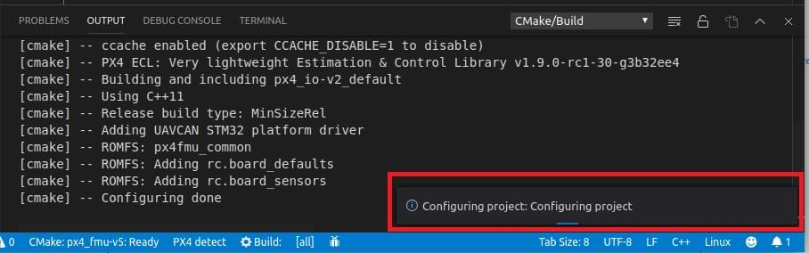
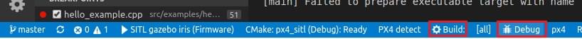
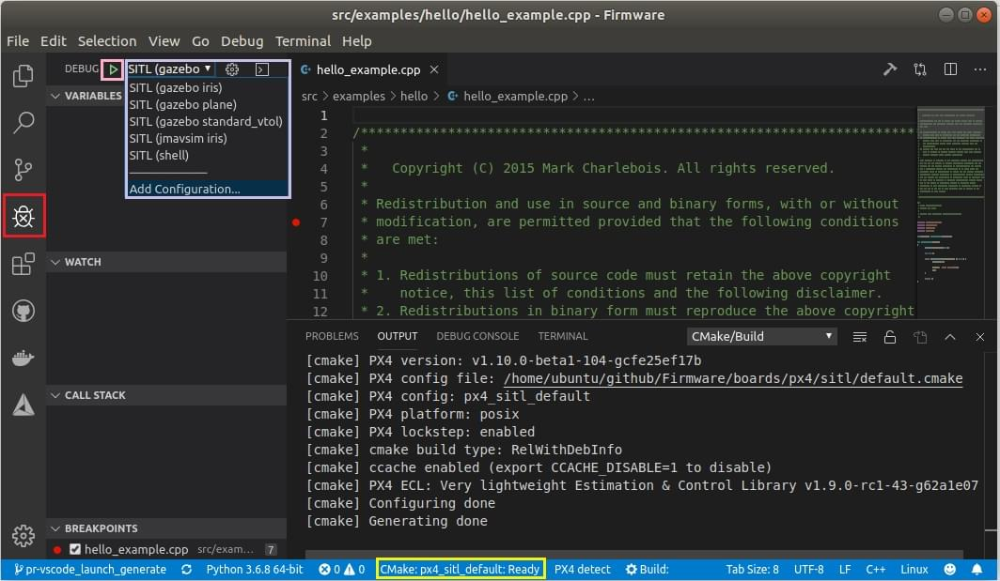

# Visual Studio Code IDE (VSCode)

[Visual Studio Code](https://code.visualstudio.com/) is a powerful cross-platform source code editor/IDE that can be used for PX4 development on Ubuntu, Windows, and macOS.

Є багато причин використання VSCode для розробки PX4:

- Зробити усі налаштування _дійсно_ займає калька хвилин.
- A rich extension ecosystem that enables a huge range of tools needed for PX4 development: C/C++ (with solid _cmake_ integration), _Python_, _Jinja2_, ROS messages, and even DroneCAN dsdl.
- Чудова інтеграція з Github.

Цей розділ пояснює, як налаштувати IDE і почати розробку.

:::note
Існують інші потужні IDE, але вони, як правило, потребують більше зусиль для інтеграції з PX4. Налаштування для _VScode_ зберігаються у дереві коду PX4/PX4-Autopilot ([PX4-Autopilot/.vscode](https://github.com/PX4/PX4-Autopilot/tree/release/1.15/.vscode)) тому процес налаштування простий і складається тільки з додавання директорії проєкту.
:::

## Попередні вимоги

Потрібно, щоб командний рядок [середовища розробки PX4](../dev_setup/dev_env.md) для вашої платформи було встановлено і завантажено репозиторій вихідного коду _Firmware_.

## Встановлення та налаштування

1. [Завантажте та встановіть VSCode](https://code.visualstudio.com/) (вам буде запропоновано правильну версію для вашої ОС).
1. Відкрийте VSCode і додайте вихідний код PX4:

   - Оберіть _Open folder ..._ варіант на вітальній сторінці (або використовуючи меню:  **File > Open Folder**): 
   - З'явиться діалогове вікно вибору файлу. Оберіть директорію **PX4-Autopilot** та натисніть **OK**.

   Файли та налаштування проєкту будуть завантажені в _VSCode_.

1. Натисніть **Install All** на підказці _This workspace has extension recommendations_ (вона з'явиться в нижній правій частині IDE). 

   VSCode відкриє панель _Extensions_ в лівій частині тому ви зможете спостерігати за прогресом установки.

   

1. Багато повідомлень/підказок може з'явитися в правому нижньому куті

   :::tip
Якщо підказки зникнуть, натисніть на значок «тривоги» праворуч від нижньої синьої панелі.
:::

   - Якщо буде запропоновано встановити нову версію _cmake_:
     - Оберіть **No** (правильна версія вже встановлена з [середовищем розробки PX4](../dev_setup/dev_env.md)).
   - Якщо буде запропоновану увійти у _github.com_ та додати облікові дані:
     - Це ваш розсуд! Це забезпечує глибоку інтеграцію між Github та IDE, що може спростити ваш робочий процес.
   - Інші підказки необов'язкові та можуть бути встановлені, якщо вважаються корисними. <!-- perhaps add screenshot of these prompts -->

## Збірка PX4

Для збірки:

1. Оберіть свою ціль збірки ("cmake build config"):

   - Поточна _ціль збірки cmake_ показується на синій панелі _config_ внизу (якщо це бажана ціль, пропустіть наступний крок). 

     ::: info The cmake target you select affects the targets offered for when [building/debugging](#debugging) (i.e. for hardware debugging you must select a hardware target like `px4_fmu-v6`).
:::

   - Натисніть на ціль на панелі config, щоб показати інші параметри та вибрати ту, яка вам потрібна (це замінить обрану ціль).
   - _Cmake_ згодом налаштує ваш проєкт (див. сповіщення внизу праворуч). 
   - Зачекайте, поки налаштування завершиться. Коли це буде зроблено, сповіщення зникнуть і буде показано розташування збірки: .

1. Тоді ви зможете почати збірку з панелі config (оберіть або **Build** або **Debug**). 

Після збірки принаймні раз ви зможете використовувати автодоповнення коду та інші функції _VSCode_.

## Налагодження

### Налагодження SITL

Для налагодження PX4 в SITL:

1. Виберіть іконку debug на бічній панелі (позначена червоним) щоб показати панель налагодження.

1. Потім виберіть ціль для налагодження (наприклад, _Debug SITL (Gazebo Iris)_ з верхньої панелі налагодження (позначено пурпуровою рамкою).

   :::note
Цілі налагодження які пропонуються (позначено пурпуровим) збігаються з вашою ціллю збірки (позначено жовтою рамкою у нижній панелі).
Наприклад, для налагодження цілей збірки SITL, ваша ціль повинна містити SITL.
:::

1. Почніть налагодження, натиснувши стрілку "play" налагодження (поруч із ціллю налагодження у верхній панелі - позначено рожевою рамкою).

Під час налагодження ви можете встановити точки зупинки, переходити до коду, на відміну від нормального процесу розробки.

### Апаратне налагодження

Інструкції в розділі [Порт налагодження SWD](../debug/swd_debug.md) пояснюють як під'єднатися для інтерфейсу SWD на розповсюджених політних контролерах (наприклад, використовуючи зонди Dronecode або Blackmagic).

Після під'єднання до інтерфейсу SWD, апаратне налагодження в VSCode таке ж саме як і для [Налагодження SITL](#debugging_sitl), за винятком того, що обирається ціль налагодження відповідна до типу налагоджувача (та прошивки), наприклад `jlink (px4_fmu-v5)`.

:::tip
Щоб побачити варіант `jlink` ви повинні обрати [cmake ціль для збірки прошивки](#building-px4).
:::

## Автодоповнення коду

Для того щоб автодоповнення коду працювало (та інша магія IntelliSense) вам потрібна активна конфігурація та код повинен бути [зібраний](#building).

Після того, як це зроблено, вам не потрібно нічого робити; інструментарій автоматично запропонує вам символи мови поки ви друкуєте.

## Усунення проблем

Цей розділ включає вказівки для помилок з налаштування та збірки.

### Ubuntu 18.04: "Visual Studio Code не може спостерігати за змінами в коді у великому робочому середовищі"

Ця помилка з'являється при старті. На деяких системах існує обмеження зверху накладене на застосунки оперувати лише 8192 файлами, що означає VSCode можливо не матиме можливості  виявити зміни у файлах у `/PX4-Autopilot`.

Ви можете збільшити цей ліміт, щоб уникнути помилки, коштом споживання пам'яті. Слідуйте [інструкціям тут](https://code.visualstudio.com/docs/setup/linux#_visual-studio-code-is-unable-to-watch-for-file-changes-in-this-large-workspace-error-enospc). Значення 65536 має бути більш ніж достатнім.
