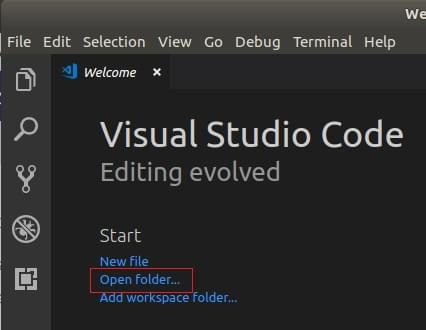
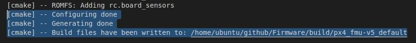
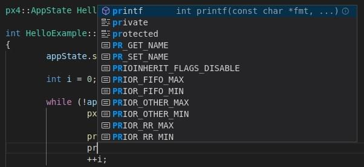

# Visual Studio Code IDE (VSCode)

[Visual Studio Code](https://code.visualstudio.com/) - це потужний редактор/IDE для багатьох платформ з відкритим вихідним кодом, який може використовуватися для розробки з PX4 на Ubuntu 18. 4 LTS і macOS (підтримка Windows скоро буде).

Є багато причин використання VSCode для розробки PX4:

- Зробити усі налаштування _дійсно_ займає калька хвилин.
- Багата екосистема розширень, яка дозволяє забезпечити широкий спектр інструментів, необхідних для розробки PX4: C/C++ (з доброю інтеграцією з _cmake_), _Python_, _Jinja2_, повідомлення ROS і навіть UAVCAN dsdl.
- Чудова інтеграція з Github.

Цей розділ пояснює, як налаштувати IDE і почати розробку.

:::note
Існують інші потужні IDE, але вони, як правило, потребують більше зусиль для інтеграції з PX4. Налаштування для _VScode_ зберігаються у дереві коду PX4/PX4-Autopilot ([PX4-Autopilot/.vscode](https://github.com/PX4/PX4-Autopilot/tree/main/.vscode)) тому процес налаштування простий і складається тільки з додавання директорії проєкту.
:::

## Попередні вимоги

Потрібно, щоб командний рядок [середовища розробки PX4](../dev_setup/dev_env.md) для вашої платформи було встановлено і завантажено репозиторій вихідного коду _Firmware_.

## Встановлення та налаштування

1. [Завантажте та встановіть VSCode](https://code.visualstudio.com/) (вам буде запропоновано правильну версію для вашої ОС).
1. Відкрийте VSCode і додайте вихідний код PX4:

   - Оберіть _Open folder ..._ варіант на вітальній сторінці (або використовуючи меню:  **File > Open Folder**): 
   - З'явиться діалогове вікно вибору файлу. Оберіть директорію **PX4-Autopilot** та натисніть **OK**.

   Файли та налаштування проєкту будуть завантажені в _VSCode_.

1. Натисніть **Install All** на підказці _This workspace has extension recommendations_ (вона з'явиться в нижній правій частині IDE). 

   VSCode відкриє панель _Extensions_ в лівій частині тому ви зможете спостерігати за прогресом установки.

   

1. Багато повідомлень/підказок може з'явитися в правому нижньому куті

   :::tip
Якщо підказки зникнуть, натисніть на значок «тривоги» праворуч від нижньої синьої панелі.
:::

   - Якщо буде запропоновано встановити нову версію _cmake_:
     - Оберіть **No** (правильна версія вже встановлена з [середовищем розробки PX4](../dev_setup/dev_env.md)).
   - Якщо буде запропоновану увійти у _github.com_ та додати облікові дані:
     - Це ваш розсуд! Це забезпечує глибоку інтеграцію між Github та IDE, що може спростити ваш робочий процес.
   - Інші підказки необов'язкові та можуть бути встановлені, якщо вважаються корисними. <!-- perhaps add screenshot of these prompts -->

## Збірка PX4

Для збірки:

1. Оберіть свою ціль збірки ("cmake build config"):

   - Поточна _ціль збірки cmake_ показується на синій панелі _config_ внизу (якщо це бажана ціль, пропустіть наступний крок). 

:::note
Ціль збірки cmake яку ви обрали впливає на цілі, які пропонуються при  [збірці/налагодженні](#debugging) (наприклад для апаратного налагодження потрібно обрати цільову платформу на кшталт `px4_fmu-v5`).
:::

   - Натисніть на ціль на панелі config, щоб показати інші параметри та вибрати ту, яка вам потрібна (це замінить обрану ціль).
   - _Cmake_ згодом налаштує ваш проєкт (див. сповіщення внизу праворуч). 
   - Зачекайте, поки налаштування завершиться. Коли це буде зроблено, сповіщення зникнуть і буде показано розташування збірки: .

1. Тоді ви зможете почати збірку з панелі config (оберіть або **Build** або **Debug**). 

Після збірки принаймні раз ви зможете використовувати автодоповнення коду та інші функції _VSCode_.

## Налагодження

### Налагодження SITL

Для налагодження PX4 в SITL:

1. Виберіть іконку debug на бічній панелі (позначена червоним) щоб показати панель налагодження.

1. Потім виберіть ціль для налагодження (наприклад, _Debug SITL (Gazebo Iris)_ з верхньої панелі налагодження (позначено пурпуровою рамкою).

   :::note
Цілі налагодження які пропонуються (позначено пурпуровим) збігаються з вашою ціллю збірки (позначено жовтою рамкою у нижній панелі).
Наприклад, для налагодження цілей збірки SITL, ваша ціль повинна містити SITL.
:::

1. Почніть налагодження, натиснувши стрілку "play" налагодження (поруч із ціллю налагодження у верхній панелі - позначено рожевою рамкою).

Під час налагодження ви можете встановити точки зупинки, переходити до коду, на відміну від нормального процесу розробки.

### Апаратне налагодження

Інструкції в розділі [Порт налагодження SWD](../debug/swd_debug.md) пояснюють як під'єднатися для інтерфейсу SWD на розповсюджених політних контролерах (наприклад, використовуючи зонди Dronecode або Blackmagic).

After connecting to the SWD interface, hardware debugging in VSCode is then the same as for [SITL Debugging](#debugging_sitl) except that you select a debug target appropriate for your debugger type (and firmware) - e.g. `jlink (px4_fmu-v5)`.

:::tip
To see the `jlink` option you must have selected a [cmake target for building firmware](#building-px4).
:::

## Code Completion

In order for the code completion to work (and other IntelliSense magic) you need an active configuration and to have [built the code](#building).

Once that is done you don't need to do anything else; the toolchain will automatically offer you symbols as you type.

## Troubleshooting

This section includes guidance on setup and build errors.

### Ubuntu 18.04: "Visual Studio Code is unable to watch for file changes in this large workspace"

This error surfaces on startup. On some systems, there is an upper-limit of 8192 file handles imposed on applications, which means that VSCode might not be able to detect file modifications in `/PX4-Autopilot`.

You can increase this limit to avoid the error, at the expense of memory consumption. Follow the [instructions here](https://code.visualstudio.com/docs/setup/linux#_visual-studio-code-is-unable-to-watch-for-file-changes-in-this-large-workspace-error-enospc). A value of 65536 should be more than sufficient.
