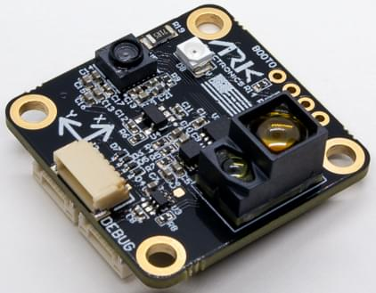
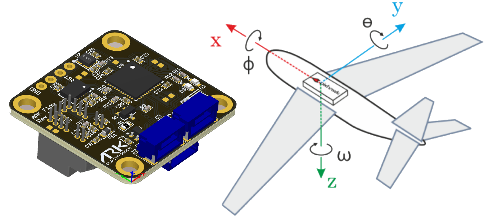

# ARK Flow

ARK Flow is an open source [DroneCAN](index.md) [optical flow](../sensor/optical_flow.md), [distance sensor](../sensor/rangefinders.md), and IMU module.

## Де купити

Замовте цей модуль з:

- [ARK Electronics](https://arkelectron.com/product/ark-flow/) (US)

## Характеристики обладнання

- [Open Source Schematic and BOM](https://github.com/ARK-Electronics/ARK_Flow)
- Датчики
  - PixArt PAW3902 датчик оптичного потоку
    - Tracks under super low light condition of >9 lux
    - Широкий робочий діапазон від 80 мм до 30 м
    - До 7.4 рад/с
  - 40mW ІЧ-світлодіод, вбудований на плату для покращення роботи в умовах слабкого освітлення
  - Broadcom AFBR-S50LV85D Time-of-Flight Distance Sensor
    - Інтегроване джерело світла лазера 850 нм
    - Поле зору (FoV) 12,4° x 6,2° з 32 пікселями
    - Типовий діапазон відстані до 30м
    - Робота в умовах 200 тис. люксів світла навколишнього середовища
    - Добре працює на всіх поверхнях
    - Трансмітер пучка 2° x 2° для підсвічування між 1 та 3 пікселями
  - Bosch BMI088 6-Axis IMU або Invensense ICM-42688-P 6-Axis IMU
- STM32F412CEU6 MCU
- Два роз'єми стандарту CAN для Pixhawk (4 контакти JST GH)
- Роз'єм для відлагодження стандарту Pixhawk (6 контактів JST SH)
- Вбудований резистор CAN з можливістю програмованого переключання
- Малий форм-фактор
  - 3см x 3см x 1.4см
- LED індикатори
- USA Built

## Налаштування програмного забезпечення

### Підключення

ARK Flow підключений до шини CAN за допомогою стандартного кабелю JST GH з чотирма контактами Pixhawk.
For more information, refer to the [CAN Wiring](../can/index.md#wiring) instructions.

### Встановлення

The recommended mounting orientation is with the connectors on the board pointing towards **back of vehicle**, as shown in the following picture.

This corresponds to the default value (`0`) of the parameter [SENS_FLOW_ROT](../advanced_config/parameter_reference.md#SENS_FLOW_ROT).
Змініть параметр належним чином, якщо використовується інша орієнтація.

The sensor can be mounted anywhere on the frame, but you will need to specify the focal point position, relative to vehicle centre of gravity, during [PX4 configuration](#px4-configuration).

## Налаштування прошивки

ARK Flow runs the [PX4 DroneCAN Firmware](px4_cannode_fw.md).
As such, it supports firmware update over the CAN bus and [dynamic node allocation](index.md#node-id-allocation).

ARK Flow boards ship with recent firmware pre-installed, but if you want to build and flash the latest firmware yourself see [PX4 DroneCAN Firmware > Building the Firmware](px4_cannode_fw.md#building-the-firmware).

- Firmware target: `ark_can-flow_default`
- Bootloader target: `ark_can-flow_canbootloader`

## Налаштування польотного контролера

:::info
The Ark Flow will not boot if there is no SD card in the flight controller when powered on.
:::

### Увімкнути DroneCAN

In order to use the ARK Flow board, connect it to the Pixhawk CAN bus and enable the UAVCAN driver by setting parameter [UAVCAN_ENABLE](../advanced_config/parameter_reference.md#UAVCAN_ENABLE) to `2` for dynamic node allocation (or `3` if using [DroneCAN ESCs](../dronecan/escs.md)).

Кроки наступні:

- In _QGroundControl_ set the parameter [UAVCAN_ENABLE](../advanced_config/parameter_reference.md#UAVCAN_ENABLE) to `2` or `3` and reboot (see [Finding/Updating Parameters](../advanced_config/parameters.md)).
- Підключіть ARK Flow CAN до шини CAN Pixhawk.

Після активації модуль буде виявлено при завантаженні.
Дані потоку повинні надходити з частотою 10 Гц.

DroneCAN configuration in PX4 is explained in more detail in [DroneCAN > Enabling DroneCAN](../dronecan/index.md#enabling-dronecan).

### Конфігурація PX4

You need to set the EKF optical flow parameters to enable fusing optical flow measurements for velocity calculation, set necessary [DroneCAN](index.md) parameters, and define offsets if the sensor is not centred within the vehicle.

Set the following parameters in _QGroundControl_:

- Enable optical flow fusion by setting [EKF2_OF_CTRL](../advanced_config/parameter_reference.md#EKF2_OF_CTRL).
- To optionally disable GPS aiding, set [EKF2_GPS_CTRL](../advanced_config/parameter_reference.md#EKF2_GPS_CTRL) to `0`.
- Enable [UAVCAN_SUB_FLOW](../advanced_config/parameter_reference.md#UAVCAN_SUB_FLOW).
- Enable [UAVCAN_SUB_RNG](../advanced_config/parameter_reference.md#UAVCAN_SUB_RNG).
- Set [EKF2_RNG_A_HMAX](../advanced_config/parameter_reference.md#EKF2_RNG_A_HMAX) to `10`.
- Set [EKF2_RNG_QLTY_T](../advanced_config/parameter_reference.md#EKF2_RNG_QLTY_T) to `0.2`.
- Set [UAVCAN_RNG_MIN](../advanced_config/parameter_reference.md#UAVCAN_RNG_MIN) to `0.08`.
- Set [UAVCAN_RNG_MAX](../advanced_config/parameter_reference.md#UAVCAN_RNG_MAX) to `30`.
- Set [SENS_FLOW_MINHGT](../advanced_config/parameter_reference.md#SENS_FLOW_MINHGT) to `0.08`.
- Set [SENS_FLOW_MAXHGT](../advanced_config/parameter_reference.md#SENS_FLOW_MAXHGT) to `25`.
- Set [SENS_FLOW_MAXR](../advanced_config/parameter_reference.md#SENS_FLOW_MAXR) to `7.4` to match the PAW3902 maximum angular flow rate.
- The parameters [EKF2_OF_POS_X](../advanced_config/parameter_reference.md#EKF2_OF_POS_X), [EKF2_OF_POS_Y](../advanced_config/parameter_reference.md#EKF2_OF_POS_Y) and [EKF2_OF_POS_Z](../advanced_config/parameter_reference.md#EKF2_OF_POS_Z) can be set to account for the offset of the Ark Flow from the vehicle centre of gravity.

## Конфігурування потоку Ark

На ARK Flow можливо вам доведеться налаштувати наступні параметри:

| Параметр                                                                                                             | Опис                                           |
| -------------------------------------------------------------------------------------------------------------------- | ---------------------------------------------- |
| [CANNODE_TERM](../advanced_config/parameter_reference.md#CANNODE_TERM) | Вбудована завершення шини CAN. |

## Значення LED індикаторів

Ви побачите як червоні, так і сині світлодіоди на ARK Flow коли він прошивається, і постійний синій світлодіод, якщо він працює належним чином.

Якщо ви бачите червоний світлодіод, це означає, що виникла помилка, і вам слід перевірити наступне:

- Переконайтеся, що у польотному контролері встановлено SD-картку.
- Make sure the Ark Flow has `ark_can-flow_canbootloader` installed prior to flashing `ark_can-flow_default`.
- Видаліть бінарні файли з кореневих та ufw директорій SD-карти та спробуйте зібрати та знову прошити.

## Відео

<lite-youtube videoid="SAbRe1fi7bU" params="list=PLUepQApgwSozmwhOo-dXnN33i2nBEl1c0" title="ARK Flow Indoor Position Hold x64"/>

<!-- ARK Flow with PX4 Optical Flow Position Hold: 20210605 -->

_PX4 holding position using the ARK Flow sensor for velocity estimation (in [Position Mode](../flight_modes_mc/position.md))._

## Дивіться також

- [ARK Flow](https://arkelectron.gitbook.io/ark-documentation/sensors/ark-flow) (ARK Docs)
