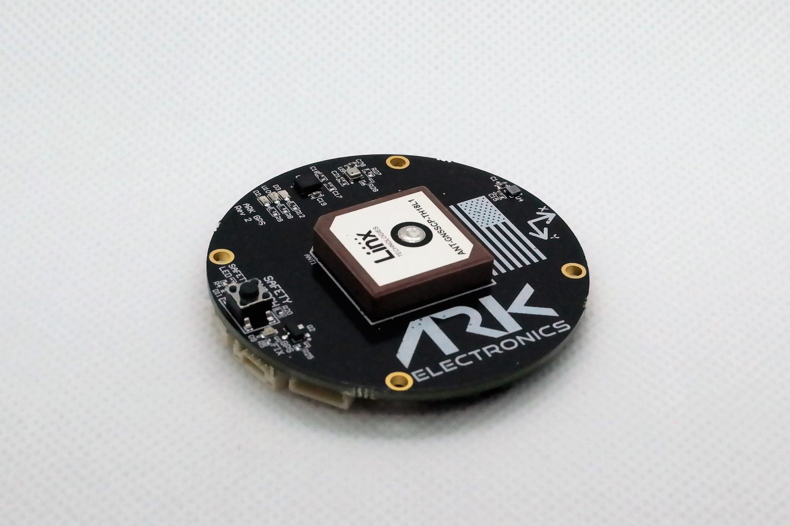

# ARK GPS (DroneCAN)

ARK GPS проєкт із відкритим кодом [DroneCAN](index.md) [GNSS/GPS](../gps_compass/index.md), магнітометром, ІВП, барометром, сигналом звукового оповіщення та модулем безпеки.

## Де придбати

Замовте цей модуль з:

- [ARK Electronics](https://arkelectron.com/product/ark-gps/) (US)

## Характеристики апаратного забезпечення

- [Схема з відкритим кодом та BOM](https://github.com/ARK-Electronics/ARK_GPS)
- Сенсори
  - Ublox M9N GPS
    - Надзвичайно надійна геоприв'язка на рівні метра за допомогою супутникової навігації
    - Максимальна доступність позиції з одночасним прийомом 4 супутників
    - Просунуте виявлення підробки сигналу та перешкод
    - Відмінне запобігання RF-перешкодам
  - Bosch BMM150 Magnetometer
  - Bosch BMP388 Barometer
  - Dual Invensense ICM-42688-P IMUs 6-вісний IMU
- STM32F412CEU6 MCU
- Кнопка безпеки
- Динамік
- Два роз'єми стандарту CAN для Pixhawk (4 контакти JST GH)
- Роз'єм для відлагодження стандарту Pixhawk (6 контактів JST SH)
- Малий форм-фактор
  - 5см x 5см x 1см
- LED індикатори
  - Індикатор безпеки
  - GPS Fix
  - RGB Статус системи
- USA Built
- Вимоги до живлення
  - 5В
  - Середній струм 110мA
  - 117мА Макс.

## Встановлення обладнання

### Підключення

ARK GPS підключений до шини CAN за допомогою стандартного кабелю Pixhawk 4 pin JST GH. Для отримання додаткової інформації, зверніться до інструкцій з [проводки CAN](../can/index.md#wiring).

### Монтаж

Рекомендоване положення монтажу є таким, щоб конектори на платі вказували у напрямку **задньої частини дрону**.

Датчик може бути встановлений де завгодно на каркасі, але ви повинні вказати його позицію, відносно центру мас транспортного засобу, під час [налаштування PX4](#px4-configuration).

## Встановлення прошивки

ARK GPS працює з [Прошивкою PX4 DroneCAN](px4_cannode_fw.md). Таким чином, він підтримує оновлення прошивки через шину CAN та [dynamic node allocation](../dronecan/index.md#node-id-allocation).

Плати ARK GPS поставляються з останнім вбудованим програмним забезпеченням, але якщо ви хочете побудувати й прошити останнє програмне забезпечення самостійно, див. [PX4 DroneCAN Firmware > Building the Firmware](px4_cannode_fw.md#building-the-firmware).

- Ціль прошивки: `ark_can-gps_default`
- Ціль завантажувача: `ark_can-gps_canbootloader`

## Налаштування PX4

Вам потрібно встановити необхідні [параметри DroneCAN](index.md) та визначити зсуви, якщо датчик не знаходиться у центрі транспортного засобу. Необхідні налаштування наведено нижче.

::: info
GPS ARK не буде завантажуватися, якщо SD-карти немає у контролері польоту під час запуску.
:::

### Увімкнення DroneCAN

Для використання плати ARK GPS підключіть її до шини CAN Pixhawk та увімкніть драйвер DroneCAN, встановивши параметр [UAVCAN_ENABLE](../advanced_config/parameter_reference.md#UAVCAN_ENABLE) на `2` для динамічного розподілу вузла (або `3`, якщо Ви використовуєте [DroneCAN ESCs](../dronecan/escs.md)).

Кроки наступні:

- У _QGroundControl_ встановіть параметр [UAVCAN_ENABLE](../advanced_config/parameter_reference.md#UAVCAN_ENABLE) на `2` або `3` та перезавантажте (див. [Finding/Updating Parameters](../advanced_config/parameters.md)).
- Підключіть ARK GPS CAN до Pixhawk CAN.

Після активації модуль буде виявлено при завантаженні. Дані GPS повинні надходити з частотою 10 Гц.

Конфігурацію DroneCAN в PX4 пояснено більш детально в [DroneCAN > Enabling DroneCAN](../dronecan/index.md#enabling-dronecan).

### Конфігурація позиції датчика

Якщо датчик не знаходиться у центрі автомобіля, вам також потрібно буде визначити зміщення датчика:

- Увімкніть GPS сигнал, встановивши біт 3 [EKF2_GPS_CTRL](../advanced_config/parameter_reference.md#EKF2_GPS_CTRL) на true.
- Увімкніть [UAVCAN_SUB_GPS](../advanced_config/parameter_reference.md#UAVCAN_SUB_GPS), [UAVCAN_SUB_MAG](../advanced_config/parameter_reference.md#UAVCAN_SUB_MAG) та [UAVCAN_SUB_BARO](../advanced_config/parameter_reference.md#UAVCAN_SUB_BARO).
- Встановіть [CANNODE_TERM](../advanced_config/parameter_reference.md#CANNODE_TERM) на `1` якщо це останній вузол на шині CAN.
- Параметри [EKF2_GPS_POS_X](../advanced_config/parameter_reference.md#EKF2_GPS_POS_X), [EKF2_GPS_POS_Y](../advanced_config/parameter_reference.md#EKF2_GPS_POS_Y) та [EKF2_GPS_POS_Z](../advanced_config/parameter_reference.md#EKF2_GPS_POS_Z) можуть бути встановлені для врахування зміщення ARK GPS від центру мас транспортного засобу.

## Значення LED індикаторів

Ви побачите зелені, сині та червоні світлодіоди на ARK GPS під час прошивки, а також мигаючий зелений світлодіод, якщо все працює належним чином.

Якщо ви бачите червоний світлодіод, це означає, що виникла помилка, і вам слід перевірити наступне:

- Переконайтеся, що у польотному контролері встановлено SD-картку.
- Перевірте, що ARK GPS має встановлене `ark_can-gps_canbootloader` перед тим, як прошивати `ark_can-gps_default`.
- Видаліть бінарні файли з кореневих та ufw директорій SD-карти та спробуйте зібрати та знову прошити.
