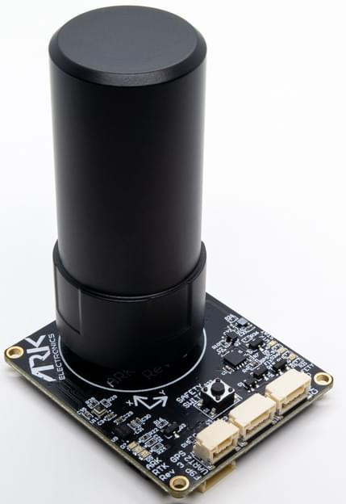

# ARK RTK GPS

ARK RTK GPS є проєктом з відкритим кодом [DroneCAN](index.md) [RTK GPS](../gps_compass/rtk_gps.md), [u-blox F9P](https://www.u-blox.com/en/product/zed-f9p-module), магнітометром, барометром, ІВП, сигналом звукового оповіщення та модулем безпеки.

## Де купити

Замовте цей модуль з:

- [ARK Electronics](https://arkelectron.com/product/ark-rtk-gps/) (US)

## Характеристики апаратного забезпечення

- [Схема з відкритим кодом та BOM](https://github.com/ARK-Electronics/ARK_RTK_GPS)
- Сенсори
  - Ublox F9P GPS
    - Багатосмуговий приймач супутникової навігації, що забезпечує точність на рівні сантиметрів за кілька секунд
    - Одночасний прийом GPS, GLONASS, Galileo та BeiDou
    - Багатосмуговий RTK зі швидкими часами збіжності та надійною продуктивністю
    - Висока швидкість оновлення для високодинамічних додатків
    - Сантиметрова точність у невеликому та енергоефективному модулі
  - Bosch BMM150 Magnetometer
  - Bosch BMP388 Barometer
  - Invensense ICM-42688-P 6-Axis IMU
- STM32F412CEU6 MCU
- Кнопка безпеки
- Динамік
- Два роз'єми стандарту CAN для Pixhawk (4 контакти JST GH)
- Роз'єм F9P "UART 2"
  - 3-контактний JST-GH
  - TX, RX, GND
- Роз'єм для відлагодження стандарту Pixhawk (6 контактів JST SH)
- LED індикатори
  - Індикатор безпеки
  - GPS Fix
  - Статус RTK
  - RGB Статус системи
- USA Built
- Вимоги до живлення
  - 5V
  - Середній струм 170мA
  - 180мА Макс

## Встановлення обладнання

### Підключення

ARK RTK GPS підключений до шини CAN за допомогою стандартного кабелю Pixhawk 4 pin JST GH. Для отримання додаткової інформації, зверніться до інструкцій з [проводки CAN](../can/index.md#wiring).

### Встановлення

Рекомендоване положення монтажу є таким, щоб конектори на платі вказували у напрямку **задньої частини дрону**.

Датчик може бути встановлений де завгодно на каркасі, але ви повинні вказати його позицію, відносно центру мас транспортного засобу, під час [налаштування PX4](#px4-configuration).

## Налаштування прошивки

ARK RTK GPS працює з [PX4 cannode firmware](px4_cannode_fw.md). Таким чином, він підтримує оновлення прошивки через шину CAN та [dynamic node allocation](index.md#node-id-allocation).

Плати ARK RTK GPS поставляються з останнім вбудованим програмним забезпеченням, але якщо ви хочете побудувати й прошити останнє програмне забезпечення самостійно, звертайтеся до [інструкцій з побудови прошивки cannode](px4_cannode_fw.md#building-the-firmware).

Ціль прошивки: `ark_can-rtk-gps_default` Ціль завантажувача: `ark_can-rtk-gps_canbootloader`

## Налаштування польотного контролера

### Увімкнення DroneCAN

Для використання ARK RTK GPS підключіть його до шини CAN Pixhawk та увімкніть драйвер DroneCAN, встановивши параметр [UAVCAN_ENABLE](../advanced_config/parameter_reference.md#UAVCAN_ENABLE) на `2` для динамічного призначення вузла (або `3`, якщо використовуєте [DroneCAN ESCs](../dronecan/escs.md)).

Кроки наступні:

- У _QGroundControl_ встановіть параметр [UAVCAN_ENABLE](../advanced_config/parameter_reference.md#UAVCAN_ENABLE) на `2` або `3` та перезавантажте (див. [Finding/Updating Parameters](../advanced_config/parameters.md)).
- Підключіть ARK RTK GPS CAN до шини CAN Pixhawk.

Після активації, модуль буде виявлено при завантаженні. Дані GPS повинні надходити з частотою 10 Гц.

### Конфігурація PX4

Вам потрібно встановити необхідні [параметри DroneCAN](index.md) та визначити зсуви, якщо датчик не знаходиться у центрі транспортного засобу:

- Увімкніть GPS сигнал, встановивши біт 3 [EKF2_GPS_CTRL](../advanced_config/parameter_reference.md#EKF2_GPS_CTRL) на true.
- Увімкніть злиття GPS, щоб завжди публікувати напрямок, встановивши [SENS_GPS_MASK](../advanced_config/parameter_reference.md#SENS_GPS_MASK) на 7 (перевірено всі три біти).
- Увімкніть [UAVCAN_SUB_GPS](../advanced_config/parameter_reference.md#UAVCAN_SUB_GPS), [UAVCAN_SUB_MAG](../advanced_config/parameter_reference.md#UAVCAN_SUB_MAG) та [UAVCAN_SUB_BARO](../advanced_config/parameter_reference.md#UAVCAN_SUB_BARO).
- Параметри [EKF2_GPS_POS_X](../advanced_config/parameter_reference.md#EKF2_GPS_POS_X), [EKF2_GPS_POS_Y](../advanced_config/parameter_reference.md#EKF2_GPS_POS_Y) та [EKF2_GPS_POS_Z](../advanced_config/parameter_reference.md#EKF2_GPS_POS_Z) можуть бути встановлені для врахування зміщення ARK RTK GPS від центру мас транспортного засобу.
- Встановіть [CANNODE_TERM](../advanced_config/parameter_reference.md#CANNODE_TERM) на `1` на GPS, якщо це останній вузол на шині CAN.

### Налаштування Переміщувальної Базової Лінії & GPS Напрямку

Найпростіший спосіб налаштування рухомого базису та напрямку GPS з двома модулями GPS ARK RTK відбувається через CAN, хоча можна зробити це через UART, щоб зменшити обсяг даних на шині CAN, якщо це потрібно.

Зверніть увагу, що заголовок виводиться лише у випадку, якщо Rover знаходиться в режимі фіксованого RTX. Він не виведе заголовок у RTK Float.

Налаштування через CAN:

- Переконайтеся, що ARK RTK GPS модулі підключені до Pixhawk через CAN (один може бути підключений до вторинного порту CAN). Два ARK RTK GPS повинні бути підключені до однієї і тієї ж CAN шини для надсилання корекцій.
- Виберіть один ARK RTK GPS для _Ровера_ та один для _Рухової Бази_.
- Перевідкрийте QGroundControl, перейдіть до параметрів та виберіть `Standard`, щоб приховати цей розкривний список та виберіть `Component ##`, щоб переглянути кожний з параметрів вузла CAN вашого ARK RTK GPS ::: info `Component ##` не буде видимим, якщо ARK RTK GPS не підключено до Pixhawk до відкриття QGroundControl.
:::
- На _Rover_, встановіть наступне:
  - [GPS_UBX_MODE](../advanced_config/parameter_reference.md#GPS_UBX_MODE) на `3`
  - [GPS_YAW_OFFSET](../advanced_config/parameter_reference.md#GPS_YAW_OFFSET) до `0`, якщо ваш _Rover_ знаходиться попереду вашої _Рухливої Бази_, `90`, якщо _Rover_ справа від _Рухливої Бази_, `180`, якщо _Rover_ ззаду _Рухливої Бази_, або `270`, якщо _Rover_ зліва від _Рухливої Бази_.
  - [CANNODE_SUB_MBD](../advanced_config/parameter_reference.md#CANNODE_SUB_MBD) на `1`.
- На _Рухомій Базі_, встановіть наступне:
  - [GPS_UBX_MODE](../advanced_config/parameter_reference.md#GPS_UBX_MODE) на `4`.
  - [CANNODE_PUB_MBD](../advanced_config/parameter_reference.md#CANNODE_PUB_MBD) на `1`.

Налаштування через UART:

- Переконайтеся, що модулі GPS ARK RTK підключені до Pixhawk через CAN.
- Переконайтеся, що модулі GPS ARK RTK підключені один до одного через їх порт UART2 (схема виводів UART2 показана нижче). Зверніть увагу, що TX одного модуля потрібно підключити до RX іншого.

| Pin | Назва |
| --- | ----- |
| 1   | TX    |
| 2   | RX    |
| 3   | GND   |

- На _Rover_, встановіть наступне:
  - [GPS_UBX_MODE](../advanced_config/parameter_reference.md#GPS_UBX_MODE) на `1`
  - [GPS_YAW_OFFSET](../advanced_config/parameter_reference.md#GPS_YAW_OFFSET) до `0`, якщо ваш _Rover_ знаходиться попереду вашої _Рухливої Бази_, `90`, якщо _Rover_ справа від _Рухливої Бази_, `180`, якщо _Rover_ ззаду _Рухливої Бази_, або `270`, якщо _Rover_ зліва від _Рухливої Бази_.
- На _Рухомій Базі_, встановіть наступне:
  - [GPS_UBX_MODE](../advanced_config/parameter_reference.md#GPS_UBX_MODE) на `2`.

## Значення LED індикаторів

- Світлодіоди статусу GPS розташовані праворуч від роз'ємів

  - Миготіння зеленого - це фіксація GPS
  - Миготіння синього - це отримані корекції та RTK Float
  - Сталий синій - це RTK зафіксовано

- Світлодіоди статусу CAN розташовані зверху ліворуч від роз'ємів
  - Повільне блимання зеленого - чекає на підключення CAN
  - Швидко блимаюче зелене світло - нормальна робота
  - Повільне блимання зеленим і синім - перелік CAN
  - Повільне блимання зеленого, синього і червоного - оновлення прошивки в процесі
  - Миготливий червоний - помилка
    - Якщо ви бачите червоний світлодіод, це означає, що виникла помилка, і вам слід перевірити наступне
      - Переконайтеся, що у польотному контролері встановлено SD-картку
      - Переконайтеся, що ARK RTK GPS має встановлене `ark_can-rtk-gps_canbootloader` перед тим, як прошивати `ark_can-rtk-gps_default`
      - Видаліть бінарні файли з кореневих та ufw директорій SD-карти та спробуйте зібрати та знову прошити

### Оновлення модуля Ublox F9P

ARK RTK GPS поставляється з модулем Ublox F9P з версією 1.13 або новішою. Проте ви можете перевірити версію та оновити прошивку за бажанням.

Кроки наступні:

- [Завантажте u-center з сайту u-blox.com](https://www.u-blox.com/en/product/u-center) та встановіть на свій ПК (лише для Windows)
- Відкрийте [веб-сайт u-blox ZED-F9P](https://www.u-blox.com/en/product/zed-f9p-module#tab-documentation-resources)
- Прокрутіть вниз і клацніть на поле "Show Legacy Documents"
- Прокрутіть вниз ще раз до Оновлення прошивки та завантажте потрібну прошивку (потрібна версія не нижче 1.13)
- Підтримуючи перемикач безпеки на ARK RTK GPS, підключіть його до живлення через один з його портів CAN і утримуйте до тих пір, поки всі 3 світлодіода не почнуть швидко мигати
- Підключіть ARK RTK GPS до комп'ютера за допомогою його порту відладки через кабель, такого як Black Magic Probe або FTDI
- Відкрийте u-center, виберіть COM-порт для ARK RTK GPS та підключіться 
- Перевірте поточну версію прошивки, вибравши View, Messages View, UBX, MON, VER 
- Для оновлення прошивки:
  - Виберіть Tools, Firmware Update
  - Поле зображення прошивки повинно бути файлом .bin, завантаженим зі сторінки веб-сайту u-blox ZED-F9P
  - Поставте прапорець "Використовувати цю швидкість передачі для оновлення" та виберіть 115200 зі списку
  - Переконайтеся, що інші прапорці відображаються так, як показано нижче
  - Натисніть зелену кнопку GO внизу зліва
  - "Firmware Update SUCCESS" повинно бути відображено, якщо оновлення пройшло успішно 
