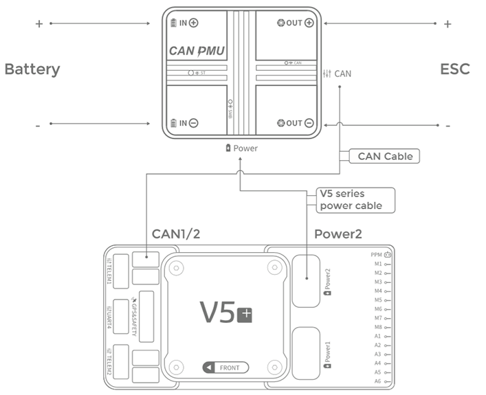

# CAUV CAN PMU

CAN PMU&reg; - це високоточний модуль живлення [DroneCAN](index.md), розроблений компанією CUAV&reg;. Він використовує алгоритм компенсації CUAV ITT, який дозволяє дронам отримувати більш точні дані про заряд батареї.

Рекомендується для використання у великих комерційних транспортних засобах, але також може застосовуватися для дослідницьких транспортних засобів.

## Де придбати

- [CUAV store](https://store.cuav.net/index.php)
- [CUAV aliexpress ](https://www.aliexpress.com/item/4000369700535.html)

## Hardware Specifications

- **Процесор:** STM32F412
- **Вхідна напруга**: 6~62V\(2-15S\)
- **Максимальний струм:** 110A
- **Точність напруги:** ±0.05V
- **Точність струму:** ±0.1A
- **Resolution:** 0.01A/V
- **Максимальна вихідна потужність:** 6000W/90S
- **Максимальна стабільна потужність:** 5000W
- **Вихід порту живлення:** 5.4V/5A
- **Робоча температура:** -20~+100
- **Оновлення прошивки:** Підтримується.
- **Калібрування:** не потрібно.
- **Тип інтерфейсу:**
  - **IN/OUT:** XT90\(Кабель）/Amass 8.0\(Модуль）
  - **Порт живлення:** 5025850670
  - **CAN:** GHR-04V-S
- **Appearance:**
  - **Розмір:** 46.5мм \* 38.5мм \* 22.5мм
  - **Вага:** 76g

## Hardware Setup

### Package Contents

### Pinouts

## Підключення

Кроки підключення:

- Connect the flight control CAN1/2 and the module CAN interface.
- Connect the V5 series power cable to the V5 Flight Control Power2 (if other flight controllers are connect to the Power interface) and the module Power interface.

## Налаштування польотного контролера

Встановіть такі параметри у _QGroundControl_ [Vehicle Setup > Parameters](../advanced_config/parameters.md), а потім перезапустіть:

- [UAVCAN_ENABLE](../advanced_config/parameter_reference.md#UAVCAN_ENABLE): встановить на: _Sensors Automatic Config_

  

- [UAVCAN_SUB_BAT](../advanced_config/parameter_reference.md#UAVCAN_SUB_BAT): встановить на: _Raw data_

  

## Додаткова інформація

[Керівництво користувача CAN PMU](http://manual.cuav.net/power-module/CAN-PMU.pdf)

[Модуль виявлення живлення CAN PMU > Увімкніть CAN PMU > Прошивка PX4](http://doc.cuav.net/power-module/can-pmu/en/) (документи CUAV)
