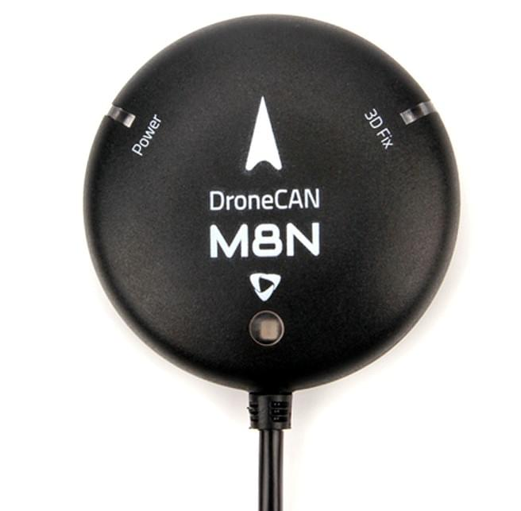
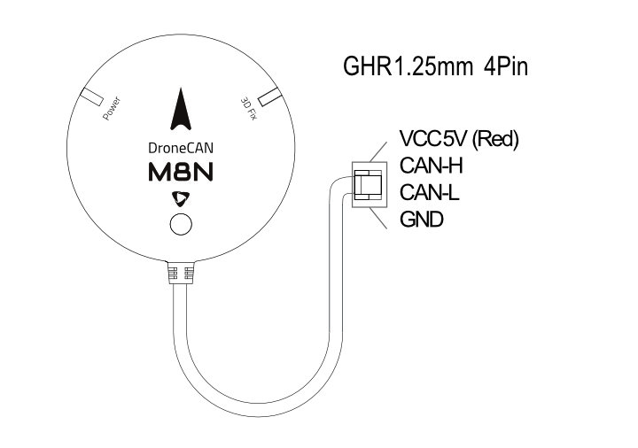
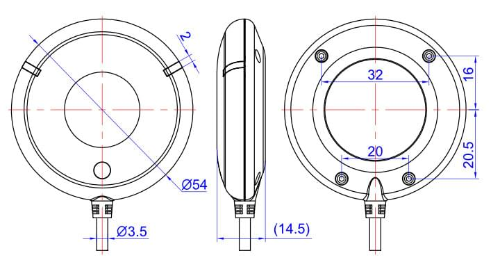

# Holybro DroneCAN M8N GPS

Holybro DroneCAN GPS має модуль UBLOX M8N, компас BMM150, триколірний індикатор світлодіодів.

Модуль GPS використовує протокол [DroneCAN](index.md) для зв'язку. DroneCAN connections are more resistant to electromagnetic interference compared to serial connection, making it more reliable. In addition, using DroneCAN means that the GPS and compass do not occupy any flight controller serial ports (different/additional CAN devices can be connected to the same CAN bus via a CAN splitter board).

## Де купити

Order this module from:

- [Holybro](https://holybro.com/products/dronecan-m8n-gps)

## Характеристики обладнання

|                           | DroneCAN M8N                         |
| ------------------------- | ------------------------------------ |
| Приймач GNSS              | Ublox NEO M8N                        |
| Кількість одночасних GNSS | 2 (Стандартний GPS + GLONASS)        |
| Процесор                  | STM32G4 (170MHz, 512K FLASH)         |
| Компас                    | BMM150                               |
| Смуга частот              | 
GPS: L1C/A GLONASS: L10F Beidou: B1I Galileo: E1B/C
            |
| GNSS Augmentation System  | SBAS: WAAS, EGNOS, MSAS, QZSS        |
| Оновлення навігації       | 5Гц За замовчуванням (10Гц МАКС)     |
| Чутливість навігації      | –167 dBm                             |
| Холодний запуск           | \~ 26s                              |
| Точність                  | 2.5m                                 |
| Точність швидкості        | 0.05 m/s                             |
| Макс. # супутників        | 22+                                  |
| Default CAN BUS data rate | 1MHz                                 |
| Протокол зв'язку          | DroneCAN @ 1 Mbit/s                  |
| Supports Autopilot FW     | PX4, Ardupilot                       |
| Port Type                 | GHR-04V-S                            |
| Антена                    | 25 x 25 x 4 mm ceramic patch antenna |
| Voltage                   | 4.7-5.2V                             |
| Power consumption         | Less than 200mA @ 5V                 |
| Температура               | -40\~80C                            |
| Розмір                    | 
Діаметр: 54мм Товщина: 14.5мм
            |
| Вага                      | 36g                                  |
| Довжина кабелю            | 26cm                                 |
| Інше                      | <ul><li>LNA MAX2659ELT+ RF Amplifier</li><li>Rechargeable Farah capacitance</li><li>Low noise 3.3V regulator</li><li>У комплект включено кабель завдовжки 26 см</li></ul>            |

## Налаштування обладнання

### Встановлення

The recommended mounting orientation is with the arrow on the GPS pointing towards the **front of vehicle**.

The sensor can be mounted anywhere on the frame, but you will need to specify its position, relative to vehicle centre of gravity, during [PX4 configuration](#px4-configuration).

### Підключення

The Holybro DroneCAN GPS is connected to the CAN bus using a Pixhawk standard 4 pin JST GH cable. For more information, refer to the [CAN Wiring](../can/index.md#wiring) instructions.

### Pinout

### Розміри

## Налаштування PX4

You need to set necessary [DroneCAN](index.md) parameters and define offsets if the sensor is not centred within the vehicle. The required settings are outlined below.

::: info
The GPS will not boot if there is no SD card in the flight controller when powered on.
:::

### Увімкнення DroneCAN

In order to use the ARK GPS board, connect it to the Pixhawk CAN bus and enable the DroneCAN driver by setting parameter [UAVCAN_ENABLE](../advanced_config/parameter_reference.md#UAVCAN_ENABLE) to `2` for dynamic node allocation (or `3` if using [DroneCAN ESCs](../dronecan/escs.md)).

Кроки наступні:

- In _QGroundControl_ set the parameter [UAVCAN_ENABLE](../advanced_config/parameter_reference.md#UAVCAN_ENABLE) to `2` or `3` and reboot (see [Finding/Updating Parameters](../advanced_config/parameters.md)).
- Connect GPS CAN to the Pixhawk CAN.

Once enabled, the module will be detected on boot. GPS data should arrive at 5Hz.

DroneCAN configuration in PX4 is explained in more detail in [DroneCAN > Enabling DroneCAN](../dronecan/index.md#enabling-dronecan).

### Конфігурація позиції датчика

If the sensor is not centred within the vehicle you will also need to define sensor offsets:

- Enable GPS yaw fusion by setting bit 3 of [EKF2_GPS_CTRL](../advanced_config/parameter_reference.md#EKF2_GPS_CTRL) to true.
- Enable [UAVCAN_SUB_GPS](../advanced_config/parameter_reference.md#UAVCAN_SUB_GPS), [UAVCAN_SUB_MAG](../advanced_config/parameter_reference.md#UAVCAN_SUB_MAG), and [UAVCAN_SUB_BARO](../advanced_config/parameter_reference.md#UAVCAN_SUB_BARO).
- Set [CANNODE_TERM](../advanced_config/parameter_reference.md#CANNODE_TERM) to `1` if this is that last node on the CAN bus.
- The parameters [EKF2_GPS_POS_X](../advanced_config/parameter_reference.md#EKF2_GPS_POS_X), [EKF2_GPS_POS_Y](../advanced_config/parameter_reference.md#EKF2_GPS_POS_Y) and [EKF2_GPS_POS_Z](../advanced_config/parameter_reference.md#EKF2_GPS_POS_Z) can be set to account for the offset of the ARK GPS from the vehicles centre of gravity.
