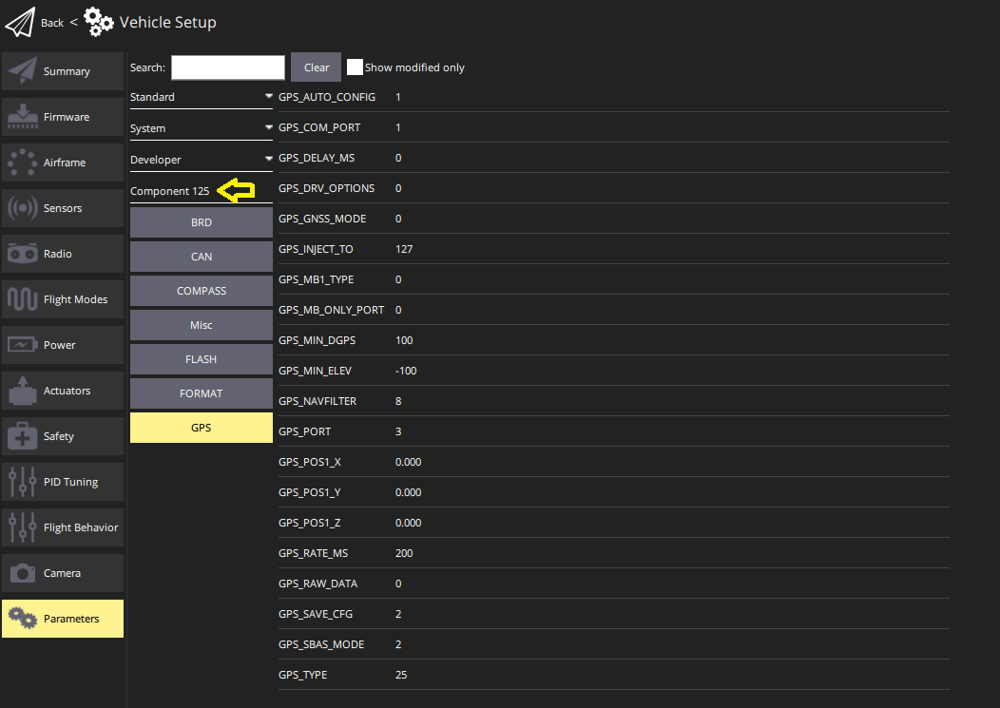

# DroneCAN

[DroneCAN](https://dronecan.github.io/) це відкритий програмний протокол зв'язку для контролерів польоту та інших пристроїв [CAN](../can/index.md) на транспортному засобі для взаємодії між собою.

:::warning

- DroneCAN не активовано за замовчуванням, так само як і конкретні сенсори та функції, які його використовують. Для отримання інформації щодо налаштування дивіться [Конфігурація PX4](#px4-configuration).
- PX4 вимагає SD-карту для активації динамічного виділення вузлів та оновлення прошивки. Карта SD не використовується під час польоту.

:::

:::info
DroneCAN раніше відомий як UAVCAN v0 (або просто UAVCAN).
Ім'я було змінено в 2022 році.
:::

## Переваги DroneCAN

Підключення периферійних пристроїв через DroneCAN має багато переваг:

- Багато різних сенсорів та приводів вже підтримуються.
- CAN був спеціально розроблений для забезпечення надійного та надійного підключення на відносно великі відстані. Це дозволяє безпечне використання ESC на більших транспортних засобах та забезпечує резервне забезпечення зв'язку.
- Автобус є бідирекціональним, що дозволяє виконувати моніторинг стану здоров'я, діагностику та телеметрію обертів на хвилину (RPM).
- Проводка менше складна, оскільки ви можете мати один шину для підключення всіх ваших ESC і інших периферійних пристроїв DroneCAN.
- Налаштування стає простіше, оскільки ви налаштовуєте нумерацію ESC, обертаючи кожен двигун вручну.
- Це дозволяє користувачам налаштовувати та оновлювати прошивку всіх пристроїв, підключених через CAN, централізовано через PX4.

## Підтримуване обладнання

Підтримуються найпоширеніші типи периферійних пристроїв (датчики, ESCs та сервоприводи), які відповідають стандартам DroneCAN/UAVCAN v0.

Підтримувана апаратура включає (це не є вичерпним списком):

- [Контролери ESC/двигуна](../dronecan/escs.md)
- Датчики швидкості повітря
  - [Датчик швидкості Thiemar](https://github.com/thiemar/airspeed)
- GNSS receivers for GNSS (GPS, GLONASS, BeiDou, and so on)
  - [ARK GPS](../dronecan/ark_gps.md)
  - [ARK RTK GPS](../dronecan/ark_rtk_gps.md)
  - [CubePilot Here3](https://www.cubepilot.org/#/here/here3)
  - [CUAV NEO v2 Pro GNSS](https://doc.cuav.net/gps/neo-series-gnss/en/neo-v2-pro.html)
  - [CUAV NEO 3 Pro GPS](../gps_compass/gps_cuav_neo_3pro.md)
  - [CUAV NEO 3X GPS](../gps_compass/gps_cuav_neo_3x.md)
  - [CUAV C-RTK2 PPK/RTK GNSS](../gps_compass/rtk_gps_cuav_c-rtk2.md)
  - [Holybro DroneCAN M8N GPS](../dronecan/holybro_m8n_gps.md)
  - [Holybro DroneCAN M9N GPS](https://holybro.com/products/dronecan-m9n-gps)
  - [Holybro DroneCAN H-RTK F9P Rover](https://holybro.com/products/dronecan-h-rtk-f9p-rover)
  - [Holybro DroneCAN H-RTK F9P Helical](https://holybro.com/products/dronecan-h-rtk-f9p-helical)
  - [Zubax GNSS](https://zubax.com/products/gnss_2)
- Power monitors
  - [Pomegranate Systems Power Module](../dronecan/pomegranate_systems_pm.md)
  - [CUAV CAN PMU Power Module](../dronecan/cuav_can_pmu.md)
- Compass
  - [Holybro RM3100 Professional Grade Compass](https://holybro.com/products/dronecan-rm3100-compass)
- Distance sensors
  - [ARK Flow](ark_flow.md)
  - [Avionics Anonymous Laser Altimeter UAVCAN Interface](../dronecan/avanon_laser_interface.md)
- Optical Flow
  - [Ark Flow](ark_flow.md)
- Generic CAN Node (enables use of I2C, SPI, UART sensors on the CAN bus).
  - [ARK CANnode](../dronecan/ark_cannode.md)

## Налаштування обладнання

DroneCAN працює через мережу CAN. Апаратне забезпечення DroneCAN повинно бути підключене, як описано в [CAN > Проводка](../can/index.md#wiring).

## Node ID Allocation

Кожен пристрій DroneCAN повинен бути налаштований з унікальним ідентифікатором вузла _node id_, який є унікальним на транспортному засобі.

Most devices support _Dynamic Node Allocation (DNA)_, which allows PX4 to automatically configure the node ID of each detected peripheral on system startup. Consult the manufacturer documentation for details on whether your device supports DNA and how to enable it. Many devices will automatically switch to DNA if the node id is set to 0. PX4 will enable the built in allocation server if the [UAVCAN_ENABLE](../advanced_config/parameter_reference.md#UAVCAN_ENABLE) parameter is > 1 (set to 2 or 3).

Some devices don't support DNA. Additionally, in certain mission-critical scenarios, you might prefer to manually configure node IDs beforehand instead of relying on the dynamic allocation server. If you wish to disable the DNA completely, set `UAVCAN_ENABLE` to `1` and manually set each node ID to a unique value. If the DNA is still running and certain devices need to be manually configured, give these devices a value greater than the total number of DroneCAN devices to avoid clashes.

:::info Ідентифікатор вузла PX4 можна налаштувати, використовуючи параметр [UAVCAN_NODE_ID](../advanced_config/parameter_reference.md#UAVCAN_NODE_ID). Параметр за замовчуванням встановлено на 1.
:::

:::warning
На момент написання PX4 не запускає сервер розподілу вузлів на порту CAN2. Це означає, що якщо у вас є пристрій, який підключений _тільки_ до CAN2 (не резервно до CAN1 і CAN2), вам потрібно буде вручну налаштувати його ідентифікатор вузла.
:::

## Конфігурація PX4

DroneCAN is configured on PX4 by [setting specific PX4 parameters](../advanced_config/parameters.md) in QGroundControl. You will need to enable DroneCAN itself, along with subscriptions and publications for any features that you use.

::: info In some cases you may need to also configure parameters on the connected CAN devices (these can also be [set using QGC](#qgc-cannode-parameter-configuration)).
:::

### Enabling DroneCAN

To enable the PX4 DroneCAN driver, set the [UAVCAN_ENABLE](../advanced_config/parameter_reference.md#UAVCAN_ENABLE) parameter:

- `0`: DroneCAN driver disabled
- `1`: DroneCAN driver enabled for sensors, [DNA server](#node-id-allocation) disabled
- `2`: DroneCAN driver enabled for sensors, DNA server enabled
- `3`: DroneCAN driver enabled for sensors and ESCs, DNA server enabled

`2` or `3` are recommended, if DNA is supported.

### Підписки &  Публікації DroneCan

PX4 does not publish or subscribe to DroneCAN messages that _might_ be needed by default, in order to avoid spamming the CAN bus. Instead you must enable publication or subscription to the messages associated with a particular feature by setting the associated [UAVCAN parameter](../advanced_config/parameter_reference.md#uavcan).

::: info Sensor parameters may not exist (be visible in QGC) until you have enabled the associated DroneCAN [sensor subscription](#sensors)!

For example, [SENS_FLOW_MINHGT](../advanced_config/parameter_reference.md#SENS_FLOW_MINHGT) does not exist until [UAVCAN_SUB_FLOW](../advanced_config/parameter_reference.md#UAVCAN_SUB_FLOW) is enabled.
:::

For example, to use a connected DroneCAN smart battery you would enable the [UAVCAN_SUB_BAT](../advanced_config/parameter_reference.md#UAVCAN_SUB_BAT) parameter, which would subscribe PX4 to receive [BatteryInfo](https://dronecan.github.io/Specification/7._List_of_standard_data_types/#batteryinfo) DroneCAN messages. If using a peripheral that needs to know if PX4 is armed, you would need to set the [UAVCAN_PUB_ARM](../advanced_config/parameter_reference.md#UAVCAN_PUB_ARM) parameter so that PX4 starts publishing [ArmingStatus](https://dronecan.github.io/Specification/7._List_of_standard_data_types/#armingstatus) messages.

The parameter names are prefixed with `UAVCAN_SUB_` and `UAVCAN_PUB_` to indicate whether they enable PX4 subscribing or publishing. The remainder of the name indicates the specific message/feature being set.

DroneCAN peripherals connected to PX4 can also be [configured using parameters via QGC](#qgc-cannode-parameter-configuration). By convention, parameters named with the prefix [CANNODE\_](../advanced_config/parameter_reference.md#CANNODE_BITRATE) have prefined meaning, and may be documented in the parameter reference. `CANNODE_` parameters prefixed with `CANNODE_PUB_` and `CANNODE_SUB_` enable the peripheral to publish or subscribe the associated DroneCAN message. These allow DroneCAN peripherals to be configured to only subscribe and publish messages that they actually need (in the same way that PX4 uses the corresponding `UAVCAN_PUB_`/`UAVCAN_SUB_` parameters). Note that a peripheral might might not use `CANNODE_` parameters, in which case it may have to publish/subscribe to particular messages whether or not they are needed.

The following sections provide additional detail on the PX4 and DroneCAN peripheral parameters used to enable particular features.

#### Sensors

The DroneCAN sensor parameters/subscriptions that you can enable are (in PX4 v1.14):

- [UAVCAN_SUB_ASPD](../advanced_config/parameter_reference.md#UAVCAN_SUB_ASPD): Airspeed
- [UAVCAN_SUB_BARO](../advanced_config/parameter_reference.md#UAVCAN_SUB_BARO): Barometer
- [UAVCAN_SUB_BAT](../advanced_config/parameter_reference.md#UAVCAN_SUB_BAT): Battery monitor/Power module
- [UAVCAN_SUB_BTN](../advanced_config/parameter_reference.md#UAVCAN_SUB_BTN): Button
- [UAVCAN_SUB_DPRES](../advanced_config/parameter_reference.md#UAVCAN_SUB_DPRES): Differential pressure
- [UAVCAN_SUB_FLOW](../advanced_config/parameter_reference.md#UAVCAN_SUB_FLOW): Optical flow
- [UAVCAN_SUB_GPS](../advanced_config/parameter_reference.md#UAVCAN_SUB_GPS): GPS
- [UAVCAN_SUB_HYGRO](../advanced_config/parameter_reference.md#UAVCAN_SUB_HYGRO): Hygrometer
- [UAVCAN_SUB_ICE](../advanced_config/parameter_reference.md#UAVCAN_SUB_ICE): Internal combustion engine (ICE).
- [UAVCAN_SUB_IMU](../advanced_config/parameter_reference.md#UAVCAN_SUB_IMU): IMU
- [UAVCAN_SUB_MAG](../advanced_config/parameter_reference.md#UAVCAN_SUB_MAG): Magnetometer (compass)
- [UAVCAN_SUB_RNG](../advanced_config/parameter_reference.md#UAVCAN_SUB_RNG): Range finder (distance sensor).

#### GPS

PX4 DroneCAN parameters:

- Enable [UAVCAN_SUB_GPS](../advanced_config/parameter_reference.md#UAVCAN_SUB_GPS).
- Enable [UAVCAN_SUB_MAG](../advanced_config/parameter_reference.md#UAVCAN_SUB_MAG) if the GPS module has an inbuilt compass.

GPS CANNODE parameter ([set using QGC](#qgc-cannode-parameter-configuration)):

- Set [CANNODE_TERM](../advanced_config/parameter_reference.md#CANNODE_TERM) to `1` for the last node on the CAN bus.

Other PX4 Parameters:

- If the GPS is not positioned at the vehicle centre of gravity you can account for the offset using [EKF2_GPS_POS_X](../advanced_config/parameter_reference.md#EKF2_GPS_POS_X), [EKF2_GPS_POS_Y](../advanced_config/parameter_reference.md#EKF2_GPS_POS_Y) and [EKF2_GPS_POS_Z](../advanced_config/parameter_reference.md#EKF2_GPS_POS_Z).
- If the GPS module provides yaw information, you can enable GPS yaw fusion by setting bit 3 of [EKF2_GPS_CTRL](../advanced_config/parameter_reference.md#EKF2_GPS_CTRL) to true.

#### RTK GPS

Set the same parameters as for [GPS](#gps) above. In addition, you may also need to set the following parameters depending on whether your RTK setup is Rover and Fixed Base, or Rover and Moving Base, or both.

##### Rover and Fixed Base

Position of rover is established using RTCM messages from the RTK base module (the base module is connected to QGC, which sends the RTCM information to PX4 via MAVLink).

PX4 DroneCAN parameters:

- [UAVCAN_PUB_RTCM](../advanced_config/parameter_reference.md#UAVCAN_PUB_RTCM):
  - Makes PX4 publish RTCM messages ([RTCMStream](https://dronecan.github.io/Specification/7._List_of_standard_data_types/#rtcmstream)) to the bus (which it gets from the RTK base module via QGC).

Rover module parameters (also [set using QGC](#qgc-cannode-parameter-configuration)):

- [CANNODE_SUB_RTCM](../advanced_config/parameter_reference.md#CANNODE_SUB_RTCM) tells the rover that it should subscribe to [RTCMStream](https://dronecan.github.io/Specification/7._List_of_standard_data_types/#rtcmstream) RTCM messages on the bus (from the moving base).

::: info You could instead use [UAVCAN_PUB_MBD](../advanced_config/parameter_reference.md#UAVCAN_PUB_MBD) and [CANNODE_SUB_MBD](../advanced_config/parameter_reference.md#CANNODE_SUB_MBD), which also publish RTCM messages (these are newer). Using the [RTCMStream](https://dronecan.github.io/Specification/7._List_of_standard_data_types/#rtcmstream) message means that you can implement moving base (see below) at the same time.
:::

##### Rover and Moving Base

As discussed in [RTK GPS Heading with Dual u-blox F9P](../gps_compass/u-blox_f9p_heading.md) a vehicle can have two RTK modules in order to calculate yaw from GPS. In this setup the vehicle has a _moving base_ RTK GPS and a _rover_ RTK GPS.

These parameters can be [set on moving base and rover RTK CAN nodes](#qgc-cannode-parameter-configuration), respectively:

- [CANNODE_PUB_MBD](../advanced_config/parameter_reference.md#CANNODE_PUB_MBD) causes a moving base GPS unit to publish [MovingBaselineData](https://dronecan.github.io/Specification/7._List_of_standard_data_types/#movingbaselinedata)RTCM messages onto the bus (for the rover)
- [CANNODE_SUB_MBD](../advanced_config/parameter_reference.md#CANNODE_SUB_MBD) tells the rover that it should subscribe to [MovingBaselineData](https://dronecan.github.io/Specification/7._List_of_standard_data_types/#movingbaselinedata) RTCM messages on the bus (from the moving base).

Для PX4 вам також знадобиться встановити [GPS_YAW_OFFSET](../advanced_config/parameter_reference.md#GPS_YAW_OFFSET), щоб вказати відносне положення рухомої бази та ровера: 0, якщо ваш Rover знаходиться перед вашою Рухомою Базою, 90, якщо Rover зправа від Рухомої Бази, 180, якщо Rover ззаду Рухомої Бази, або 270, якщо Rover зліва від Рухомої Бази.

#### Барометр

Параметри PX4 DroneCAN:

- Увімкніть [UAVCAN_SUB_BARO](../advanced_config/parameter_reference.md#UAVCAN_SUB_BARO).

#### Компас

Параметри PX4 DroneCAN:

- Увімкніть [UAVCAN_SUB_MAG](../advanced_config/parameter_reference.md#UAVCAN_SUB_MAG).

#### Датчик відстані/Дальніметр

Параметри PX4 DroneCAN:

- Увімкніть [UAVCAN_SUB_RNG](../advanced_config/parameter_reference.md#UAVCAN_SUB_RNG).
- Встановіть [UAVCAN_RNG_MIN](../advanced_config/parameter_reference.md#UAVCAN_RNG_MIN) та [UAVCAN_RNG_MAX](../advanced_config/parameter_reference.md#UAVCAN_RNG_MAX), мінімальну та максимальну дистанцію сенсора відстані.

Інші параметри PX4:

- Якщо дальномер не розташований в центрі ваги транспортного засобу, ви можете врахувати зміщення, використовуючи [EKF2_RNG_POS_X](../advanced_config/parameter_reference.md#EKF2_RNG_POS_X), [EKF2_RNG_POS_Y](../advanced_config/parameter_reference.md#EKF2_RNG_POS_Y) та [EKF2_RNG_POS_Z](../advanced_config/parameter_reference.md#EKF2_RNG_POS_Z).
- Інші параметри `EKF2_RNG_*` можуть бути важливими, у такому випадку вони повинні бути задокументовані з конкретним дальномером.

#### Оптичний потік Sensor

Параметри PX4 DroneCAN:

- Увімкніть [UAVCAN_SUB_FLOW](../advanced_config/parameter_reference.md#UAVCAN_SUB_FLOW).

Інші параметри PX4:

- Встановіть [SENS_FLOW_MINHGT](../advanced_config/parameter_reference.md#SENS_FLOW_MINHGT) та [SENS_FLOW_MAXHGT](../advanced_config/parameter_reference.md#SENS_FLOW_MAXHGT), мінімальну та максимальну висоту датчика потоку.
- Встановіть [SENS_FLOW_MAXR](../advanced_config/parameter_reference.md#SENS_FLOW_MAXR) максимальну кутову швидкість потоку датчика.
- Увімкніть об'єднання оптичного потоку, встановивши [EKF2_OF_CTRL](../advanced_config/parameter_reference.md#EKF2_OF_CTRL).
- Щоб вимкнути підтримку GPS (необов'язково), встановіть [EKF2_GPS_CTRL](../advanced_config/parameter_reference.md#EKF2_GPS_CTRL) на `0`.
- Якщо оптичний потік не розташований в центрі ваги транспортного засобу, ви можете врахувати зміщення, використовуючи [EKF2_OF_POS_X](../advanced_config/parameter_reference.md#EKF2_OF_POS_X), [EKF2_OF_POS_Y](../advanced_config/parameter_reference.md#EKF2_OF_POS_Y) та [EKF2_OF_POS_Z](../advanced_config/parameter_reference.md#EKF2_OF_POS_Z).

Оптичні датчики потоку потребують даних дальномера. Однак дальномер не обов'язково повинен бути частиною того ж модуля, і якщо він не є, то може бути не підключений через DroneCAN. Якщо дальномір підключений через DroneCAN (чи це вбудовано або окремо), вам також потрібно буде активувати його, як описано в розділі [дальномір](#distance-sensor-range-finder) (вище).

#### Периферійне озброєння

Параметри PX4 DroneCAN:

- [UAVCAN_PUB_ARM](../advanced_config/parameter_reference.md#UAVCAN_PUB_ARM) ([Статус зброї](https://dronecan.github.io/Specification/7._List_of_standard_data_types/#armingstatus)): Опублікуйте, коли використовуєте компоненти DroneCAN, які вимагають статусу зброї PX4 як умову для використання.

### ESC & сервоприводи

[Двигуни DroneCAN та сервоприводи](../dronecan/escs.md) потребують налаштування [порядку двигунів та виходів сервоприводів](../config/actuators.md).

## Налаштування параметрів CANNODE QGC

QGroundControl може переглядати та змінювати параметри, що належать до пристроїв CAN, підключених до автопілота, за умови, що пристрої підключені до автопілота до запуску QGC.

Контролери CAN відображаються в окремих розділах у [Параметри транспортного засобу > Параметри](../advanced_config/parameters.md) під назвою _Компонент X_, де X - ідентифікатор вузла. Наприклад, на знімку екрану нижче показані параметри для CAN GPS з ідентифікатором вузла 125 (після групування параметрів _Стандарт_, _Система_ та _Розробник_).

## Налаштування пристрою

Більшість вузлів DroneCAN не потребують додаткової настройки, якщо це не вказано у їх документації, специфічній для пристрою.

## Оновлення прошивки

PX4 може оновлювати прошивку пристрою через DroneCAN. Щоб оновити пристрій, все, що потрібно зробити, це скопіювати бінарний файл прошивки в кореневий каталог SD-карти контролера польоту та перезавантажити його.

Під час завантаження контролер польоту автоматично передасть прошивку на пристрій та оновить його. Якщо операція вдалася, бінарний файл прошивки буде видалено з кореневого каталогу, і на SD-картці буде файл з назвою **XX.bin** у каталозі **/ufw**.

## Відстеження проблем

**Q**:  Мої пристрої DroneCAN не працюють.

**A**: Перевірте, що параметр `UAVCAN_ENABLE` встановлено правильно. Щоб побачити список пристроїв/вузлів, які PX4 виявив на шині CAN, відкрийте NSH (тобто перейдіть до консолі MAVLink QGroundControl) та введіть `uavcan status`.

---

**Q**: Сервер DNA не видає ідентифікатори вузлів.

**A**: PX4 вимагає SD-карту для виконання динамічного виділення вузлів. Переконайтеся, що у вас (працюючий) вставлений і перезавантажтеся.

---

**Q**: Двигуни не крутяться під час увімкнення.

**A**: Переконайтеся, що `UAVCAN_ENABLE` встановлено ​​на `3`, щоб увімкнути вивід ESC DroneCAN.

---

**Q**: Двигуни не крутяться, поки не збільшиться оберти.

**А**: Використовуйте [Acutator > Тестування приводу](../config/actuators.md#actuator-testing), щоб підтвердити, що вихідні дані двигуна встановлені на правильні мінімальні значення.

## Корисні посилання

- [Головна сторінка](https://dronecan.github.io) (dronecan.github.io)
- [Специфікація протоколу](https://dronecan.github.io/Specification) (dronecan.github.io)
- [Реалізації](https://dronecan.github.io/Implementations/) (dronecan.github.io)
- [пристрій Cyphal/CAN interconnection](https://kb.zubax.com/pages/viewpage.action?pageId=2195476) (kb.zubax.com)
