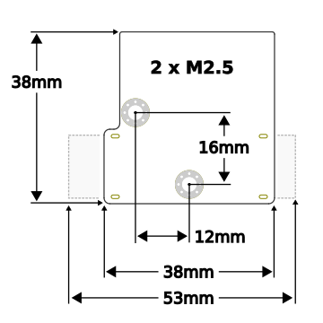

# Силовий модуль Pomegranate Systems

:::info У 2022 році UAVCAN (v0) був форкнутий і підтримується як `DroneCAN`. Хоча цей продукт все ще згадує "UAVCAN", він повністю сумісний з підтримкою DroneCAN в PX4.
:::


Цифровий модуль живлення з високороздільним інтегруванням струму, живлення 5В/2А з моніторингом потужності, один інтерфейс DroneCAN CANbus, та RGB індикатор статусу.

Детальну інформацію щодо налаштування, конфігурації та усунення неполадок можна знайти на [домашній сторінці пристрою виробника](https://p-systems.io/product/power_module).

## Характеристики обладнання

- **Вхідна напруга:** 6-26V \(2-6S\)
- **Максимальний постійний струм:**
  - **Benchtop:** 40A
  - **Примусове охолодження:** 100A
- **Максимальний струм виходу 5В:** 2A
- **Роздільна здатність напруги:** 0.04 ΔV
- **Поточне рішення:**
  - **Основна / Акумуляторна Шина:** 0.02 ΔA
  - **5V шина:** 0.001 ΔA
- **Завершення CANbus:** Електронне (увімкнено за замовчуванням)
- **MCU:** STM32F302K8U
- **Електричний інтерфейс:**
  - **Потужність:** Паяльні подушки або XT60PW (прямий кут, платні роз'єми)
  - **CANbus** Подвійний JST GH-4 (стандартний мікро-коннектор UAVCAN)
  - **I2C / Serial:** JST GH-5
  - **5V Вихід:** Паяні площини або роз'єми CANbus / I2C
- **Маса пристрою:**
  - **без конекторів:** 9g
  - **З конекторами XT60PW:** 16г



## Налаштування прошивки

Модуль живлення працює на власній спеціальній (відкритому вихідному коді) прошивці компанії pomegranate systems. Вихідний код та інструкції зі збірки можна знайти на [bitbucket](https://bitbucket.org/p-systems/firmware/src/master).

## Налаштування контролера польоту

1. Увімкніть DroneCAN, встановивши параметр [UAVCAN_ENABLE](../advanced_config/parameter_reference.md#UAVCAN_ENABLE) на `2` (Автоматична конфігурація сенсорів) або `3`.
1. Увімкніть моніторинг батареї DroneCAN, встановивши [UAVCAN_SUB_BAT](../advanced_config/parameter_reference.md#UAVCAN_SUB_BAT) на `1` або `2` (залежно від вашої батареї).
1. Встановіть наступні параметри модуля, використовуючи [консоль MAVLink](https://docs.qgroundcontrol.com/master/en/qgc-user-guide/analyze_view/mavlink_console.html):
   - Ємність батареї у мАг: `battery_capacity_mAh`
   - Напруга батареї при _повному_ заряді: `battery_full_V`,
   - Напруга акумулятора при _порожнечі_: `battery_empty_V`
   - Увімкніть поточну інтеграцію: `enable_current_track`
   - (необов'язково) Вимкніть резистор завершення CANbus :`enable_can_term`

**Приклад:** Модуль живлення з ідентифікатором вузла UAVCAN `125`, підключений до LiPo з напругою `3S` і ємністю `5000mAh`, може бути налаштований за допомогою наступних команд:

```sh
uavcan param set 125 battery_capacity_mAh 5000
uavcan param set 125 battery_full_V 12.5
uavcan param set 125 battery_empty_V 11.2
uavcan param set 125 enable_current_track 1
uavcan param save 125
```

Дивіться [сторінку конфігурації пристрою](https://p-systems.io/product/power_module/configuration) для повного списку параметрів.
