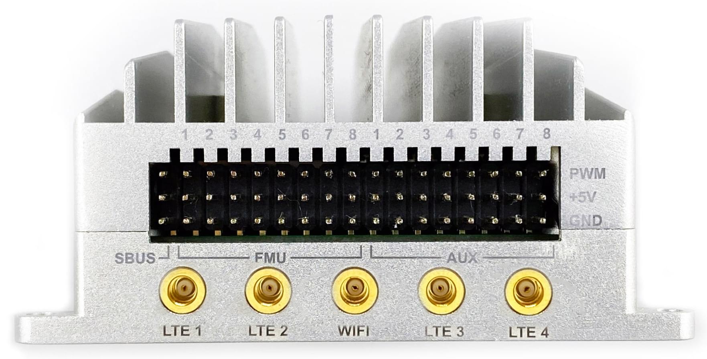

# Sky-Drones AIRLink

:::warning
PX4 не виробляє цей (або будь-який інший) автопілот. Зверніться до [виробника](https://sky-drones.com/) щодо підтримки обладнання або питань сумісності.
:::

[AIRLink](https://sky-drones.com/airlink) розшифровується як Artificial Intelligence (штучний інтелект) & Remote Link (дистанційне з'єднання). Апарат складається з найсучаснішого автопілота безпілотника, комп'ютера зі штучним інтелектом та блоку зв'язку LTE/5G. AIRLink допомагає скоротити час виходу на ринок для нових виробників дронів з років і місяців до тижнів.


:::note
Цей польотний контролер підтримується [виробником](../flight_controller/autopilot_manufacturer_supported.md).
:::

AIRLink має два комп'ютери та інтегрований LTE-модуль:

- Комп'ютер керування польотом (автопілот) має потрійне резервування з вібро- та термостабілізованим IMU.
- Потужний місійний комп'ютер зі штучним інтелектом забезпечує такі передові функції програмного забезпечення безпілотника, як комп'ютерний зір і оминання перешкод, потокове передавання цифрового відео високої чіткості та потокове передавання даних корисного вантажу.
- Модулі зв'язку LTE/5G та WiFi забезпечують постійне широкосмугове підключення до Інтернету, що дозволяє здійснювати віддалені робочі процеси.

## Основні характеристики

@[youtube](https://youtu.be/VcBx9DLPN54)

## Специфікації

- **Датчики (сенсори)**

  - 3x акселерометри, 3x гіроскопи, 3x магнітометри, 3x датчики тиску
  - ГНСС, далекоміри, лідари, оптичний потік, камери
  - 3x-кратне резервування IMU
  - Гасіння вібрації
  - Стабілізація температури

- **Політний контролер**

  - STM32F7, ARM Cortex M7 з FPU, 216 МГц, 2 МБ Flash, 512 кБ оперативної пам'яті
  - STM32F1, співпроцесор вводу/виводу (IO)
  - Ethernet, 10/100 Мбіт/с
  - Локальна мережа з комп'ютером місії зі штучним інтелектом
  - 8x UART: Телеметрія 1, Телеметрія 2 ( місійний комп'ютер зі ШІ), Телеметрія 3, GPS 1, GPS 2, додатковий UART, послідовна консоль налагодження, ввід-вивід (IO)
  - 2x CAN: CAN1, CAN2
  - USB з MAVLink
  - Послідовна консоль для відладки
  - Вхід RC, вхід SBUS, вхід RSSI, вхід PPM
  - 16x PWM виходів сервоприводів (8 з IO, 8 з FMU)
  - 3x I2C порти
  - Потужний драйвер п'єзо-зуммера
  - Високопотужний RGB LED
  - Запобіжний вимикач / LED опція

- **Місійний комп'ютер зі штучним інтелектом**

  - 6-ядерний процесор: двоядерний Cortex-A72 + чотирьохядерний Cortex-A53
  - Графічний процесор Mali-T864, OpenGL ES1.1/2.0/3.0/3.1
  - VPU з декодуванням 4K VP8/9, 4K 10bits H265/H264 60fps
  - Дистанційне керування живленням, скидання програмного забезпечення, вимкнення живлення, пробудження RTC, сплячий режим
  - Оперативна пам'ять Dual Channel 4GB LPDDR4
  - 16GB eMMC
  - MicroSD до 256 Гб
  - Ethernet 10/100/1000 Native Gigabit
  - WiFi 802.11a/b/g/n/ac, Bluetooth
  - USB 3.0 Type C
  - 2х Video: 4-смугова MIPI CSI (FPV-камера) та 4-смугова MIPI CSI з входом HMDI (камера корисного навантаження)

- **Модуль зв'язку LTE/5G**

  - Пропускна здатність до 600 Мбіт/с
  - 5G sub-6 і mmWave, SA і NSA операції
  - 4G Cat 20, до 7xCA, 256-QAM DL/UL, 2xCA UL
  - 4 x 4 MIMO для 4G і 5G (до 6 діапазонів)
  - 3G HSPA+
  - Схвалено JRL/JTBL, FCC, PTCRB, RED, GCF
  - Антена, 4x4 MIMO
  - Bands: Worldwide

## Де купити

Купуйте в оригінальному магазині Sky-Drones (доставка по всьому світу з обробкою замовлення за 1-2 дні):

- [AIRLink Enterprise 4G](https://sky-drones.com/sets/airlink-enterprise-set.html)
- [AIRLink Enterprise 5G](https://sky-drones.com/sets/airlink-5g-enterprise-set.html)
- [AIRLink Core 4G](https://sky-drones.com/autopilots/airlink-core.html)
- [AIRLink Core 5G](https://sky-drones.com/store/airlink-5g-core.html)

## Аксесуари до AIRLink Enterprise Kit

@[youtube](https://youtu.be/lex7axW8WQg)

AIRLink Enterprise прибуває з усім необхідним для налаштування автопілота.

Стандартний набір містить:

- 1x AIRLink Enterprise unit
- 1x FPV камера з CSI кабелем
- 1x WiFi антена з роз'ємом MMCX
- 2x/4x LTE/5G антена з роз'ємом MMCX
- 1x кабель HDMI на міні HDMI 1x набір кабелів (7 кабелів для всіх роз'ємів)

[AIRLink Telemetry](https://sky-drones.com/sets/airlink-telemetry-set.html) на базі радіочастотного мікромодуля Microhard LAN/IP доступний як додатковий модуль і повністю сумісний з AIRLink.

## Видання

There are AIRLink editions that offer different integration levels required by drone manufacturers: _Enterprise_ and _Core_. AIRLink Enterprise is ideal for a quick start, evaluation and prototyping while Core is optimised for deep integration and mid-high volume manufacturing.

**AIRLink Enterprise**

SmartAP AIRLink's Enterprise edition is intended for prototyping and low to medium volume drone production. Quick and easy installation thanks to the dedicated mounting holes and integrated heatsink for power dissipation.


**AIRLink Core**

SmartAP AIRLink's Core edition is intended for medium to high volume production and deep integration with customer's hardware. It weighs only 89 g and can be attached to a metal frame for optimum cooling.


| Parameter           | AIRLink Enterprise                                          | AIRLink Core                                                                        |
| ------------------- | ----------------------------------------------------------- | ----------------------------------------------------------------------------------- |
| Enclosure           | Aluminum, with integrated heatsink and fan mounting option. | External heatsink or reasonable power dissipation should be provided by the design. |
| Dimensions          | L103 x W61 x H37 mm                                         | L100 x W57 x H22 mm                                                                 |
| Weight              | 198 g                                                       | 89 g                                                                                |
| Ambient temperature | -40°C-..+50°C                                               | -40°C-..+50°C                                                                       |

## Key Features

- **Easy to mount**

  

- **FPV camera comes as standard**

  

## Interfaces

### Left Side


- **Left side interfaces:**

  - Power input with voltage & current monitoring
  - AI Mission Computer micro SD card
  - Flight Controller micro SD card
  - AI Mission Computer USB Type-C
  - PPM input, SBUS output, RSSI monitor

- **POWER - JST GH SM10B-GHS-TB**

  | Pin number | Pin name    | Direction | Voltage | Function                   |
  | ---------- | ----------- | --------- | ------- | -------------------------- |
  | 1          | 12V         | IN        | +12V    | Main power input           |
  | 2          | 12V         | IN        | +12V    | Main power input           |
  | 3          | 12V         | IN        | +12V    | Main power input           |
  | 4          | BAT_CURRENT | IN        | +3.3V   | Battery current monitoring |
  | 5          | BAT_VOLTAGE | IN        | +3.3V   | Battery voltage monitoring |
  | 6          | 3V3         | OUT       | +3.3V   | 3.3V output                |
  | 7          | PWR_KEY     | IN        | +3.3V   | Power key input            |
  | 8          | GND         | Ground    |         |                            |
  | 9          | GND         | Ground    |         |                            |
  | 10         | GND         | Ground    |         |                            |

- **CPU SD card - microSD**
- **CPU USB - USB Type C**
- **RC Connector - JST GH SM06B-GHS-TB**

  | Pin number | Pin name | Direction | Voltage | Function                       |
  | ---------- | -------- | --------- | ------- | ------------------------------ |
  | 1          | 5V       | OUT       | +5V     | 5V output                      |
  | 2          | PPM_IN   | IN        | +3.3V   | PPM input                      |
  | 3          | RSSI_IN  | IN        | +3.3V   | RSSI input                     |
  | 4          | FAN_OUT  | OUT       | +5V     | Fan output                     |
  | 5          | SBUS_OUT | OUT       | +3.3V   | SBUS output | 6 | GND | Ground |

* **FMU SD card - microSD**

### Right Side


- **Right side interfaces:**

  - Ethernet port with power output
  - Telemetry port
  - Second GPS port
  - Spare I2C / UART port
  - Flight controller USB Type-C
  - Micro SIM Card
  - HDMI input port (payload camera)

- **ETHERNET - JST GH SM08B-GHS-TB**

  | Pin number | Pin name | Direction | Voltage | Function                   |
  | ---------- | -------- | --------- | ------- | -------------------------- |
  | 1          | 5V       | OUT       | +5V     | Radio module power supply  |
  | 2          | 5V       | OUT       | +5V     | Radio module power supply  |
  | 3          | ETH_TXP  | OUT       | +3.3V   | Ethernet transmit positive |
  | 4          | ETH_TXN  | OUT       | +3.3V   | Ethernet transmit negative |
  | 5          | ETH_RXP  | IN        | +3.3V   | Ethernet receive positive  |
  | 6          | ETH_RXN  | IN        | +3.3V   | Ethernet receive negative  |
  | 7          | GND      | Ground    |         |                            |
  | 8          | GND      | Ground    |         |                            |

- **TEL3 - JST GH SM06B-GHS-TB**

  | Pin number | Pin name   | Direction | Voltage | Function            |
  | ---------- | ---------- | --------- | ------- | ------------------- |
  | 1          | 5V         | OUT       | +5V     | Power supply output |
  | 2          | USART2_TX  | OUT       | +3.3V   | Telemetry 3 TX      |
  | 3          | USART2_RX  | IN        | +3.3V   | Telemetry 3 RX      |
  | 4          | USART2_CTS | IN        | +3.3V   | Telemetry 3 CTS     |
  | 5          | USART2_RTS | OUT       | +3.3V   | Telemetry 3 RTS     |
  | 6          | GND        | Ground    |         |                     |

- **I2C3 / UART4 - JST GH SM06B-GHS-TB**

  | Pin number | Pin name  | Direction | Voltage | Function            |
  | ---------- | --------- | --------- | ------- | ------------------- |
  | 1          | 5V        | OUT       | +5V     | Power supply output |
  | 2          | USART4_TX | OUT       | +3.3V   | UART 4 TX           |
  | 3          | USART4_RX | IN        | +3.3V   | UART 4 RX           |
  | 4          | I2C3_SCL  | I/O       | +3.3V   | I2C3 Clock          |
  | 5          | I2C3_SDA  | I/O       | +3.3V   | I2C3 Data           |
  | 6          | GND       | Ground    |         |                     |

- **GPS2 - JST GH SM06B-GHS-TB**

  | Pin number | Pin name  | Direction | Voltage | Function            |
  | ---------- | --------- | --------- | ------- | ------------------- |
  | 1          | 5V        | OUT       | +5V     | Power supply output |
  | 2          | USART8_TX | OUT       | +3.3V   | UART 8 TX           |
  | 3          | USART8_RX | IN        | +3.3V   | UART 8 RX           |
  | 4          | I2C2_SCL  | I/O       | +3.3V   | I2C2 Clock          |
  | 5          | I2C2_SDA  | I/O       | +3.3V   | I2C2 Data           |
  | 6          | GND       | Ground    |         |                     |

- **FMU USB - USB Type C**
- **SIM Card - micro SIM**
- **HDMI - mini HDMI**

### Front Side


- **Front side interfaces:**

  - Main GNSS and compass port
  - Main telemetry port
  - CSI camera input
  - CAN 1
  - CAN 2

- **TEL1 - JST GH SM06B-GHS-TB**

  | Pin number | Pin name   | Direction | Voltage | Function            |
  | ---------- | ---------- | --------- | ------- | ------------------- |
  | 1          | 5V         | OUT       | +5V     | Power supply output |
  | 2          | USART7_TX  | OUT       | +3.3V   | Telemetry 1 TX      |
  | 3          | USART7_RX  | IN        | +3.3V   | Telemetry 1 RX      |
  | 4          | USART7_CTS | IN        | +3.3V   | Telemetry 1 CTS     |
  | 5          | USART7_RTS | OUT       | +3.3V   | Telemetry 1 RTS     |
  | 6          | GND        | Ground    |         |                     |

- **GPS1 - JST GH SM10B-GHS-TB**

  | Pin number | Pin name   | Direction | Voltage | Function            |
  | ---------- | ---------- | --------- | ------- | ------------------- |
  | 1          | 5V         | OUT       | +5V     | Power supply output |
  | 2          | USART1_TX  | OUT       | +3.3V   | GPS 1 TX            |
  | 3          | USART1_RX  | IN        | +3.3V   | GPS 1 RX            |
  | 4          | I2C1_SCL   | I/O       | +3.3V   | Mag 1 Clock         |
  | 5          | I2C1_SDA   | I/O       | +3.3V   | Mag 1 Data          |
  | 6          | SAFETY_BTN | IN        | +3.3V   | Safety button       |
  | 7          | SAFETY_LED | OUT       | +3.3V   | Safety LED          |
  | 8          | +3V3       | OUT       | +3.3V   | 3.3V output         |
  | 9          | BUZZER     | OUT       | +5V     | Buzzer output       |
  | 10         | GND        | Ground    |         |                     |

- **CAN1 - JST GH SM04B-GHS-TB**

  | Pin number | Pin name | Direction | Voltage | Function            |
  | ---------- | -------- | --------- | ------- | ------------------- |
  | 1          | 5V       | OUT       | +5V     | Power supply output |
  | 2          | CAN1_H   | I/O       | +5V     | CAN 1 High (120Ω)   |
  | 3          | CAN1_L   | I/O       | +5V     | CAN 1 Low (120Ω)    |
  | 4          | GND      | Ground    |         |                     |

- **CAN2 - JST GH SM04B-GHS-TB**

  | Pin number | Pin name | Direction | Voltage | Function            |
  | ---------- | -------- | --------- | ------- | ------------------- |
  | 1          | 5V       | OUT       | +5V     | Power supply output |
  | 2          | CAN2_H   | I/O       | +5V     | CAN 2 High (120Ω)   |
  | 3          | CAN2_L   | I/O       | +5V     | CAN 2 Low (120Ω)    |
  | 4          | GND      | Ground    |         |                     |

- **CAMERA - FPC 30 pin, 0.5mm pitch**

### Rear Side



- **Rear side interfaces:**

  - SBUS input
  - 16 PWM output channels
  - 2x LTE antenna sockets (MIMO)
  - WiFi antenna socket (AP & Station modes)

# Serial Mapping

AIRLink has a large number of internal and external serial ports:

| Serial   | UART    | Function                                            |
| -------- | ------- | --------------------------------------------------- |
| Serial 0 | USB     | Console                                             |
| Serial 1 | UART 7  | Telemetry 1                                         |
| Serial 2 | UART 5  | Telemetry 2 (used internally with Mission Computer) |
| Serial 3 | USART 1 | GPS 1                                               |
| Serial 4 | UART 8  | GPS 2                                               |
| Serial 5 | USART 3 | Debug console (internal connector)                  |
| Serial 6 | USART 2 | Telemetry 3                                         |
| Serial 7 | UART 4  | External UART                                       |

## RC Input

RC input is configured on the SBUS pin and is connected to IO MCU via an inverter internally. For PPM receivers please use RC Connector PPM pin located on the left side of the unit.


## Outputs

AIRLink has 16 PWM ouputs. Main outputs 1-8 and connected to IO MCU. AUX outputs 1-8 are connected to FMU.

| Output | Timer    | Channel   |
| ------ | -------- | --------- |
| AUX 1  | Timer 1  | Channel 4 |
| AUX 2  | Timer 1  | Channel 3 |
| AUX 3  | Timer 1  | Channel 2 |
| AUX 4  | Timer 1  | Channel 1 |
| AUX 5  | Timer 4  | Channel 2 |
| AUX 6  | Timer 4  | Channel 3 |
| AUX 7  | Timer 12 | Channel 1 |
| AUX 8  | Timer 12 | Channel 2 |

[DShot](../peripherals/dshot.md) can be used on the first four AUX pins.

## Building Firmware

:::tip
Most users will not need to build this firmware! It is pre-built and automatically installed by _QGroundControl_ when appropriate hardware is connected.
:::

To [build PX4](../dev_setup/building_px4.md) for this target:

```
make sky-drones_smartap-airlink
```

## Peripherals

- [SmartAP GPS](../gps_compass/gps_smartap.md) - GPS module with compass, pressure sensor and RGB LED
- [SmartAP PDB](../power_module/sky-drones_smartap-pdb.md) - Power Distribution Board

## Reference Design


AIRLink CAD model is available [here](https://docs.sky-drones.com/airlink/cad-model)

AIRLink Reference design can be provided by request. Get in touch at [Sky-Drones contact page](https://sky-drones.com/contact-us)

## More Information

For more information and instructions on setting up and using the AIRLink system see [AIRLink Documentation](https://docs.sky-drones.com/airlink/).

For technical help, support and customization please get in touch at [Sky-Drones contact page](https://sky-drones.com/contact-us).

More information can be found at [www.sky-drones.com](https://sky-drones.com).

Frequently asked questions are answered in [FAQ](https://docs.sky-drones.com/airlink/faq).

## Useful Links

- [AIRLink product page](https://sky-drones.com/airlink)
- [AIRLink documentation](https://docs.sky-drones.com/avionics/airlink)
- [AIRLink datasheet](https://3182378893-files.gitbook.io/~/files/v0/b/gitbook-x-prod.appspot.com/o/spaces%2F-MTMlWysgDtJq8Hid1v7%2Fuploads%2F8AiuNNSwLYnZSscj7uIV%2FAIRLink-Datasheet.pdf?alt=media&token=cbf0c4bf-9ab1-40c5-a0af-c6babdddb690)
- [Buy AIRLink Enterprise 4G](https://sky-drones.com/sets/airlink-enterprise-set.html)
- [Buy AIRLink Enterprise 5G](https://sky-drones.com/sets/airlink-5g-enterprise-set.html)
- [Buy AIRLink Core 4G](https://sky-drones.com/autopilots/airlink-core.html)
- [Buy AIRLink Core 5G](https://sky-drones.com/store/airlink-5g-core.html)
