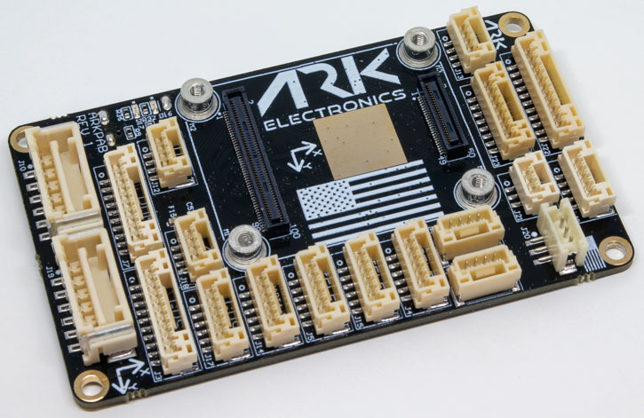
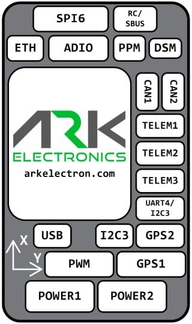

# ARK Pixhawk Autopilot Bus Carrier

:::warning
PX4 не виробляє цей (або будь-який інший) автопілот. Зверніться до [виробника](https://arkelectron.com/contact-us/) щодо підтримки обладнання або питань сумісності.
:::

Плата ARK Pixhawk Autopilot Bus (PAB) Carrier - це вироблена в США плата контролера польоту, що базується на стандарті з відкритим вихідним кодом [Pixhawk Autopilot Bus](https://github.com/pixhawk/Pixhawk-Standards).

Форм-фактор PAB дозволяє використовувати ARK PAB Carrier з будь-яким [PAB-сумісним польотним контролером](../flight_controller/pixhawk_autopilot_bus.md), таким як [ARKV6X](../flight_controller/arkv6x.md).

### Де купити

Замовляйте у [Ark Electronics](https://arkelectron.com/product/ark-pixhawk-autopilot-bus-carrier/) (США)

## Функції

- [Pixhawk Autopilot Bus (PAB) Form Factor](https://github.com/pixhawk/Pixhawk-Standards/blob/master/DS-010%20Pixhawk%20Autopilot%20Bus%20Standard.pdf?_ga=2.20605755.2081055420.1671562222-391294592.1671562222)
- USA Built

## З’єднання

- Інтерфейс PAB Board to Board
  - 100 Pin Hirose DF40
  - 40 Pin Hirose DF40
- Подвійні входи цифрового модуля живлення
  - Вхід 5В
  - Монітор живлення I2C
  - 6-контактний Molex CLIK-Mate
- Ethernet
  - 100Мбіт/c
  - Built in Magnetics
  - 4-контактний JST-GH
- Повноцінний порт перемикача безпеки GPS Plus
  - 10-контактний JST-GH
- Базовий порт GPS
  - 6-контактний JST-GH
- Подвійні CAN порти
  - 4-контактний JST-GH
- Потрійні телеметричні порти з контролем потоку
  - 6-контактний JST-GH
- Вісім ШІМ-виходів
  - 10-контактний JST-GH
- UART/I2C порт
  - 6-контактний JST-GH
- I2C порт
  - 4-контактний JST-GH
- PPM RC порт
  - 3-контактний JST-GH
- DSM RC порт
  - 3-контактний JST-GH
- SPI порт
  - 11-контактний JST-GH
- ADIO порт
  - 8-контактний JST-GH
- Відладочний порт
  - 10-контактний JST-SH

## Розміри

- Без модуля польотного контролера
  - 74.0мм х 43.5мм х 12,0мм
  - 22г

## Живлення

- 5В вхід на `POWER1`, `POWER2`, `USB C` та роз'єм `USB JST-GH`
  - Пріоритет входу визначається у наступному порядку: POWER1 > POWER2 > USB
  - `USB C` і `USB JST-GH` з'єднані паралельно
  - Захист від перенапруги при 5,8 В
  - Захист від зниженої напруги 3,9 В
- `VDD_5V_HIPOWER` і `VDD_5V_PERIPH` можуть забезпечити сумарно 1,5 А на всіх роз'ємах

## Cвітлодіоди

- На ARK PAB є два світлодіода
  - `Червоний` - це світлодіод Ethernet
  - `Зелений` - це світлодіод активності Ethernet

## Схема розташування виводів

## POWER1

| Pin     | Сигнал    | Вольтаж |
| ------- | --------- | ------- |
| 1 (red) | `VBRICK1` | +5.0В   |
| 2 (blk) | `VBRICK1` | +5.0В   |
| 3 (blk) | I2C1_SCL  | +3.3В   |
| 4 (blk) | I2C1_SDA  | +3.3В   |
| 5 (blk) | `GND`     | GND     |
| 6 (blk) | `GND`     | GND     |

## POWER2

| Pin     | Сигнал    | Вольтаж |
| ------- | --------- | ------- |
| 1 (red) | `VBRICK2` | +5.0В   |
| 2 (blk) | `VBRICK2` | +5.0В   |
| 3 (blk) | I2C2_SCL  | +3.3В   |
| 4 (blk) | I2C2_SDA  | +3.3В   |
| 5 (blk) | `GND`     | GND     |
| 6 (blk) | `GND`     | GND     |

## PWM

| Pin      | Сигнал                     | Вольтаж |
| -------- | -------------------------- | ------- |
| 1 (red)  | VDD_SERVO (не підключений) | +5.0В   |
| 2 (blk)  | FMU_CH1                    | +3.3В   |
| 3 (blk)  | FMU_CH2                    | +3.3В   |
| 4 (blk)  | FMU_CH3                    | +3.3В   |
| 5 (blk)  | FMU_CH4                    | +3.3В   |
| 6 (blk)  | FMU_CH5                    | +3.3В   |
| 7 (blk)  | FMU_CH6                    | +3.3В   |
| 8 (blk)  | FMU_CH7                    | +3.3В   |
| 9 (blk)  | FMU_CH8                    | +3.3В   |
| 10 (blk) | `GND`                      | GND     |

## GPS1

| Pin      | Сигнал                   | Вольтаж |
| -------- | ------------------------ | ------- |
| 1 (red)  | `VDD_5V_PERIPH`          | +5.0В   |
| 2 (blk)  | USART1_TX_GPS1         | +3.3В   |
| 3 (blk)  | USART1_RX_GPS1         | +3.3В   |
| 4 (blk)  | I2C1_SCL                 | +3.3В   |
| 5 (blk)  | I2C1_SDA                 | +3.3В   |
| 6 (blk)  | nSAFETY_SWITCH_IN      | +3.3В   |
| 7 (blk)  | nSAFETY_SWITCH_LED_OUT | +3.3В   |
| 8 (blk)  | `3V3_FMU`                | +3.3В   |
| 9 (blk)  | BUZZER                   | +5.0В   |
| 10 (blk) | `GND`                    | GND     |

## GPS2

| Pin     | Сигнал           | Вольтаж |
| ------- | ---------------- | ------- |
| 1 (red) | `VDD_5V_HIPOWER` | +5.0В   |
| 2 (blk) | UART8_TX_GPS2  | +3.3В   |
| 3 (blk) | UART8_RX_GPS2  | +3.3В   |
| 4 (blk) | I2C2_SCL         | +3.3В   |
| 5 (blk) | I2C2_SDA         | +3.3В   |
| 6 (blk) | `GND`            | GND     |

## TELEM1

| Pin     | Сигнал           | Вольтаж |
| ------- | ---------------- | ------- |
| 1 (red) | `VDD_5V_HIPOWER` | +5.0В   |
| 2 (blk) | UART7_TX         | +3.3В   |
| 3 (blk) | UART7_RX         | +3.3В   |
| 4 (blk) | UART7_CTS        | +3.3В   |
| 5 (blk) | UART7_RTS        | +3.3В   |
| 6 (blk) | `GND`            | GND     |

## TELEM2

| Pin     | Сигнал          | Вольтаж |
| ------- | --------------- | ------- |
| 1 (red) | `VDD_5V_PERIPH` | +5.0В   |
| 2 (blk) | UART5_TX        | +3.3В   |
| 3 (blk) | UART5_RX        | +3.3В   |
| 4 (blk) | UART5_CTS       | +3.3В   |
| 5 (blk) | UART5_RTS       | +3.3В   |
| 6 (blk) | `GND`           | GND     |

## TELEM3

| Pin     | Сигнал           | Вольтаж |
| ------- | ---------------- | ------- |
| 1 (red) | `VDD_5V_HIPOWER` | +5.0В   |
| 2 (blk) | USART2_TX        | +3.3В   |
| 3 (blk) | USART2_RX        | +3.3В   |
| 4 (blk) | USART2_CTS       | +3.3В   |
| 5 (blk) | USART2_RTS       | +3.3В   |
| 6 (blk) | `GND`            | GND     |

## UART4/I2C3

| Pin     | Сигнал          | Вольтаж |
| ------- | --------------- | ------- |
| 1 (red) | `VDD_5V_PERIPH` | +5.0В   |
| 2 (blk) | UART4_TX        | +3.3В   |
| 3 (blk) | UART4_RX        | +3.3В   |
| 4 (blk) | I2C3_SCL        | +3.3В   |
| 5 (blk) | I2C3_SDA        | +3.3В   |
| 6 (blk) | `GND`           | GND     |

## I2C3

| Pin     | Сигнал          | Вольтаж |
| ------- | --------------- | ------- |
| 1 (red) | `VDD_5V_PERIPH` | +5.0В   |
| 2 (blk) | I2C3_SCL        | +3.3В   |
| 3 (blk) | I2C3_SDA        | +3.3В   |
| 4 (blk) | `GND`           | GND     |

## CAN1

| Pin     | Сигнал           | Вольтаж |
| ------- | ---------------- | ------- |
| 1 (red) | `VDD_5V_HIPOWER` | +5.0В   |
| 2 (blk) | CAN1_H           | +3.3В   |
| 3 (blk) | CAN1_L           | +3.3В   |
| 4 (blk) | `GND`            | GND     |

## CAN2

| Pin     | Сигнал          | Вольтаж |
| ------- | --------------- | ------- |
| 1 (red) | `VDD_5V_PERIPH` | +5.0В   |
| 2 (blk) | CAN2_H          | +3.3В   |
| 3 (blk) | CAN2_L          | +3.3В   |
| 4 (blk) | `GND`           | GND     |

## USB

Всі сигнали паралельно з роз'ємом USB C
| Pin     | Сигнал    | Вольтаж |
| ------- | --------- | ------- |
| 1 (red) | `VBUS_IN` | +5.0В   |
| 2 (blk) | USB_N     | +3.3В   |
| 3 (blk) | USB_P     | +3.3В   |
| 4 (blk) | `GND`     | GND     |

## ETH

| Pin     | Сигнал     | Вольтаж                  |
| ------- | ---------- | ------------------------ |
| 1 (red) | ETH_RD_N | +50.0В допустима напруга |
| 2 (blk) | ETH_RD_P | +50.0В допустима напруга |
| 3 (blk) | ETH_TD_N | +50.0В допустима напруга |
| 4 (blk) | ETH_TD_P | +50.0В допустима напруга |

## ADIO

| Pin     | Сигнал          | Вольтаж |
| ------- | --------------- | ------- |
| 1 (red) | `VDD_5V_PERIPH` | +5.0В   |
| 2 (blk) | FMU_CAP         | +3.3В   |
| 3 (blk) | BOOTLOADER      | +3.3В   |
| 4 (blk) | FMU_RST_REQ   | +3.3В   |
| 5 (blk) | nARMED          | +3.3В   |
| 6 (blk) | ADC1_3V3        | +3.3В   |
| 7 (blk) | ADC1_6V6        | +3.3В   |
| 8 (blk) | `GND`           | GND     |

## RC/SBUS

| Pin     | Сигнал              | Вольтаж |
| ------- | ------------------- | ------- |
| 1 (red) | `VDD_5V_SBUS_RC`    | +5.0В   |
| 2 (blk) | USART6_RX_SBUS_IN | +3.3В   |
| 3 (blk) | USART6_TX           | +3.3В   |
| 4 (blk) | `VDD_3V3_SPEKTRUM`  | +3.3В   |
| 5 (blk) | `GND`               | GND     |

## PPM

| Pin     | Сигнал                    | Вольтаж |
| ------- | ------------------------- | ------- |
| 1 (red) | `VDD_5V_PPM_RC`           | +5.0В   |
| 2 (blk) | DSM_INPUT/FMU_PPM_INPUT | +3.3В   |
| 3 (blk) | `GND`                     | GND     |

## DSM

| Pin     | Сигнал                    | Вольтаж |
| ------- | ------------------------- | ------- |
| 1 (red) | `VDD_3V3_SPEKTRUM`        | +3.3В   |
| 2 (blk) | `GND`                     | GND     |
| 3 (blk) | DSM_INPUT/FMU_PPM_INPUT | +3.3В   |

## SPI6

| Pin      | Сигнал          | Вольтаж |
| -------- | --------------- | ------- |
| 1 (red)  | `VDD_5V_PERIPH` | +5.0В   |
| 2 (blk)  | SPI6_SCK        | +3.3В   |
| 3 (blk)  | SPI6_MISO       | +3.3В   |
| 4 (blk)  | SPI6_MOSI       | +3.3В   |
| 5 (blk)  | SPI6_nCS1       | +3.3В   |
| 6 (blk)  | SPI6_nCS2       | +3.3В   |
| 7 (blk)  | SPIX_nSYNC      | +3.3В   |
| 8 (blk)  | SPI6_DRDY1      | +3.3В   |
| 9 (blk)  | SPI6_DRDY2      | +3.3В   |
| 10 (blk) | SPI6_nRESET     | +3.3В   |
| 11 (blk) | `GND`           | GND     |

## Відладочний порт

Системна консоль [PX4](../debug/system_console.md) та інтерфейс [SWD](../debug/swd_debug.md) працюють на порту **FMU Debug**.

Розподіл контактів і роз'єм відповідають інтерфейсу [Pixhawk Debug Full](../debug/swd_debug.md#pixhawk-debug-full), визначеному в інтерфейсі [Pixhawk Connector Standard](https://github.com/pixhawk/Pixhawk-Standards/blob/master/DS-009%20Pixhawk%20Connector%20Standard.pdf) (роз'єм JST SM10B).

| Pin      | Сигнал           | Вольтаж |
| -------- | ---------------- | ------- |
| 1 (red)  | `Vtref`          | +3.3В   |
| 2 (blk)  | Console TX (OUT) | +3.3В   |
| 3 (blk)  | Console RX (IN)  | +3.3В   |
| 4 (blk)  | `SWDIO`          | +3.3В   |
| 5 (blk)  | `SWCLK`          | +3.3В   |
| 6 (blk)  | `SWO`            | +3.3В   |
| 7 (blk)  | NFC GPIO         | +3.3В   |
| 8 (blk)  | PH11             | +3.3В   |
| 9 (blk)  | nRST             | +3.3В   |
| 10 (blk) | `GND`            | GND     |

Інформацію про використання цього порту див:

- [Порт відладки SWD](../debug/swd_debug.md)
- [Системна консоль PX4](../debug/system_console.md) (Зауважте, консоль FMU відображається на USART3).

