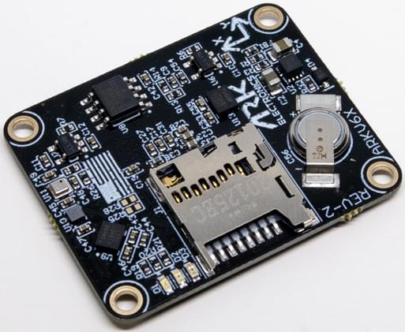

# ARK Electronics ARKV6X

:::warning
PX4 не виробляє цей (або будь-який інший) автопілот. Зверніться до [виробника](https://arkelectron.com/contact-us/) щодо підтримки обладнання або питань сумісності.
:::

Польотний контролер ARKV6X американського виробництва базується на стандартах з відкритим програмним кодом [FMUV6X і Pixhawk Autopilot Bus](https://github.com/pixhawk/Pixhawk-Standards).

Завдяки потрійній синхронізації IMU можливе узагальнення даних, голосування та фільтрація. Форм-фактор Pixhawk Autopilot Bus (PAB) дозволяє використовувати ARKV6X на будь-якій [PAB-сумісній платі-носії](../flight_controller/pixhawk_autopilot_bus.md), наприклад, на [ARK Pixhawk Autopilot Bus Carrier](../flight_controller/arkpab.md).



::: info
Цей польотний контролер підтримується [виробником](../flight_controller/autopilot_manufacturer_supported.md).
:::

## Де купити

Замовляйте у [Ark Electronics](https://arkelectron.com/product/arkv6x/) (США)

## Датчики (сенсори)

- [Dual Invensense ICM-42688-P IMUs](https://invensense.tdk.com/products/motion-tracking/6-axis/icm-42688-p/)
- [Invensense IIM-42652 Industrial IMU](https://invensense.tdk.com/products/smartindustrial/iim-42652/)
- [Bosch BMP390 Barometer](https://www.bosch-sensortec.com/products/environmental-sensors/pressure-sensors/bmp390/)
- [Bosch BMM150 Magnetometer](https://www.bosch-sensortec.com/products/motion-sensors/magnetometers/bmm150/)

## Мікропроцесор

- [STM32H743IIK6 MCU](https://www.st.com/en/microcontrollers-microprocessors/stm32h743ii.html)
  - 480MHz
  - 2MB Flash
  - 1MB Flash

## Інші характеристики

- FRAM
- [Pixhawk Autopilot Bus (PAB) Form Factor](https://github.com/pixhawk/Pixhawk-Standards/blob/master/DS-010%20Pixhawk%20Autopilot%20Bus%20Standard.pdf)
- LED індикатори
- Слот MicroSD
- USA Built
- Розроблений з нагрівачем потужністю 1 Вт. Підтримує датчики в теплі в екстремальних умовах

## Вимоги до живлення

- 5В
- 500 мА
  - 300 мА для основної системи
  - 200 мА для нагрівача

## Додаткова інформація

- Вага: 5.0 g
- Розміри: 3,6 x 2,9 x 0,5 см

## Схема розташування виводів

Для розводки ARKV6X дивіться [DS-10 Pixhawk Autopilot Bus Standard](https://github.com/pixhawk/Pixhawk-Standards/blob/master/DS-010%20Pixhawk%20Autopilot%20Bus%20Standard.pdf).

## Зіставлення послідовних портів

| UART   | Пристрій   | Порт          |
| ------ | ---------- | ------------- |
| USART1 | /dev/ttyS0 | GPS           |
| USART2 | /dev/ttyS1 | TELEM3        |
| USART3 | /dev/ttyS2 | Debug Console |
| UART4  | /dev/ttyS3 | UART4 & I2C   |
| UART5  | /dev/ttyS4 | TELEM2        |
| USART6 | /dev/ttyS5 | PX4IO/RC      |
| UART7  | /dev/ttyS6 | TELEM1        |
| UART8  | /dev/ttyS7 | GPS2          |

## Збірка прошивки

```
make ark_fmu-v6x_default
```
