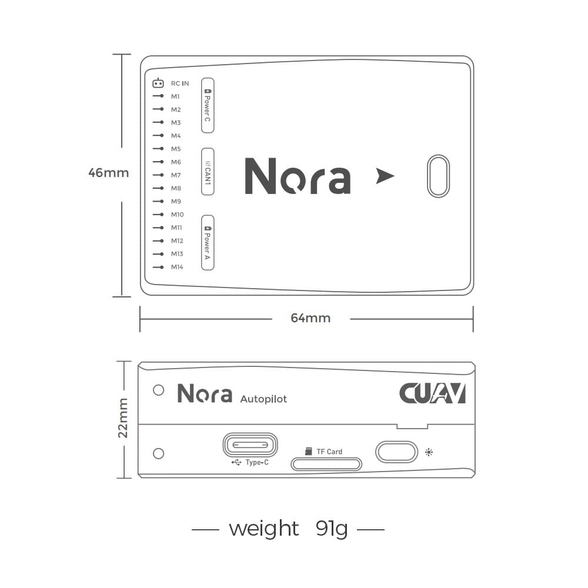

# Диспетчер польотів CUAV Nora

:::warning PX4 не виробляє цей (або будь-який) автопілот. Звертайтесь до [виробника](https://www.cuav.net) щодо питань апаратного забезпечення або питань відповідності.
:::

Контролер польоту [Nora](https://doc.cuav.net/flight-controller/x7/en/nora.html)<sup>&reg;</sup> - це високопродуктивний автопілот. Це ідеальний вибір для промислових дронів і великомасштабних важких дронів. В основному постачається комерційним виробникам.


Нора - це варіант CUAV X7. Він використовує інтегровану материнську плату (м'яку і тверду), що зменшує кількість внутрішніх роз'ємів польотного контролера, підвищує надійність і розміщує всі інтерфейси збоку (роблячи проводку більш лаконічною).

:::info Цей польотний контролер [підтримується виробником](../flight_controller/autopilot_manufacturer_supported.md).
:::

## Особливості

- Внутрішнє поглинання ударів
- Інтегрований процес зменшує відмову, спричинену пошкодженням інтерфейсу.
- Підтримка USB_HS, швидше завантаження журналів (PX4 ще не підтримується)
- Підтримка більшої кількості виходів dshot
- Підтримка нагріву IMU, покращення роботи датчика
- Виділений порт для акумулятора CAN
- 3 комплекти датчиків IMU
- Автомобільний компас RM3100
- Високопродуктивний процесор

:::tip
Виробник [CUAV Docs](https://doc.cuav.net/flight-controller/x7/en/nora.html) є канонічним посиланням для Nora. Вони повинні використовуватися за перевагою, оскільки вони містять найбільш повну та актуальну інформацію.
:::

## Короткий опис

- Головний FMU процесор: STM32H743
- Бортові сенсори:

  - Акселерометр/Гіроскоп: ICM-20689
  - Прискорювач/гіроскоп: ICM-20649
  - Акселерометр/Гіроскоп: BMI088
  - Магнітометр: RM3100
  - Барометр: MS5611\*2

- Інтерфейси:
  - 14 ШІМ-виходів （12 підтримує Dshot）
  - Підтримка декількох входів RC (SBU / CPPM / DSM)
  - Аналоговий / PWM вхід RSSI
  - 2 GPS порти (GPS і UART4 порти)
  - 4 шини i2c (два виділені порти i2c)
  - 2 порти CAN шини
  - 2 порти живлення (Power A - загальний інтерфейс адаптера, Power C - інтерфейс акумулятора DroneCAN)
  - 2 входи АЦП
  - 1 USB порт
- Система живлення:
  - Живлення: 4.3~5.4В
  - Вхід USB: 4.75~5.25В
  - Вхід сервоприводу: 0~36V
- Вага та розміри:
  - Вага: 101 g
- Інші характеристики:
  - Робоча температура: -20 ~ 80°c (виміряне значення)
  - Три імуси
  - Підтримка компенсації температури
  - Внутрішнє поглинання ударів

::: info
Коли він працює під управлінням прошивки PX4, працюють лише 8 ШІМ-виходів.
Решта 6 ШІМ-портів все ще адаптуються (тому на момент написання статті вони не сумісні з VOLT).
:::

## Де придбати

- [Магазин CUAV](https://store.cuav.net)<\br>
- [CUAV Aliexpress](https://www.aliexpress.com/item/4001042501927.html?gps-id=8041884&scm=1007.14677.110221.0&scm_id=1007.14677.110221.0&scm-url=1007.14677.110221.0&pvid=3dc0a3ba-fa82-43d2-b0b3-6280e4329cef&spm=a2g0o.store_home.promoteRecommendProducts_7913969.58)

## З'єднання (Проводка)

[Короткий посібник з підключення CUAV nora](https://doc.cuav.net/flight-controller/x7/en/quick-start/quick-start-nora.html)

## Розмір та роз'єми




:::warning
Порт `RCIN` призначено лише для живлення rc-приймача і його не можна підключати до жодного джерела живлення/навантаження.
:::

## Номінальна напруга

Nora AutoPilot\* може мати потрійне резервування джерела живлення, якщо до нього підключено три джерела живлення. Дві шини живлення: **POWERA**, **POWERC** і **USB**.

::: info Вихідні шини живлення **PWM OUT** (від 0В до 36В) не живлять плату контролера польоту (і не живляться від неї). Ви повинні подати живлення на один з виводів **POWERA**, **POWERC** або **USB**, інакше плата буде знеструмлена.
:::

**Максимальна напруга нормальної роботи**

За таких умов всі джерела живлення будуть використовуватися в цьому порядку для живлення системи:

1. **POWERA** та **POWERC** входи (від 4,3 В до 5,4 В)
2. **USB** вхід (4.75V до 5.25V)

## Збірка прошивки

:::tip
Більшості користувачів не потрібно збирати цю прошивку! Вона попередньо зібрана й автоматично встановлюється _QGroundControl_ при підключенні відповідного апаратного забезпечення.
:::

Щоб [зібрати PX4](../dev_setup/building_px4.md) для цієї цілі:

```
make cuav_nora_default
```

## Захист від перенапруги

_Nora_ має захист від перенапруги на периферійних пристроях з напругою 5 Вольт і 5 Вольт високої потужності, який обмежує струм до 2,5 А. _Nora_ має захист від короткого замикання.

:::warning
На роз'єми, позначені як контакт 1, можна подавати до 2,5 А (хоча вони розраховані лише на 1 А).
:::

## Відладочний порт

Консоль послідовного доступу до системи та інтерфейс SWD працюють через порт **DSU7**. Просто підключіть кабель FTDI до роз'єму DSU7 (у списку продуктів є кабель CUAV FTDI).

Системна консоль [PX4](../debug/system_console.md) та інтерфейс [SWD](../debug/swd_debug.md) працюють через порт **FMU Debug** (`DSU7`).

Відладочний порт (`DSU7`) використовує роз'єм [JST BM06B](https://www.digikey.com.au/product-detail/en/jst-sales-america-inc/BM06B-GHS-TBT-LF-SN-N/455-1582-1-ND/807850) і має наступну розводку:

| Pin     | Сигнал         | Вольтаж |
| ------- | -------------- | ------- |
| 1 (red) | 5V+            | +5В     |
| 2 (blk) | DEBUG TX (OUT) | +3.3В   |
| 3 (blk) | DEBUG RX (IN)  | +3.3В   |
| 4 (blk) | FMU_SWDIO      | +3.3В   |
| 5 (blk) | FMU_SWCLK      | +3.3В   |
| 6 (blk) | GND            | GND     |

CUAV надає спеціальний відладочний кабель, який можна підключити до порту `DSU7`. Він розділяє кабель FTDI для підключення [PX4 System Console](../debug/system_console.md) до USB-порту комп'ютера і виводи SWD, які використовуються для налагодження SWD/JTAG. Відладочний кабель, що входить до комплекту, не підключається до контакту (1) порту SWD `Vref`.


:::warning
Вивід Vref SWD (1) використовує 5В як Vref, але процесор працює при напрузі 3,3В!

Деякі JTAG-адаптери (SEGGER J-Link) використовують напругу Vref для встановлення напруги на лініях SWD. Для прямого підключення до _Segger Jlink_ ми рекомендуємо використовувати 3,3 вольта з контакту 4 роз'єму з позначкою `DSM`/`SBUS`/`RSSI` для забезпечення `Vtref` на JTAG (тобто для забезпечення 3,3 В і _NOT_ 5 В).
:::

## Підтримувані платформи / Конструкції

Будь-який мультикоптер / літак / наземна платформа / човен, який може керуватися звичайними RC сервоприводами або сервоприводами Futaba S-Bus. Повний набір підтримуваних конфігурацій можна переглянути в [Довіднику авіаційних платформ](../airframes/airframe_reference.md).

## Подальша інформація

- [Швидкий старт](https://doc.cuav.net/flight-controller/x7/en/quick-start/quick-start-nora.html)
- [Документація CUAV](http://doc.cuav.net)
- [схема nora](https://github.com/cuav/hardware/tree/master/X7_Autopilot)
