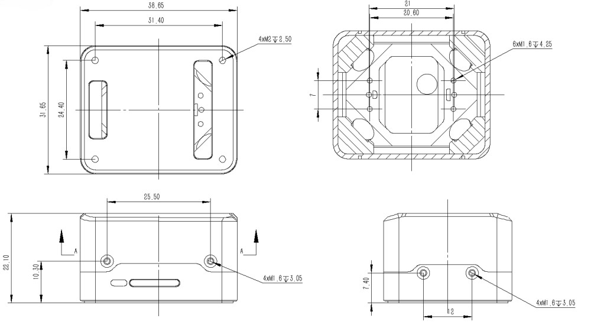

# CUAV Pixhawk V6X

:::warning
PX4 не виробляє цей (або будь-який інший) автопілот. Зверніться до [виробника](https://store.cuav.net/) щодо питань технічної підтримки або відповідності вимогам.
:::

_Pixhawk V6X_<sup>&reg;</sup> - останнє оновлення успішного сімейства польотних контролерів Pixhawk®, розроблене та виготовлене у співпраці з CUAV<sup>&reg;</sup> та командою PX4.

Це базується на стандарті [Pixhawk​​® Autopilot FMUv6X](https://github.com/pixhawk/Pixhawk-Standards/blob/master/DS-012%20Pixhawk%20Autopilot%20v6X%20Standard.pdf), [Стандарті шин автопілота](https://github.com/pixhawk/Pixhawk-Standards/blob/master/DS-010%20Pixhawk%20Autopilot%20Bus%20Standard.pdf) та [Стандарті коннектора Pixhawk​​®](https://github.com/pixhawk/Pixhawk-Standards/blob/master/DS-009%20Pixhawk%20Connector%20Standard.pdf).


:::tip
Цей автопілот [підтримується](../flight_controller/autopilot_pixhawk_standard.md) командами підтримки та тестування PX4.
:::

Pixhawk<sup>&reg;</sup> V6X принесе вам найвищий рівень продуктивності, стабільності та надійності у всіх аспектах.

- Процесор Arm® Cortex®-M7 (STM32H753) з операційною точкою (FPU), високошвидкісні операції на частоті 480 МГц та 2 МБ флеш-пам'яті. Розробники можуть бути більш продуктивними та ефективними, що дозволяє використовувати складніші алгоритми та моделі.
- Високопродуктивний бортовий, низькозвуковий ІНС та автомобільний магнітний компас на основі відкритого стандарту FMUv6X. Мета полягає в досягненні кращої стабільності та антиінтерференційної здатності.
- Тройний резервний IMU & подвійний резервний барометр на окремих шинах. Коли автопілот PX4 виявляє відмову датчика, система безперервно переключається на інший, щоб забезпечити надійність керування польотом.
- Кожен незалежний LDO живить кожен набір сенсорів з незалежним керуванням живленням. Система ізоляції вібрації для фільтрації високочастотної вібрації та зменшення шуму для забезпечення точних вимірювань, що дозволяє транспортним засобам досягти кращих загальних польотних характеристик.
- Зовнішня шина датчика (SPI5) має дві лінії вибору мікросхем та сигнали готовності даних для додаткових датчиків та навантаження з інтерфейсом SPI.
- Інтегрований мікросхемний Ethernet PHY для високошвидкісного зв'язку по Ethernet з пристроями на борту, такими як комп'ютери місій.
- Нова система ізоляції вібрацій, призначена для фільтрації високочастотних вібрацій та зменшення шуму для забезпечення точних вимірювань.
- IMUs контролюються за допомогою нагрівальних резисторів на борту, що дозволяє досягти оптимальної робочої температури IMUs&#x20;
- Модульний керуючий пристрій: розділені IMU, FMU та базова система, з'єднані за допомогою роз'ємів Pixhawk® Autopilot Bus на 100 контактів та 50 контактів.

Pixhawk® V6X ідеально підходить для корпоративних дослідницьких лабораторій, академічних досліджень та комерційних застосувань.

### Процесори &  датчики

- Процесор FMU: STM32H753
  - 32 Bit Arm® Cortex®-M7, 480MHz, 2MB flash memory, 1MB RAM
- IO Processor: STM32F103
  - 32 Bit Arm® Cortex®-M3, 72MHz, 20KB SRAM
- Сенсори на платі
  - Акселератор/гіроскоп: BMI088
  - Акселератор/гіроскоп: ICM-42688-P
  - Акселератор/гіроскоп: ICM-20649
  - Mag: RM3100
  - Барометр: 2x ICP-20100

### Електротехнічні дані

- Номінальна напруга:
  - Максимальна вхідна напруга: 5,7 В
  - Вхід USB Power: 4.75~5.25В
  - Вхід на серворейку: 0\~9.9В
- Номінальний струм:
  - Комбінований обмежувач вихідного струму TELEM1 і GPS2: 1,5 А
  - Комбінований обмежувач вихідного струму всіх інших портів: 1.5A

### Інтерфейси

- 16 PWM виводів сервоприводів
- 1 Виділений R/C вхід для Spektrum / DSM та S.Bus з аналоговим / PWM RSSI входом
- 3 TELEM-порти (з повним контролем потоку)
- 1 UART4(Seial та I2C)
- 2 порти GPS
  - 1 повноцінний порт GPS плюс порт перемикача безпеки (GPS1)
  - 1 базовий GPS-порт (з I2C, GPS2)
- 2 USB порти
  - 1 TYPE-C
  - JST GH1.25
- 1 порт Ethernet
  - Transformerless Applications
  - 100Mbps
- 1 шина SPI
  - 2 лінії вибору чіпу
  - 2 лінії даних
  - 1 SPI SYNC лінія
  - 1 лінія SPI reset
- 2 CAN шини для CAN периферії
  - CAN шина має individual silent controls або ESC RX-MUX control
- 4 порти вводу живлення
  - 2 входи живлення Dronecan/UAVCAN
  - 2 входи живлення SMBUS/I2C
- 1 порт вводу-виводу AD & IO
  - 2 додаткових аналогових входи (3,3 і 6,6 В)
  - 1 PWM/Capture вхід
- 2 виділених для відлагодження
  - FMU Debug
  - IO debug

### Механічні дані

- Вага
  - Модуль політного контролера: 99г
  - Основний модуль: 43г
  - Baseboard: 56г
- Температура роботи та зберігання: -20 ~ 85°c
- Розмір

  - Політний контролер

    

  - Основний модуль

    

## Де купити

Замовлення від [CUAV](https://store.cuav.net/).

## Зборка/інсталяція

[Швидкий старт з підключення Pixhawk V6X](../assembly/quick_start_cuav_pixhawk_v6x.md) надає інструкції щодо збирання необхідних/важливих периферійних пристроїв, включаючи GPS, модуль живлення тощо.

## Схема розташування виводів


Примітки:

- The [camera capture pin](../camera/fc_connected_camera.md#camera-capture-configuration) (`PI0`) is pin 2 on the AD&IO port, marked above as `FMU_CAP1`.

## Зіставлення послідовних портів

| UART   | Пристрій   | Порт          |
| ------ | ---------- | ------------- |
| USART1 | /dev/ttyS0 | GPS           |
| USART2 | /dev/ttyS1 | TELEM3        |
| USART3 | /dev/ttyS2 | Debug Console |
| UART4  | /dev/ttyS3 | UART4         |
| UART5  | /dev/ttyS4 | TELEM2        |
| USART6 | /dev/ttyS5 | PX4IO/RC      |
| UART7  | /dev/ttyS6 | TELEM1        |
| UART8  | /dev/ttyS7 | GPS2          |

## Номінальна напруга

_Pixhawk V6X_ може мати потрійну резервність у джерелі живлення, якщо подаються три джерела живлення. Три шини живлення: **POWERC1/POWER1**, **POWERC2/POWER2** і **USB**.

- **POWER C1** і **POWER C2** - це інтерфейси акумуляторів DroneCAN/UAVCAN (рекомендовано); **POWER1** і **POWER2** - це інтерфейси акумуляторів SMbus/I2C (резервний варіант).
- **POWER C1** і **POWER1** використовують один і той самий вимикач живлення, **POWER C2** і **POWER2** використовують один і той самий вимикач живлення.

**Максимальна напруга нормальної роботи**

За таких умов всі джерела живлення будуть використовуватися в цьому порядку для живлення системи:

1. **POWER C1**, **POWER C2**, **POWER1** і **POWER2** входи (4.75V в 5.7V)
2. Вхід **USB** (4.75V до 5.25V)

**Абсолютна максимальна напруга**

За таких умов система не буде витрачати жодної потужності (не буде працювати), але залишиться неушкодженою.

1. Входи **POWER1** і **POWER2** (робочий діапазон від 4,7 В до 5,7 В, від 0 В до 10 В без пошкоджень)
1. **USB-вхід** (робочий діапазон від 4,7 В до 5,7 В, від 0 В до 6 В без пошкоджень)
1. ** Серво-вхід:** `VDD_SERVO` вивід **FMU PWM OUT** та **I/O PWM OUT** (від 0В до 42В без пошкоджень)

**Моніторинг напруги**

Моніторинг акумулятора цифрових DroneCAN/UAVCAN увімкнено за замовчуванням (див. [Швидкий старт > Живлення](../assembly/quick_start_cuav_pixhawk_v6x.md#power)).

::: info
Аналоговий моніторинг батареї через ADC не підтримується на цій конкретній платі, але може підтримуватися в варіантах цього контролера польоту з іншою базовою платою.
:::

## Створення прошивки

:::tip
Більшості користувачів не потрібно збирати цю прошивку! Вона попередньо зібрана й автоматично встановлюється _QGroundControl_ при підключенні відповідного апаратного забезпечення.
:::

Щоб [зібрати PX4](../dev_setup/building_px4.md) для цієї цілі:

```
make px4_fmu-v6x_default
```

<a id="debug_port"></a>

## Відладочний порт

[Системна консоль PX4](../debug/system_console.md) та [SWD interface](../debug/swd_debug.md) працюють на порту **FMU Debug**.

Розпиновка та роз’єм відповідають інтерфейсу [Pixhawk Debug Full](../debug/swd_debug.md#pixhawk-debug-full), визначеному в інтерфейсі [Pixhawk Connector Standard](https://github.com/pixhawk/Pixhawk-Standards/blob/master/DS-009%20Pixhawk%20Connector%20Standard.pdf) (роз’єм JST SM10B).

| Pin      | Сигнал           | Вольт |
| -------- | ---------------- | ----- |
| 1 (red)  | `Vtref`          | +3.3V |
| 2 (blk)  | Консоль TX (OUT) | +3.3V |
| 3 (blk)  | Консоль RX (IN)  | +3.3V |
| 4 (blk)  | `SWDIO`          | +3.3V |
| 5 (blk)  | `SWCLK`          | +3.3V |
| 6 (blk)  | `SWO`            | +3.3V |
| 7 (blk)  | NFC GPIO         | +3.3V |
| 8 (blk)  | PH11             | +3.3V |
| 9 (blk)  | nRST             | +3.3V |
| 10 (blk) | `GND`            | GND   |

Інформацію про підключення та використання цього порту див:

- [Системна консоль PX4](../debug/system_console.md#pixhawk_debug_port) (Зауважте, що консоль FMU зіставляється з USART3).
- [SWD Debug Port](../debug/swd_debug.md)

## Периферія

- [Цифровий датчик швидкості польоту](https://holybro.com/products/digital-air-speed-sensor)
- [Радіо модулі телеметрії](https://holybro.com/collections/telemetry-radios?orderby=date)
- [Далекоміри / Датчики відстані](../sensor/rangefinders.md)

## Підтримувані платформи / Airframes

Будь-який мультикоптер / літак / наземна платформа / човен, який може керуватися звичайними RC сервоприводами або сервоприводами Futaba S-Bus. Повний набір підтримуваних конфігурацій можна переглянути в розділі [Довідник про планери  Copter(Вертоліт)](../airframes/airframe_reference.md).

## Подальша інформація

- [CUAV Docs](https://doc.cuav.net/) (CUAV)
- [Швидке підключення Pixhawk V6X Wiring](../assembly/quick_start_cuav_pixhawk_v6x.md)
- [Стандарт Pixhawk Autopilot FMUv6X](https://github.com/pixhawk/Pixhawk-Standards/blob/master/DS-012%20Pixhawk%20Autopilot%20v6X%20Standard.pdf)
- [Стандарт шин Pixhawk Autopilot](https://github.com/pixhawk/Pixhawk-Standards/blob/master/DS-010%20Pixhawk%20Autopilot%20Bus%20Standard.pdf)
- [Стандарт роз'ємів Pixhawk](https://github.com/pixhawk/Pixhawk-Standards/blob/master/DS-009%20Pixhawk%20Connector%20Standard.pdf)
