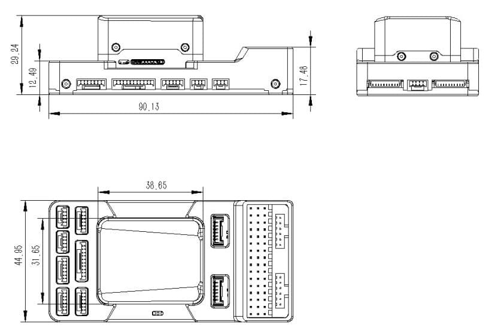

# CUAV Pixhawk V6X

:::warning
PX4 does not manufacture this (or any) autopilot. Contact the [manufacturer](https://store.cuav.net/) for hardware support or compliance issues.
:::

_Pixhawk V6X_<sup>&reg;</sup> is the latest update to the successful family of Pixhawk® flight controllers designed and made in collaboration with CUAV<sup>&reg;</sup> and the PX4 team.

Це базується на стандарті [Pixhawk​​® Autopilot FMUv6X](https://github.com/pixhawk/Pixhawk-Standards/blob/master/DS-012%20Pixhawk%20Autopilot%20v6X%20Standard.pdf), [Стандарті шин автопілота](https://github.com/pixhawk/Pixhawk-Standards/blob/master/DS-010%20Pixhawk%20Autopilot%20Bus%20Standard.pdf) та [Стандарті коннектора Pixhawk​​®](https://github.com/pixhawk/Pixhawk-Standards/blob/master/DS-009%20Pixhawk%20Connector%20Standard.pdf).


:::tip
Цей автопілот [підтримується](../flight_controller/autopilot_pixhawk_standard.md) командами підтримки та тестування PX4.
:::

Pixhawk<sup>&reg;</sup> V6X принесе вам найвищий рівень продуктивності, стабільності та надійності у всіх аспектах.

- Процесор Arm® Cortex®-M7 (STM32H753) з операційною точкою (FPU), високошвидкісні операції на частоті 480 МГц та 2 МБ флеш-пам'яті. Розробники можуть бути більш продуктивними та ефективними, що дозволяє використовувати складніші алгоритми та моделі.
- Високопродуктивний бортовий, низькозвуковий ІНС та автомобільний магнітний компас на основі відкритого стандарту FMUv6X. Мета полягає в досягненні кращої стабільності та антиінтерференційної здатності.
- Тройний резервний IMU & подвійний резервний барометр на окремих шинах. Коли автопілот PX4 виявляє відмову датчика, система безперервно переключається на інший, щоб забезпечити надійність керування польотом.
- Кожен незалежний LDO живить кожен набір сенсорів з незалежним керуванням живленням. Система ізоляції вібрації для фільтрації високочастотної вібрації та зменшення шуму для забезпечення точних вимірювань, що дозволяє транспортним засобам досягти кращих загальних польотних характеристик.
- Зовнішня шина датчика (SPI5) має дві лінії вибору мікросхем та сигнали готовності даних для додаткових датчиків та навантаження з інтерфейсом SPI.
- Інтегрований мікросхемний Ethernet PHY для високошвидкісного зв'язку по Ethernet з пристроями на борту, такими як комп'ютери місій.
- Нова система ізоляції вібрацій, призначена для фільтрації високочастотних вібрацій та зменшення шуму для забезпечення точних вимірювань.
- IMUs контролюються за допомогою нагрівальних резисторів на борту, що дозволяє досягти оптимальної робочої температури IMUs&#x20;
- Модульний керуючий пристрій: розділені IMU, FMU та базова система, з'єднані за допомогою роз'ємів Pixhawk® Autopilot Bus на 100 контактів та 50 контактів.

Pixhawk® V6X ідеально підходить для корпоративних дослідницьких лабораторій, академічних досліджень та комерційних застосувань.

### Процесори &  датчики

- Процесор FMU: STM32H753
  - 32 Bit Arm® Cortex®-M7, 480MHz, 2MB flash memory, 1MB RAM
- IO Processor: STM32F103
  - 32 Bit Arm® Cortex®-M3, 72MHz, 20KB SRAM
- On-board sensors
  - Accel/Gyro: BMI088
  - Accel/Gyro: ICM-42688-P
  - Accel/Gyro: ICM-20649
  - Mag: RM3100
  - Barometer: 2x ICP-20100

### Electrical data

- Voltage Ratings:
  - Max input voltage: 5.7V
  - USB Power Input: 4.75\~5.25V
  - Servo Rail Input: 0\~9.9V
- Current Ratings:
  - TELEM1 and GPS2 combined output current limiter: 1.5A
  - All other port combined output current limiter: 1.5A

### Interfaces

- 16- PWM servo outputs
- 1 Dedicated R/C input for Spektrum / DSM and S.Bus with analog / PWM RSSI input
- 3 TELEM Ports（with full flow control）
- 1 UART4(Seial and I2C)
- 2 GPS ports
  - 1 full GPS plus Safety Switch Port(GPS1)
  - 1 basic GPS port(with I2C,GPS2)
- 2 USB Ports
  - 1 TYPE-C
  - JST GH1.25
- 1 Ethernet port
  - Transformerless Applications
  - 100Mbps
- 1 SPI bus
  - 2 chip select lines
  - 2 data-ready lines
  - 1 SPI SYNC line
  - 1 SPI reset line
- 2 CAN Buses for CAN peripheral
  - CAN Bus has individual silent controls or ESC RX-MUX control
- 4 power input ports
  - 2 Dronecan/UAVCAN power inputs
  - 2 SMBUS/I2C power inputs
- 1 AD & IO port
  - 2 additional analog input(3.3 and 6.6v）
  - 1 PWM/Capture input
- 2 Dedicated debug
  - FMU debug
  - IO debug

### Mechanical data

- Weight
  - Flight Controller Module: 99g
  - Core module: 43g
  - Baseboard: 56g
- Operating & storage temperature: -20 ~ 85°c
- Size

  - Flight controller

    

  - Core module

    

## Де купити

Замовлення від [CUAV](https://store.cuav.net/).

## Зборка/інсталяція

[Швидкий старт з підключення Pixhawk V6X](../assembly/quick_start_cuav_pixhawk_v6x.md) надає інструкції щодо збирання необхідних/важливих периферійних пристроїв, включаючи GPS, модуль живлення тощо.

## Схема розташування виводів


Примітки:

- [Захоплення камери](../peripherals/camera.md#camera-capture) (`PI0`) - це контакт 2 на порті AD&IO , позначений як `FMU_CAP1`.

## Зіставлення послідовних портів

| UART   | Пристрій   | Порт          |
| ------ | ---------- | ------------- |
| USART1 | /dev/ttyS0 | GPS           |
| USART2 | /dev/ttyS1 | TELEM3        |
| USART3 | /dev/ttyS2 | Debug Console |
| UART4  | /dev/ttyS3 | UART4         |
| UART5  | /dev/ttyS4 | TELEM2        |
| USART6 | /dev/ttyS5 | PX4IO/RC      |
| UART7  | /dev/ttyS6 | TELEM1        |
| UART8  | /dev/ttyS7 | GPS2          |

## Voltage Ratings

_Pixhawk V6X_ can be triple-redundant on the power supply if three power sources are supplied. The three power rails are: **POWERC1/POWER1**, **POWERC2/POWER2** and **USB**.

- **POWER C1** and **POWER C2** are DroneCAN/UAVCAN battery interfaces (recommended)；**POWER1** and **POWER2** are SMbus/I2C battery interfaces (backup).
- **POWER C1** and **POWER1** use the same power switch, **POWER C2** and **POWER2** use the same power switch.

**Normal Operation Maximum Ratings**

Under these conditions all power sources will be used in this order to power the system:

1. **POWER C1**, **POWER C2**, **POWER1** і **POWER2** входи (4.75V в 5.7V)
2. Вхід **USB** (4.75V до 5.25V)

**Absolute Maximum Ratings**

Under these conditions the system will not draw any power (will not be operational), but will remain intact.

1. **POWER1** and **POWER2** inputs (operational range 4.7V to 5.7V, 0V to 10V undamaged)
1. **USB input** (operational range 4.7V to 5.7V, 0V to 6V undamaged)
1. **Servo input:** `VDD_SERVO` pin of **FMU PWM OUT** and **I/O PWM OUT** (0V to 42V undamaged)

**Voltage monitoring**

Digital DroneCAN/UAVCAN battery monitoring is enabled by default (see [Quickstart > Power](../assembly/quick_start_cuav_pixhawk_v6x.md#power)).

::: info
Analog battery monitoring via an ADC is not supported on this particular board, but may be supported in variations of this flight controller with a different baseboard.
:::

## Building Firmware

:::tip
Most users will not need to build this firmware! It is pre-built and automatically installed by _QGroundControl_ when appropriate hardware is connected.
:::

To [build PX4](../dev_setup/building_px4.md) for this target:

```
make px4_fmu-v6x_default
```

<a id="debug_port"></a>

## Debug Port

The [PX4 System Console](../debug/system_console.md) and [SWD interface](../debug/swd_debug.md) run on the **FMU Debug** port.

The pinouts and connector comply with the [Pixhawk Debug Full](../debug/swd_debug.md#pixhawk-debug-full) interface defined in the [Pixhawk Connector Standard](https://github.com/pixhawk/Pixhawk-Standards/blob/master/DS-009%20Pixhawk%20Connector%20Standard.pdf) interface (JST SM10B connector).

| Pin      | Сигнал           | Вольт |
| -------- | ---------------- | ----- |
| 1 (red)  | `Vtref`          | +3.3V |
| 2 (blk)  | Консоль TX (OUT) | +3.3V |
| 3 (blk)  | Консоль RX (IN)  | +3.3V |
| 4 (blk)  | `SWDIO`          | +3.3V |
| 5 (blk)  | `SWCLK`          | +3.3V |
| 6 (blk)  | `SWO`            | +3.3V |
| 7 (blk)  | NFC GPIO         | +3.3V |
| 8 (blk)  | PH11             | +3.3V |
| 9 (blk)  | nRST             | +3.3V |
| 10 (blk) | `GND`            | GND   |

For information about wiring and using this port see:

- [PX4 System Console](../debug/system_console.md#pixhawk_debug_port) (Note, the FMU console maps to USART3).
- [SWD Debug Port](../debug/swd_debug.md)

## Периферія

- [Digital Airspeed Sensor](https://holybro.com/products/digital-air-speed-sensor)
- [Telemetry Radio Modules](https://holybro.com/collections/telemetry-radios?orderby=date)
- [Rangefinders/Distance sensors](../sensor/rangefinders.md)

## Підтримувані платформи / Airframes

Будь-який мультикоптер / літак / наземна платформа / човен, який може керуватися звичайними RC сервоприводами або сервоприводами Futaba S-Bus. Повний набір підтримуваних конфігурацій можна переглянути в розділі [Довідник про планери  Copter(Вертоліт)](../airframes/airframe_reference.md).

## Подальша інформація

- [CUAV Docs](https://doc.cuav.net/) (CUAV)
- [Pixhawk V6X Wiring QuickStart](../assembly/quick_start_cuav_pixhawk_v6x.md)
- [Pixhawk Autopilot FMUv6X Standard](https://github.com/pixhawk/Pixhawk-Standards/blob/master/DS-012%20Pixhawk%20Autopilot%20v6X%20Standard.pdf)
- [Pixhawk Autopilot Bus Standard](https://github.com/pixhawk/Pixhawk-Standards/blob/master/DS-010%20Pixhawk%20Autopilot%20Bus%20Standard.pdf)
- [Pixhawk Connector Standard](https://github.com/pixhawk/Pixhawk-Standards/blob/master/DS-009%20Pixhawk%20Connector%20Standard.pdf)
