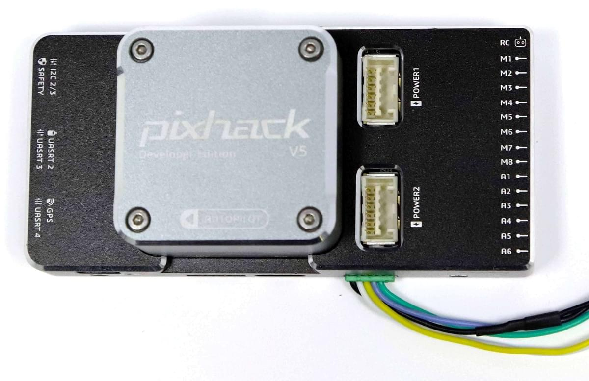

# CUAV v5 (Знято з виробництва)

<Badge type="error" text="Discontinued" />

:::warning
Цей політний контролер був [знятий з виробництва](../flight_controller/autopilot_experimental.md) і більше не продається комерційно.
:::

:::warning PX4 не виробляє цей (або будь-який) автопілот. Звертайтесь до [виробника](https://store.cuav.net/) щодо питань апаратного забезпечення або питань відповідності.
:::

_CUAV v5_<sup>&reg;</sup> (раніше "Pixhack v5") - це вдосконалений автопілот, розроблений і виготовлений компанією CUAV<sup>&reg;</sup>. Плата базується на [Pixhawk проекті](https://pixhawk.org/) відкритого апаратного забезпечення **FMUv5**. Він працює з PX4 на ОС [NuttX](https://nuttx.apache.org/), і повністю сумісний з прошивкою PX4. Він призначений насамперед для академічних і комерційних розробників.


## Короткий опис

- Головний FMU процесор: STM32F765
  - 32 Bit Arm® Cortex®-M7, 216MHz, 2MB memory, 512KB RAM
- IO Processor: STM32F100
  - 32 Bit Arm®️ Cortex®️-M3, 24MHz, 8KB SRAM
- Бортові сенсори:

  - Акселерометр/Гіроскоп: ICM-20689
  - Акселерометр/Гіроскоп: BMI055
  - Магнітометр: IST8310
  - Барометр: MS5611

- Інтерфейси:
  - 8-14 PWM виходів (6 з IO, 8 з FMU)
  - 3 виділених PWM/Capture входи на FMU
  - Виділений R/C вхід для CPPM
  - Спеціалізований R/C вхід для PPM і S.Bus
  - аналоговий / PWM вхід RSSI
  - Вихід сервоприводу S.Bus
  - 5 загальних послідовних портів
  - 4x I2C порти
  - 4 шини SPI
  - 2 CANBuses з послідовними ESC
  - Аналогові входи для напруги / струму з 2 батарей
- Система живлення:
  - Живлення: 4.3~5.4В
  - Вхід USB: 4.75~5.25В
  - Вхід сервоприводу: 0~36 В
- Вага та розміри:
  - Вага: 90г
  - Розміри: 44x84x12мм
- Інші характеристики:
  - Робоча температура: -20 ~ 80°С (виміряне значення)

## Де придбати

Замовлення від [CUAV](https://cuav.taobao.com/index.htm?spm=2013.1.w5002-16371268426.2.411f26d9E18eAz).

## Підключення


:::warning
Інтерфейс RCIN призначений лише для живлення радіоприймача і не може бути підключений до будь-якого джерела живлення/навантаження.
:::

## Номінальна напруга

_CUAV v5_ може мати потрійну резервність у джерелі живлення, якщо подаються три джерела живлення. Три шини живлення: **POWER1**, **POWER2** і **USB**.

::: info Вихідні шини живлення **FMU PWM OUT** та **I/O PWM OUT** (від 0В до 36В) не живлять плату контролера польоту (і не живляться від неї). Ви повинні подавати живлення на один з **POWER1**, **POWER2** або **USB**, інакше плата буде знеструмлена.
:::

**Максимальна напруга нормальної роботи**

За таких умов всі джерела живлення будуть використовуватися в цьому порядку для живлення системи:

1. Входи **POWER1** та **POWER2** (4,3 - 5,4 В)
1. **USB** вхід (4.75В до 5.25В)

## Збірка прошивки

:::tip
Більшості користувачів не потрібно збирати цю прошивку! Вона попередньо зібрана і автоматично встановлюється за допомогою _QGroundControl_ при підключенні відповідного обладнання.
:::

Щоб [ зібрати PX4](../dev_setup/building_px4.md) для цієї цілі:

```
make px4_fmu-v5_default
```

## Відладочний порт

[Системна консоль PX4](../debug/system_console.md) та [SWD interface](../debug/swd_debug.md) працюють на порту **FMU Debug**. Просто підключіть кабель FTDI до роз'єму Debug & F7 SWD. Щоб отримати доступ до порту відладки вводу/виводу, користувач повинен видалити оболонку CUAV v5. Обидва порти мають стандартні послідовні контакти і можуть бути підключені до стандартного кабелю FTDI (3,3 В, але допускається 5 В).

Схема підключення показана.



| пін | CUAV v5 debug |
| --- | ------------- |
| 1   | GND           |
| 2   | FMU-SWCLK     |
| 3   | FMU-SWDIO     |
| 4   | UART7_RX      |
| 5   | UART7_TX      |
| 6   | VCC           |

## Зіставлення послідовних портів

| UART   | Пристрій   | Порт                           |
| ------ | ---------- | ------------------------------ |
| UART1  | /dev/ttyS0 | GPS                            |
| USART2 | /dev/ttyS1 | TELEM1 (керування потоком)     |
| USART3 | /dev/ttyS2 | TELEM2 (керування потоком)     |
| UART4  | /dev/ttyS3 | TELEM4                         |
| USART6 | /dev/ttyS4 | TX - RC-вхід з роз'єму SBUS_RC |
| UART7  | /dev/ttyS5 | Debug Console                  |
| UART8  | /dev/ttyS6 | PX4IO                          |

<!-- Note: Got ports using https://github.com/PX4/PX4-user_guide/pull/672#issuecomment-598198434 -->

## Периферія

- [Цифровий датчик швидкості польоту](https://item.taobao.com/item.htm?spm=a1z10.3-c-s.w4002-16371268452.37.6d9f48afsFgGZI&id=9512463037)
- [Телеметричні радіо модулі](https://cuav.taobao.com/category-158480951.htm?spm=2013.1.w5002-16371268426.4.410b7a821qYbBq&search=y&catName=%CA%FD%B4%AB%B5%E7%CC%A8)
- [Далекомір/Датчики відстані](../sensor/rangefinders.md)

## Supported Platforms / Airframes

Будь-який мультикоптер / літак / наземна платформа чи човен, який може керуватися звичайними РК сервоприводами або сервоприводами Futaba S-Bus. Повний набір підтримуваних конфігурацій можна переглянути в [Довіднику авіаційних платформ](../airframes/airframe_reference.md).

## Подальша інформація

- [FMUv5 еталонна розводка](https://docs.google.com/spreadsheets/d/1-n0__BYDedQrc_2NHqBenG1DNepAgnHpSGglke-QQwY/edit#gid=912976165).
- [Документація CUAV V5](http://doc.cuav.net/flight-controller/v5-autopilot/en/v5.html)
- [CUAV Github](https://github.com/cuav)
