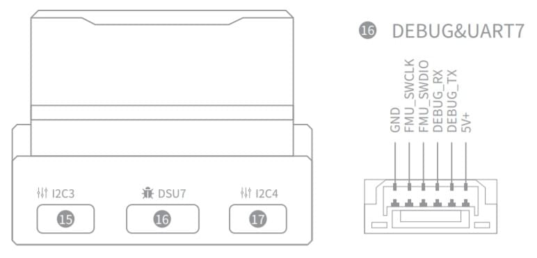

# Автопілот CUAV V5+

:::warning PX4 не виробляє цей (або будь-який) автопілот. Зверніться до [виробника](https://store.cuav.net/) щодо питань технічної підтримки або відповідності вимогам.
:::

_V5+_<sup>&reg;</sup> - вдосконалений автопілот виробництва CUAV<sup>&reg;</sup>. Він був розроблений CUAV<sup>&reg;</sup> у співпраці з командою PX4.

Автопілот рекомендується для комерційної системної інтеграції, але також підходить для академічних досліджень і будь-якого іншого використання.


Деякі з його основних функцій включають:

- Повна сумісність зі стандартом проєкту [Pixhawk](https://pixhawk.org/) **FMUv5** і використовує [Pixhawk Connector Standard](https://pixhawk.org/pixhawk-connector-standard/) для всіх зовнішніх інтерфейсів.
- Більш продуктивний процесор, оперативна пам'ять та флеш-пам'ять, ніж у FMU v3, разом із більш стабільними та надійними датчиками.
- Прошивка сумісна з PX4.
- Модульна конструкція дозволяє користувачам налаштовувати власну носійну плату.
- Вбудована система поглинання вібрації з високоефективною системою поглинання ударів.
- Множинні резервні датчики та системи живлення для покращення безпеки та стабільності польоту.

::: info Цей контролер польоту [підтримується виробником](../flight_controller/autopilot_manufacturer_supported.md).
:::

## Короткий опис

- Головний FMU процесор: STM32F765
  - 32 Bit Arm® Cortex®-M7, 216MHz, 2MB пам'ять, 512KB RAM
- IO процесор: STM32F100
  - 32 Bit Arm® Cortex®-M3, 24MHz, 8KB SRAM
- Сенсори на платі:

  - Акселерометр/Гіроскоп: ICM-20689
  - Акселерометр/Гіроскоп: BMI055
  - Магнітометр: IST8310
  - Барометр: MS5611

- Інтерфейси:
  - 8-14 PWM виходів (6 з IO, 8 з FMU)
  - 3 виділених PWM/Capture входи на FMU
  - Виділений R/C вхід для CPPM
  - Виділений R/C вхід для Spektrum / DSM та S.Bus з аналоговим / PWM RSSI входом
  - аналоговий / PWM вхід RSSI
  - Вихід сервоприводу S.Bus
  - 5 загальних послідовних портів
  - 4x I2C порти
  - 4 шини SPI
  - 2 CANBuses з послідовними ESC
  - Аналогові входи для напруги / струму з 2 батарей
- Система живлення:
  - Живлення: 4.3~5.4В
  - Вхід USB: 4.75~5.25В
- Вага та розміри:
  - Вага: 90г
  - Розміри: 85.5\*42\*мм
- Інші характеристики:

  - Робоча температура: -20 ~ 80°c (виміряне значення)

## Де купити<!-- \[CUAV Store\](https://store.cuav.net/index.php?id_product=95&id_product_attribute=0&rewrite=cuav-new-pixhack-v5-autopilot-m8n-gps-for-fpv-rc-drone-quadcopter-helicopter-flight-simulator-free-shipping-whole-sale&controller=product&id_lang=1) -->[CUAV Aliexpress](https://www.aliexpress.com/item/32890380056.html?spm=a2g0o.detail.1000060.1.7a7233e7mLTlVl&gps-id=pcDetailBottomMoreThisSeller&scm=1007.13339.90158.0&scm_id=1007.13339.90158.0&scm-url=1007.13339.90158.0&pvid=d899bfab-a7ca-46e1-adf2-72ad1d649822) (міжнародні користувачі)

[CUAV Taobao](https://item.taobao.com/item.htm?spm=a1z10.5-c.w4002-21303114052.37.a28f697aeYzQx9&id=594262853015) (користувачі з материкового Китаю)

::: info
Автопілот можна придбати з модулем Neo GPS в комплекті
:::

<a id="connection"></a>

## З'єднання (Проводка)

[Швидке підключення CUAV V5+](../assembly/quick_start_cuav_v5_plus.md)

## Схема розташування виводів

Завантажте схему розводки **V5+** [звідси](http://manual.cuav.net/V5-Plus.pdf).

## Номінальна напруга

_Автопілот V5+_ підтримує резервні джерела живлення - можна використовувати до трьох джерел: `Power1`, `Power2` та `USB`. Ви повинні подати живлення принаймні до одного з цих джерел, інакше контролер польоту буде знеструмлений.

::: info У FMUv5 з модулем PX4IO (як у випадку з _V5+_) шина живлення сервоприводу контролюється тільки FMU. Вона не живиться від FMU і не забезпечує його живленням. Однак, контакти, позначені **+**, є загальними, і до будь-якого з наборів контактів серводвигуна може бути підключений BEC для живлення рейки живлення серводвигуна.
:::

**Максимальна напруга нормальної роботи**

За таких умов всі джерела живлення будуть використовуватися в цьому порядку для живлення системи:

1. Входи `Power1` та `Power2` (4,3 - 5,4 В)
1. `USB` вхід (4.75В до 5.25В)

## Захист від перенапруги

_V5+_ має захист від перенапруги на периферійних пристроях з напругою 5 Вольт і 5 Вольт високої потужності, який обмежує струм до 2,5 А. _V5+_ має захист від короткого замикання.

:::warning
На роз'єми, позначені як контакт 1, можна подавати до 2,5 А (хоча вони розраховані лише на 1 А).
:::

## Збірка прошивки

:::tip
Більшості користувачів не потрібно збирати цю прошивку! Вона попередньо зібрана і автоматично встановлюється за допомогою _QGroundControl_ при підключенні відповідного обладнання.
:::

Щоб [зібрати PX4](../dev_setup/building_px4.md) для цього контролера:

```
make px4_fmu-v5_default
```

## Відладочний порт

Системна консоль [PX4](../debug/system_console.md) та інтерфейс [SWD](../debug/swd_debug.md) працюють через порт **FMU Debug** (`DSU7`). Плата не має інтерфейсу відладки вводу/виводу.



Відладочний порт (`DSU7`) використовує роз'єм [JST BM06B](https://www.digikey.com.au/product-detail/en/jst-sales-america-inc/BM06B-GHS-TBT-LF-SN-N/455-1582-1-ND/807850) і має наступну розводку:

| Pin     | Сигнал         | Вольт |
| ------- | -------------- | ----- |
| 1 (red) | 5V+            | +5В   |
| 2 (blk) | DEBUG TX (OUT) | +3.3В |
| 3 (blk) | DEBUG RX (IN)  | +3.3В |
| 4 (blk) | FMU_SWDIO      | +3.3В |
| 5 (blk) | FMU_SWCLK      | +3.3В |
| 6 (blk) | GND            | GND   |

До комплекту поставки входить зручний відладочний кабель, який можна під'єднати до порту `DSU7`. Він розділяє кабель FTDI для підключення [PX4 System Console](../debug/system_console.md) до USB-порту комп'ютера і виводи SWD, які використовуються для налагодження SWD/JTAG. Відладочний кабель, що входить до комплекту, не підключається до контакту (1) порту SWD `Vref`.


:::warning
Вивід Vref SWD (1) використовує 5В як Vref, але процесор працює при напрузі 3,3В!

Деякі JTAG-адаптери (SEGGER J-Link) використовують напругу Vref для встановлення напруги на лініях SWD. Для прямого підключення до _Segger Jlink_ ми рекомендуємо використовувати 3,3 вольта з контакту 4 роз'єму з позначкою `DSM`/`SBUS`/`RSSI` для забезпечення `Vtref` на JTAG (тобто для забезпечення 3,3 В і _NOT_ 5 В).

За додатковою інформацією звертайтесь до розділу [Використання JTAG для апаратної налагодження](#using-jtag-for-hardware-debugging).
:::

## Зіставлення послідовних портів

| UART   | Пристрій   | Порт                           |
| ------ | ---------- | ------------------------------ |
| UART1  | /dev/ttyS0 | GPS                            |
| USART2 | /dev/ttyS1 | TELEM1 (керування потоком)     |
| USART3 | /dev/ttyS2 | TELEM2 (керування потоком)     |
| UART4  | /dev/ttyS3 | TELEM4                         |
| USART6 | /dev/ttyS4 | TX - RC-вхід з роз'єму SBUS_RC |
| UART7  | /dev/ttyS5 | Debug Console                  |
| UART8  | /dev/ttyS6 | PX4IO                          |

<!-- Note: Got ports using https://github.com/PX4/PX4-user_guide/pull/672#issuecomment-598198434 -->

<a id="optional-hardware"></a>

## Периферія

- [Цифровий датчик швидкості польоту](https://item.taobao.com/item.htm?spm=a1z10.3-c-s.w4002-16371268452.37.6d9f48afsFgGZI&id=9512463037)
- [Телеметричні радіо модулі](https://cuav.taobao.com/category-158480951.htm?spm=2013.1.w5002-16371268426.4.410b7a821qYbBq&search=y&catName=%CA%FD%B4%AB%B5%E7%CC%A8)
- [Далекоміри / Датчики відстані](../sensor/rangefinders.md)

## Підтримувані платформи / Airframes

Будь-який мультикоптер / літак / наземна платформа чи човен, який може керуватися звичайними RC сервоприводами або сервоприводами Futaba S-Bus. Повний перелік підтримуваних конфігурацій можна переглянути в розділі [Довідник планерів](../airframes/airframe_reference.md).

## Примітки

#### Не підключайте цифровий або аналоговий PM до роз'ємів, сконфігурованих для іншого типу PM

Якщо ви під'єднаєте аналоговий PM до цифрового роз'єму PM, він зупинить всі пристрої I2C на цій шині. Зокрема, це призведе до зупинки компаса GPS через конфлікт, а також може пошкодити FMU (у довгостроковій перспективі).

Аналогічно, цифровий PM, підключений до аналогового роз'єму, не працюватиме, а також може пошкодити/вивести з ладу модуль живлення (у довгостроковій перспективі).

## Сумісність

CUAV використовує деякі відмінні дизайни і несумісний з деяким обладнанням, про що буде описано нижче.

<a id="compatibility_gps"></a>

#### GPS несумісний з іншими пристроями

_Neo v2.0 GPS_, рекомендований для використання з _CUAV V5+_ і _CUAV V5 nano_, не повністю сумісний з іншими контролерами польоту Pixhawk (зокрема, не сумісна частина сигнального зумера і можуть виникнути проблеми з перемикачем безпеки).

Пристрій прийому GNSS UAVCAN [NEO V2 PRO](http://doc.cuav.net/gps/neo-series-gnss/en/neo-v2-pro.html) також може бути використаний і сумісний з іншими контролерами польоту.

<a id="compatibility_jtag"></a>

#### Використання JTAG для апаратного налагодження

`DSU7` Штифт налагодження FMU 1 має напругу 5 вольтів - не 3,3 вольта від ЦП.

Деякі JTAG використовують цю напругу для встановлення рівнів вводу-виводу під час обміну даними з ціллю.

Для прямого підключення до _Segger Jlink_ ми рекомендуємо використовувати 3,3 вольти з DSM/SBUS/RSSI пін 4 як Пін 1 на роз'ємі для налагодження (`Vtref`).

## Відомі проблеми

Проблеми нижче посилаються на _номер партії_, в якій вони вперше з'являються. Номер партії - це чотирицифрова дата виробництва за V01 та відображається на наклейці з боку контролера польоту. Наприклад, серійний номер партії V011904 ((V01 - це номер V5, 1904 - це дата виробництва, тобто номер партії).

<a id="pin1_unfused"></a>

#### Інтерфейс SBUS / DSM / RSSI Pin1 не захищений від перевантаження

:::warning
Це питання безпеки.
:::

Будь ласка, не підключайте інше обладнання (крім RC приймача) до інтерфейсу SBUS / DSM / RSSI - це може призвести до пошкодження обладнання.

- _Знайдено:_ Партії V01190904xxxx
- _Виправлено:_ Партії пізніше, ніж V01190904xxxx

## Додаткова інформація

- [Керівництво користувача CUAV V5+](http://manual.cuav.net/V5-Plus.pdf)
- [Документація CUAV V5+](http://doc.cuav.net/flight-controller/v5-autopilot/en/v5+.html)
- [Еталонна розводка FMUv5](https://docs.google.com/spreadsheets/d/1-n0__BYDedQrc_2NHqBenG1DNepAgnHpSGglke-QQwY/edit#gid=912976165)
- [CUAV Github](https://github.com/cuav)
- [Посилання на дизайн базової плати](https://github.com/cuav/hardware/tree/master/V5_Autopilot/V5%2B/V5%2BBASE)
- [Швидке підключення CUAV V5+](../assembly/quick_start_cuav_v5_plus.md)
- [Журнал збірки конструкції повітряного каркасу за допомогою CUAV v5+ на рамі DJI FlameWheel450](../frames_multicopter/dji_f450_cuav_5plus.md)
