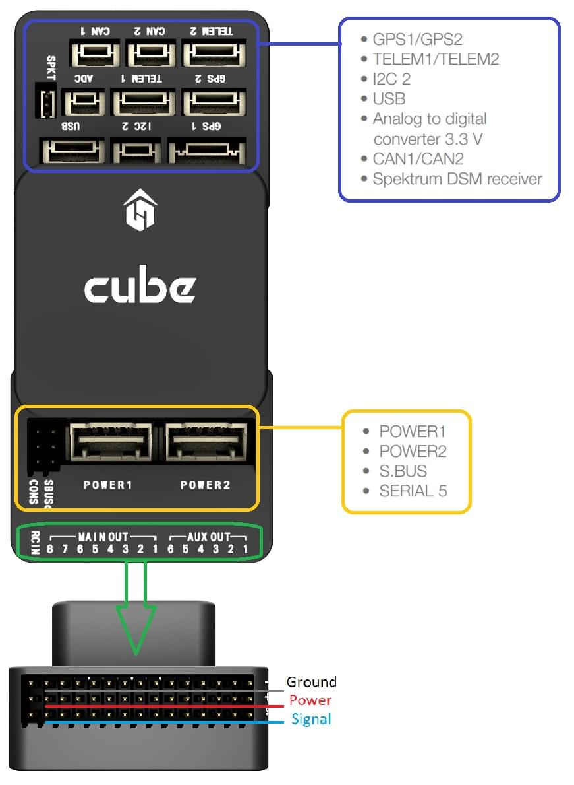

# Контролер польоту CubePilot Cube Orange

:::warning PX4 не виробляє цей (або будь-який) автопілот. Зверніться до [виробника](https://cubepilot.org/#/home) щодо підтримки апаратного забезпечення чи відповідності вимогам.
:::

Контролер польоту [Cube Orange](https://www.cubepilot.com/#/cube/features) - це універсальний автопілот, призначений в першу чергу для виробників комерційних систем.


Контролер призначений для використання зі специфічною для домену несучою платою, щоб зменшити кількість дротів, підвищити надійність і спростити збірку. Наприклад, несуча плата для комерційного інспекційного апарату може містити з'єднання для комп'ютера-компаньйона, тоді як несуча плата для пілота може містити ESC для рами транспортного засобу.

Несуча плата ADS-B включає налаштований приймач ADSB-In на 1090 МГц від uAvionix. Це забезпечує позиціонування і розташування комерційних пілотованих літаків в межах досяжності Cube. Ця функція автоматично налаштована і ввімкнена у прошивці PX4 за замовчуванням.

Cube має віброізоляцію на двох IMU, з третім фіксованим IMU в якості еталонного/резервного.

:::tip
Документація виробника [Cube Docs](https://docs.cubepilot.org/user-guides/autopilot/the-cube-module-overview) містить детальну інформацію, включаючи огляд [Різниця між Cube Colours](https://docs.cubepilot.org/user-guides/autopilot/the-cube-module-overview#differences-between-cube-colours).
:::

## Ключові особливості

- 32-біт STM32H753VI (32-біт [ARM Cortex M7](https://en.wikipedia.org/wiki/ARM_Cortex-M#Cortex-M7), 400 МГц, флеш 2 МБ, оперативна пам'ять 1 МБ).
- 32 bit STM32F103 відмовостійкий копроцесор
- 14 ШІМ / серво виходів (8 з відмовостійкими і ручним керуванням, 6 допоміжних, сумісних з великими потужностями)
- Широкі можливості підключення додаткових периферійних пристроїв (UART, I2C, CAN)
- Інтегрована система резервного копіювання для відновлення в польоті та ручного керування з виділеним процесором та автономним джерелом живлення (для літаків з фіксованим крилом)
- Резервна система інтегрує систему мікшування, забезпечуючи узгоджені режими автопілота та ручного заміщення ( для літаків з фіксованим крилом)
- Резервні входи живлення та автоматичне перемикання на резервне джерело
- Зовнішній запобіжний вимикач
- Головний візуальний індикатор - багатоколірний світлодіод
- Потужний багатотональний п'єзозвуковий індикатор
- Карта microSD для високошвидкісної фіксації даних протягом тривалого періоду часу

<a id="stores"></a>

## Де придбати

- [Список реселерів](https://www.cubepilot.com/#/reseller/list)

## Збірка

[Швидке підключення Cube](../assembly/quick_start_cube.md)

## Специфікації

- **Процесор:**
  - STM32H753VI (32біт [ARM Cortex M7](https://en.wikipedia.org/wiki/ARM_Cortex-M#Cortex-M7))
  - 400 МГц
  - 1 МБ RAM
  - 2 МБ флеш-пам'яті \(повністю доступна\)
- **Відмовостійкий співпроцесор:** <!-- inconsistent info on failsafe processor: 32 bit STM32F103 failsafe co-processor http://www.proficnc.com/all-products/191-pixhawk2-suite.html -->
  - STM32F103 (32біт _ARM Cortex-M3_)
  - 24 МГц
  - 8 KB SRAM
- **Датчики:** (всі підключені через SPI)
  - **Акселерометр:** (3) ICM20948, ICM20649, ICM20602
  - **Гіроскоп:** (3) ICM20948, ICM20649, ICM20602
  - **Компас:** (1) ICM20948
  - **Барометричний датчик тиску:** (2) MS5611
- **Умови експлуатації:**
  - **Робоча температура:** від -10C до 55C
  - **Степень захисту IP/Водонепроникність:** Не водонепроникний
  - **Вхідна напруга серворейки:** 3,3В / 5В
  - **Вхід USB-порту:**
    - Напруга: 4В - 5.7В
    - Номінальний струм: 250 мА
  - **POWER:**
    - Вхідна напруга: 4.1В - 5.7В
    - Номінальний вхідний струм: 2,5 А
    - Номінальна вхідна/вихідна потужність: 14 Вт
- **Розміри:**
  - **Cube:** 38.25 мм x 38.25 мм x 22.3 мм
  - **Carrier:** 94,5 мм x 44,3 мм x 17,3 мм
- **Інтерфейси**
  - Порти вводу-виводу: 14 ШІМ-виходів сервоприводів (8 від IO, 6 від FMU)
  - 5x UART (serial ports), one high-power capable, 2x with HW flow control
  - 2x CAN (one with internal 3.3V transceiver, one on expansion connector)
  - **R/C inputs:**
    - Spektrum DSM / DSM2 / DSM-X® Satellite compatible input
    - Futaba S.BUS® compatible input and output
    - PPM-SUM signal input
  - RSSI (PWM or voltage) input
  - I2C
  - SPI
  - 3.3v ADC input
  - Internal microUSB port and external microUSB port extension

## Ports

### Top-Side (GPS, TELEM etc)



## Pinouts

#### TELEM1, TELEM2 ports

| Pin     | Signal    | Volt  |
| ------- | --------- | ----- |
| 1 (red) | VCC       | +5V   |
| 2 (blk) | TX (OUT)  | +3.3V |
| 3 (blk) | RX (IN)   | +3.3V |
| 4 (blk) | CTS (IN)  | +3.3V |
| 5 (blk) | RTS (OUT) | +3.3V |
| 6 (blk) | GND       | GND   |

#### GPS1 port

| Pin     | Signal        | Volt  |
| ------- | ------------- | ----- |
| 1 (red) | VCC           | +5V   |
| 2 (blk) | TX (OUT)      | +3.3V |
| 3 (blk) | RX (IN)       | +3.3V |
| 4 (blk) | SCL I2C2      | +3.3V |
| 5 (blk) | SDA I2C2      | +3.3V |
| 6 (blk) | Safety Button | GND   |
| 7 (blk) | Button LED    | GND   |
| 8 (blk) | GND           | GND   |

<!-- check is i2c2 -->

#### GPS2 port

| Pin     | Signal   | Volt  |
| ------- | -------- | ----- |
| 1 (red) | VCC      | +5V   |
| 2 (blk) | TX (OUT) | +3.3V |
| 3 (blk) | RX (IN)  | +3.3V |
| 4 (blk) | SCL I2C1 | +3.3V |
| 5 (blk) | SDA I2C1 | +3.3V |
| 6 (blk) | GND      | GND   |

#### ADC

| Pin     | Signal | Volt        |
| ------- | ------ | ----------- |
| 1 (red) | VCC    | +5V         |
| 2 (blk) | ADC IN | up to +6.6V |
| 3 (blk) | GND    | GND         |

#### I2C

| Pin     | Signal | Volt           |
| ------- | ------ | -------------- |
| 1 (red) | VCC    | +5V            |
| 2 (blk) | SCL    | +3.3 (pullups) |
| 3 (blk) | SDA    | +3.3 (pullups) |
| 4 (blk) | GND    | GND            |

#### CAN1 & CAN2

| Pin     | Signal | Volt |
| ------- | ------ | ---- |
| 1 (red) | VCC    | +5V  |
| 2 (blk) | CAN_H  | +12V |
| 3 (blk) | CAN_L  | +12V |
| 4 (blk) | GND    | GND  |

#### POWER1 & POWER2

| Pin     | Signal          | Volt  |
| ------- | --------------- | ----- |
| 1 (red) | VCC             | +5V   |
| 2 (red) | VCC             | +5V   |
| 3 (blk) | CURRENT sensing | +3.3V |
| 4 (blk) | VOLTAGE sensing | +3.3V |
| 5 (blk) | GND             | GND   |
| 6 (blk) | GND             | GND   |

#### USB

| Pin     | Signal        | Volt            |
| ------- | ------------- | --------------- |
| 1 (red) | VCC           | +5V             |
| 2 (blk) | OTG_DP1       | +3.3V           |
| 3 (blk) | OTG_DM1       | +3.3V           |
| 4 (blk) | GND           | GND             |
| 5 (blk) | BUZZER        | Battery voltage |
| 6 (blk) | FMU Error LED |                 |

#### SPKT

| Pin     | Signal | Volt  |
| ------- | ------ | ----- |
| 1 (blk) | IN     |       |
| 2 (blk) | GND    | GND   |
| 3 (red) | OUT    | +3.3V |

#### TELEM1, TELEM2

| Pin     | Signal    | Volt        |
| ------- | --------- | ----------- |
| 1 (red) | VCC       | +5V         |
| 2 (blk) | TX (OUT)  | +3.3V to 5V |
| 3 (blk) | RX (IN)   | +3.3V to 5V |
| 4 (blk) | CTS (OUT) | +3.3V to 5V |
| 5 (blk) | RTS (IN)  | +3.3V to 5V |
| 6 (blk) | GND       | GND         |

## Serial Port Mapping

| UART   | Device     | Port                  |
| ------ | ---------- | --------------------- |
| USART2 | /dev/ttyS0 | TELEM1 (flow control) |
| USART3 | /dev/ttyS1 | TELEM2 (flow control) |
| UART4  | /dev/ttyS2 | GPS1                  |
| USART6 | /dev/ttyS3 | PX4IO                 |
| UART7  | /dev/ttyS4 | CONSOLE/ADSB-IN       |
| UART8  | /dev/ttyS5 | GPS2                  |

<!-- Note: Got ports using https://github.com/PX4/PX4-user_guide/pull/672#issuecomment-598198434 -->
<!-- https://github.com/PX4/PX4-Autopilot/blob/main/boards/cubepilot/cubeorange/default.px4board -->
<!-- https://github.com/PX4/PX4-Autopilot/blob/main/boards/cubepilot/cubeorange/nuttx-config/nsh/defconfig#L188-L197 -->

### USB/SDCard Ports


## Building Firmware

:::tip
Most users will not need to build this firmware! It is pre-built and automatically installed by _QGroundControl_ when appropriate hardware is connected.
:::

To [build PX4](../dev_setup/building_px4.md) for this target, open up the terminal and enter:

```
make cubepilot_cubeorange
```

## Schematics

Board schematics and other documentation can be found here: [The Cube Project](https://github.com/proficnc/The-Cube).

## Further Information/Documentation

- [Cube Wiring Quickstart](../assembly/quick_start_cube.md)
- Cube Docs (Manufacturer):
  - [Cube Module Overview](https://docs.cubepilot.org/user-guides/autopilot/the-cube-module-overview)
  - [Cube User Manual](https://docs.cubepilot.org/user-guides/autopilot/the-cube-user-manual)
  - [Mini Carrier Board](https://docs.cubepilot.org/user-guides/carrier-boards/mini-carrier-board)
