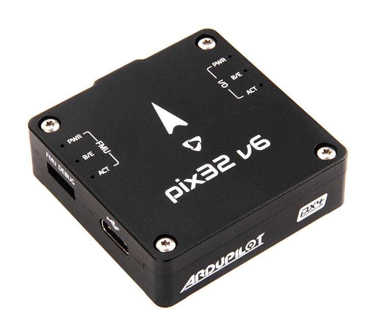

# Holybro Pix32 v5

:::warning
PX4 не виробляє цей (або будь-який інший) автопілот. Зверніться до [виробника](https://holybro.com/) щодо підтримки апаратного забезпечення чи відповідності вимогам.
:::

_Pix32 v6_<sup>&reg;</sup> є останньою оновленою версією контролерів польоту pix32 v5. Це варіант Pixhawk 6C з модульним дизайном та спільною ціллю з FMUv6C. Він складається з окремого контролера польоту та базової плати, які з'єднані [100-контактним роз'ємом](https://docs.holybro.com/autopilot/pix32-v6/download). Це призначено для тих пілотів, які потребують потужної, гнучкої та настроюваної системи керування польотами.

Він оснащений високопродуктивним процесором H7, і має резервування IMU, з контролем температури, і економічно вигідний дизайн, що забезпечує неймовірну продуктивність та надійність. Він відповідає [Connector Standard](https://github.com/pixhawk/Pixhawk-Standards/blob/master/DS-009%20Pixhawk%20Connector%20Standard.pdf).




<!--
:::tip
This autopilot is [supported](../flight_controller/autopilot_pixhawk_standard.md) by the PX4 maintenance and test teams.
:::  
-->

## Вступ

Всередині Pix32 v6 ви можете знайти STM32H743 на базі STMicroelectronics®, у поєднанні з технологією сенсорів від Bosch® & InvenSense®, що надає гнучкість і надійність для керування будь-яким автономним апаратом, придатним як для академічних, так і для комерційних застосувань.

Pix32 v6’s H7 MCU містить ядро Arm® Cortex®-M7 до 480 MHz, має 2MB flash пам’яті та 1MB RAM. Завдяки оновленій потужності обробки розробники можуть бути більш продуктивними та ефективними у своїй роботі з розробкою, що дозволяє використовувати складні алгоритми та моделі. Це включає високопродуктивні, низькошумні IMU на платі, розроблені, щоб бути ефективними з точки зору вартості, при цьому мати резерв IMU. Система ізоляції вібрації для фільтрації високочастотної вібрації та зменшення шуму для забезпечення точних вимірювань, що дозволяє транспортним засобам досягти кращих загальних польотних характеристик.

Цей контролер польоту ідеально підходить для людей, які шукають доступний та модульний контролер польоту, який може використовувати настроювану базову плату. Ми зробили [схеми базової плати pix32 v6 загальнодоступними](https://docs.holybro.com/autopilot/pix32-v6/download), ви можете або зробити власну несучу плату, або просто дозвольте нам допомогти вам з цим. За допомогою налаштованої базової плати ви можете впевнитися, що фізичний розмір, виводи і вимоги до розподілу живлення відповідають вашому безпілотнику належним чином, забезпечуючи, що у вас є всі необхідні з'єднання і ніяких витрат і масштабу з'єднувачів, яких вам не потрібно.

**Ключові пункти дизайну**

- Високопродуктивний процесор STM32H743 з більшою обчислювальною потужністю & оперативною пам'яттю
- Новий економічно ефективний дизайн із низькопрофільним форм-фактором
- Інтегрована система ізоляції вібрацій для фільтрації високочастотних вібрацій та зменшення шуму для забезпечення точних вимірювань
- IMU температурно контролюються за допомогою вбудованих нагрівальних резисторів, що дозволяє досягти оптимальної робочої температури IMU

# Технічна специфікація

### **Процесори & датчики**

- Процесор FMU: STM32H743&#x20;
  - 32 Bit Arm® Cortex®-M7, 480MHz, 2MB memory, 1MB SRAM&#x20;
- IO процесор: STM32F103
  - &#x20;32 Bit Arm® Cortex®-M3, 72MHz, 64KB SRAM&#x20;
- Бортові сенсори&#x20;
  - &#x20;Accel/Gyro: ICM-42688-P &#x20;
  - Accel/Gyro: BMI055&#x20;
  - Mag: IST8310&#x20;
  - Барометр: MS5611

### **Електричні дані**

- Номінальна напруга:
  - Максимальна вхідна напруга: 6 В
  - Вхід USB Power: 4.75\~5.25В
  - Вхід сервоприводу: 0\~36В
- Поточні рейтинги:
  - TELEM1 Максимальний обмежувач вихідного струму: 1.5A
  - Комбінований обмежувач вихідного струму всіх інших портів: 1.5A

### **Механічні характеристики**

- Розміри модуля FC: 44.8 x 44.8 x 13.5
- Вага модуля FC: 36г

### **Інтерфейси**

- 16- PWM серво виводів (8 з IO, 8 з FMU)
- 3 загальних послідовних портів
  - `TELEM1` - Повний контроль потоку, повністю розділений поточним лімітом 1.5A
  - `TELEM2` - Повний контроль потоку
  - `TELEM3`
- 2 Порти GPS
  - `GPS1` - Повний порт GPS (GPS плюс захисний перемикач)
  - `GPS2` - Базовий порт GPS
- 1 I2C порт
  - Підтримує спеціалізовану I2C калібрування EEPROM, розташовану на модулі сенсорів
- 2 CAN шини
  - Кожна CAN шина має індивідуальне керування шумом або ESC RX-MUX контроль
- 2 порти відладки:
  - FMU Debug
  - I/O Debug
- Спеціалізований R/C вхід для Spektrum / DSM та S.BUS, CPPM, аналоговий / PWM RSSI
- Спеціалізований S.BUS вивід
- 2 вхідні порти живлення (аналогові)

- Інші Характеристики:
  - Робоча & температура зберігання: -40 ~ 85°c

## Де купити

Замовляйте з [Holybro](https://holybro.com/collections/autopilot-flight-controllers/products/pix32-v6).

## Схема розташування виводів

- [Порти Holybro Pix32 v6 Baseboard](https://docs.holybro.com/autopilot/pix32-v6/pix32-v6-baseboard-ports)
- [Порти Holybro Pix32 v6 Baseboard](https://docs.holybro.com/autopilot/pix32-v6/pix32-v6-mini-base-ports)

## Зіставлення послідовних портів

| UART   | Пристрій   | Порт                  |
| ------ | ---------- | --------------------- |
| USART1 | /dev/ttyS0 | GPS1                  |
| USART2 | /dev/ttyS1 | TELEM3                |
| USART3 | /dev/ttyS2 | Консоль відлагодження |
| UART5  | /dev/ttyS3 | TELEM2                |
| USART6 | /dev/ttyS4 | PX4IO                 |
| UART7  | /dev/ttyS5 | TELEM1                |
| UART8  | /dev/ttyS6 | GPS2                  |

## Розміри

- [Розміри Pix32v6](https://docs.holybro.com/autopilot/pix32-v6/dimensions)

## Номінальна напруга

_Pix32 v6_ може мати потрійну резервність у джерелі живлення, якщо подаються три джерела живлення. Три шляхи живлення: **USB**, **POWER1**, **POWER2** (N/A на Pix32 v6 Mini-Baseboard) .

**Максимальна напруга нормальної роботи**

За таких умов всі джерела живлення будуть використовуватися в цьому порядку для живлення системи:

1. **POWER1** та **POWER2** входи (від 4,9 В до 5,5 В)
1. **USB** вхід (4.75V до 5.25V)

**Абсолютна максимальна напруга**

За таких умов система не буде витрачати жодної енергії (не буде працювати), але залишиться неушкодженою.

1. **POWER1** і **POWER2** входи (робочий діапазон від 4,1 В до 5,7 В, від 0 В до 10 В без пошкоджень)
1. **USB** вхід (операційний діапазон 4.1В до 5.7В, 0В до 6В без пошкоджень)
1. Серво-вхід: пін VDD_SERVO виводу **FMU PWM OUT** та **I/O PWM OUT** (від 0В до 42В без пошкоджень)

**Моніторинг напруги**

Pix32 v6 використовує аналогові модулі живлення.

Holybro виготовляє різноманітні аналогові [модулі живлення](../power_module/index.md) для різних потреб.

- [PM02 Power Module](../power_module/holybro_pm02.md)
- [PM06 Power Module](../power_module/holybro_pm06_pixhawk4mini_power_module.md)
- [PM07 Power Module](../power_module/holybro_pm07_pixhawk4_power_module.md)

## Збірка прошивки

:::tip
Більшості користувачів не потрібно створювати цю прошивку! Вона попередньо зібрана і автоматично встановлюється за допомогою _QGroundControl_ при підключенні відповідного обладнання.
:::

Щоб [зібрати PX4](../dev_setup/building_px4.md) для цієї цілі:

```
make px4_fmu-v6c_default
```

<a id="debug_port"></a>

## Відладочний порт

[Системна консоль PX4](../debug/system_console.md) та [SWD interface](../debug/swd_debug.md) працюють на порту **FMU Debug**.

Розпіновка та роз’єм відповідають інтерфейсу [Pixhawk Debug Full](../debug/swd_debug.md#pixhawk-debug-full), визначеному в [Pixhawk Connector Standard](https://github.com/pixhawk/Pixhawk-Standards/blob/master/DS-009%20Pixhawk%20Connector%20Standard.pdf) (роз’єм JST SM10B).

| Пін          | Сигнал           | Вольтаж |
| ------------ | ---------------- | ------- |
| 1 (червоний) | `Vtref`          | +3.3В   |
| 2 (чорний)   | Консоль TX (OUT) | +3.3В   |
| 3 (чорний)   | Консоль RX (IN)  | +3.3В   |
| 4 (чорний)   | `SWDIO`          | +3.3В   |
| 5 (чорний)   | `SWCLK`          | +3.3В   |
| 6 (чорний)   | `SWO`            | +3.3В   |
| 7 (чорний)   | NFC GPIO         | +3.3В   |
| 8 (чорний)   | PH11             | +3.3В   |
| 9 (чорний)   | nRST             | +3.3В   |
| 10 (чорний)  | `GND`            | GND     |

Інформацію про використання цього порту дивіться:

- [Порт відладки SWD](../debug/swd_debug.md)
- [Системна консоль PX4](../debug/system_console.md) (Зауважте, консоль FMU відображається на USART3).

## Периферія

- [Цифровий датчик швидкості польоту](https://holybro.com/products/digital-air-speed-sensor)
- [Радіо модулі телеметрії](https://holybro.com/collections/telemetry-radios?orderby=date)
- [Далекоміри / Датчики відстані](../sensor/rangefinders.md)

## Підтримувані платформи / Airframes

Будь-який мультикоптер / літак / наземна платформа / човен, який може керуватися звичайними RC сервоприводами або сервоприводами Futaba S-Bus. Повний перелік підтримуваних конфігурацій можна переглянути в розділі [Довідник планерів](../airframes/airframe_reference.md).

## Подальша інформація

- [Holybro Docs](https://docs.holybro.com/) (Holybro)
- [Reference: Pixhawk 6C Wiring QuickStart](../assembly/quick_start_pixhawk6c.md)
- [PM02 Power Module](../power_module/holybro_pm02.md)
- [PM06 Power Module](../power_module/holybro_pm06_pixhawk4mini_power_module.md)
- [PM07 Power Module](../power_module/holybro_pm07_pixhawk4_power_module.md)
- [FMUv6C reference design pinout](https://docs.google.com/spreadsheets/d/1FcmWRKd6zjdz3-cnjEDYEmANKZOFzNSc/edit?usp=sharing&ouid=113251442407318461574&rtpof=true&sd=true).
- [Pixhawk Connector Standard](https://github.com/pixhawk/Pixhawk-Standards/blob/master/DS-009%20Pixhawk%20Connector%20Standard.pdf).
