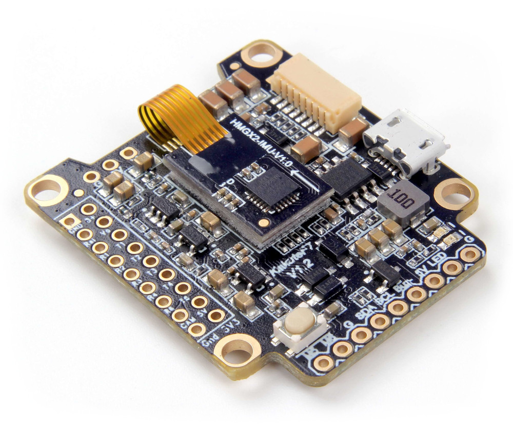
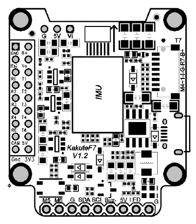
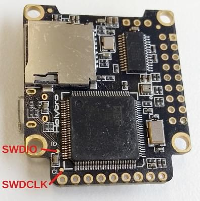
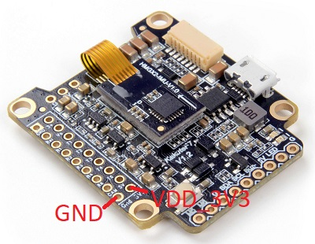

# Holybro Kakute F7 (Знято з виробництва)

<Badge type="error" text="Discontinued" />

:::warning PX4 не виробляє цей (або будь-який інший) автопілот. Зверніться до [виробника](https://holybro.com/) щодо підтримки апаратного забезпечення чи відповідності вимогам.
:::

_Kakute F7_ від Holybro - це плата керування польотом, призначена для гонщиків.



::: info Цей контролер польоту [підтримується виробником](../flight_controller/autopilot_manufacturer_supported.md).
:::

## Ключові особливості

- Головний системний чіп: [STM32F745VGT6](https://www.st.com/en/microcontrollers-microprocessors/stm32f745vg.html)
  - ЦП: 216 МГц ARM Cortex M7 з одноточністю FPU
  - RAM: 320 KB SRAM
  - FLASH: 1 МБ
- Стандартна форма гонщика: 36x36 мм зі стандартним отвором 30,5 мм
- ICM20689 Accel / Gyro (М'які кріплення)
- BMP280 Baro
- microSD (логування)
- 6 UARTs
- 1 шина I2C
- 6 PWM виводів
- Вбудований чіп OSD (AB7456 через SPI)

## Де придбати

Дошку можна придбати в одному з наступних магазинів (наприклад):

- [getfpv](https://www.getfpv.com/holybro-kakute-f7-tekko32-f3-metal-65a-4-in-1-esc-combo.html)

:::tip
_Kakute F7_ призначений для сумісної роботи з 4-в-1 ESC _Tekko32_ і може бути придбаний в комплекті.
:::

## Конектори та контакти

Це сілкскрін для _Kakute F7_, що показує верхню частину плати:



| Піни         | Функція                                                                       | PX4 default                 |
| ------------ | ----------------------------------------------------------------------------- | --------------------------- |
| B+           | Позитивна напруга батареї (2S-6S)                                             |                             |
| 5В           | Вихід 5В (максимум 2A)                                                        |                             |
| VO           | Відеовихід на відеопередавач                                                  |                             |
| VI           | Відеовхід з камери FPV                                                        |                             |
| G або GND    | Заземлення                                                                    |                             |
| SDA, SCL     | Підключення I2C (для периферійних пристроїв)                                  |                             |
| R1, T1       | UART1 RX та TX                                                                | TELEM1                      |
| R2, T2       | UART2 RX та TX                                                                | TELEM2                      |
| R3, T3       | UART2 RX та TX                                                                | Консоль відлагодження NuttX |
| R4, T4       | UART4 RX та TX                                                                | GPS1                        |
| R6, T6       | UART6 RX та TX                                                                | RC порт                     |
| R7, T7       | UART7 RX та TX (RX знаходиться у роз'ємі для використання з 4-в-1 ESC)        | Телеметрія DShot            |
| LED          | Дріт сигнальний для адресованих світлодіодів WS2182 (не тестувався)           |                             |
| Buz-         | Негативна нога п'єзожучка (Підключіть позитивну ногу динаміку до контакту 5В) |                             |
| 3V3          | 3.3V вивід (200 мA max)                                                       |                             |
| M1 до M4     | Вихід сигналу двигуна (розташований у роз'ємі для використання в 4-в-1 ESC)   |                             |
| М5, М6       | Додаткові виходи сигналу двигуна (розташовані на боці плати)                  |                             |
| RSI          | Аналоговий вхід RSSI (0-3,3 В) від приймача                                   |                             |
| Завантаження | Кнопка завантажувача                                                          |                             |

<a id="bootloader"></a>

## Оновлення завантажувача PX4

Дошка поставляється із заздалегідь встановленою [Betaflight](https://github.com/betaflight/betaflight/wiki). Перед встановленням прошивки PX4 необхідно прошити _завантажувач PX4_. Завантажте завантажувальний бінарний файл [kakutef7_bl.hex](https://github.com/PX4/PX4-user_guide/raw/main/assets/flight_controller/kakutef7/kakutef7_bl_0b3fbe2da0.hex) та прочитайте [цю сторінку](../advanced_config/bootloader_update_from_betaflight.md) для інструкцій з прошивки.

## Збірка прошивки

Щоб [зібрати PX4](../dev_setup/building_px4.md) для цієї цілі:

```
make holybro_kakutef7_default
```

## Встановлення прошивки PX4

Прошивку можна встановити будь-якими звичайними способами:

- Збудуйте та завантажте джерело
  ```
  make holybro_kakutef7_default upload
  ```
- [Завантажте прошивку](../config/firmware.md) за допомогою _QGroundControl_. Ви можете використовувати або готове вбудоване програмне забезпечення, або власне користувацьке програмне забезпечення.

## Конфігурація

Якщо ви використовуєте 4-в-1 ESC з призначенням мотора Betaflight/Cleanflight, ви можете використовувати користувацький інтерфейс [Actuator](../config/actuators.md), щоб належним чином встановити управління мотором.

Крім [основної конфігурації](../config/index.md), важливі наступні параметри:

| Параметр                                                               | Налаштування                                                                                                                  |
| ---------------------------------------------------------------------- | ----------------------------------------------------------------------------------------------------------------------------- |
| [SYS_HAS_MAG](../advanced_config/parameter_reference.md#SYS_HAS_MAG) | Це має бути вимкнено, оскільки у платі немає внутрішнього магніту. Ви можете активувати це, якщо приєднаєте зовнішній магніт. |

## Зіставлення послідовних портів

| UART   | Пристрій   | Порт                   |
| ------ | ---------- | ---------------------- |
| USART1 | /dev/ttyS0 | TELEM1                 |
| USART2 | /dev/ttyS1 | TELEM2                 |
| USART3 | /dev/ttyS2 | Консоль відладки       |
| UART4  | /dev/ttyS3 | GPS1                   |
| USART6 | /dev/ttyS4 | RC SBUS                |
| UART7  | /dev/ttyS5 | Телеметрія ESC (DShot) |

<!-- Note: Got ports using https://github.com/PX4/PX4-user_guide/pull/672#issuecomment-598198434 -->

## Відладочний порт

### Системна консоль

UART3 RX та TX налаштовані для використання як [Системна Консоль](../debug/system_console.md).

### SWD

Інтерфейс [SWD](../debug/swd_debug.md) (JTAG) має такі контакти:

- `SWCLK`: Тестова точка 2 (Pin 72 на процесорі)
- `SWDIO`: Тестова точка 3 (Pin 76 на процесорі)
- `GND`: Як позначено на платі
- `VDD_3V3`: Як позначено на платі

Ці показані нижче.

 
