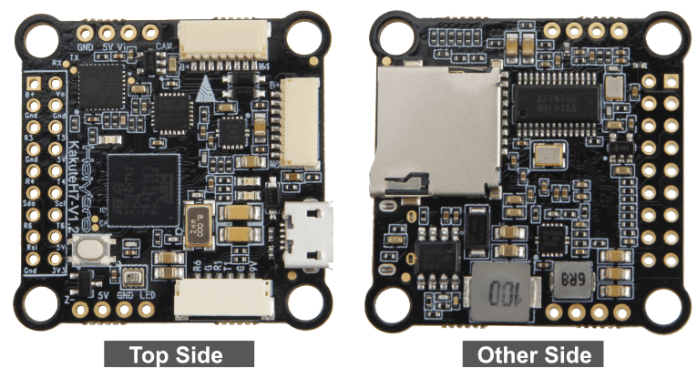
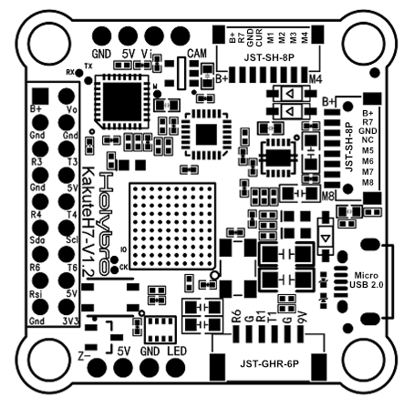

# Holybro Kakute H7

<Badge type="tip" text="PX4 v1.13" />

:::warning PX4 не виробляє цей (чи будь-який інший) автопілот. Зверніться до [виробника](https://holybro.com/) щодо підтримки апаратного забезпечення чи відповідності вимогам.
:::

[Holybro Kakute H7](https://holybro.com/products/kakute-h7) є повним набором функцій, включаючи подвійні роз'єми ESC 4in1 plug-and-play, роз'єм для HD-камери, барометр, OSD, 6x UART, слот для картки пам'яті Blackbox MicroSD, BEC на 5В та 9В, зручне розташування для паяння та багато іншого.

Kakute H7 базується на кращих рисах свого попередника, [Kakute F7](../flight_controller/kakutef7.md), та подальші вдосконалюють апаратні компоненти та компонування. Подвійні роз'єми підключення 4-в-1 ESC спрощують підтримку конфігурацій x8 та Octocopter, забезпечуючи простоту збирання.

Плата також має вбудований барометр, світлодіод & п'єзоімпульс, а також плату I2C (SDA & SCL) для зовнішніх GPS/магнітомерів.



::: info Цей польотний контролер [підтримується виробником](../flight_controller/autopilot_manufacturer_supported.md).
:::

## Ключові особливості

- MCU: Процесор STM32H743 32-біт, який працює на частоті 480 МГц
- IMU: MPU6000
- Барометр: BMP280
- OSD: AT7456E
- Bluetooth-чіп на борту: вимкнено з PX4
- 2x порт JST-SH1.0_8pin (для одиночних або 4-в-1 ESCs, сумісний з x8/Octocopter plug & play)
- 1x порт JST-GH1.25_6pin (для HD-системи, такої як Caddx Vista & Air Unit)
- Напруга вхідної батареї: 2S - 8S
- BEC 5В 2A &Cont.
- BEC 9В 1.5A Cont.
- Монтаж: 30,5 х 30,5 мм / отвір Φ4 мм з прокладками Φ3 люверси
- Розміри: 35x35мм
- Вага: 8г

## Де придбати

Плату можна придбати в одному з наступних магазинів (наприклад):

- [Holybro](https://holybro.com/products/kakute-h7)

:::tip
_Kakute H7_ призначений для сумісної роботи з _Tekko32_ 4-в-1 ESC і може бути придбаний в комплекті.
:::

## Конектори та контакти

Це сілкскрін для _Kakute H7_, що показує верхню частину плати:



| Pin      | Function                                                          | PX4 default         |
| -------- | ----------------------------------------------------------------- | ------------------- |
| B+       | Battery positive voltage (2S-8S)                                  |                     |
| SDA, SCL | I2C connection (for peripherals)                                  |                     |
| 5V       | 5V output (2A max)                                                |                     |
| 3V3      | 3.3V output (0.25A max)                                           |                     |
| VI       | Video input from FPV camera                                       |                     |
| VO       | Video output to video transmitter                                 |                     |
| CAM      | To camera OSD control                                             |                     |
| G or GND | Ground                                                            |                     |
| RSI      | Analog RSSI (0-3.3V) input from receiver                          |                     |
| R1, T1   | UART1 RX and TX                                                   | TELEM1              |
| R3, T3   | UART3 RX and TX                                                   | NuttX debug console |
| R4, T4   | UART4 RX and TX                                                   | GPS1                |
| R6, T6   | UART6 RX and TX (R6 also located in the GH plug)                  | RC port             |
| R7       | UART7 RX (RX is located in the plugs for use with 4-in-1 ESCs)    | DShot telemetry     |
| LED      | WS2182 addressable LED signal wire (not tested)                   |                     |
| Z-       | Piezo buzzer negative leg (Connect buzzer positive leg to 5V pad) |                     |
| M1 to M4 | Motor signal outputs (located in plug for use in 4-in-1 ESCs)     |                     |
| M5 to M8 | Motor signal outputs (located in plug for use in 4-in-1 ESCs)     |                     |
| Boot     | Bootloader button                                                 |                     |

<a id="bootloader"></a>

## PX4 Bootloader Update

The board comes pre-installed with [Betaflight](https://github.com/betaflight/betaflight/wiki). Before PX4 firmware can be installed, the _PX4 bootloader_ must be flashed. Download the [kakuteh7_bl.hex](https://github.com/PX4/PX4-user_guide/raw/main/assets/flight_controller/kakuteh7/holybro_kakuteh7_bootloader.hex) bootloader binary and read [this page](../advanced_config/bootloader_update_from_betaflight.md) for flashing instructions.

## Building Firmware

To [build PX4](../dev_setup/building_px4.md) for this target:

```
make holybro_kakuteh7_default
```

## Installing PX4 Firmware

The firmware can be installed in any of the normal ways:

- Build and upload the source

  ```
  make holybro_kakuteh7_default upload
  ```

- [Load the firmware](../config/firmware.md) using _QGroundControl_. You can use either pre-built firmware or your own custom firmware.

::: info
If you are loading the pre-built firmware via QGroundcontrol, you must use QGC Daily or QGC version newer than 4.1.7.
:::

## PX4 Configuration

In addition to the [basic configuration](../config/index.md), the following parameters are important:

| Parameter                                                              | Setting                                                                                                                 |
| ---------------------------------------------------------------------- | ----------------------------------------------------------------------------------------------------------------------- |
| [SYS_HAS_MAG](../advanced_config/parameter_reference.md#SYS_HAS_MAG) | This should be disabled since the board does not have an internal mag. You can enable it if you attach an external mag. |

## Serial Port Mapping

| UART   | Device     | Port                  |
| ------ | ---------- | --------------------- |
| USART1 | /dev/ttyS0 | TELEM1                |
| USART3 | /dev/ttyS2 | Debug Console         |
| UART4  | /dev/ttyS3 | GPS1                  |
| USART6 | /dev/ttyS4 | RC SBUS               |
| UART7  | /dev/ttyS5 | ESC telemetry (DShot) |

## Debug Port

### System Console

UART3 RX and TX are configured for use as the [System Console](../debug/system_console.md).

### SWD

The [SWD interface](../debug/swd_debug.md) (JTAG) pins are:

- `SWCLK`: Test Point 2 (Pin 72 on the CPU)
- `SWDIO`: Test Point 3 (Pin 76 on CPU)
- `GND`: As marked on board
- `VDD_3V3`: As marked on board

These are shown below.


