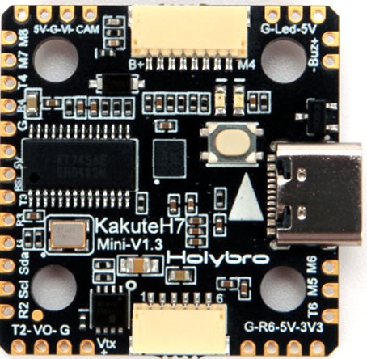
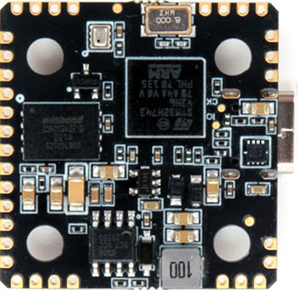
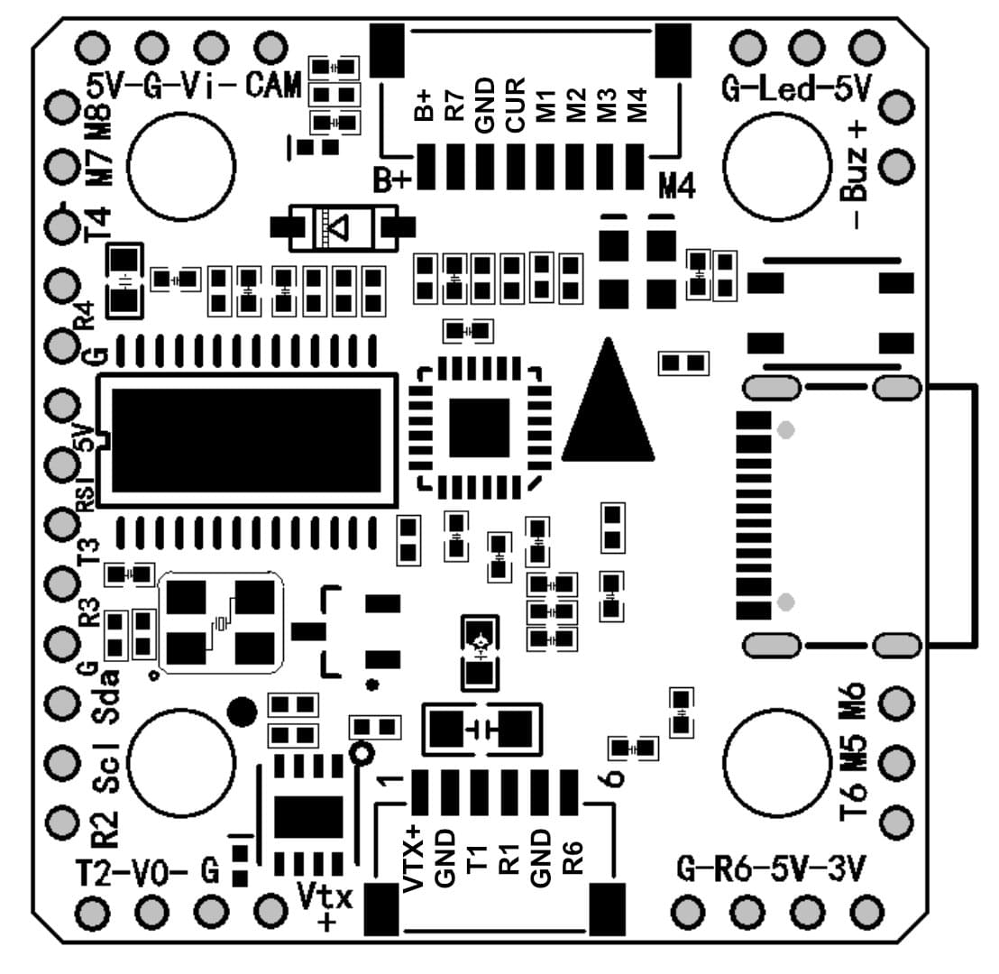

# Holybro Kakute H7 mini

<Badge type="tip" text="PX4 v1.13" />

:::warning
PX4 не займається виготовленням цього (чи якогось іншого) автопілоту. Звертайтесь до [виробника](https://holybro.com/) щодо питань апаратного забезпечення або питань відповідності.
:::

Польотний контролер [Holybro Kakute H7 mini](https://holybro.com/collections/autopilot-flight-controllers/products/kakute-h7-mini) призначений для легких корпусів (таких як гонщики тощо).

Цей контролер польоту повний функцій, включаючи роз'єм для HD-камери, подвійні роз'єми ESC 4in1 plug-and-play, перемикач VTX ON/OFF Pit (напруга батареї), барометр, OSD, 6x UART, 128 МБ Flash для журналювання (ще не підтримується з PX4), BEC на 5В, та більші пластини для паяння з простим розташуванням та багато іншого.

Kakute H7 mini базується на кращих рисах свого попередника, [Kakute F7](../flight_controller/kakutef7.md), та [Kakute H7](../flight_controller/kakuteh7.md). Плата також має вбудований барометр, світлодіод & п'єзоімпульс, а також контакт I2C (SDA & SCL) для зовнішніх GPS/магнітомерів.

 

::: info
Цей польотний контролер [підтримується виробником](../flight_controller/autopilot_manufacturer_supported.md).
:::

::: info
PX4 запускається на H7 mini v1.3 та більш пізніх моделях.
:::

## Основні характеристики

- MCU: Процесор STM32H743 32-біт, який працює на частоті 480 МГц
- IMU: BMI270
- Барометр: BMP280
- OSD: AT7456E
- 6x UARTs (1,2,3,4,6,7)
- VTX On/Off Pit Switch: Не використовується з PX4
- 9x Вихід PWM (8 Вихід Двигуна, 1 Світлодіод)
- 2x порт JST-SH1.0_8pin (для одиночних або 4-в-1 ESCs, сумісне з x8/Octocopter plug & play)
- 1x порт JST-GH1.5_6pin (для HD-системи, такої як Caddx Vista & Air Unit)
- Напруга введення батареї: 2S-6S
- BEC 5V 2A Cont.
- Монтаж: 20 х 20 мм / отвір Φ3,6 мм з прокладками M3 & M2
- Розміри: 30x31x6мм
- Вага: 5.5г

## Де придбати

Плату можна придбати в одному з наступних магазинів (наприклад):

- [Holybro](https://holybro.com/products/kakute-h7-mini)

## Конектори та контакти



| Пін      | Функція                                                                       | PX4 default                 |
| -------- | ----------------------------------------------------------------------------- | --------------------------- |
| B+       | Позитивна напруга батареї (2S-6S)                                             |                             |
| VTX+     | Позитивна напруга батареї (2S-6S)                                             |                             |
| SDA, SCL | Підключення I2C (для периферійних пристроїв)                                  |                             |
| 5V       | 5В вихід (максимум 2A)                                                        |                             |
| 3V3      | 3.3В вивід (максимум 0.25A)                                                   |                             |
| VI       | Відеовхід з камери FPV                                                        |                             |
| VO       | Відеовихід на відеопередавач                                                  |                             |
| CAM      | На контроль OSD камери                                                        |                             |
| G or GND | Заземлення                                                                    |                             |
| RSI      | Аналоговий вхід RSSI (0-3,3 В) від приймача                                   |                             |
| R1, T1   | UART1 RX і TX                                                                 | TELEM1                      |
| R2, T2   | UART2 RX і TX                                                                 | TELEM2                      |
| R3, T3   | UART3 RX і TX                                                                 | Консоль відлагодження NuttX |
| R4, T4   | UART4 RX і TX                                                                 | GPS1                        |
| R6, T6   | UART6 RX і TX (R6 також розташований в GH plug)                               | RC port                     |
| R7       | UART7 RX (RX знаходиться у роз'ємі для використання з 4-в-1 ESC)              | Телеметрія DShot            |
| LED      | Дріт сигнальний для адресованих світлодіодів WS2182 (не тестувався)           |                             |
| Z-       | Негативна нога п'єзожучка (Підключіть позитивну ногу динаміку до контакту 5В) |                             |
| M1 to M4 | Вихід сигналу двигуна (розташований у роз'ємі для використання в 4-в-1 ESC)   |                             |
| M5 to M8 | Вихід сигналу двигуна (розташований у роз'ємі для використання в 4-в-1 ESC)   |                             |
| Boot     | Кнопка завантажувача                                                          |                             |

<a id="bootloader"></a>

## Оновлення завантажувача PX4

Плата поставляється із заздалегідь встановленою [Betaflight](https://github.com/betaflight/betaflight/wiki). Перед встановленням прошивки PX4 необхідно прошити _завантажувач PX4_. Завантажте завантажувальний бінарний файл [holybro_kakuteh7mini_bootloader.hex](https://github.com/PX4/PX4-user_guide/raw/v1.15/assets/flight_controller/kakuteh7mini/holybro_kakuteh7mini_bootloader.hex) та прочитайте [цю сторінку](../advanced_config/bootloader_update_from_betaflight.md) для інструкцій з прошивки.

## Створення прошивки

Щоб [зібрати PX4](../dev_setup/building_px4.md) для цього контролера:

```
make holybro_kakuteh7mini_default
```

## Встановлення прошивки PX4

::: info
Якщо ви завантажуєте попередню прошивку через QGroundcontrol, ви повинні використовувати QGC Daily або QGC версію новішу від 4.1.7. До випуску вам потрібно буде вручну зібрати та встановити прошивку.
:::

Прошивку можна встановити вручну будь-якими звичайними способами:

- Збудуйте та завантажте джерело:

  ```
  make holybro_kakuteh7mini_default upload
  ```

- [Завантажте прошивку](../config/firmware.md) за допомогою _QGroundControl_. Ви можете використовувати або готове вбудоване програмне забезпечення, або власне користувацьке програмне забезпечення.

::: info
KakuteH7mini підтримується з PX4 головною та v1.14 або новішою.
:::

## Налаштування PX4

Крім [основних налаштувань](../config/index.md), важливі наступні параметри:

| Параметр                                                               | Налаштування                                                                                                                  |
| ---------------------------------------------------------------------- | ----------------------------------------------------------------------------------------------------------------------------- |
| [SYS_HAS_MAG](../advanced_config/parameter_reference.md#SYS_HAS_MAG) | Це має бути вимкнено, оскільки у платі немає внутрішнього магніту. Ви можете активувати це, якщо приєднаєте зовнішній магніт. |

## Зіставлення послідовних портів

| UART   | Пристрій   | Порт                  |
| ------ | ---------- | --------------------- |
| USART1 | /dev/ttyS0 | TELEM1                |
| UART2  | /dev/ttyS1 | TELEM2                |
| USART3 | /dev/ttyS2 | Debug Console         |
| UART4  | /dev/ttyS3 | GPS1                  |
| USART6 | /dev/ttyS4 | RC SBUS               |
| UART7  | /dev/ttyS5 | ESC telemetry (DShot) |

## Відладочний порт

### Системна консоль

UART3 RX та TX налаштовані для використання як [Системна Консоль](../debug/system_console.md).

### SWD

Інтерфейс [SWD](../debug/swd_debug.md) (JTAG) має такі контакти:

- `SWCLK`: Тестова точка 2 (Pin 72 на процесорі)
- `SWDIO`: Тестова точка 3 (Pin 76 на процесорі)
- `GND`: Як позначено на платі
- `VDD_3V3`: Як позначено на платі
