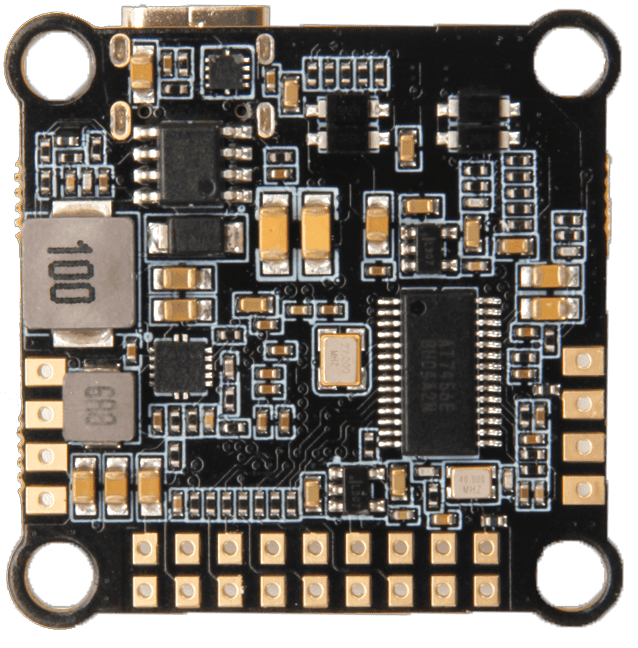

# Holybro Kakute H7 V2

:::warning
PX4 не виробляє цей (або будь-який інший) автопілот. Звертайтесь до [виробника](https://holybro.com/) щодо питань апаратного забезпечення або питань відповідності.
:::

Польотний контролер [Holybro Kakute H7 V2](https://holybro.com/collections/autopilot-flight-controllers/products/kakute-h7-v2) має багато різних функцій, включаючи інтегрований Bluetooth, роз'єм для HD-камери, подвійні роз'єми ESC 4in1 plug-and-play, VTX ON/OFF Pit Switch на 9В, барометр, OSD, 6x UART, 128 МБ сховище для ведення журналу (ще не підтримується PX4), BEC на 5В та 9В, більші площі для паяння та багато іншого.

Kakute H7v2 базується на кращих рисах своїх попередників, [Kakute F7](../flight_controller/kakutef7.md), та [Kakute H7](../flight_controller/kakuteh7.md).

Плата також має вбудований барометр, світлодіод & п'єзоімпульс, а також плату I2C (SDA & SCL) для зовнішніх GPS/магнітомерів.

 

::: info
Цей польотний контролер підтримується [виробником](../flight_controller/autopilot_manufacturer_supported.md).
:::

## Основні характеристики

- MCU: Процесор STM32H743 32-біт, що працює на частоті 480 МГц
- IMU: BMI270
- Барометр: BMP280
- OSD: AT7456E
- Bluetooth-чіп на борту: вилучено з PX4
- VTX On/Off Pit Switch: Не використовується з PX4
- 6x UARTs (1,2,3,4,6,7; UART2 використовується для Bluetooth телеметрії)
- 9x PWM виходів (8 виходів двигуна, 1 LED)
- 2x порт JST-SH1.0_8pin (для одиночних або 4-в-1 ESCs, сумісний з x8/Octocopter plug & play)
- 1x порт JST-GH1.5_6pin (для HD-системи, такої як Caddx Vista & Air Unit)
- Напруга вхідної батареї: 2S-8S
- BEC 5V 2A Cont.
- BEC 9V 1.5A Cont.
- Монтаж: 30.5 х 30.5 мм / отвір Φ4 мм з люверсами Φ3 мм
- Розміри: 35 x 35мм
- Вага: 8г

## Де купити

Плату можна придбати в одному з наступних магазинів (наприклад):

- [Holybro](https://holybro.com/products/kakute-h7-v2)

:::tip
_Kakute H7v2_ призначений для сумісної роботи з _Tekko32_ 4-in-1 ESC і може бути придбаний в комплекті.
:::

## Конектори та контакти

| Контакт  | Функція                                                                      | PX4 default                 |
| -------- | ---------------------------------------------------------------------------- | --------------------------- |
| B+       | Позитивна напруга батареї (2S-8S)                                            |                             |
| VTX+     | 9В вивід                                                                     |                             |
| SDA, SCL | Підключення I2C (для периферійних пристроїв)                                 |                             |
| 5V       | Вихід 5В (максимум 2A)                                                       |                             |
| 3V3      | Вихід 3.3В (максимум 0.25A)                                                  |                             |
| VI       | Відеовхід з камери FPV                                                       |                             |
| VO       | Відеовихід на відеопередавач                                                 |                             |
| CAM      | Контроль OSD камери                                                          |                             |
| G or GND | Заземлення                                                                   |                             |
| RSI      | Аналоговий вхід RSSI (0-3,3 В) від приймача                                  |                             |
| R1, T1   | UART1 RX та TX                                                               | TELEM1                      |
| R3, T3   | UART3 RX та TX                                                               | Консоль відлагодження NuttX |
| R4, T4   | UART4 RX та TX                                                               | GPS1                        |
| R6, T6   | UART6 RX та TX (R6 також розташований в GH plug)                             | RC порт                     |
| R7       | UART7 RX (RX знаходиться у роз'ємах для використання з 4-in-1 ESC)           | Телеметрія DShot            |
| LED      | Дріт сигнальний для адресованих світлодіодів WS2182 (не тестувався)          |                             |
| Z-       | Негативна нога п'єзожучка (Підключіть позитивну ногу до контакту 5В)         |                             |
| M1 to M4 | Вихід сигналу двигуна (розташований у роз'ємі для використання в 4-in-1 ESC) |                             |
| M5 to M8 | Вихід сигналу двигуна (розташований у роз'ємі для використання в 4-in-1 ESC) |                             |
| Boot     | Кнопка завантажувача                                                         |                             |

<a id="bootloader"></a>

## Оновлення завантажувача PX4

Плата поставляється із заздалегідь встановленою [Betaflight](https://github.com/betaflight/betaflight/wiki). Перед встановленням прошивки PX4 необхідно прошити _заванажувач PX4_. Завантажте завантажувальний бінарний файл [holybro_kakuteh7v2_bootloader.hex](https://github.com/PX4/PX4-user_guide/raw/main/assets/flight_controller/kakuteh7v2/holybro_kakuteh7v2_bootloader.hex) та прочитайте [цю сторінку](../advanced_config/bootloader_update_from_betaflight.md) для інструкцій з прошивки.

## Створення прошивки

Щоб [зібрати PX4](../dev_setup/building_px4.md) для цього контролера:

```
make holybro_kakuteh7v2_default
```

## Встановлення прошивки PX4

::: info
KakuteH7v2 підтримується з PX4 master & PX4 v1.14 або новішою. Якщо ви завантажуєте готове програмне забезпечення через QGroundcontrol, вам необхідно використовувати щоденну версію QGC або версію QGC новішу за 4.1.7. До випуску вам потрібно буде вручну зібрати та встановити прошивку.
:::

Прошивку можна встановити вручну будь-якими звичайними способами:

- Джерело для збірки та завантаження:

  ```
  make holybro_kakuteh7v2_default upload
  ```

- [Завантажте прошивку](../config/firmware.md) за допомогою _QGroundControl_. Ви можете використовувати або готове вбудоване програмне забезпечення, або власне користувацьке програмне забезпечення.

::: info
KakuteH7v2 підтримується з PX4 main і v1.14 або новішою.
:::

## Налаштування PX4

Крім [основної конфігурації](../config/index.md), важливі наступні параметри:

| Параметр                                                               | Налаштування                                                                                                                  |
| ---------------------------------------------------------------------- | ----------------------------------------------------------------------------------------------------------------------------- |
| [SYS_HAS_MAG](../advanced_config/parameter_reference.md#SYS_HAS_MAG) | Це має бути вимкнено, оскільки у платі немає внутрішнього магніту. Ви можете активувати це, якщо приєднаєте зовнішній магніт. |

## Зіставлення послідовних портів

| UART   | Пристрій   | Порт                  |
| ------ | ---------- | --------------------- |
| USART1 | /dev/ttyS0 | TELEM1                |
| USART3 | /dev/ttyS2 | Debug Console         |
| UART4  | /dev/ttyS3 | GPS1                  |
| USART6 | /dev/ttyS4 | RC SBUS               |
| UART7  | /dev/ttyS5 | ESC telemetry (DShot) |

## Відладочний порт

### Системна консоль

UART3 RX та TX налаштовані для використання як [Системна Консоль](../debug/system_console.md).

### SWD

Інтерфейс [SWD](../debug/swd_debug.md) (JTAG) має такі контакти:

- `SWCLK`: Test Point 2 (Pin 72 on the CPU)
- `SWDIO`: Test Point 3 (Pin 76 on CPU)
- `GND`: Як позначено на платі
- `VDD_3V3`: Як позначено на платі
