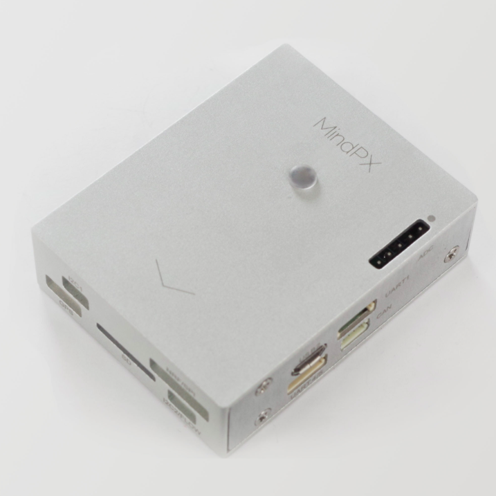
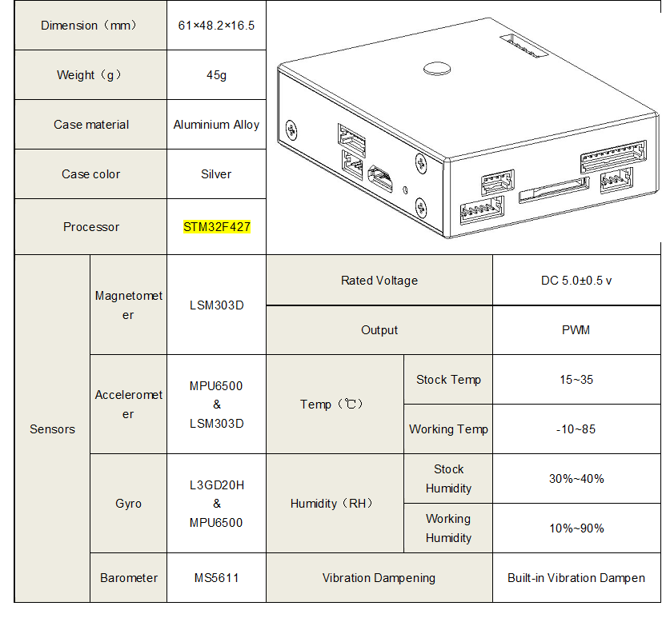
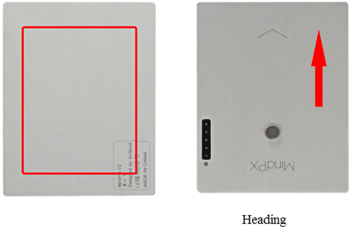
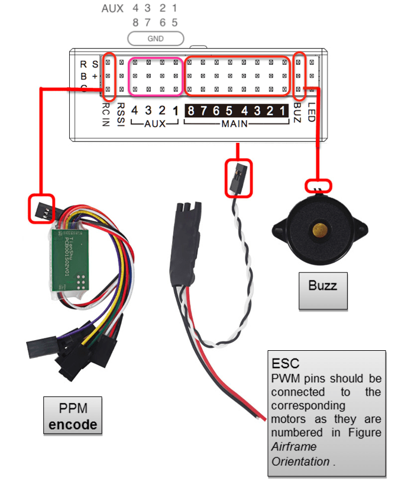
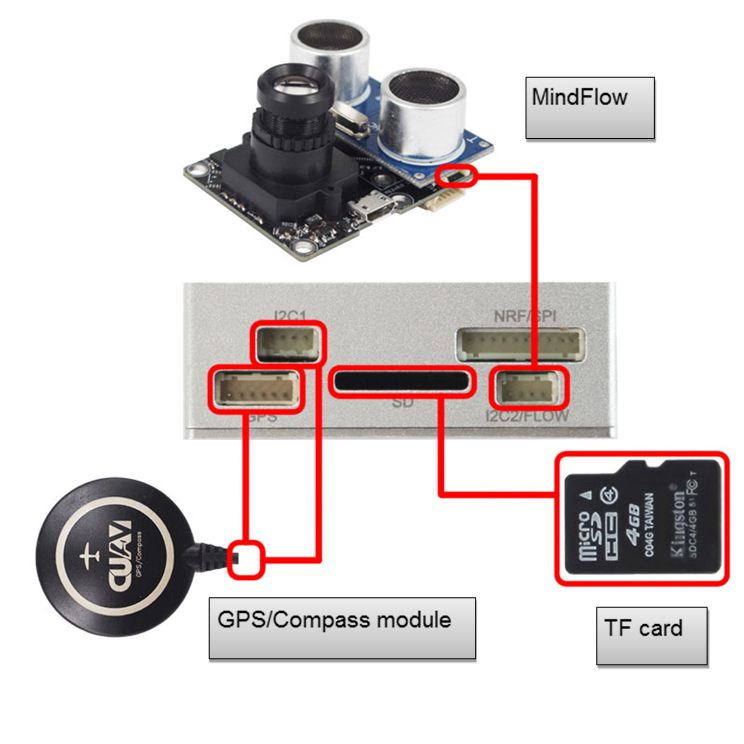
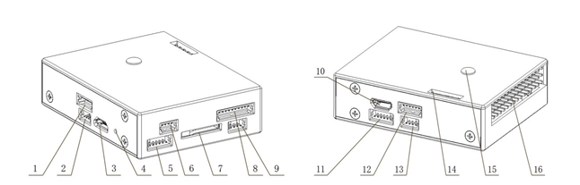

# Апаратне забезпечення MindPX

:::warning PX4 не виробляє цей (чи будь-який інший) автопілот. Зверніться до [виробника](http://mindpx.net) щодо підтримки обладнання або питань сумісності.
:::

Серія AirMind<sup>&reg;</sup> [MindPX](http://mindpx.net) - це нове покоління автопілотів, що відгалужується від Pixhawk<sup>&reg;</sup>.



::: info Ці контролери польоту [підтримуються виробником](../flight_controller/autopilot_manufacturer_supported.md).
:::

## Короткий опис

::: info Основна документація щодо апаратного забезпечення знаходиться [тут](http://mindpx.net/assets/accessories/Specification9.18_3_pdf.pdf).
:::

MindPX - це нова система автопілотів, що створена з Pixhawk<sup>&reg;</sup>, переглянута в схематиці та структурі, і вони були ще більше розширені новими можливостями, щоб безпілотний пристрій був "розумнішим" та простшим у користуванні.

MindPX збільшує загальну кількість каналів виведення PWM до 16 (8 основних виводів + 8 допоміжних виводів). Це означає, що MindPX може підтримувати більш складні конфігурації VTOL і кращий контроль. Це особливо важливо для тих контролерів польоту на основі FMU-V4, оскільки MindPX реалізує основний та додатковий вивід в одному FMU.



- Головний системний чіп: STM32F427

  - Процесор: 32bits, 168 MHz ARM Cortex<sup>&reg;</sup> M4 з FPU
  - RAM: 256 KB SRAM
  - 2MB Flash
  - ST Micro LSM303D 14 бітний акселерометр/магнітометр
  - MEAS MS5611 барометр
  - Інтегровані датчики 6-осевого сенсора InvenSense<sup>&reg;</sup> MPU6500

- Виділені функції:
  - Корпус із обробленого CNC алюмінієвого сплаву, легкий і міцний
  - Вбудована ізольована резервна IMU
  - Загалом 16 каналів виведення PWM (8 основних + 8 додаткових)
  - 1 extra I2C port for flow connection.
  - 1 extra USB port for companion computer connection (built-in UART-to-USB converter)
  - Exposed debug port for development

## Quick Start

### Mounting



### Wiring





### Pin



| Num. |        Description         | Num. |      Description       |
|:----:|:--------------------------:|:----:|:----------------------:|
|  1   |           Power            |  9   |    I2C2 (MindFLow)     |
|  2   | Debug (refresh bootloader) |  10  | USB2 (Serial 2 to USB) |
|  3   |  USB1 (refresh firmware)   |  11  |        UART4,5         |
|  4   |           Reset            |  12  |   UART1 (Telemetry)    |
|  5   |        UART3 (GPS)         |  13  |          CAN           |
|  6   |   I2C1(external compass)   |  14  |          ADC           |
|  7   |        TF card slot        |  15  |     Tricolor Light     |
|  8   |  NRF/SPI(Remote Control)   |  16  |         Looper         |

### Radio Receiver

MindPX supports a wide variety of radio receivers (since V2.6) including: PPM/SBUS/DSM/DSM2/DSMX. MindPX also support FrSky<sup>&reg;</sup> bi-direction telemetry D and S.Port.

For detailed Pin diagram, please refer to the [User Guide](http://mindpx.net/assets/accessories/UserGuide9.18_2_pdf.pdf).

### Building Firmware

:::tip
Most users will not need to build this firmware! It is pre-built and automatically installed by _QGroundControl_ when appropriate hardware is connected.
:::

To [build PX4](../dev_setup/building_px4.md) for this target:

```
make airmind_mindpx-v2_default
```

### Companion PC connection

MindPX has a USB-TO-UART Bridge IC on the board. A micro-USB to USB type A cable is used for the connection. Connect micro-USB end to the 'OBC' port of MindPX and USB type A end to companion computer.

And the max BAUD rate is the same with px4 family, which is up to 921600.

## User Guide

::: info The user guide is [here](http://mindpx.net/assets/accessories/UserGuide9.18_2_pdf.pdf).
:::

## Where to Buy

MindRacer is available at [AirMind Store](http://drupal.xitronet.com/?q=catalog) on internet. You can also find MindRacer at Amazon<sup>&reg;</sup> or eBay<sup>&reg;</sup>.

## Serial Port Mapping

| UART   | Device     | Port          |
| ------ | ---------- | ------------- |
| USART1 | /dev/ttyS0 | RC            |
| USART2 | /dev/ttyS1 | TELEM1        |
| USART3 | /dev/ttyS2 | TELEM2        |
| UART4  | /dev/ttyS3 | GPS1          |
| USART6 | /dev/ttyS4 | ?             |
| UART7  | /dev/ttyS5 | Debug Console |
| UART8  | /dev/ttyS6 | ?             |

<!-- Note: Got ports using https://github.com/PX4/PX4-user_guide/pull/672#issuecomment-598198434 -->

## Support

Please visit http://www.mindpx.org for more information. Or you can send email to [support@mindpx.net](mailto:support@mindpx.net) for any inquiries or help.
