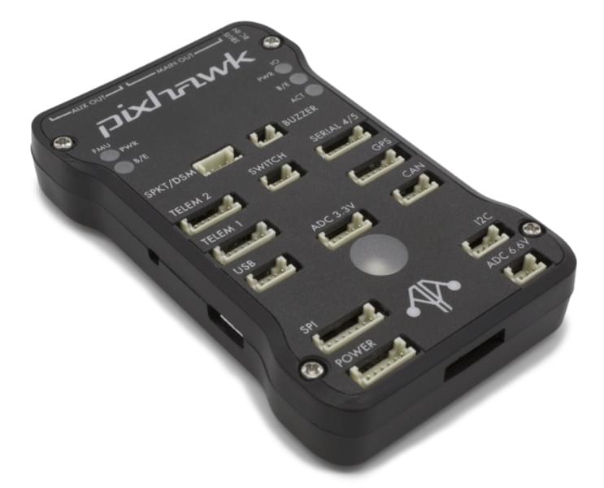

# mRo Pixhawk Flight Controller (Pixhawk 1)

:::warning PX4 не виробляє цей (чи будь-який інший) автопілот. Зверніться до [виробника](https://store.mrobotics.io/) щодо підтримки обладнання або питань сумісності.
:::

_mRo Pixhawk<sup>&reg;</sup>_ є апаратно сумісною версією оригінальної [Pixhawk 1](../flight_controller/pixhawk.md). Він виконує PX4 на ОС [NuttX](https://nuttx.apache.org/).

:::tip
Контролер може бути використаний як заміна для 3DR<sup>&reg;</sup> [Pixhawk 1](../flight_controller/pixhawk.md). Основна різниця полягає в тому, що вона базується на відкритому апаратному проекті [Pixhawk-project](https://pixhawk.org/) **FMUv3**, який виправляє помилку, що обмежувала оригінальний Pixhawk 1 до 1 МБ флеш-пам'яті.
:::



Інструкції зі збирання/налаштування для використання з PX4 наведено тут: [Швидкий старт з підключення Pixhawk](../assembly/quick_start_pixhawk.md)

:::tip
Цей автопілот [підтримується](../flight_controller/autopilot_pixhawk_standard.md) командами підтримки та тестування PX4.
:::

## Основні характеристики

- Мікропроцесор:
  - 32-bit STM32F427 Cortex<sup>&reg;</sup> M4 core з FPU
  - 168 MHz/256 KB RAM/2 MB Flash
  - 32 bit STM32F103 відмовостійкий копроцесор
  - 24 MHz/8 KB RAM/64 KB Flash
- Датчики:
  - ST Micro L3GD20 3-axis 16-бітний гіроскоп
  - ST Micro LSM303D 3-вісний 14-бітний акселерометр / магнітометр
  - Invensense<sup>&reg;</sup> MPU 6000 3-вісний акселерометр/гіроскоп
  - MEAS MS5611 барометр
- Інтерфейси:
  - 5x UART (послідовні порти), один високої потужності, 2x з контролем потоку HW
  - 2x CAN
  - Вхід, сумісний з приймачами Spektrum DSM / DSM2 / DSM-X® Satellite до DX8 (DX9 та вище не підтримуються)
  - Futaba<sup>&reg;</sup> S.BUS сумісний вхід та вихід
  - Сигнал суми PPM
  - Вхід RSSI (PWM або напруга)
  - I2C
  - SPI
  - 3.3 та 6.6V ADC входи
  - Зовнішній порт microUSB
- Система живлення:

  - Ідеальний діодний контролер з автоматичним перемиканням на резервне живлення
  - Сервопривід високої потужності (7 В) і готовий до великого струму
  - Усі периферійні виводи захищені від перевантаження по струму, усі входи захищені від електростатичного розряду

- Вага та розміри:
  - Вага: 38г (1,31 унції)
  - Ширина: 50 мм (1.96")
  - Товщина: 15.5 мм (.613")
  - Довжина: 81.5 мм (3.21")

## Доступність

- [Bare Bones](https://store.mrobotics.io/Genuine-PixHawk-1-Barebones-p/mro-pixhawk1-bb-mr.htm) - просто плата (корисна як заміна 3DR Pixhawk)
- [Набір mRo Pixhawk 2.4.6 Essential!](https://store.mrobotics.io/Genuine-PixHawk-Flight-Controller-p/mro-pixhawk1-minkit-mr.htm) - Все, крім телеметричних радіомодулів
- [mRo Pixhawk 2.4.6 Cool Kit! (Limited edition)](https://store.mrobotics.io/product-p/mro-pixhawk1-fullkit-mr.htm) - включає все необхідне, включаючи телеметричне радіо

## Створення прошивки

:::tip
Більшості користувачів не потрібно створювати цю прошивку! Вона попередньо зібрана й автоматично встановлюється за допомогою _QGroundControl_ при підключенні відповідного апаратного забезпечення.
:::

Щоб [зібрати PX4](../dev_setup/building_px4.md) для цієї цілі:

```
make px4_fmu-v3_default
```

## Відладочні порти

Дивіться [3DR Pixhawk 1 > Порти налагодження](../flight_controller/pixhawk.md#debug-ports)

## Розпіновка

Дивіться [3DR Pixhawk 1 > Pinouts](../flight_controller/pixhawk.md#pinouts)

## Налаштування послідовного порту

| UART   | Девайс     | Порт                     |
| ------ | ---------- | ------------------------ |
| UART1  | /dev/ttyS0 | IO debug                 |
| USART2 | /dev/ttyS1 | TELEM1 (контроль потоку) |
| USART3 | /dev/ttyS2 | TELEM2 (контроль потоку) |
| UART4  |            |                          |
| UART7  | CONSOLE    |                          |
| UART8  | SERIAL4    |                          |

<!-- Note: Got ports using https://github.com/PX4/PX4-user_guide/pull/672#issuecomment-598198434 -->

## Схема

Плата базується на [Pixhawk-project](https://pixhawk.org/) **FMUv3** відкритому апаратному забезпеченні.

- [Схема FMUv3](https://github.com/PX4/Hardware/raw/master/FMUv3_REV_D/Schematic%20Print/Schematic%20Prints.PDF) -- Схема та макет

::: info Як ліцензований Open Hardware дизайн CC-BY-SA 3.0, всі схеми та файли дизайну доступні [тут](https://github.com/PX4/Hardware).
:::
