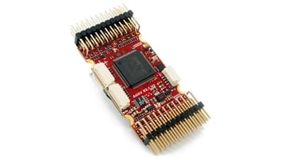
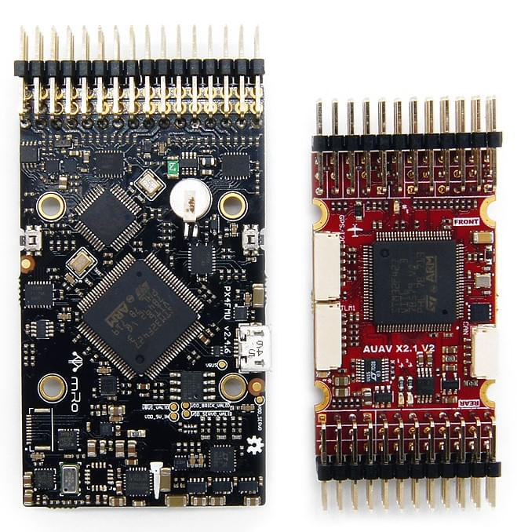
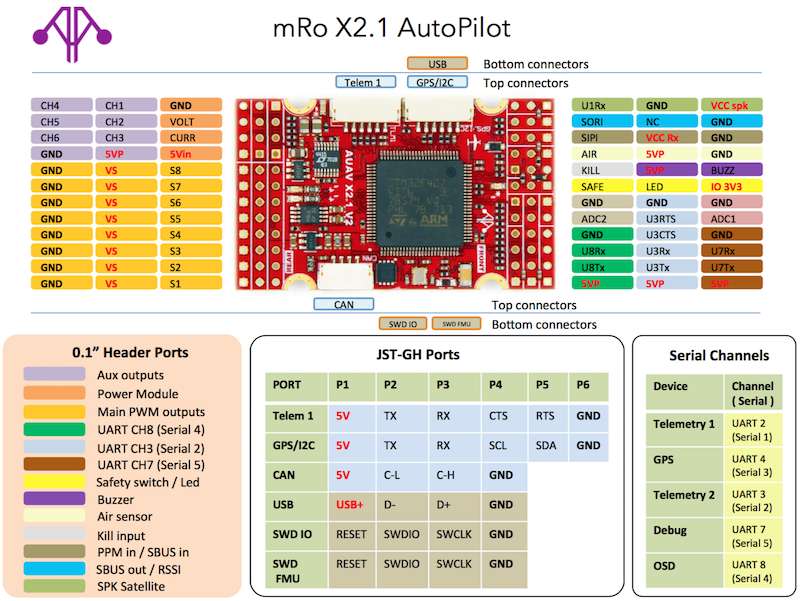

# mRo-X2.1 Autopilot

:::warning PX4 не виробляє цей (чи будь-який інший) автопілот. Зверніться до [виробника](https://store.mrobotics.io/) щодо підтримки обладнання або питань сумісності.
:::

Автопілот [mRo-X2.1](http://www.mRobotics.io/) базується на [Pixhawk<sup>&reg;</sup>-project](https://pixhawk.org/) **FMUv2** відкритому апаратному забезпеченні. Він виконує PX4 на ОС [NuttX](https://nuttx.apache.org/).



::: info Цей контролер польоту [підтримується виробником](../flight_controller/autopilot_manufacturer_supported.md).
:::

## Короткий опис

- Основна System-on-Chip: [STM32F427](http://www.st.com/web/en/catalog/mmc/FM141/SC1169/SS1577/LN1789)
  - CPU: STM32F427VIT6 ARM<sup>&reg;</sup> мікроконтроллер - Revision 3
  - ІО: мікроконтролер STM32F100C8T6 ARM<sup>&reg;</sup>
- Датчики:
  - Invensense<sup>&reg;</sup> MPU9250 9DOF
  - Invensense ICM-20602 6DOF
  - MEAS MS5611 барометр
- Розміри/Вага
  - Розміри: 36мм x 50мм (Можна замовити з вертикальним, горизонтальним або без голівок)
  - Точки кріплення: 30,5 мм х 30,5 мм діаметр 3,2 мм
  - Вага: 10.9г

Діаграма нижче надає порівняльний аналіз з Pixhawk 1. mRo має практично ідентичне апаратне забезпечення й підключення, але має значно менший слід. Основні відмінності - це оновлені датчики та Rev 3 FMU.



## Підключення

- 2.54 мм головки:
- GPS (UART4) з I2C
- CAN шина
- Вхід RC
- PPM вхід
- Spektrum input
- RSSI вхід
- sBus вхід
- sBus вихід
- Вхід живлення
- Buzzer output
- Вихід світлодіода
- 8 x Виводи сервоприводів
- 6 x Aux виходів
- Позабортовий конектор microUSB
- Вимкнути вивід Pin _(Зараз не підтримується програмним забезпеченням)_
- AirSpeed Sensor
- USART2 (Telem 1)
- USART3 (Telem 2)
- UART7 (Console)
- UART8 (OSD)

## Проблема PX4 BootLoader

За замовчуванням mRo X2.1 може бути попередньо налаштований на ArduPilot<sup>&reg;</sup>, а не на PX4. Це можна побачити під час оновлення прошивки, коли плата визнається як FMUv2 замість X2.1.

У цьому випадку вам потрібно оновити BootLoader, використовуючи [BL_Update_X21.zip](https://github.com/PX4/PX4-user_guide/raw/main/assets/hardware/BL_Update_X21.zip). Якщо це виправлення не буде зроблено, ваша пеленга буде відображена неправильно і надмірний інерціальний модуль не буде виявлено.

Основні кроки:

1. Завантажте та розпакуйте [BL_Update_X21.zip](https://github.com/PX4/PX4-user_guide/raw/main/assets/hardware/BL_Update_X21.zip).
2. Знайдіть папку _BL_Update_X21_. Ця папка містить файл **bin** та підпапку з назвою **/etc**, що містить файл **rc.txt**
3. Скопіюйте ці файли на кореневий каталог вашої micro SD-карти та вставте її в mRO x2.1
4. Увімкніть mRO x2.1. Зачекайте, доки він завантажиться, а потім перезавантажте 1 раз.

## Доступність

Цей продукт можна замовити в [магазині mRobotics<sup>&reg;</sup>](https://store.mrobotics.io/mRo-X2-1-Rev-2-p/m10021a.htm).

## Посібник з написання



## Створення прошивки

:::tip
Більшості користувачів не потрібно створювати цю прошивку! Вона попередньо зібрана й автоматично встановлюється _QGroundControl_ при підключенні відповідного апаратного забезпечення.
:::

Щоб [зібрати PX4](../dev_setup/building_px4.md) для цієї цілі:

```
make mro_x21_default
```

## Схема

Плата задокументована на апаратному репозиторії mRo: [x21_V2_schematic.pdf](https://github.com/mRoboticsIO/Hardware/blob/master/X2.1/Docs/x21_V2_schematic.pdf).

## Зіставлення послідовних портів

| UART   | Девайс     | Порт            |
| ------ | ---------- | --------------- |
| USART1 | /dev/ttyS0 | IO debug        |
| USART2 | /dev/ttyS1 | SERIAL1         |
| USART3 | /dev/ttyS2 | TELEM2          |
| UART4  | /dev/ttyS3 | GPS/I2C         |
| USART6 | /dev/ttyS4 | PX4IO           |
| UART7  | /dev/ttyS5 | SERIAL5 CONSOLE |
| UART8  | /dev/ttyS6 | SERIAL4         |

<!-- Note: Got ports using https://github.com/PX4/PX4-user_guide/pull/672#issuecomment-598198434 -->
