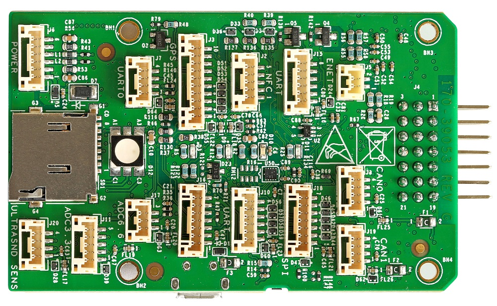
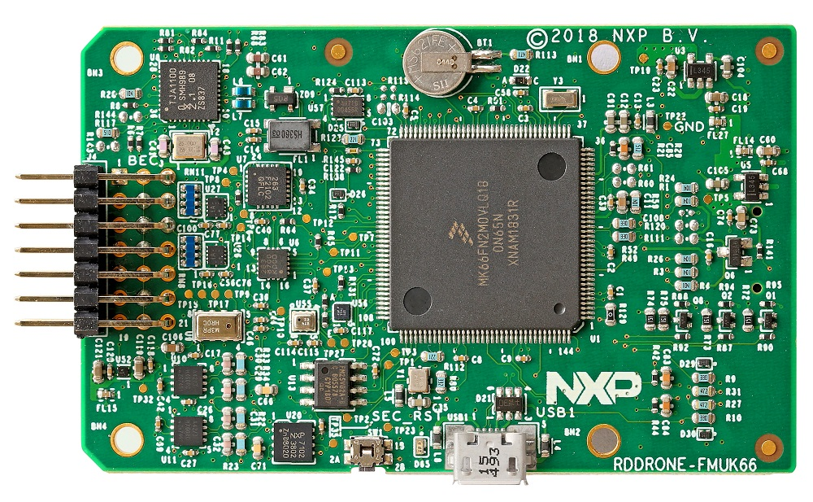
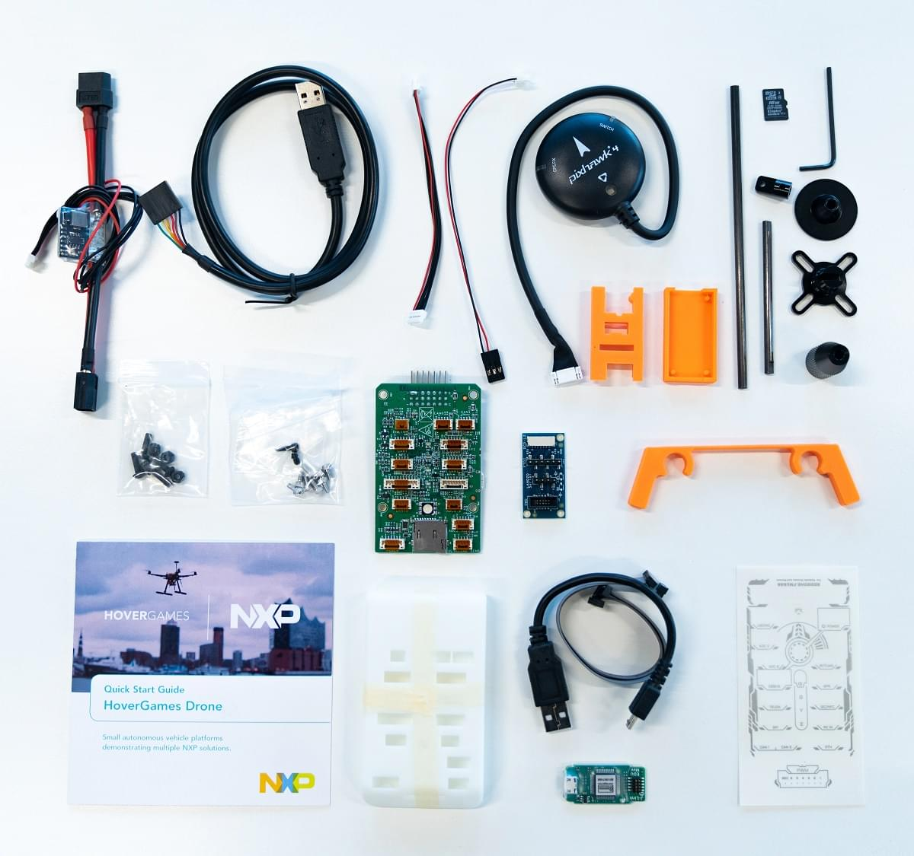
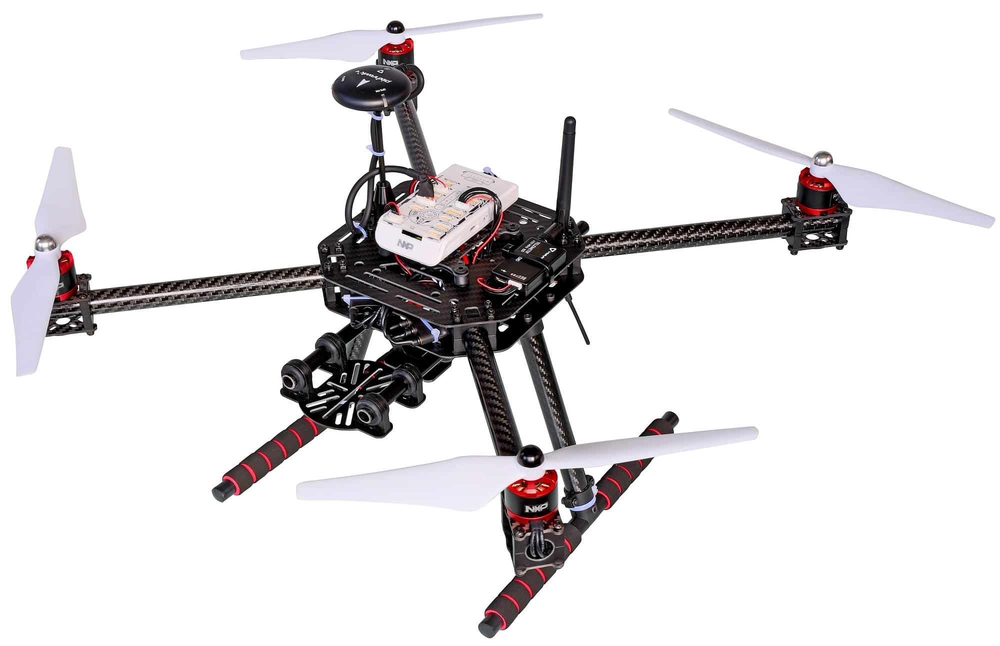

# NXP RDDRONE-FMUK66 FMU

:::warning PX4 не виробляє цей (чи будь-який інший) автопілот. Зверніться до [виробника](https://www.nxp.com/) щодо підтримки апаратного забезпечення чи питань відповідності вимогам.
:::

RDDRONE-FMUK66 FMU - це еталонний дизайн, який використовує компоненти NXP Semiconductor із тісною відповідністю специфікаціям Pixhawk FMUv4, додавши двохжильний автомобільний Ethernet 100BASET1 та безпечний елемент A71CH (RevC) або SE050 (RevD). NXP надає схеми, гербери, BOM та вихідні файли, щоб будь-хто міг відтворити, змінити або використати цей дизайн для інших цілей.

Це офіційний FMU для використання з [HoverGames](https://www.hovergames.com/).





NXP FMU та включені периферійні пристрої були протестовані на відповідність директивам FCC/CE/RoHs/REACH.

::: info Ці контролери польоту [підтримуються виробником](../flight_controller/autopilot_manufacturer_supported.md).
:::

## Короткий опис

- **Головний FMU процесор:**
  - Мікроконтролер Kinetis K66 MK66FN2MOVLQ18 працює на частоті 180 МГц Cortex-M4F MCU, 2 МБ флеш-пам'яті, 256 КБ SRAM, два USB (FS + HS), Ethernet, 144-LQFP.
- **Бортові сенсори:**
  - Акселерометр/гіроскоп: BMI088/ICM42688 (RevD)...
  - Акселерометр/Магнітометр: FXOS8700CQ
  - Гіроскоп: FXAS21002CQ
  - Magnetometer: BMM150
  - Барометр: ML3115A2
  - Барометр: BMP280
- **GPS:**
  - u-blox Neo-M8N GPS/GLONASS приймач; інтегрований магнетометр IST8310

Цей FMU надається лише у вигляді комплекту, і включає [Segger Jlink EDU mini debugger](https://www.segger.com/products/debug-probes/j-link/models/j-link-edu-mini/), адаптер дебагера DCD-LZ, консольний кабель USB-TTL-3V3, модуль GPS від HolyBro, модуль живлення від батареї, SDCard та корпус, гвинти та наклейки. Телеметричні радіо ([HGD-TELEM433](https://www.nxp.com/part/HGD-TELEM433) та [HGD-TELEM915](https://www.nxp.com/part/HGD-TELEM915)) повинні бути куплені окремо, щоб відповідати частотам ISM-діапазону, які використовуються в вашій країні.



Також доступна "Lite" версія RDDRONE-FMUK66L, яка не включає модуль живлення, GPS, Jlink або кабель консольного з'єднання USB-TTL-3V3, або SDCard.[Прокрутіть вниз, щоб побачити FMUK66L у розділі покупок сторінки покупки FMUK66](https://www.nxp.com/design/designs/px4-robotic-drone-fmu-rddrone-fmuk66:RDDRONE-FMUK66#buy)

Додаткову інформацію можна знайти у [Технічному описі](https://www.nxp.com/design/designs/px4-robotic-drone-fmu-rddrone-fmuk66:RDDRONE-FMUK66). <!-- www.nxp.com/rddrone-fmuk66 -->

## Де купити

Спеціальний набір для посилань **RDDRONE-FMUK66** можна придбати безпосередньо у компанії NXP або у будь-якої з офіційної всесвітньої дистриб'юторської мережі [електронних компонентів](https://www.nxp.com/support/sample-and-buy/distributor-network:DISTRIBUTORS).

- [Посилання на покупку](https://www.nxp.com/design/designs/px4-robotic-drone-fmu-rddrone-fmuk66:RDDRONE-FMUK66#buy) (www.nxp.com)
- Телеметричні радіопередавачі придбаються окремо в залежності від частотного діапазону:
  - [HGD-TELEM433](https://www.nxp.com/part/HGD-TELEM433)
  - [HGD-TELEM915](https://www.nxp.com/part/HGD-TELEM915)

::: info _RDDRONE-FMUK66_ FMU також включений в повний комплект безпілотних літальних апаратів HoverGames: [KIT-HGDRONEK66](https://www.nxp.com/applications/solutions/industrial/aerospace-and-mobile-robotics/uavs-drones-and-rovers/nxp-hovergames-drone-kit-including-rddrone-fmuk66-and-peripherals:KIT-HGDRONEK66#buy)
:::

<!--
## Connectors

[Connector Diagram]

## Pinouts

[Pinouts listing or link]

## Dimensions

[Dimensions]

-->

## Збірка / встановлення

https://nxp.gitbook.io/hovergames

## Збірка прошивки

:::tip
Більшості користувачів не потрібно збирати цю прошивку! Вона попередньо зібрана й автоматично встановлюється _QGroundControl_ при підключенні відповідного апаратного забезпечення.
:::

Щоб [зібрати PX4](../dev_setup/building_px4.md) для цього контролера:

```
make nxp_fmuk66-v3_default
```

## Відладочний порт

[Системна консоль PX4](../debug/system_console.md) та [інтерфейс SWD](../debug/swd_debug.md) працюють на порту [DCD-LZ FMU Debug](https://nxp.gitbook.io/hovergames/rddrone-fmuk66/connectors/debug-interface-dcd-lz).

DCD-LZ компанії NXP є роз'ємом JST-GH з 7 контактами та додає контакт nRST/MCU_RESET до [стендартного роз'єму відлагодження Pixhawk 6-Pin](https://github.com/pixhawk/Pixhawk-Standards/blob/master/DS-009%20Pixhawk%20Connector%20Standard.pdf).

Адаптер DCD-LZ дозволяє використовувати стандартний інтерфейс JTAG/SWD з 10 контактами (тобто за допомогою Segger Jlink) та стандартний кабель типу FTDI USB-TTL-3V3 з 5 контактами.

<!--

## Peripherals

* [List of anything people should use with this hardware]

-->

## Підтримувані платформи / Конструкції

Будь-який мультикоптер / літак / наземна платформа чи човен, який може керуватися звичайними RC сервоприводами або сервоприводами Futaba S-Bus. Повний перелік підтримуваних конфігурацій можна переглянути в розділі [Довідник планерів](../airframes/airframe_reference.md).



:::tip NXP
[HoverGames Drone Kit](https://www.nxp.com/kit-hgdronek66) (показаний вище) є повним набором для розробки дронів, який включає все необхідне для побудови квадрокоптера. Вам потрібно лише поставити акумулятор LiPo 3S/4S.
:::

## Додаткова інформація

- [Онлайн документація HoverGames](https://nxp.gitbook.io/hovergames) Керівництво користувача та програмування PX4, конкретна збірка, конструкція, відлагодження, інструкції з програмування.

- 3DМоделі, що підтримують HoverGames та RDDRONE-FMUK66, можна знайти на _Thingiverse_ за цими посиланнями для пошуку: [fmuk66](https://www.thingiverse.com/search?q=fmuk66&type=things&sort=relevant), [hovergames](https://www.thingiverse.com/search?q=hovergames&type=things&sort=relevant).


