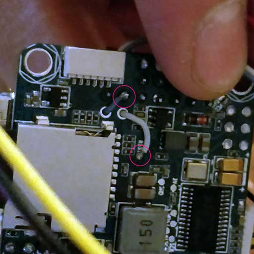

# Omnibus F4 SD

:::warning
Цей політний контролер був [знятий з виробництва](../flight_controller/autopilot_experimental.md) і більше не продається комерційно.
:::

:::warning
PX4 не виробляє цей (чи будь-який інший) автопілот.
Звертайтесь до виробника з питань щодо підтримки або відповідності.
:::

_Omnibus F4 SD_ - це плата контролера, розроблена для гонщиків. На відміну від звичайної гоночної дошки, вона має деякі додаткові функції, такі як SD-карта та швидший процесор.


Ось основні відмінності в порівнянні з [Pixracer](../flight_controller/pixracer.md):

- Нижча ціна
- Менше портів вводу/виводу (хоча все ще можна підключити GPS або датчик потоку, наприклад)
- Для зовнішнього GPS потрібен зовнішній підтягувальний резистор на шині I2C, див. [I2C](#i2c) нижче.
- Менше ОЗП (192 КБ проти 256 КБ) та FLASH (1 МБ проти 2 МБ)
- Ті ж розміри плати, що й у _Pixracer_, але трохи менший форм-фактор (тому що в неї менше роз'ємів)
- Інтегрований OSD (ще не реалізований у програмному забезпеченні)

:::tip
Усі звичайні функції PX4 все ще можна використовувати для вашого гонщика!
:::

::: info Цей польотний контролер [підтримується виробником](../flight_controller/autopilot_manufacturer_supported.md).
:::

## Основні характеристики

- Основний System-on-Chip: [STM32F405RGT6](https://www.st.com/en/microcontrollers/stm32f405rg.html)
  - CPU: 168 МГц ARM Cortex M4 з одноточним FPU
  - RAM: 192 KB SRAM
  - FLASH: 1 МБ
- Стандартний гоночний форм-фактор: 36x36 мм зі стандартним розміром отворів 30,5 мм
- MPU6000 Акселератор / Гіроскоп
- BMP280 Baro (встановлений не на всі плати)
- microSD (логування)
- Futaba S.BUS і S.BUS2 / Spektrum DSM2 і DSMX / Graupner SUMD / PPM input / Yuneec ST24
- OneShot PWM (налаштовується)
- Вбудований датчик струму
- Вбудований чіп OSD (AB7456 через SPI)

## Де придбати

Дошка виробляється різними вендорами, з деякими варіаціями (наприклад, з барометром або без нього).

:::tip PX4 сумісний з платами, які підтримують таргет Betaflight OMNIBUSF4SD (якщо на сторінці продукту вказано _OMNIBUSF4SD_, то плата повинна працювати з PX4).
:::

:::tip
Будь-яка похідна з міткою Omnibus F4 (наприклад, клон) також повинна працювати. Однак розподіл живлення на цих платах має різну якість.
:::

Ось дошки, які були протестовані і відомо, що працюють:

- [Hobbywing XRotor Flight Controller F4](https://www.hobbywing.com/en/products/info.html?id=164)

  ::: info Ця плата встановлюється на [Hobbywing XRotor Micro 40A 4in1 ESC](https://www.hobbywing.com/en/products/info.html?id=116) без пайки. Ця плата ESC також забезпечує живлення для плати Omnibus.
:::

  Купуйте у:

  - [Hobbywing XRotor F4 Flight Controller w/OSD](https://www.getfpv.com/hobbywing-xrotor-f4-flight-controller-w-osd.html) (getfpv)

- Original Airbot Omnibus F4 SD

  Купуйте у:

  - [Airbot (китайський виробник)](https://store.myairbot.com/omnibusf4prov3.html)
  - [Ready To Fly Quads (США реселлер)](https://quadsrtf.com/product/flip-32-f4-omnibus-rev-2/)

Аксесуари в комплекті:

- [ESP8266 WiFi модуль](../telemetry/esp8266_wifi_module.md) для телеметрії MAVLink. Потрібно підключити ці контакти: GND, RX, TX, VCC та CH-PD (CH-PD до 3,3В). Швидкість передачі даних становить 921600.

## Конектори

Плати від різних виробників (на основі цього дизайну) можуть мати дуже різні макети. Макети / Silkscreen-и для різних версій показані нижче.

### Airbot Omnibus F4 SD

Нижче подані silkscreen-и для Airbot Omnibus F4 SD (V1), що показують як верхню, так і нижню частину.

 

### Hobbywing XRotor Flight Controller F4

Нижче наведені silkscreen-и для Hobbywing XRotor Flight Controller F4.


## Розпіновка

### Радіоуправління

RC підключений до одного з наступних портів:

- UART1
- Порт SBUS/PPM (через інвертор, йде до UART1)

::: info
Деякі плати Omnibus F4 мають перемикач, який з'єднує MCU SBUS та PPM з одним роз'ємом для контактів. Встановіть ваш перемикач або припойте перемичку до відповідного контакту MCU перед використанням.
:::

### UARTs

- UART6: Порт GPS

  - TX: MCU pin PC6
  - RX: MCU pin PC7

  - Airbot Omnibus F4 SD знаходиться на порту J10 (TX6/RX6):

  

- UART4

  - TX: MCU pin PA0
  - RX: MCU pin PA1
  - 57600 baud
  - Це може бути налаштовано як порт `TELEM 2`.
  - Airbot Omnibus F4 SD Pinout:
    - TX: RSSI pin
    - RX: PWM out 5

  

  

### I2C

Є один доступний порт I2C через:

- SCL: Пін MCU PB10 (може мати мітку TX3)
- SDA: пін MCU PB11 (може мати напис RX3)

::: info
Вам знадобляться зовнішні підтяжки на обох сигналах (годинник та дані).
Ви можете використовувати 2,2 тис. підтяжок, наприклад, щоб прикріпити зовнішню магнітолу.
:::

- Airbot Omnibus F4 SD знаходиться на порту J10 (SCL [clock] / SCA [data]): 

Ось приклад імплементації. Я використовував штекер Spektrum, щоб отримати 3,3 В від порту DSM, підключаючи лише 3,3 В + до кожної лінії через резистор 2,2к.


## Зіставлення послідовних портів

| UART   | Пристрій   | Порт     |
| ------ | ---------- | -------- |
| USART1 | /dev/ttyS0 | SerialRX |
| USART4 | /dev/ttyS1 | TELEM1   |
| USART6 | /dev/ttyS2 | GPS      |

<!-- Note: Got ports using https://github.com/PX4/PX4-user_guide/pull/672#issuecomment-598198434 -->

## RC Телеметрія

Omnibus підтримує телеметрію до передавача RC за допомогою [FrSky Telemetry](../peripherals/frsky_telemetry.md) або [CRSF Crossfire Telemetry](#crsf_telemetry).

<a id="crsf_telemetry"></a>

### Телеметрія CRSF (TBS Crossfire Telemetry)

[TBS CRSF Telemetry](../telemetry/crsf_telemetry.md) може бути використана для передачі телеметричних даних з контролера польоту (положення літака, батареї, режим польоту та GPS-дані) на дистанційну радіостанцію, таку як Taranis.

Переваги порівняно з телеметрією [FrSky](../peripherals/frsky_telemetry.md), включають:

- Лише один UART потрібен для RC та телеметрії.
- Протокол CRSF оптимізований для низької затримки.
- 150 Гц частота оновлення RC.
- Сигнали неінвертовані, тому не потрібна (зовнішня) логіка інвертора.

::: info
Якщо ви використовуєте CRSF Telemetry, вам знадобиться створити власну прошивку PX4.
На відміну від цього, телеметрія FrSky може використовувати завчасно побудоване програмне забезпечення.
:::

Для Omnibus ми рекомендуємо [TBS Crossfire Nano RX](http://team-blacksheep.com/products/prod:crossfire_nano_rx), оскільки він спеціально розроблений для малих квадрокоптерів.

На ручному пульті керування (наприклад, Taranis) вам також знадобиться [модуль передавача](http://team-blacksheep.com/shop/cat:rc_transmitters#product_listing). Це можна підключити ззаду до пульта радіо керування.

::: info
Зазначені посилання вище містять документацію для модулів TX/RX.
:::

#### Встановлення

Підключіть контакти Nano RX та Omnibus, як показано:

| Omnibus UART1 | Nano RX |
| ------------- | ------- |
| TX            | Ch2     |
| RX            | Ch1     |

Наступне оновіть модулі TX/RX для використання протоколу CRSF та налаштуйте телеметрію. Інструкції з цього наведені в [Посібнику TBS Crossfire](https://www.team-blacksheep.com/tbs-crossfire-manual.pdf) (шукайте 'Налаштування радіо для CRSF').

#### Налаштування CRSF PX4

Вам потрібно буде створити власну прошивку, щоб використовувати CRSF. Для отримання додаткової інформації див. [CRSF Telemetry](../telemetry/crsf_telemetry.md#px4-configuration).

## Схема

Схеми надає [Airbot](https://myairbot.com/): [OmnibusF4-Pro-Sch.pdf](http://bit.ly/obf4pro).

<a id="bootloader"></a>

## Оновлення завантажувача PX4

Плата поставляється із заздалегідь встановленою [Betaflight](https://github.com/betaflight/betaflight/wiki). Перед встановленням прошивки PX4 необхідно прошити _заванажувач PX4_. Завантажте завантажувальний бінарний файл [omnibusf4sd_bl.hex](https://github.com/PX4/PX4-user_guide/raw/v1.15/assets/flight_controller/omnibus_f4_sd/omnibusf4sd_bl_d52b70cb39.hex) та прочитайте [цю сторінку](../advanced_config/bootloader_update_from_betaflight.md) для інструкцій з прошивки.

## Створення прошивки

Щоб [зібрати PX4](../dev_setup/building_px4.md) для цієї цілі:

```
make omnibus_f4sd_default
```

## Встановлення прошивки PX4

Ви можете використовувати або готове вбудоване програмне забезпечення, або власне користувацьке програмне забезпечення.

:::warning

Якщо ви використовуєте [CRSF Telemetry](../telemetry/crsf_telemetry.md#px4-configuration) у вашій радіосистемі, як описано вище, то вам потрібно використовувати власну прошивку.
:::

Прошивку можна встановити будь-якими звичайними способами:

- Джерело для збірки та завантаження

  ```
  make omnibus_f4sd_default upload
  ```

- [Завантажте прошивку](../config/firmware.md) за допомогою _QGroundControl_.

## Налаштування

Крім [основних налаштувань](../config/index.md), важливі наступні параметри:

| Параметр                                                                 | Налаштування                                                                                                                  |
| ------------------------------------------------------------------------ | ----------------------------------------------------------------------------------------------------------------------------- |
| [SYS_HAS_MAG](../advanced_config/parameter_reference.md#SYS_HAS_MAG)   | Це має бути вимкнено, оскільки у платі немає внутрішнього магніту. Ви можете активувати це, якщо приєднаєте зовнішній магніт. |
| [SYS_HAS_BARO](../advanced_config/parameter_reference.md#SYS_HAS_BARO) | Вимкніть це, якщо ваша плата не має барометра.                                                                                |

## Додаткова інформація

[Ця сторінка](https://blog.dronetrest.com/omnibus-f4-flight-controller-guide/) надає хороший огляд з контактами та інструкціями щодо налаштування.
