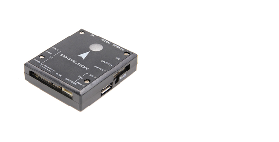

# Контролер польоту Pixfalcon (знятий з виробництва)

<Badge type="error" text="Discontinued" />

:::warning
Цей політний контролер був [знятий з виробництва](../flight_controller/autopilot_experimental.md) і більше не продається комерційно.
:::

:::warning PX4 не виробляє цей (або будь-який) автопілот. Зверніться до [виробника](https://holybro.com/) щодо підтримки апаратного забезпечення чи питань відповідності вимогам.
:::

Автопілот Pixfalcon (розроблений [Holybro<sup>&reg;</sup>](https://holybro.com/)) є бінарно сумісним (FMUv2) похідним від [Pixhawk 1](../flight_controller/pixhawk.md), оптимізованим для застосування в умовах обмеженого простору, наприклад, для FPV-гонщиків. Він має менше входів-виходів, що дозволяє зменшити розмір.



## Швидкий резюме

- Основна System-on-Chip: [STM32F427](http://www.st.com/web/en/catalog/mmc/FM141/SC1169/SS1577/LN1789)
  - CPU: 180 MHz ARM<sup>&reg;</sup> Cortex<sup>&reg;</sup> M4 з одинарною точністю FPU
  - RAM: 256 KB SRAM (L1)
- Failsafe System-on-Chip: STM32F100
  - CPU: 24 MHz ARM Cortex M3
  - RAM: 8 KB SRAM
- GPS: u-blox<sup>&reg;</sup> M8 (в комплекті)

### Підключення

- 1x I2C
- 2x UART (один для телеметрії / OSD, без контролю потоку)
- 8x ШІМ з ручним управлінням
- S.BUS / PPM вхід

## Наявність:

Від дистриб'ютора [Hobbyking<sup>&reg;</sup>](https://hobbyking.com/en_us/pixfalcon-micro-px4-autopilot-plus-micro-m8n-gps-and-mega-pbd-power-module.html)

Опціональне обладнання:

- Оптичний потік: PX4 Flow unit від виробника [Holybro](https://holybro.com/products/px4flow)
- Digital Airspeed sensor від виробника [Holybro](https://holybro.com/products/digital-air-speed-sensor) або дистриб'ютора [Hobbyking](https://hobbyking.com/en_us/hkpilot-32-digital-air-speed-sensor-and-pitot-tube-set.html)
- Екранний дисплей з вбудованою телеметрією:
  - [Hobbyking OSD + EU Telemetry (433 МГц)](https://hobbyking.com/en_us/micro-hkpilot-telemetry-radio-module-with-on-screen-display-osd-unit-433mhz.html)
- Pure Telemetry опції:
  - [Hobbyking Wifi Telemetry](https://hobbyking.com/en_us/apm-pixhawk-wireless-wifi-radio-module.html)
  - [SIK Radios](../telemetry/sik_radio.md)

## Збірка прошивки

:::tip
Більшості користувачів не потрібно збирати цю прошивку! Вона попередньо зібрана і автоматично встановлюється за допомогою _QGroundControl_ при підключенні відповідного обладнання.
:::

Щоб [зібрати PX4](../dev_setup/building_px4.md) для цього контролера:

```
make px4_fmu-v2_default
```

## Відладочний порт

Ця плата не має відладочного порту (тобто не має порту для доступу до [System Console](../debug/system_console.md) або [SWD інтерфейсу](../debug/swd_debug.md) (JTAG).

Розробникам потрібно буде припаяти дроти до тестових майданчиків плати для SWD, а також до STM32F4 (IC) TX і RX, щоб отримати консоль.

## Зіставлення послідовних портів

| UART   | Девайс     | Порт                         |
| ------ | ---------- | ---------------------------- |
| UART1  | /dev/ttyS0 | IO Debug                     |
| USART2 | /dev/ttyS1 | TELEM1 (без контролю потоку) |
| UART4  | /dev/ttyS2 | GPS                          |

<!-- Note: Got ports using https://github.com/PX4/PX4-user_guide/pull/672#issuecomment-598198434 -->
