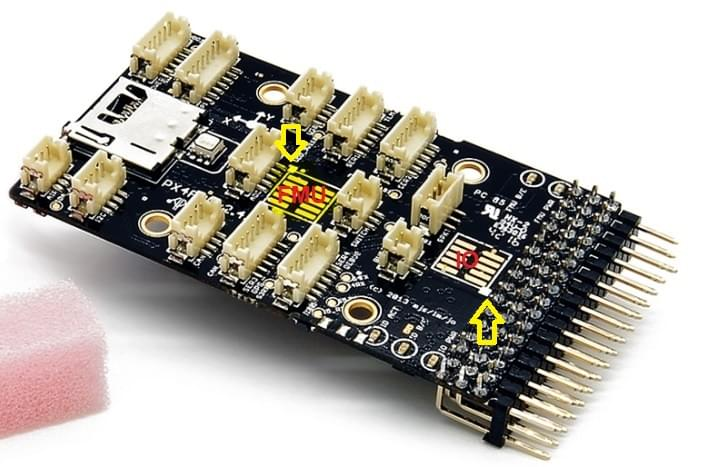

# 3DR Pixhawk 1 Flight Controller (знято з виробництва)

:::warning
Цей політний контролер був [знятий з виробництва](../flight_controller/autopilot_experimental.md) і більше не продається комерційно. Ви можете використовувати [mRo Pixhawk](../flight_controller/mro_pixhawk.md) як заміну.
:::

:::warning
PX4 не виробляє цей (або будь-який) автопілот.
Звертайтесь до виробника з питань щодо підтримки або відповідності.
:::

Автопілот _3DR Pixhawk<sup>&reg;</sup> 1_ є популярним універсальним політним контролером на основі відкритого апаратного дизайну [Pixhawk-project](https://pixhawk.org/) **FMUv2** (він поєднує функціональність PX4FMU + PX4IO). Він виконує PX4 на ОС [NuttX](https://nuttx.apache.org/).


Інструкції зі збирання/налаштування для використання з PX4 наведено тут: [Швидкий старт з підключення Pixhawk](../assembly/quick_start_pixhawk.md)

## Основні характеристики

- Основна System-on-Chip: [STM32F427](http://www.st.com/web/en/catalog/mmc/FM141/SC1169/SS1577/LN1789)
  - CPU: 180 MHz ARM<sup>&reg;</sup> Cortex<sup>&reg;</sup> M4 з одинарною точністю FPU
  - RAM: 256 KB SRAM (L1)
- Failsafe System-on-Chip: STM32F100
  - CPU: 24 MHz ARM Cortex M3
  - RAM: 8 KB SRAM
- Wifi: ESP8266 зовнішній
- GPS: u-blox<sup>&reg;</sup> 7/8 (Hobbyking<sup>&reg;</sup>) / u-blox 6 (3D Robotics)
- Оптичний потік: [PX4 Flow unit](../sensor/px4flow.md)
- Резервні входи живлення та автоматичне перемикання на резервне джерело
- Зовнішній запобіжний вимикач
- Головний візуальний індикатор - мультиколірний світлодіод
- Потужний мультитональний п'єзозвуковий індикатор
- microSD карта для високошвидкісного логування даних протягом тривалого періоду

Підключення

- 1x I2C
- 1x CAN (2x опційно)
- 1x ADC
- 4x UART (2x з контролем потоку)
- 1x Консоль
- 8x PWM з ручним перевизначенням
- 6x PWM / GPIO / PWM вхід
- S.BUS / PPM / Spektrum вхід
- S.BUS вивід

# Де придбати

Ця плата, що оригінально вироблялася компанією 3DR&reg;, була стандартною платформою мікроконтролера для PX4&reg;. Так, як плата більше не виробляється 3DR, ви можете використовувати [mRo Pixhawk](../flight_controller/mro_pixhawk.md) як заміну.

Замовте mRo Pixhawk з:

- [Bare Bones](https://store.mrobotics.io/Genuine-PixHawk-1-Barebones-p/mro-pixhawk1-bb-mr.htm) - просто плата (корисна як заміна 3DR Pixhawk)
- [mRo Pixhawk 2.4.6 Essential Kit](https://store.mrobotics.io/Genuine-PixHawk-Flight-Controller-p/mro-pixhawk1-minkit-mr.htm) - включає все, крім телеметрії радіо
- [mRo Pixhawk 2.4.6 Cool Kit! (Limited edition)](https://store.mrobotics.io/product-p/mro-pixhawk1-fullkit-mr.htm) - включає все необхідне, включаючи телеметрію радіо

## Характеристики

### Процесор

- 32bit STM32F427 [Cortex-M4F](http://en.wikipedia.org/wiki/ARM_Cortex-M#Cortex-M4) ядро з FPU
- 168 MHz
- 256 KB RAM
- 2 MB Flash
- 32 bit STM32F103 відмовостійкий копроцесор

### Датчики

- ST Micro L3GD20H 16 bit гіроскоп
- ST Micro LSM303D 14 bit акселерометр / магнітометр
- Invensense MPU 6000 3-вісний акселерометр/гіроскоп
- MEAS MS5611 барометр

### Інтерфейси

- 5x UART (послідовні порти), один високої потужності, 2x з HW контролем потоку
- 2x CAN (один з внутрішнім 3.3V трансивером, один на конекторі розширення)
- Spektrum DSM / DSM2 / DSM-X® Satellite сумісний вхід
- Futaba S.BUS® сумісний вхід і вивід
- PPM sum signal вхід
- RSSI (PWM чи voltage) вхід
- I2C
- SPI
- 3.3 та 6.6V ADC входи
- Внутрішній порт microUSB і розширення зовнішнього порту microUSB

<lite-youtube videoid="gCCC5A-Bvv4" title="PX4 Pixhawk (3DR) Multicolor Led in action"/>

### Система живлення та захист

- Ідеальний діодний контролер з автоматичним перемиканням
- Сервопривід високої потужності (max. 10V) і сильного струму (10A+)
- Усі периферійні виводи захищені від перевантаження по струму, усі входи захищені від електростатичного розряду

## Номінальна напруга

Pixhawk може мати потрійну резервність у джерелі живлення, якщо подаються три джерела живлення. Три шини: вхід модуля живлення, вхід сервоприводу, вхід USB.

### Максимальна напруга нормальної роботи

За таких умов всі джерела живлення будуть використовуватися в цьому порядку для живлення системи

- Вхід модуля живлення (4.8V to 5.4V)
- Вхід сервоприводу (4.8V to 5.4V) **ДО 10V ДЛЯ РУЧНОГО ПЕРЕКЛЮЧЕННЯ, АЛЕ АВТОПІЛОТ БУДЕ ЗНЕЖИВЛЕНИЙ ВИЩЕ 5.7V, ЯКЩО ВХІД МОДУЛЯ ЖИВЛЕННЯ НЕ ПРИСУТНІЙ**
- Вхід живлення USB (4.8V до 5.4V)

### Абсолютна максимальна напруга

За таких умов система не буде витрачати жодної потужності (не буде працювати), але залишиться неушкодженою.

- Вхід модуля живлення (4.1V до 5.7V, 0V до 20V неушкоджений)
- Вхід сервоприводу (4.1V до 5.7V, 0V до 20V)
- Вхід живлення USB (4.1V до 5.7V, 0V до 6V)

## Схеми

[Схема FMUv2 + IOv2](https://raw.githubusercontent.com/PX4/Hardware/master/FMUv2/PX4FMUv2.4.5.pdf) -- Схема та макет

::: info Як дизайн Open Hardware з ліцензією CC-BY-SA 3.0, всі схеми та файли дизайну доступні [тут](https://github.com/PX4/Hardware).
:::

## З'єднання

Порти Pixhawk показані нижче. Вони використовують роз’єми Hirose DF13 (передують роз’ємам JST-GH, визначеним у стандарті роз’ємів Pixhawk).

:::warning
Багато клонів 3DR Pixhawk використовують роз’єми Molex picoblade замість роз’ємів DF13.
Вони мають прямокутні штифти замість квадратних, і їх не можна вважати сумісними.
:::


:::tip
Порт `RC IN` призначений лише для RC приймачів і забезпечує достатню потужність для цієї мети. **НІКОЛИ** не підключайте до нього або до підключеного приймача жодних сервоприводів, джерел живлення або батарей.
:::

## Схема розташування виводів

#### TELEM1, TELEM2 порти

| Pin     | Сигнал    | Вольт |
| ------- | --------- | ----- |
| 1 (red) | VCC       | +5V   |
| 2 (blk) | TX (OUT)  | +3.3V |
| 3 (blk) | RX (IN)   | +3.3V |
| 4 (blk) | CTS (IN)  | +3.3V |
| 5 (blk) | RTS (OUT) | +3.3V |
| 6 (blk) | GND       | GND   |

#### GPS port

| Pin     | Сигнал   | Вольт |
| ------- | -------- | ----- |
| 1 (red) | VCC      | +5V   |
| 2 (blk) | TX (OUT) | +3.3V |
| 3 (blk) | RX (IN)  | +3.3V |
| 4 (blk) | CAN2 TX  | +3.3V |
| 5 (blk) | CAN2 RX  | +3.3V |
| 6 (blk) | GND      | GND   |

#### SERIAL 4/5 port

У зв'язку з обмеженням простору два порти знаходяться на одному роз'ємі.

| Pin     | Сигнал  | Вольт |
| ------- | ------- | ----- |
| 1 (red) | VCC     | +5V   |
| 2 (blk) | TX (#4) | +3.3V |
| 3 (blk) | RX (#4) | +3.3V |
| 4 (blk) | TX (#5) | +3.3V |
| 5 (blk) | RX (#5) | +3.3V |
| 6 (blk) | GND     | GND   |

#### ADC 6.6V

| Pin     | Сигнал | Вольт       |
| ------- | ------ | ----------- |
| 1 (red) | VCC    | +5V         |
| 2 (blk) | ADC IN | up to +6.6V |
| 3 (blk) | GND    | GND         |

#### ADC 3.3V

| Pin     | Signal | Вольт    |
| ------- | ------ | -------- |
| 1 (red) | VCC    | +5V      |
| 2 (blk) | ADC IN | до +3.3V |
| 3 (blk) | GND    | GND      |
| 4 (blk) | ADC IN | до +3.3V |
| 5 (blk) | GND    | GND      |

#### I2C

| Pin     | Сигнал | Вольт          |
| ------- | ------ | -------------- |
| 1 (red) | VCC    | +5V            |
| 2 (blk) | SCL    | +3.3 (pullups) |
| 3 (blk) | SDA    | +3.3 (pullups) |
| 4 (blk) | GND    | GND            |

#### CAN

| Pin     | Сигнал | Вольт |
| ------- | ------ | ----- |
| 1 (red) | VCC    | +5V   |
| 2 (blk) | CAN_H  | +12V  |
| 3 (blk) | CAN_L  | +12V  |
| 4 (blk) | GND    | GND   |

#### SPI (питома споживана потужність)

| Pin     | Сигнал         | Вольт |
| ------- | -------------- | ----- |
| 1 (red) | VCC            | +5V   |
| 2 (blk) | SPI_EXT_SCK  | +3.3  |
| 3 (blk) | SPI_EXT_MISO | +3.3  |
| 4 (blk) | SPI_EXT_MOSI | +3.3  |
| 5 (blk) | !SPI_EXT_NSS | +3.3  |
| 6 (blk) | !GPIO_EXT      | +3.3  |
| 7 (blk) | GND            | GND   |

#### POWER

| Pin     | Сигнал  | Вольт |
| ------- | ------- | ----- |
| 1 (red) | VCC     | +5V   |
| 2 (blk) | VCC     | +5V   |
| 3 (blk) | CURRENT | +3.3V |
| 4 (blk) | VOLTAGE | +3.3V |
| 5 (blk) | GND     | GND   |
| 6 (blk) | GND     | GND   |

#### SWITCH

| Pin     | Сигнал           | Вольт |
| ------- | ---------------- | ----- |
| 1 (red) | VCC              | +3.3V |
| 2 (blk) | !IO_LED_SAFETY | GND   |
| 3 (blk) | SAFETY           | GND   |

## Зіставлення послідовних портів

| UART   | Пристрій   | Порт                       |
| ------ | ---------- | -------------------------- |
| UART1  | /dev/ttyS0 | IO debug                   |
| USART2 | /dev/ttyS1 | TELEM1 (керування потоком) |
| USART3 | /dev/ttyS2 | TELEM2 (керування потоком) |
| UART4  |            |                            |
| UART7  | CONSOLE    |                            |
| UART8  | SERIAL4    |                            |

<!-- Note: Got ports using https://github.com/PX4/PX4-user_guide/pull/672#issuecomment-598198434 -->

## Відладочні порти

### Порт Консолі

[Консоль системи PX4](../debug/system_console.md) працює на порту, позначеному [SERIAL4/5](#serial-4-5-port).

:::tip
Зручний спосіб підключення до консолі - скористатися [Dronecode probe](https://kb.zubax.com/display/MAINKB/Dronecode+Probe+documentation), оскільки він поставляється з роз'ємами, які можна використовувати з кількома різними пристроями Pixhawk. Просто під'єднайте кабель DF13 1:1 з 6-позиційним роз'ємом з [Dronecode probe](https://kb.zubax.com/display/MAINKB/Dronecode+Probe+documentation) до порту Pixhawk `SERIAL4/5`.


:::

Розводка є стандартною послідовною розводкою, призначеною для підключення до кабелю [3.3V FTDI](https://www.digikey.com/en/products/detail/TTL-232R-3V3/768-1015-ND/1836393) (до 5V).

| 3DR Pixhawk 1 |           | FTDI                    |
| ------------- | --------- | ----------------------- |
| 1             | +5V (red) | | N/C                   |
| 2             | S4 Tx     | | N/C                   |
| 3             | S4 Rx     | | N/C                   |
| 4             | S5 Tx     | 5    | FTDI RX (yellow) |
| 5             | S5 Rx     | 4    | FTDI TX (orange) |
| 6             | GND       | 1    | FTDI GND (black) |

Підключення кабелю FTDI до 6-контактного роз’єму DF13 1:1 показано на малюнку нижче.


Повна проводка показана нижче.


::: info Для отримання інформації про те, як _використовувати_ консоль, див: [Системна консоль](../debug/system_console.md).
:::

### SWD Port

Порти [SWD](../debug/swd_debug.md) (JTAG) приховані під покриттям (яке треба зняти для налагодження апаратного забезпечення). Є окремі порти для FMU та IO, як показано нижче.



Порти являють собою 10-контактні роз’єми JTAG ARM, які вам, ймовірно, доведеться паяти. Схема контактів для портів показана нижче (квадратні маркери в кутах вище вказують на контакт 1).


::: info
Усі плати Pixhawk FMUv2 мають подібний порт SWD.
:::

## Збірка прошивки

:::tip
Більшості користувачів не потрібно збирати цю прошивку! Вона попередньо зібрана й автоматично встановлюється _QGroundControl_ при підключенні відповідного апаратного забезпечення.
:::

Щоб [ зібрати PX4](../dev_setup/building_px4.md) для цієї цілі:

```
make px4_fmu-v2_default
```

## Частини / Корпуси

- **ARM MINI JTAG (J6)**: 1.27 mm 10pos header (SHROUDED), for Black Magic Probe: FCI 20021521-00010D4LF ([Distrelec](https://www.distrelec.ch/en/minitek-127-straight-male-pcb-header-surface-mount-rows-10-contacts-27mm-pitch-amphenol-fci-20021521-00010d4lf/p/14352308), [Digi-Key](https://www.digikey.com/en/products/detail/20021521-00010T1LF/609-4054-ND/2414951)) or Samtec FTSH-105-01-F-DV-K (untested) or Harwin M50-3600542 ([Digikey](https://www.digikey.com/en/products/detail/harwin-inc/M50-3600542/2264370) or [Mouser](http://ch.mouser.com/ProductDetail/Harwin/M50-3600542/?qs=%2fha2pyFadujTt%2fIEz8xdzrYzHAVUnbxh8Ki%252bwWYPNeEa09PYvTkIOQ%3d%3d))
  - JTAG Adapter Option #1: [BlackMagic Probe](https://1bitsquared.com/products/black-magic-probe). Зверніть увагу, що може поставлятися без кабелів (перевірте у виробника). Якщо так, вам знадобиться кабель **Samtec FFSD-05-D-06.00-01-N** ([Samtec sample service](https://www.samtec.com/products/ffsd-05-d-06.00-01-n) або [Digi-Key Link: SAM8218-ND](http://www.digikey.com/product-search/en?x=0&y=0&lang=en&site=us&KeyWords=FFSD-05-D-06.00-01-N)) або [Tag Connect Ribbon](http://www.tag-connect.com/CORTEXRIBBON10) та кабель Mini-USB.
  - JTAG Adapter Option #2: [Digi-Key Link: ST-LINK/V2](https://www.digikey.com/product-detail/en/stmicroelectronics/ST-LINK-V2/497-10484-ND) / [ST USER MANUAL](http://www.st.com/internet/com/TECHNICAL_RESOURCES/TECHNICAL_LITERATURE/USER_MANUAL/DM00026748.pdf), потрібен адаптер ARM Mini JTAG до 20pos: [Digi-Key Link: 726-1193-ND](https://www.digikey.com/en/products/detail/texas-instruments/MDL-ADA2/1986451)
  - JTAG Adapter Option #3: [SparkFun Link: Olimex ARM-TINY](http://www.sparkfun.com/products/8278) або будь-який інший адаптер JTAG ARM Cortex, сумісний з OpenOCD, потребує адаптера ARM Mini JTAG на 20 контактів: [Digi-Key Link: 726-1193-ND](https://www.digikey.com/en/products/detail/texas-instruments/MDL-ADA2/1986451)
- **USARTs**: Hirose DF13 6 pos ([Digi-Key Link: DF13A-6P-1.25H(20)](https://www.digikey.com/products/en?keywords=H3371-ND))
  - Mates: Hirose DF13 6 pos housing ([Digi-Key Link: Hirose DF13-6S-1.25C](https://www.digikey.com/products/en?keywords=H2182-ND))
- **I2C і CAN**: Hirose DF13 4 pos ([Digi-Key Link: DF13A-4P-1.25H(20)](https://www.digikey.com/en/products/detail/hirose-electric-co-ltd/DF13A-4P-1-25H-20/530666) - знято з виробництва)

## Підтримувані платформи / шасі

Будь-який мультикоптер / літак / наземна платформа чи човен, який може керуватися звичайними RC сервоприводами або сервоприводами Futaba S-Bus.
