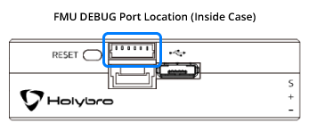

# Holybro Pixhawk 4 Mini (Знято з виробництва)

:::warning PX4 не виробляє цей (або будь-який інший) автопілот. Зверніться до [виробника](https://holybro.com/) щодо підтримки апаратного забезпечення або відповідності вимогам.
:::

Автопілот _Pixhawk<sup>&reg;</sup> 4 Mini_ розроблений для інженерів та любителів, які прагнуть використовувати потужність _Pixhawk 4_, але працюють з меншими дронами. _Pixhawk 4 Mini_ використовує FMU процесор та ресурси пам'яті _Pixhawk 4_, але виключає інтерфейси, які зазвичай не використовуються. Це дозволяє _Pixhawk 4 Mini_ бути достатньо малим, щоб поміститися у 250mm гоночний дрон.

_Pixhawk 4 Mini_ був спроєктований та розроблений у співпраці між Holybro<sup>&reg;</sup> та Auterion<sup>&reg;</sup>. Він заснований на стандарті дизайну [Pixhawk](https://pixhawk.org/) **FMUv5** та оптимізований для роботи на програмному забезпеченні управління польотом PX4.


:::tip
Цей автопілот [підтримується](../flight_controller/autopilot_pixhawk_standard.md) командами підтримки та тестування PX4.
:::

## Короткий опис

- Основний FMU Processor: STM32F765
  - 32 Bit Arm® Cortex®-M7, 216MHz, 2MB memory, 512KB RAM
- Бортові сенсори:
  - Accel/Gyro: ICM-20689
  - Accel/Gyro: BMI055 або ICM20602
  - Magnetometer: IST8310
  - Barometer: MS5611
- GPS: u-blox Neo-M8N GPS/GLONASS приймач; інтегрований магнетометр IST8310
- Інтерфейси:
  - 8 PWM виводів
  - 4 виділених PWM/Capture входи на FMU
  - Виділений R/C вхід для CPPM
  - Виділений R/C вхід для Spektrum / DSM та S.Bus з аналоговим / PWM RSSI входом
  - 3 загальних послідовних портів
  - 2 I2C порти
  - 3 SPI шини
  - 1 CAN шина для CAN ESC
  - Аналогові входи для напруги / струму з батареї
  - 2 додаткових аналогових входи
- Система живлення:
  - Вхід Power Brick: 4.75~5.5V
  - Вхід USB Power: 4.75~5.25V
  - Вхід Servo Rail: 0~24V
  - Максимальне вимірювання струму: 120A
- Вага та розміри:
  - Вага: 37.2g
  - Розміри: 38x55x15.5mm
- Інші характеристики:
  - Робоча температура: -40 ~ 85°c

Додаткову інформацію можна знайти у [_Технічному описі_ Pixhawk 4 Mini](https://github.com/PX4/PX4-user_guide/raw/main/assets/flight_controller/pixhawk4mini/pixhawk4mini_technical_data_sheet.pdf).

## Де придбати

Замовляйте на [Holybro](https://holybro.com/collections/autopilot-flight-controllers/products/pixhawk4-mini).

## Інтерфейси


:::warning
Порти **RC IN** та **PPM** призначені лише для RC приймачів. Вони працюють на електроживленні! НІКОЛИ не підключайте до них жодних сервоприводів, джерел живлення або батарей (або до будь-якого підключеного приймача).
:::

## Розводка

Завантажте схему розводки _Pixhawk 4 Mini_ [звідси](https://github.com/PX4/PX4-user_guide/raw/main/assets/flight_controller/pixhawk4mini/pixhawk4mini_pinouts.pdf).

## Розміри


## Номінальна напруга

_Pixhawk 4 Mini_ може мати резервне живлення — якщо надаються два джерела живлення. Шини живлення: **POWER** та **USB**.

::: info Вихідна потужність **MAIN OUT** не живить плату політного контролера (і не живиться нею). Ви повинні [подати живлення](../assembly/quick_start_pixhawk4_mini.md#power) або на **POWER** або на **USB**, інакше плата буде знеживлена.
:::

**Максимальна напруга нормальної роботи**

За таких умов всі джерела живлення будуть використовуватися в цьому порядку для живлення системи:

1. **POWER** (4.75V до 5.5V)
1. **USB** вхід (4.75V до 5.25V)

**Абсолютна максимальна напруга**

За таких умов система залишиться неушкодженою.

1. **POWER** вхід (0V до 6V без пошкоджень)
1. **USB** вхід (0V до 6V без пошкоджень)
1. Вхід серводвигуна: контакт VDD_SERVO **MAIN OUT** (0V до 24V без пошкоджень)

## Збірка / налаштування

[_Pixhawk 4 Mini_ Швидкий старт з підключення](../assembly/quick_start_pixhawk4_mini.md) надає інструкції щодо збирання необхідних/важливих периферійних пристроїв, таких як GPS, плата управління живленням тощо.

## Збірка прошивки

:::tip
Більшості користувачів не потрібно збирати цю прошивку! Вона попередньо зібрана й автоматично встановлюється _QGroundControl_ при підключенні відповідного апаратного забезпечення.
:::

Щоб [зібрати PX4](../dev_setup/building_px4.md) для цієї цілі:

```
make px4_fmu-v5_default
```

## Відладочний порт

[Системна консоль PX4](../debug/system_console.md) та [SWD interface](../debug/swd_debug.md) працюють на порту **FMU Debug**. Для доступу до цих портів користувач має зняти корпус _Pixhawk 4 Mini_.



The port has a standard serial pinout and can be connected to a standard FTDI cable (3.3V, but it's 5V tolerant) or a [Dronecode probe](https://kb.zubax.com/display/MAINKB/Dronecode+Probe+documentation). The pinout uses the standard [Pixhawk debug connector](https://github.com/pixhawk/Pixhawk-Standards/blob/master/DS-009%20Pixhawk%20Connector%20Standard.pdf) pinout. Please refer to the [wiring](../debug/system_console.md) page for details of how to wire up this port.

## Serial Port Mapping

|  UART  |   Device   | QGC Parameter Description |     Port Label on FC     |
|:------:|:----------:|:-------------------------:|:------------------------:|
| UART1  | /dev/ttyS0 |           GPS1            |        GPS Module        |
| USART2 | /dev/ttyS1 |          TELEM1           |          TELEM1          |
| USART3 | /dev/ttyS2 |          TELEM2           |           N/A            |
| UART4  | /dev/ttyS3 |       TELEM/SERIAL4       |        UART/l2C B        |
| USART6 | /dev/ttyS4 |            N/A            |          RC IN           |
| UART7  | /dev/ttyS5 |            N/A            |          Debug           |
| UART8  | /dev/ttyS6 |            N/A            | Not connected (no PX4IO) |

## Peripherals

- [Digital Airspeed Sensor](https://holybro.com/products/digital-air-speed-sensor)
- [Telemetry Radio Modules](../telemetry/index.md)
- [Rangefinders/Distance sensors](../sensor/rangefinders.md)

## Supported Platforms

Motors and servos are connected to the **MAIN OUT** ports in the order specified for your vehicle in the [Airframe Reference](../airframes/airframe_reference.md). This reference lists the output port to motor/servo mapping for all supported air and ground frames (if your frame is not listed in the reference then use a "generic" airframe of the correct type).

:::warning
_Pixhawk 4 Mini_ does not have AUX ports. The board cannot be used with frames that require more than 8 ports or which use AUX ports for motors or control surfaces. It can be used for airframes that use AUX for non-essential peripherals (e.g. "feed-through of RC AUX1 channel").
:::

## Further info

- [_Pixhawk 4 Mini_ Technical Data Sheet](https://github.com/PX4/PX4-user_guide/raw/main/assets/flight_controller/pixhawk4mini/pixhawk4mini_technical_data_sheet.pdf)
- [FMUv5 reference design pinout](https://docs.google.com/spreadsheets/d/1-n0__BYDedQrc_2NHqBenG1DNepAgnHpSGglke-QQwY/edit#gid=912976165).
