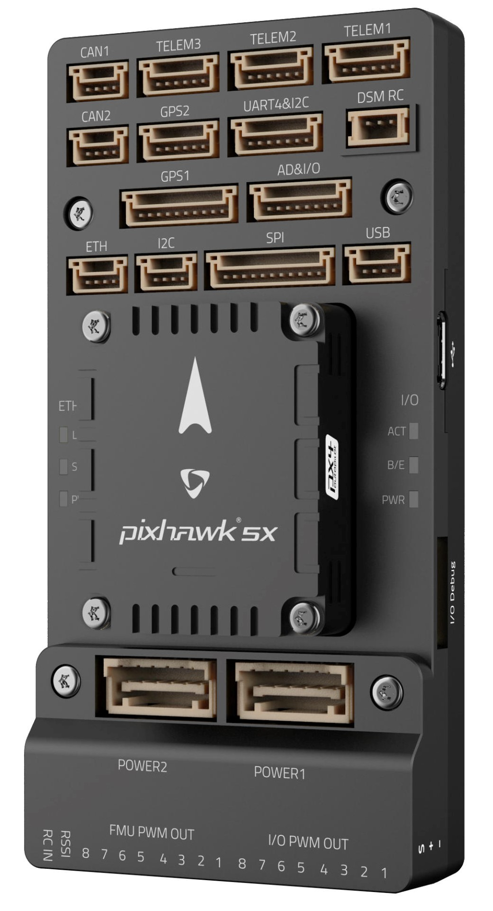
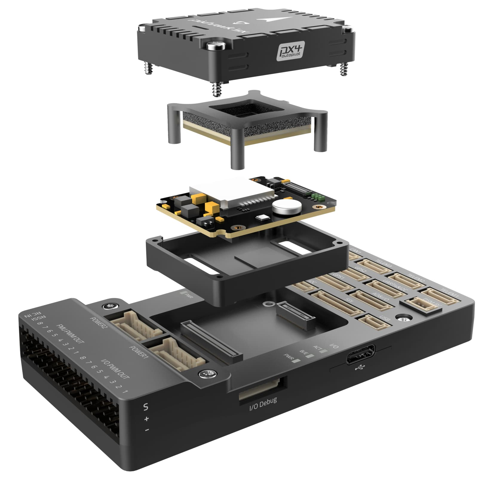
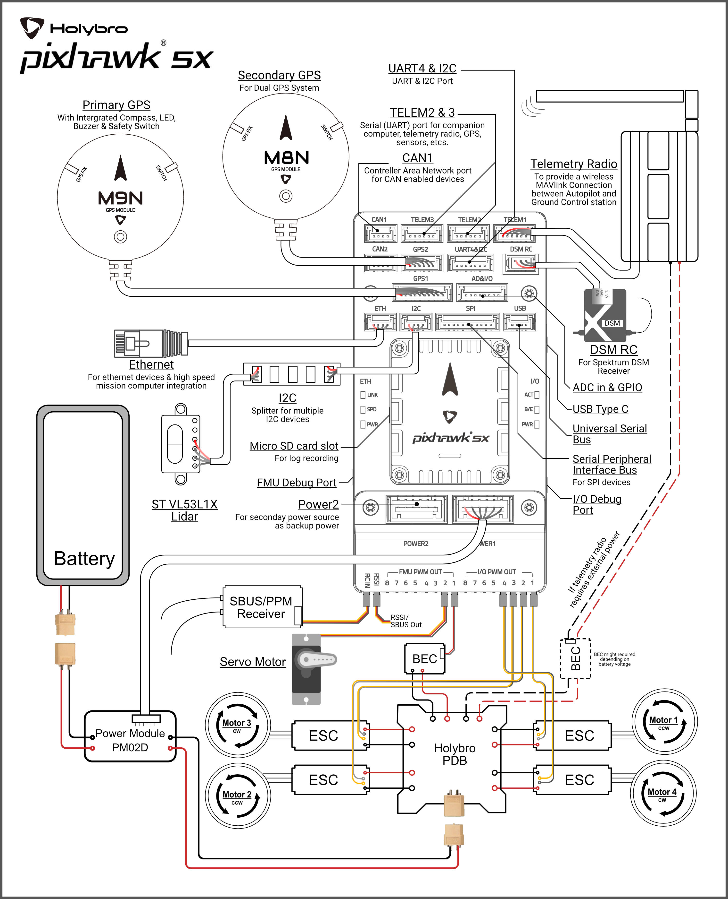
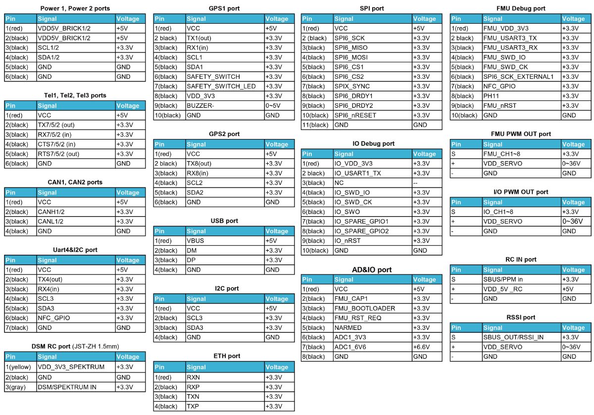
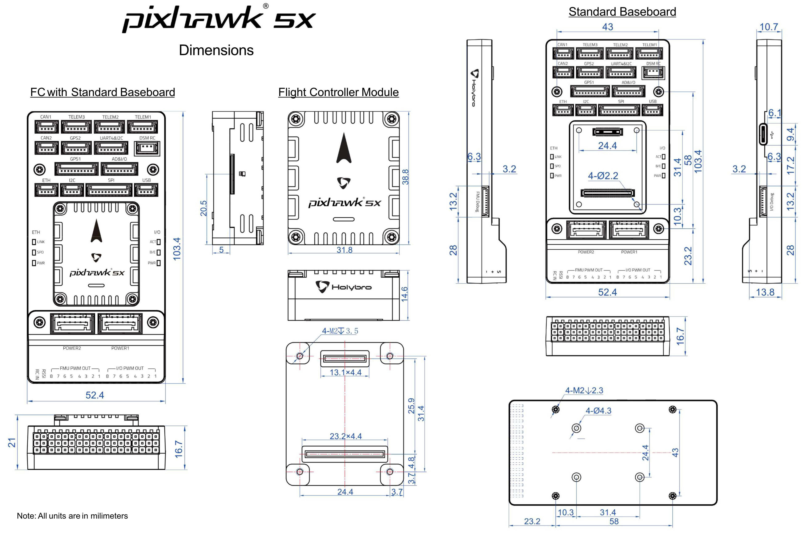

# Holybro Pixhawk 5X

:::warning PX4 не виробляє цей (або будь-який інший) автопілот. Зверніться до [виробника](https://holybro.com/) щодо підтримки апаратного забезпечення чи відповідності вимогам.
:::

_Pixhawk 5X_<sup>&reg;</sup> є останнім оновленням успішної серії політних контролерів Pixhawk®, розроблених та виготовлених у співпраці між Holybro<sup>&reg;</sup> та командою PX4.

Він базується на [Pixhawk​​® Autopilot FMUv5X Standard](https://github.com/pixhawk/Pixhawk-Standards/blob/master/DS-011%20Pixhawk%20Autopilot%20v5X%20Standard.pdf), [Autopilot Bus Standard](https://github.com/pixhawk/Pixhawk-Standards/blob/master/DS-010%20Pixhawk%20Autopilot%20Bus%20Standard.pdf), та [Connector Standard](https://github.com/pixhawk/Pixhawk-Standards/blob/master/DS-009%20Pixhawk%20Connector%20Standard.pdf). Він поставляється з попередньо встановленою найновішою версією PX4 Autopilot​®, потрійним резервуванням, температурним контролем, ізольованими датчиками, що забезпечує неймовірну продуктивність і надійність.

 

:::tip
Цей автопілот [підтримується](../flight_controller/autopilot_pixhawk_standard.md) командами підтримки та тестування PX4.
:::

## Вступ

Всередині Pixhawk® 5X ви можете знайти STM32F7 на базі STMicroelectronics® у поєднанні з сенсорною технологією від Bosch®, InvenSense®, що дає вам гнучкість і надійність для керування будь-яким автономним транспортним засобом, придатним як для академічних, так і для комерційних застосувань. Мікроконтролер Pixhawk® 5X F7 має 2 МБ флеш-пам'яті та 512 КБ ОЗП. Автопілот PX4 використовує переваги збільшеної потужності та оперативної пам’яті. Завдяки оновленій потужності обробки розробники можуть бути більш продуктивними та ефективними у своїй роботі з розробкою, що дозволяє використовувати складні алгоритми та моделі.

Відкритий стандарт FMUv5X включає в себе високопродуктивні IMU з низьким рівнем шуму, призначені для кращої стабілізації. Потрійне резервування IMU & подвійний резервний барометр на окремих шинах. Коли автопілот PX4 виявляє відмову датчика, система безперервно переключається на інший, щоб забезпечити надійність керування польотом.

Кожен незалежний LDO живить кожен набір сенсорів з незалежним керуванням живленням. Нова конструкція віброізоляції для фільтрації високочастотної вібрації та зменшення шуму для забезпечення точних показань, що дозволяє транспортним засобам досягати кращих загальних характеристик польоту. Зовнішня шина датчика (SPI5) має дві лінії вибору мікросхем та сигнали готовності даних для додаткових датчиків та корисного навантаження з інтерфейсом SPI, а також з інтегрованим Ethernet PHY від Microchip (LAN8742AI-CZ-TR), підтримується високошвидкісний обмін даними з обчислювальними пристроями місії через Ethernet. Два розумних порти моніторингу батареї (SMBus), підтримка модуля живлення INA226 SMBus.

Pixhawk® 5X ідеально підходить для розробників у корпоративних дослідницьких лабораторіях, стартапах, академії (дослідження, професори, студенти) та комерційних застосувань.

## Ключові пункти дизайну

- Modular flight controller
  - separated IMU, FMU, and Base system connected by a 100-pin & a 50-pin Pixhawk® Autopilot Bus connector, designed for flexible and customizable systems
- Redundancy
  - 3x IMU sensors & 2x Barometer sensors on separate buses, allowing parallel and continuous operation even in the event of a hardware failure
- Triple redundancy domains
  - Completely isolated sensor domains with separate buses and separate power control
- Temperature-controlled IMUs
  - Onboard IMU heating resistors, allowing optimum working temperature of IMUs
- Vibration isolation system
  - Newly designed system to filter out high frequency vibration and reduce noise to ensure accurate readings
- Ethernet interface
  - For high-speed mission computer integration
- Automated sensor calibration eliminating varying signals and temperature
- Two smart batteries monitoring on SMBus
- Additional GPIO line and 5V for the external NFC reader
- Secure element for secure authentication of the drone (SE050)

## Технічна специфікація

- FMU Processor: STM32F765
  - 32 Bit Arm® Cortex®-M7, 216MHz, 2MB memory, 512KB RAM
- IO Processor: STM32F100
  - 32 Bit Arm® Cortex®-M3, 24MHz, 8KB SRAM
- On-board Sensors:

  - Accel/Gyro: ICM-20649
  - Accel/Gyro: ICM-42688P
  - Accel/Gyro: ICM-20602
  - Magnetometer: BMM150
  - Barometer: 2x BMP388

- Interfaces

  - 16- PWM servo outputs
  - R/C input for Spektrum / DSM
  - Dedicated R/C input for PPM and S.Bus input
  - Dedicated analog / PWM RSSI input and S.Bus output
  - 4 general purpose serial ports
    - 3 with full flow control
    - 1 with separate 1.5A current limit
    - 1 with I2C and additional GPIO line for external NFC reader
  - 2 GPS ports
    - 1 full GPS & Safety Switch Port
    - 1 basic GPS port
  - 1 I2C port
  - 1 Ethernet port
    - Transformerless Applications
  - 100Mbps
  - 1 SPI bus
  - 2 chip select lines
  - 2 data-ready lines
  - 1 SPI SYNC line
  - 1 SPI reset line
  - 2 CAN Buses for CAN peripheral
    - CAN Bus has individual silent controls or ESC RX-MUX control
  - 2 Power input ports with SMBus
  - 1 AD & IO port
    - 2 additional analog input
    - 1 PWM/Capture input
    - 2 Dedicated debug and GPIO lines

- Voltage Ratings

  - Max input voltage: 6V
  - USB Power Input: 4.75~5.25V
  - Servo Rail Input: 0~36V

- Розміри

  - Flight Controller Module: 38.8 x 31.8 x 14.6mm
  - Standard Baseboard: 52.4 x 103.4 x 16.7mm

- Weight

  - Flight Controller Module: 23g
  - Standard Baseboard: 51g

- Other Characteristics:
  - Operating & storage temperature: -40 ~ 85°c

## Де купити

Замовляйте на [Holybro](https://holybro.com/products/pixhawk-5x).

## Зборка/інсталяція

[Швидкий старт з підключення Pixhawk 5X](../assembly/quick_start_pixhawk5x.md) надає інструкції щодо збірки необхідних/важливих периферійних пристроїв, включаючи GPS, модуль живлення тощо.

## З'єднання



## Pinouts



:::info
Призначення контактів роз'ємів відбувається зліва направо (тобто Pin 1 - це найлівіший контакт).
:::info

- The [camera capture pin](../peripherals/camera.md#camera-capture) (`PI0`) is pin 2 on the AD&IO port, marked above as `FMU_CAP1`.
- _Pixhawk 5X_ pinouts can be downloaded in PDF from from [here](https://github.com/PX4/PX4-user_guide/blob/main/assets/flight_controller/pixhawk5x/pixhawk5x_pinout.pdf) or [here](https://cdn.shopify.com/s/files/1/0604/5905/7341/files/Holybro_Pixhawk5X_Pinout.pdf).

## Serial Port Mapping

| UART   | Device     | Port          |
| ------ | ---------- | ------------- |
| USART1 | /dev/ttyS0 | GPS           |
| USART2 | /dev/ttyS1 | TELEM3        |
| USART3 | /dev/ttyS2 | Debug Console |
| UART4  | /dev/ttyS3 | UART4 & I2C   |
| UART5  | /dev/ttyS4 | TELEM2        |
| USART6 | /dev/ttyS5 | PX4IO/RC      |
| UART7  | /dev/ttyS6 | TELEM1        |
| UART8  | /dev/ttyS7 | GPS2          |

## Розміри



## Voltage Ratings

_Pixhawk 5X_ може мати потрійну резервність у джерелі живлення, якщо подаються три джерела живлення. Три шини живлення: **POWER1**, **POWER2** і **USB**. Порти **POWER1** та **POWER2** на Pixhawk 5X використовують 6-контактний [Роз'єм плати CLIK-Mate Wire-to-Board PCB з кроком 2,00 мм](https://www.molex.com/molex/products/part-detail/pcb_receptacles/5024430670).

**Максимальна напруга нормальної роботи**

За таких умов всі джерела живлення будуть використовуватися в цьому порядку для живлення системи:

1. **POWER1** та **POWER2** входи (4.9V до 5.5V)
1. **USB** вхід (4.75V до 5.25V)

**Абсолютна максимальна напруга**

За таких умов система не буде витрачати жодної потужності (не буде працювати), але залишиться неушкодженою.

1. **POWER1** та **POWER2** входи (операційний діапазон 4.1V до 5.7V, 0V до 10V без пошкоджень)
1. **USB** вхід (робочий діапазон 4.1V до 5.7V, 0V до 6V без пошкоджень)
1. Вхід серводвигуна: контакт VDD_SERVO **FMU PWM OUT** та **I/O PWM OUT** (0V до 42V без пошкоджень)

**Моніторинг напруги**

Цифровий моніторинг батареї I2C увімкнено за замовчуванням (див. [Швидкий старт >  Живлення](../assembly/quick_start_pixhawk5x.md#power)).

:::info
Аналоговий моніторинг батареї через ADC не підтримується на цій конкретній платі, але може підтримуватися в варіантах цього контролера польоту з іншою базовою платою.
:::

## Збірка прошивки

:::tip
Більшості користувачів не потрібно збирати цю прошивку! Вона попередньо зібрана і автоматично встановлюється за допомогою _QGroundControl_ при підключенні відповідного обладнання.
:::

Щоб [ зібрати PX4](../dev_setup/building_px4.md) для цієї цілі:

```
make px4_fmu-v5x_default
```

<a id="debug_port"></a>

## Debug Port

[Системна консоль PX4](../debug/system_console.md) та інтерфейс [SWD](../debug/swd_debug.md) працюють на порту **FMU Debug**.

Розводка та роз’єм відповідають інтерфейсу [Pixhawk Debug Full](../debug/swd_debug.md#pixhawk-debug-full), визначеному в [Pixhawk Connector Standard](https://github.com/pixhawk/Pixhawk-Standards/blob/master/DS-009%20Pixhawk%20Connector%20Standard.pdf) (роз’єм JST SM10B).

| Pin      | Сигнал           | Вольтаж |
| -------- | ---------------- | ------- |
| 1 (red)  | `Vtref`          | +3.3V   |
| 2 (blk)  | Console TX (OUT) | +3.3V   |
| 3 (blk)  | Console RX (IN)  | +3.3V   |
| 4 (blk)  | `SWDIO`          | +3.3V   |
| 5 (blk)  | `SWCLK`          | +3.3V   |
| 6 (blk)  | `SWO`            | +3.3V   |
| 7 (blk)  | NFC GPIO         | +3.3V   |
| 8 (blk)  | PH11             | +3.3V   |
| 9 (blk)  | nRST             | +3.3V   |
| 10 (blk) | `GND`            | GND     |

For information about using this port see:

- [SWD Debug Port](../debug/swd_debug.md)
- [PX4 System Console](../debug/system_console.md) (Note, the FMU console maps to USART3).

## Периферійні пристрої

- [Digital Airspeed Sensor](https://holybro.com/products/digital-air-speed-sensor)
- [Telemetry Radio Modules](https://holybro.com/collections/telemetry-radios?orderby=date)
- [Rangefinders/Distance sensors](../sensor/rangefinders.md)

## Підтримувані платформи / Конструкції

Будь-який мультикоптер / літак / наземна платформа / човен, який може керуватися звичайними RC сервоприводами або сервоприводами Futaba S-Bus. Повний набір підтримуваних конфігурацій можна переглянути в розділі [Довідник про планери](../airframes/airframe_reference.md).

## Подальша інформація

- [Гайд з підключення Pixhawk 5X](../assembly/quick_start_pixhawk5x.md)
- [Огляд & специфікація Pixhawk 5X](https://cdn.shopify.com/s/files/1/0604/5905/7341/files/Holybro_Pixhawk5X_Spec_Overview.pdf) (Holybro)
- [Схеми виводів Pixhawk 5X](https://cdn.shopify.com/s/files/1/0604/5905/7341/files/Holybro_Pixhawk5X_Pinout.pdf) (Holybro)
- [Схема роз'ємів для посилання на FMUv5X](https://docs.google.com/spreadsheets/d/1Su7u8PHp-Y1AlLGVuH_I8ewkEEXt_bHHYBHglRuVH7E/edit#gid=562580340).
- [Стандарт автопілота Pixhawk FMUv5X](https://github.com/pixhawk/Pixhawk-Standards/blob/master/DS-011%20Pixhawk%20Autopilot%20v5X%20Standard.pdf).
- [Стандарт шин автопілота Pixhawk](https://github.com/pixhawk/Pixhawk-Standards/blob/master/DS-010%20Pixhawk%20Autopilot%20Bus%20Standard.pdf).
- [Стандарт роз'ємів Pixhawk](https://github.com/pixhawk/Pixhawk-Standards/blob/master/DS-009%20Pixhawk%20Connector%20Standard.pdf).
