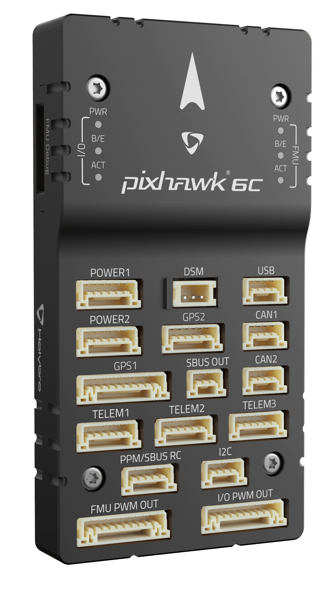

# Holybro Pixhawk 6C

:::warning PX4 не виробляє цей (або будь-який) автопілот. Зверніться до [виробника](https://holybro.com/) щодо підтримки апаратного забезпечення чи відповідності вимогам.
:::

_Pixhawk 6C_<sup>&reg;</sup> є останньою оновленою версією успішної родини автопілотів Pixhawk®, розроблених та виготовлених у співпраці з Holybro<sup>&reg;</sup>  та командою PX4.

Він оснащений високопродуктивним процесором H7, резервуванням IMU, платою IMU з контролем температури та економічно вигідним дизайном, що забезпечує неймовірну продуктивність і надійність. Він відповідає стандарту роз'ємів Pixhawk [Connector Standard](https://github.com/pixhawk/Pixhawk-Standards/blob/master/DS-009%20Pixhawk%20Connector%20Standard.pdf).



:::tip
Цей автопілот [підтримується](../flight_controller/autopilot_pixhawk_standard.md) командами підтримки та тестування PX4.
:::

## Вступ

Pixhawk® 6C - це останнє оновлення успішної родини контролерів польоту Pixhawk®.

Всередині Pixhawk® 6C ви можете знайти STM32H743 на базі STMicroelectronics®, поєднаний з сенсорною технологією від Bosch® & InvenSense®, що надає вам гнучкість і надійність для керування будь-яким автономним транспортним засобом, придатним як для академічних, так і для комерційних застосувань.

Мікроконтролер H7 Pixhawk® 6C містить ядро Arm® Cortex®-M7, що працює до 480 МГц, має 2 МБ флеш-пам’яті та 1 МБ RAM. Завдяки оновленій потужності обробки розробники можуть бути більш продуктивними та ефективними у своїй роботі з розробкою, що дозволяє використовувати складні алгоритми та моделі.

Pixhawk 6C включає в себе високопродуктивні, низькозвукові ІМП на борту, призначені для ефективності витрат при наявності резервування ІМП. Система віброізоляції для фільтрації високочастотної вібрації та зменшення шуму для забезпечення точних показань, що дозволяє транспортним засобам досягати кращих загальних характеристик польоту.

Pixhawk® 6C ідеально підходить для розробників у корпоративних дослідницьких лабораторіях, стартапах, академіях (дослідження, професори, студенти) та комерційних застосувань.

**Ключові пункти дизайну**

- Високопродуктивний процесор STM32H743 з більшою обчислювальною потужністю та оперативною пам'яттю
- Новий економічний дизайн із низькопрофільним форм-фактором
- Нова інтегрована система віброізоляції, призначена для фільтрації високочастотних вібрацій та зменшення шуму для забезпечення точних даних
- IMU температурно контролюються за допомогою вбудованих нагрівальних резисторів, що дозволяє досягти оптимальної робочої температури IMU&#x20;

# Технічна специфікація

### **Процесори & датчики**

- FMU Processor: STM32H743&#x20;
  - 32 Bit Arm® Cortex®-M7, 480MHz, 2MB пам'ять, 1MB SRAM&#x20;
- IO Processor: STM32F103
  - &#x20;32 Bit Arm® Cortex®-M3, 72MHz, 64KB SRAM&#x20;
- Бортові сенсори&#x20;
  - &#x20;Accel/Gyro: ICM-42688-P&#x20;
  - Accel/Gyro: BMI055&#x20;
  - Mag: IST8310&#x20;
  - Barometer: MS5611

### **Електричні дані**

- Номінальна напруга:
  - Максимальна вхідна напруга: 6V
  - Вхід USB Power: 4.75~5.25V
  - Вхід Servo Rail: 0\~36V
- Номінальний струм:
  - TELEM1 Обмежувач максимального вихідного струму: 1.5A
  - Комбінований обмежувач вихідного струму всіх інших портів: 1.5A

### **Механічні характеристики**

- Розміри: 84.8 \* 44 \* 12.4 mm
- Вага: 59.3g

### **Інтерфейси**

- 16- PWM серво виводів (8 з IO, 8 з FMU)
- 3 загальних послідовних порти
  - TELEM1 - Повний контроль потоку, окреме обмеження струму 1.5A
  - TELEM2 - Повний контроль потоку
  - TELEM3
- 2 порти GPS
  - GPS1 - Повний порт GPS (GPS плюс захисний перемикач)
  - GPS2 - Basic GPS порт
- 1 I2C порт
  - Підтримує виділене I2C калібрування EEPROM, розташоване на модулі сенсорів
- 2 CAN шини
  - CAN шина має individual silent controls або ESC RX-MUX control
- 2 порти відладки:
  - FMU Debug
  - I/O Debug
- Виділений R/C вхід для Spektrum / DSM та S.BUS, CPPM, аналоговий / PWM RSSI
- Виділений S.BUS вивід
- 2 порти Power input (аналогові)

- Інші характеристики:
  - Температура роботи та зберігання: -40 ~ 85°c

## Де придбати

Замовляйте на [Holybro](https://holybro.com/products/pixhawk-6c).

## Збірка / налаштування

[Швидкий старт з підключення Pixhawk 6C](../assembly/quick_start_pixhawk6c.md) надає інструкції щодо збирання необхідних/важливих периферійних пристроїв, включаючи GPS, модуль живлення тощо.

## Розводка

- [Holybro Pixhawk 6C Pinout](https://docs.holybro.com/autopilot/pixhawk-6c/pixhawk-6c-pinout)

## Зіставлення послідовних портів

| UART   | Device     | Port          |
| ------ | ---------- | ------------- |
| USART1 | /dev/ttyS0 | GPS1          |
| USART2 | /dev/ttyS1 | TELEM3        |
| USART3 | /dev/ttyS2 | Debug Console |
| UART5  | /dev/ttyS3 | TELEM2        |
| USART6 | /dev/ttyS4 | PX4IO         |
| UART7  | /dev/ttyS5 | TELEM1        |
| UART8  | /dev/ttyS6 | GPS2          |

## Розміри

- [Розміри Pixhawk 6C](https://docs.holybro.com/autopilot/pixhawk-6c/dimensions)

## Номінальна напруга

_Pixhawk 6C_ може мати потрійну резервність у джерелі живлення, якщо подаються три джерела живлення. Три шини живлення: **POWER1**, **POWER2** і **USB**.

**Максимальна напруга нормальної роботи**

За таких умов всі джерела живлення будуть використовуватися в цьому порядку для живлення системи:

1. **POWER1** та **POWER2** входи (4.9V до 5.5V)
1. **USB** вхід (4.75V до 5.25V)

**Абсолютна максимальна напруга**

За таких умов система не буде витрачати жодної потужності (не буде працювати), але залишиться неушкодженою.

1. **POWER1** та **POWER2** входи (операційний діапазон 4.1V до 5.7V, 0V до 10V без пошкоджень)
1. **USB** вхід (операційний діапазон 4.1V до 5.7V, 0V до 6V без пошкоджень)
1. Servo вхід: VDD_SERVO контакт **FMU PWM OUT** та **I/O PWM OUT** (0V до 42V без пошкоджень)

**Моніторинг напруги**

Pixhawk 6C використовує аналогові модулі живлення.

Holybro виготовляє різноманітні аналогові [модулі живлення](../power_module/index.md) для різних потреб:

- [PM02 Power Module](../power_module/holybro_pm02.md)
- [PM06 Power Module](../power_module/holybro_pm06_pixhawk4mini_power_module.md)
- [PM07 Power Module](../power_module/holybro_pm07_pixhawk4_power_module.md)

## Збірка прошивки

:::tip
Більшості користувачів не потрібно збирати цю прошивку! Вона попередньо зібрана й автоматично встановлюється _QGroundControl_ при підключенні відповідного апаратного забезпечення.
:::

Щоб [зібрати PX4](../dev_setup/building_px4.md) для цієї цілі:

```
make px4_fmu-v6c_default
```

<a id="debug_port"></a>

## Відладочний порт

[Системна консоль PX4](../debug/system_console.md) та [SWD interface](../debug/swd_debug.md) працюють на порту **FMU Debug**.

Розпиновка та роз’єм відповідають інтерфейсу [Pixhawk Debug Full](../debug/swd_debug.md#pixhawk-debug-full), визначеному в інтерфейсі [Pixhawk Connector Standard](https://github.com/pixhawk/Pixhawk-Standards/blob/master/DS-009%20Pixhawk%20Connector%20Standard.pdf) (роз’єм JST SM10B).

| Pin          | Signal           | Volt  |
| ------------ | ---------------- | ----- |
| 1 (червоний) | `Vtref`          | +3.3V |
| 2 (чорний)   | Console TX (OUT) | +3.3V |
| 3 (чорний)   | Console RX (IN)  | +3.3V |
| 4 (чорний)   | `SWDIO`          | +3.3V |
| 5 (чорний)   | `SWCLK`          | +3.3V |
| 6 (чорний)   | `SWO`            | +3.3V |
| 7 (чорний)   | NFC GPIO         | +3.3V |
| 8 (чорний)   | PH11             | +3.3V |
| 9 (чорний)   | nRST             | +3.3V |
| 10 (чорний)  | `GND`            | GND   |

Інформацію про використання цього порту див:

- [Порт відладки SWD](../debug/swd_debug.md)
- [Системна консоль PX4](../debug/system_console.md) (Зауважте, що консоль FMU зіставляється з USART3).

## Периферійні пристрої

- [Цифровий датчик швидкості польоту](https://holybro.com/products/digital-air-speed-sensor)
- [Радіо модулі телеметрії](https://holybro.com/collections/telemetry-radios?orderby=date)
- [Далекоміри / Датчики відстані](../sensor/rangefinders.md)

## Підтримувані платформи / Конструкції

Будь-який мультикоптер / літак / наземна платформа / човен, який може керуватися звичайними RC сервоприводами або сервоприводами Futaba S-Bus. Повний набір підтримуваних конфігурацій можна переглянути в розділі [Довідник про планери](../airframes/airframe_reference.md).

## Подальша інформація

- [Документи Holybro](https://docs.holybro.com/) (Holybro)
- [Швидке підключення Pixhawk 6C](../assembly/quick_start_pixhawk6c.md)
- [PM02 Power Module](../power_module/holybro_pm02.md)
- [PM06 Power Module](../power_module/holybro_pm06_pixhawk4mini_power_module.md)
- [PM07 Power Module](../power_module/holybro_pm07_pixhawk4_power_module.md)
- [Довідник з дизайну схеми контактів FMUv6C](https://docs.google.com/spreadsheets/d/1FcmWRKd6zjdz3-cnjEDYEmANKZOFzNSc/edit?usp=sharing&ouid=113251442407318461574&rtpof=true&sd=true).
- [Pixhawk Connector Standard](https://github.com/pixhawk/Pixhawk-Standards/blob/master/DS-009%20Pixhawk%20Connector%20Standard.pdf).
