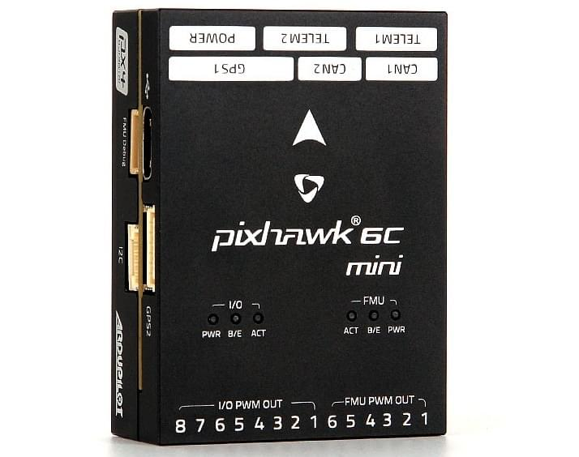
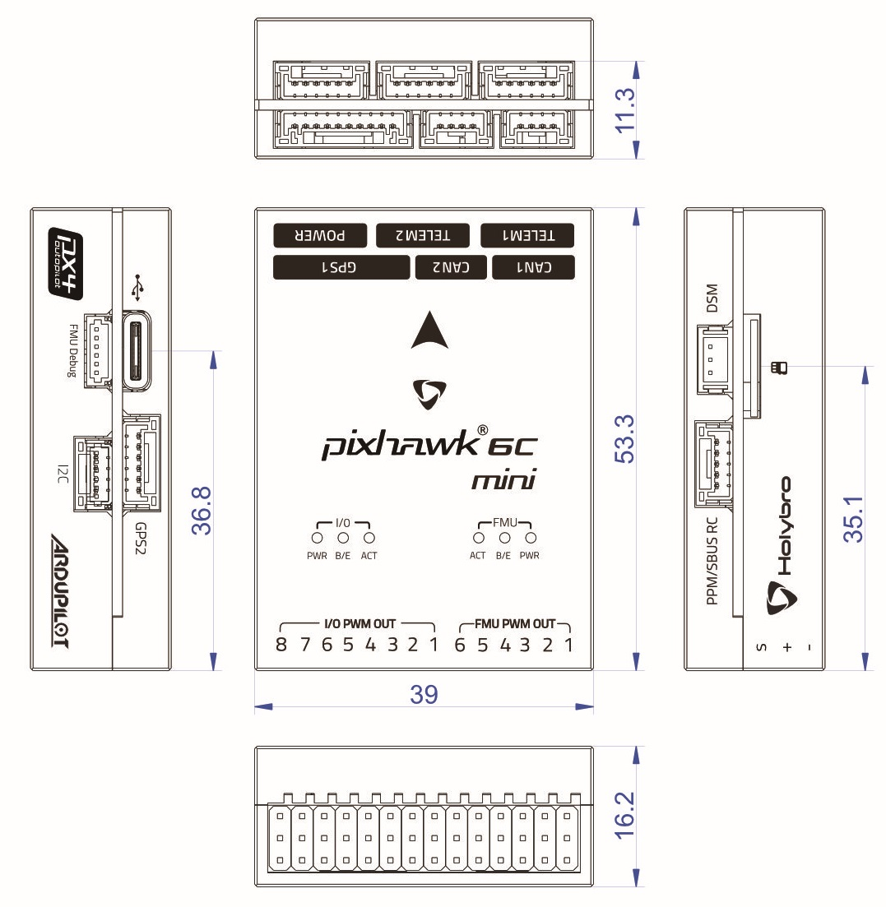

# Holybro Pixhawk 6C Mini

:::warning
PX4 не виробляє цей (або будь-який інший) автопілот. Зверніться до [виробника](https://holybro.com/) щодо підтримки апаратного забезпечення чи відповідності вимогам.
:::

_Pixhawk 6C Mini_<sup>&reg;</sup> є останнім оновленням успішної серії політних контролерів Pixhawk®, розроблених та виготовлених у співпраці між Holybro<sup>&reg;</sup> та командою PX4.

Він оснащений високопродуктивним процесором H7, резервуванням IMU, платою IMU з контролем температури та економічним дизайном, що забезпечує неймовірну продуктивність і надійність. Він відповідає Pixhawk [Connector Standard](https://github.com/pixhawk/Pixhawk-Standards/blob/master/DS-009%20Pixhawk%20Connector%20Standard.pdf).



:::tip
Цей автопілот [підтримується](../flight_controller/autopilot_pixhawk_standard.md) командами підтримки та тестування PX4.
:::

## Введення

Pixhawk® 6C Mini є останнім оновленням успішної серії політних контролерів Pixhawk®.

Всередині Pixhawk® 6C Mini ви можете знайти STM32H743 на базі STMicroelectronics®, у поєднанні з технологією сенсорів від Bosch® & InvenSense®, що надає гнучкість і надійність для керування будь-яким автономним апаратом, придатним як для академічних, так і для комерційних застосувань.

Мікроконтролер H7 Pixhawk® 6C Mini містить ядро Arm® Cortex®-M7 до 480 MHz, має 2MB flash пам’яті та 1MB RAM. Завдяки оновленій потужності обробки розробники можуть бути більш продуктивними та ефективними у своїй роботі з розробкою, що дозволяє використовувати складні алгоритми та моделі.

Pixhawk 6C Mini включає високопродуктивні, низькошумні IMU на борту, розроблені бути економічними, але водночас маючи резервування IMU. Система ізоляції вібрації для фільтрації високочастотної вібрації та зменшення шуму для забезпечення точних вимірювань, що дозволяє апаратам досягти кращих загальних польотних характеристик.

Pixhawk® 6C Mini ідеально підходить для розробників у корпоративних дослідницьких лабораторіях, стартапах, академічних закладах (дослідники, професори, студенти) та комерційних застосувань.

**Ключові моменти дизайну**

- Високопродуктивний процесор STM32H743 з більшою обчислювальною потужністю та оперативною пам'яттю
- Новий економічний дизайн із низькопрофільним форм-фактором
- Нова інтегрована система ізоляції вібрацій, призначена для фільтрації високочастотних вібрацій та зменшення шуму для забезпечення точних вимірювань
- IMU контролюються за допомогою нагрівальних резисторів на борту, що дозволяє досягти оптимальної робочої температури IMU&#x20;

## Технічна специфікація

### **Процесори & датчики**

- FMU процесор: STM32H743&#x20;
  - 32 Bit Arm® Cortex®-M7, 480MHz, 2MB memory, 1MB SRAM&#x20;
- IO процесор: STM32F103
  - &#x20;32 Bit Arm® Cortex®-M3, 72MHz, 64KB SRAM&#x20;
- Бортові сенсори&#x20;
  - &#x20;Accel/Gyro: ICM-42688-P&#x20;
  - Accel/Gyro: BMI055&#x20;
  - Mag: IST8310&#x20;
  - Barometer: MS5611

### **Електричні дані**

- Номінальна напруга:
  - Максимальна вхідна напруга: 6V
  - Вхід USB Power: 4.75\~5.25V
  - Вхід Servo Rail: 0\~36V
- Номінальний струм:
  - `TELEM1`` обмежувач максимального вихідного струму: 1A
  - Комбінований обмежувач вихідного струму всіх інших портів: 1A

### **Механічні дані**

- Розміри: 53.3 x 39 x 16.2 mm
- Вага: 39.2г

### **Інтерфейси**

- 16- PWM серво виводів (8 з IO, 6 з FMU)
- 3 загальних послідовних порти
  - `TELEM1` - Повний контроль потоку, окреме обмеження струму 1A
  - `TELEM2` - Повний контроль потоку
- 2 порти GPS
  - GPS1 - Повний порт GPS (GPS плюс захисний перемикач)
  - GPS2 - Базовий порт GPS
- 1 I2C порт
  - Підтримує виділене I2C калібрування EEPROM, розташоване на модулі сенсорів
- 2 CAN шини
  - CAN шина має individual silent controls або ESC RX-MUX control
- 1 порт відладки:
  - FMU Debug Mini
- Виділений R/C вхід для Spektrum/DSM та S.BUS, CPPM, аналоговий / PWM RSSI
- 1 вхідний порт живлення (аналоговий)

- Інші характеристики:
  - Температура роботи та зберігання: -40 ~ 85°c

## Де придбати

Замовляйте на [Holybro](https://holybro.com/products/pixhawk-6c-mini).

## Збірка / налаштування

Порт Pixhawk 4 Mini дуже схожий з портом Pixhawk 6C Mini. Будь ласка, зверніться до [Швидкого старту з підключення Pixhawk 4 Mini](../assembly/quick_start_pixhawk4_mini.md), оскільки він надає інструкції щодо збірки необхідних/важливих периферійних пристроїв, включаючи GPS, модуль живлення тощо.

## Розводка

- [Схема роз'ємів Holybro Pixhawk 6C Mini](https://docs.holybro.com/autopilot/pixhawk-6c-mini/pixhawk-6c-mini-ports)

## Зіставлення послідовних портів

| UART   | Device     | Опис параметра QGC | Мітка порту на FC |
| ------ | ---------- | ------------------ | ----------------- |
| USART1 | /dev/ttyS0 | GPS1               | GPS1              |
| USART2 | /dev/ttyS1 | TELEM3             | N/A               |
| USART3 | /dev/ttyS2 | N/A                | FMU Debug         |
| UART5  | /dev/ttyS3 | TELEM2             | TELEM2            |
| USART6 | /dev/ttyS4 | PX4IO              | I/O PWM Out       |
| UART7  | /dev/ttyS5 | TELEM1             | TELEM1            |
| UART8  | /dev/ttyS6 | GPS2               | GPS2              |

<!-- See http://docs.px4.io/main/en/hardware/serial_port_mapping.html#serial-port-mapping -->

## Розміри



## Номінальна напруга

_Pixhawk 6C Mini_ може бути подвійно резервним у джерелі живлення, якщо подаються два джерела живлення. Дві шини живлення: **POWER1** і **USB**.

**Максимальна напруга нормальної роботи**

За таких умов всі джерела живлення будуть використовуватися в цьому порядку для живлення системи:

1. **POWER1** входи (4.9V до 5.5V)
1. **USB** вхід (4.75V до 5.25V)

**Абсолютна максимальна напруга**

За таких умов система не буде витрачати жодної потужності (не буде працювати), але залишиться неушкодженою.

1. **POWER1** входи (операційний діапазон 4.1V до 5.7V, 0V до 10V без пошкоджень)
1. **USB** вхід (операційний діапазон 4.1V до 5.7V, 0V до 6V без пошкоджень)
1. Servo вхід: контакт VDD_SERVO **FMU PWM OUT** та **I/O PWM OUT** (0V до 42V без пошкоджень)

**Моніторинг напруги**

Pixhawk 6C Mini використовує аналогові модулі живлення.

Holybro виготовляє різноманітні аналогові [модулі живлення](../power_module/index.md) для різних потреб:

- [PM02 Power Module](../power_module/holybro_pm02.md)
- [PM06 Power Module](../power_module/holybro_pm06_pixhawk4mini_power_module.md)
- [PM07 Power Module](../power_module/holybro_pm07_pixhawk4_power_module.md)
- [PM08 Power Module](https://holybro.com/products/pm08-power-module-14s-200a)

## Збірка прошивки

:::tip
Більшості користувачів не потрібно збирати цю прошивку! Вона попередньо зібрана й автоматично встановлюється _QGroundControl_ при підключенні відповідного апаратного забезпечення.
:::

Щоб [зібрати PX4](../dev_setup/building_px4.md) для цієї цілі:

```
make px4_fmu-v6c_default
```

<a id="debug_port"></a>

## Відладочний порт

[Системна консоль PX4](../debug/system_console.md) та [SWD interface](../debug/swd_debug.md) працюють на порту **FMU Debug**.

Розводка та роз’єм відповідають інтерфейсу [Pixhawk Debug Mini](../debug/swd_debug.md#pixhawk-debug-mini), визначеному в [Pixhawk Connector Standard](https://github.com/pixhawk/Pixhawk-Standards/blob/master/DS-009%20Pixhawk%20Connector%20Standard.pdf) (роз’єм JST SH).

| Pin          | Signal           | Volt  |
| ------------ | ---------------- | ----- |
| 1 (червоний) | `Vtref`          | +3.3V |
| 2 (чорний)   | Console TX (OUT) | +3.3V |
| 3 (чорний)   | Console RX (IN)  | +3.3V |
| 4 (чорний)   | `SWDIO`          | +3.3V |
| 5 (чорний)   | `SWCLK`          | +3.3V |
| 6 (чорний)   | `GND`            | GND   |

Інформацію про використання цього порту див:

- [SWD Debug Port](../debug/swd_debug.md)
- [Системна консоль PX4](../debug/system_console.md) (Зауважте, що консоль FMU зіставляється з USART3).

## Периферія

- [Цифровий датчик швидкості польоту](https://holybro.com/products/digital-air-speed-sensor)
- [Радіо модулі телеметрії](../telemetry/index.md):
  - [Holybro Telemetry Radio](../telemetry/holybro_sik_radio.md)
  - [Holybro Microhard P900 Radio](../telemetry/holybro_microhard_p900_radio.md)
  - [Holybro XBP9X Telemetry Radio](../telemetry/holybro_xbp9x_radio.md)
- [Далекоміри / Датчики відстані](../sensor/rangefinders.md)

## Підтримувані платформи / шасі

Будь-який мультикоптер / літак / наземна платформа чи човен, який може керуватися звичайними RC сервоприводами або сервоприводами Futaba S-Bus. Повний перелік підтримуваних конфігурацій можна переглянути в розділі [Довідник планерів](../airframes/airframe_reference.md).

## Дивіться також

- [Документація Holybro](https://docs.holybro.com/) (Holybro)
- [Швидкий старт з підключення Pixhawk 4 Mini](../assembly/quick_start_pixhawk4_mini.md) (і [Швидкий старт з підключення Pixhawk 6C](../assembly/quick_start_pixhawk6c.md))
- [PM02 Power Module](../power_module/holybro_pm02.md)
- [PM06 Power Module](../power_module/holybro_pm06_pixhawk4mini_power_module.md)
- [PM07 Power Module](../power_module/holybro_pm07_pixhawk4_power_module.md)
- [PM08 Power Module](https://holybro.com/products/pm08-power-module-14s-200a)
- [Довідник з дизайну схеми контактів FMUv6C](https://docs.google.com/spreadsheets/d/1FcmWRKd6zjdz3-cnjEDYEmANKZOFzNSc/edit?usp=sharing&ouid=113251442407318461574&rtpof=true&sd=true).
- [Pixhawk Connector Standard](https://github.com/pixhawk/Pixhawk-Standards/blob/master/DS-009%20Pixhawk%20Connector%20Standard.pdf).
