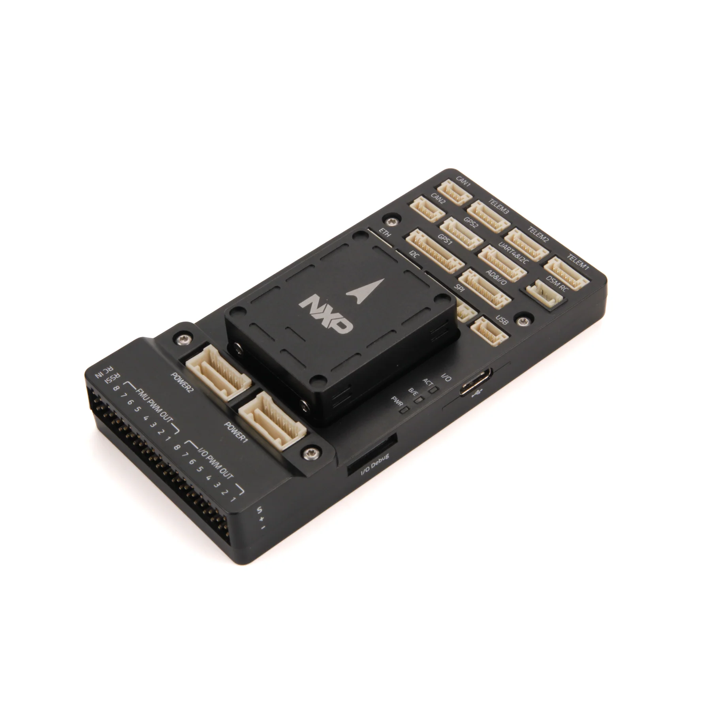
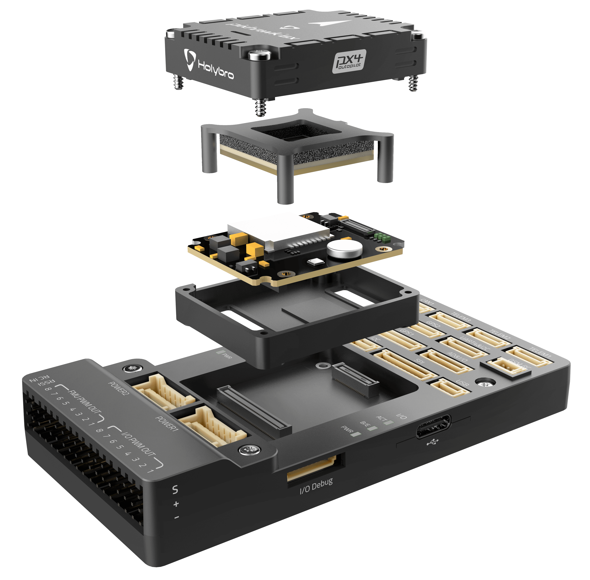
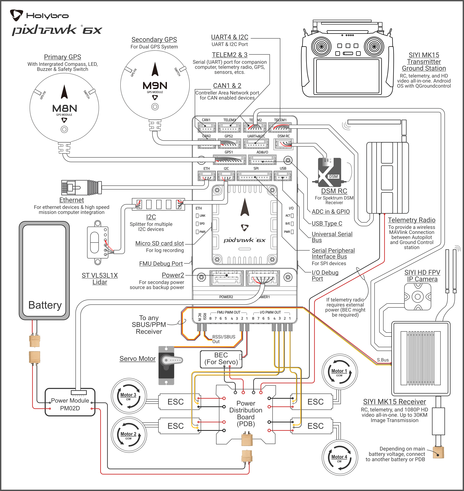

# Holybro Pixhawk 6X-RT

:::warning
PX4 не виробляє цей (або будь-який інший) автопілот. Зверніться до [виробника](https://holybro.com/) щодо підтримки апаратного забезпечення чи відповідності вимогам.
:::

_Pixhawk 6X-RT_<sup>&reg;</sup> є останнім оновленням успішної серії політних контролерів Pixhawk®, розроблених та виготовлених у співпраці між Holybro<sup>&reg;</sup>, командою NXP's mobile robotics та командою PX4 на основі відкритого дизайну NXP.

Він базується на [Pixhawk​​® Autopilot FMUv6X Standard](https://github.com/pixhawk/Pixhawk-Standards/blob/master/DS-012%20Pixhawk%20Autopilot%20v6X%20Standard.pdf), [Autopilot Bus Standard](https://github.com/pixhawk/Pixhawk-Standards/blob/master/DS-010%20Pixhawk%20Autopilot%20Bus%20Standard.pdf), та [Connector Standard](https://github.com/pixhawk/Pixhawk-Standards/blob/master/DS-009%20Pixhawk%20Connector%20Standard.pdf).

Оснащений високопродуктивним процесором NXP i.mx RT1176 dual core, модульним дизайном, потрійним резервуванням, платою IMU з контролем температури, ізольованими доменами сенсорів, що забезпечує неймовірну продуктивність, надійність та гнучкість.

 

:::tip
Цей автопілот [підтримується](../flight_controller/autopilot_pixhawk_standard.md) командами підтримки та тестування PX4.
:::

## Введення

Всередині Pixhawk®​ 6X-RT ви можете знайти NXP i.mx RT1176, поєднаний з сенсорною технологією від Bosch®​​, InvenSense®​​, що надає вам гнучкість і надійність для керування будь-яким автономним апаратом, придатним як для академічних, так і для комерційних застосувань.

Двоядерний MCU в Pixhawk® 6X-RT i.mx RT1176 Crossover містить ядро Arm® Cortex®-M7 до 1GHz і ядро Arm® Cortex®-M4 до 400MHz, має 2MB SRAM та зовнішню XIP Flash обсягом 64MB. Автопілот PX4 використовує переваги збільшеної потужності та оперативної пам’яті. Завдяки збільшеній потужності обробки розробники можуть бути більш продуктивними та ефективними у своїй роботі з розробкою, що дозволяє використовувати складні алгоритми та моделі.

Відкритий стандарт FMUv6X включає високоефективні, низькошумні IMU на платі, розроблені для кращої стабілізації. IMU з потрійним резервуванням та барометр з подвійним резервуванням на окремих шинах. Коли PX4 виявляє відмову датчика, система плавно перемикатися на інший, щоб забезпечити надійність керування польотом.

Незалежний LDO живить кожен набір сенсорів з незалежним керуванням живленням. Система ізоляції вібрації для фільтрації високочастотної вібрації та зменшення шуму для забезпечення точних вимірювань, що дозволяє апаратам досягти кращих загальних польотних характеристик.

Зовнішня шина датчиків (SPI5) має дві лінії вибору чипів та сигнали готовності даних для додаткових датчиків та корисного навантаження з інтерфейсом SPI, а також з інтегрованим Microchip Ethernet PHY, високошвидкісний обмін даними з комп'ютерами місії через ethernet тепер можливий.

Pixhawk®️sco6X-RT ідеально підходить для розробників корпоративних дослідницьких лабораторій, стартапів, академічних потреб (досліджень, професорів, студентів) та комерційного застосування.

## Ключові пункти дизайну

- Високопродуктивний [NXP i.MX RT1170 1GHz Crossover MCU](https://www.nxp.com/products/processors-and-microcontrollers/arm-microcontrollers/i-mx-rt-crossover-mcus/i-mx-rt1170-1-ghz-crossover-mcu-with-arm-cortex-cores:i.MX-RT1170) з ядрами Arm® Cortex®
- Апаратний захисний елемент [NXP EdgeLock SE051](https://www.nxp.com/products/security-and-authentication/authentication/edgelock-se051-proven-easy-to-use-iot-security-solution-with-support-for-updatability-and-custom-applets:SE051) є розширенням надійного EdgeLock SE050 Plug & Trust сімейства захисних елементів, підтримує оновлення аплетів на місці та забезпечує перевірену безпеку, сертифіковану відповідно до CC EAL 6+, з AVA_VAN.5 до рівня ОС, для надійного захисту від останніх сценаріїв атак. Наприклад, для безпечного зберігання ідентифікатора оператора або сертифікатів.
- Модульний політний контролер: розділені IMU, FMU та базова система, з'єднані за допомогою роз'ємів Pixhawk® Autopilot Bus на 100 контактів та 50 контактів.
- Резервність: 3x датчики IMU та 2x датчики барометра на окремих шинах
- Потрійне резервування доменів: повністю ізольовані сенсорні домени з окремими шинами та окремим керуванням живленням
- Нова система ізоляції вібрацій для фільтрації високочастотних вібрацій та зменшення шуму для забезпечення точних вимірювань
- Інтерфейс Ethernet для високошвидкісної інтеграції комп'ютера місії
- IMU контролюються за допомогою нагрівальних резисторів на борту, що дозволяє досягти оптимальної робочої температури IMU&#x20;

### Процесори та датчики

- FMU процесор: NXP i.MX RT1176
  - 32 Bit Arm® Cortex®-M7, 1GHz
  - 32 Bit Arm® Cortex®-M4, 400MHz вторинне ядро
  - 64MB зовнішньої флеш пам'яті
  - 2MB RAM
- Апаратний захисний елемент NXP EdgeLock SE051
  - Сертифіковано згідно з вимогами IEC62443-4-2
  - 46 kB користувацької пам'яті з опціями персоналізації до 104 kB
  - Сертифіковане рішення Groundbreaking CC EAL6+ для IoT
  - AES та 3DES шифрування і дешифрування
- IO процесор: STM32F100
  - 32 Bit Arm® Cortex®-M3, 24MHz, 8KB SRAM
- Бортові сенсори
  - Accel/Gyro: ICM-20649 або BMI088
  - Accel/Gyro: ICM-42688-P
  - Accel/Gyro: ICM-42670-P
  - Mag: BMM150
  - Barometer: 2x BMP388

### Електричні дані

- Номінальна напруга:
  - Максимальна вхідна напруга: 6V
  - Вхід USB Power: 4.75\~5.25V
  - Вхід Servo Rail: 0\~36V
- Номінальний струм:
  - `TELEM1` обмежувач вихідного струму: 1.5A
  - Комбінований обмежувач вихідного струму всіх інших портів: 1.5A

### Механічні дані

- Розміри
  - Модуль політного контролера: 38.8 x 31.8 x 14.6mm
  - Стандартна базова плата: 52.4 x 103.4 x 16.7mm
  - Міні базова плата: 43.4 x 72.8 x 14.2 mm
- Вага
  - Модуль політного контролера: 23g
  - Стандартна базова плата: 51g
  - Міні базова плата: 26.5g

### Інтерфейси

- 16- PWM серво виводів
- R/C вхід для Spektrum / DSM
- Виділений R/C вхід для PPM та S.Bus вхід
- Спеціалізований аналоговий / PWM вхід RSSI та вивід S.Bus
- 4 загальних послідовних порти
  - 3 з повним контролем потоку
  - 1 з окремим обмеженням струму 1.5A (Telem1)
  - 1 з I2C та додатковою лінією GPIO для зовнішнього NFC зчитувача
- 2 порти GPS
  - 1 повний GPS плюс порт запобіжного перемикача
  - 1 базовий порт GPS
- 1 I2C порт
- 1 порт Ethernet
  - Transformerless Applications
  - 100Mbps
- 1 шина SPI
  - 2 лінії вибору чіпу
  - 2 лінії готових даних
  - 1 лінія SPI SYNC
  - 1 лінія SPI reset
- 2 CAN шини для CAN периферії
  - CAN шина має individual silent controls або ESC RX-MUX control
- 2 порти вводу живлення з SMBus

  - 1 AD та IO порт
  - 2 додаткових аналогових входи
  - 1 PWM/Capture вхід
  - 2 виділені відладочні та GPIO лінії

- Інші характеристики:
  - Температура роботи та зберігання: -40 ~ 85°c

## Де придбати

Замовляйте на [Holybro](https://holybro.com/products/fmuv6x-rt-developer-edition).

## Збірка / налаштування

[Швидкий старт з підключення Pixhawk 6X](../assembly/quick_start_pixhawk6x.md) надає інструкції щодо збірки необхідних/важливих периферійних пристроїв, включаючи GPS, модуль живлення тощо.

## З'єднання

Зразок схеми з'єднань



## Розводка

- [Схема роз'ємів базової плати Holybro Pixhawk](https://docs.holybro.com/autopilot/pixhawk-6x/pixhawk-baseboard-pinout)
- [Схема роз'ємів міні-плати Holybro Pixhawk](https://docs.holybro.com/autopilot/pixhawk-6x/pixhawk-mini-baseboard-pinout)

Примітки:

- [Контакт камери](../peripherals/camera.md#camera-capture) (`PI0`) є контактом 2 порту AD&IO, позначеним вище як `FMU_CAP1`.

## Зіставлення послідовних портів

| UART   | Device     | Port     |
| ------ | ---------- | -------- |
| UART1  | /dev/ttyS0 | Debug    |
| UART3  | /dev/ttyS1 | GPS      |
| UART4  | /dev/ttyS2 | TELEM1   |
| UART5  | /dev/ttyS3 | GPS2     |
| UART6  | /dev/ttyS4 | PX4IO    |
| UART8  | /dev/ttyS5 | TELEM2   |
| UART10 | /dev/ttyS6 | TELEM3   |
| UART11 | /dev/ttyS7 | External |

## Розміри

[Розміри Pixhawk 6X](https://docs.holybro.com/autopilot/pixhawk-6x/dimensions)

## Номінальна напруга

_Pixhawk 6X-RT_ може мати потрійну резервність у джерелі живлення, якщо подаються три джерела живлення. Три шини живлення: **POWER1**, **POWER2** і **USB**. Порти **POWER1** та **POWER2** на Pixhawk 6X використовують 6 circuit [2.00mm Pitch CLIK-Mate Wire-to-Board PCB Receptacle](https://www.molex.com/molex/products/part-detail/pcb_receptacles/5024430670).

**Normal Operation Maximum Ratings**

Under these conditions all power sources will be used in this order to power the system:

1. **POWER1** and **POWER2** inputs (4.9V to 5.5V)
1. **USB** input (4.75V to 5.25V)

**Absolute Maximum Ratings**

Under these conditions the system will not draw any power (will not be operational), but will remain intact.

1. **POWER1** and **POWER2** inputs (operational range 4.1V to 5.7V, 0V to 10V undamaged)
1. **USB** input (operational range 4.1V to 5.7V, 0V to 6V undamaged)
1. Servo input: VDD_SERVO pin of **FMU PWM OUT** and **I/O PWM OUT** (0V to 42V undamaged)

**Voltage monitoring**

Digital I2C battery monitoring is enabled by default (see [Quickstart > Power](../assembly/quick_start_pixhawk6x.md#power)).

::: info
Analog battery monitoring via an ADC is not supported on this particular board, but may be supported in variations of this flight controller with a different baseboard.
:::

## Building Firmware

:::tip
Most users will not need to build this firmware! It is pre-built and automatically installed by _QGroundControl_ when appropriate hardware is connected.
:::

To [build PX4](../dev_setup/building_px4.md) for this target:

```
make px4_fmu-v6xrt_default
```

<a id="debug_port"></a>

## Debug Port

The [PX4 System Console](../debug/system_console.md) and [SWD interface](../debug/swd_debug.md) run on the **FMU Debug** port.

The pinouts and connector comply with the [Pixhawk Debug Full](../debug/swd_debug.md#pixhawk-debug-full) interface defined in the [Pixhawk Connector Standard](https://github.com/pixhawk/Pixhawk-Standards/blob/master/DS-009%20Pixhawk%20Connector%20Standard.pdf) interface (JST SM10B connector).

| Pin      | Signal           | Volt  |
| -------- | ---------------- | ----- |
| 1 (red)  | `Vtref`          | +3.3V |
| 2 (blk)  | Console TX (OUT) | +3.3V |
| 3 (blk)  | Console RX (IN)  | +3.3V |
| 4 (blk)  | `SWDIO`          | +3.3V |
| 5 (blk)  | `SWCLK`          | +3.3V |
| 6 (blk)  | `SWO`            | +3.3V |
| 7 (blk)  | NFC GPIO         | +3.3V |
| 8 (blk)  | PH11             | +3.3V |
| 9 (blk)  | nRST             | +3.3V |
| 10 (blk) | `GND`            | GND   |

For information about using this port see:

- [SWD Debug Port](../debug/swd_debug.md)
- [PX4 System Console](../debug/system_console.md) (Note, the FMU console maps to USART3).

## Peripherals

- [Digital Airspeed Sensor](https://holybro.com/products/digital-air-speed-sensor)
- [Telemetry Radio Modules](https://holybro.com/collections/telemetry-radios?orderby=date)
- [Rangefinders/Distance sensors](../sensor/rangefinders.md)

## Supported Platforms / Airframes

Any multicopter / airplane / rover or boat that can be controlled with normal RC servos or Futaba S-Bus servos. The complete set of supported configurations can be seen in the [Airframes Reference](../airframes/airframe_reference.md).

## Further info

- [Update Pixhawk 6X-RT Bootloader](../advanced_config/bootloader_update_v6xrt.md)
- [Holybro Docs](https://docs.holybro.com/) (Holybro)
- [Pixhawk 6X Wiring QuickStart](../assembly/quick_start_pixhawk6x.md)
- [PM02D Power Module](../power_module/holybro_pm02d.md)
- [PM03D Power Module](../power_module/holybro_pm03d.md)
- [Pixhawk Autopilot FMUv6X Standard](https://github.com/pixhawk/Pixhawk-Standards/blob/master/DS-012%20Pixhawk%20Autopilot%20v6X%20Standard.pdf).
- [Pixhawk Autopilot Bus Standard](https://github.com/pixhawk/Pixhawk-Standards/blob/master/DS-010%20Pixhawk%20Autopilot%20Bus%20Standard.pdf).
- [Pixhawk Connector Standard](https://github.com/pixhawk/Pixhawk-Standards/blob/master/DS-009%20Pixhawk%20Connector%20Standard.pdf).
