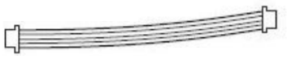
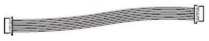
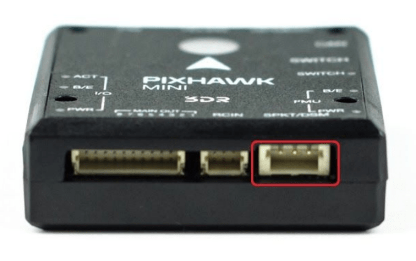
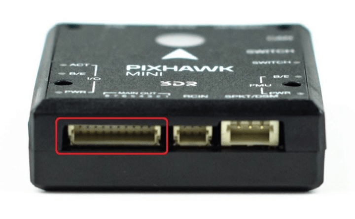

# Holybro Pixhawk Mini (Припинено)

:::warning PX4 не виробляє цей (або будь-який інший) автопілот. Звертайтесь до [виробника](https://holybro.com/) щодо питань апаратного забезпечення або питань відповідності. :::

Автопілот Holybro *Pixhawk<sup>&reg;</sup> Mini* - це наступне покоління еволюції Pixhawk. Це близько 1/3 розміру оригінального Pixhawk та має потужніші процесори та сенсори.

Pixhawk Mini базується на відкритому проекті PX4 і був оптимізований для стеку керування польотом PX4.


Інформація щодо підключення доступна [нижче](#wiring).

:::info Цей контролер польоту був розроблений компанією 3DR у співпраці з HobbyKing<sup>&reg;</sup>. Раніше він був відомий як 3DR Pixhawk Mini. :::

:::tip
Цей автопілот [підтримується](../flight_controller/autopilot_pixhawk_standard.md) командами підтримки та тестування PX4. :::

## Специфікації

**Процесори:**

- **Основний процесор:** STM32F427 Rev 3
- **IO процесор:** STM32F103

**Сенсори:**

- **Accel/Gyro/Mag:** MPU9250
  - [застарілий](https://github.com/PX4/PX4-Autopilot/pull/7618) для прошивки PX4
- **Accel/Gyro:** ICM20608
- **Barometer:** MS5611

**Номінальна напруга:**

- **Вивід модуля живлення:** 4.1\~5.5V
- **Максимальна вхідна напруга:** 45V (10S LiPo)
- **Максимальне вимірювання струму:** 90A
- **Вхід живлення USB:** 4.1\`5.5V
- **Вхід Servo Rail:** 0\~10V

**Інтерфейси:**

- 1 x UART Serial Port (для GPS)
- Spektrum DSM/DSM2/DSM-X® Satellite Compatible RC вхід
- Futaba S BUS® Compatible RC вхід
- PPM Sum Signal RC вхід
- I2C (для цифрових сенсорів)
- CAN (для цифрового керування мотором з сумісними контролерами)
- ADC (для аналогових сенсорів)
- Мікро USB порт

**Вага та розміри:**

- **Розміри:** 38x43x12мм
- **Вага:** 15.8g

**Модуль GPS (постачається з комплектом):**

- **GNSS приймач:** u-blox<sup>&reg;</sup> Neo-M8N; компас HMC5983
- **Вага:** 22.4g
- **Розміри:** 37x37x12мм

## Де придбати

Припинено.

## Призначення конекторів

`<To be added>`

## Особливості

Основні функції Pixhawk Mini:

- Просунутий 32 bit ARM Cortex® M4 Processor що управляється NuttX RTOS
- 8 PWM/servo виводів
- Кілька варіантів підключення для додаткової периферії (UART, I2C, CAN)
- Резервні входи живлення та автоматичне перемикання на резервне джерело
- Інтегрований перемикач безпеки та опційна зовнішня кнопка безпеки для легкої активації мотора
- Мультиколірний LED індикатор
- Інтегрований багатотональний п'єзозвуковий індикатор
- microSD-карта для довгострокового логування
- Легкі у використанні конектори Micro JST

Pixhawk Mini поставляється з новим **модулем GPS**:

- На основі u-blox M8N
- Одночасне приймання до 3 GNSS (GPS, Galileo, GLONASS, BeiDou)
- Найкраща в галузі навігаційна чутливість -167 dBm
- Безпека та захист цілісності
- Підтримує всі супутникові системи доповнення
- Просунуте виявлення перешкод і спуфінгу
- Варіативність продукту для задоволення вимог до продуктивності та вартості

## Набір комплекту

_Pixhawk Mini_ поставляється з наступним вмістом:

| Компонент                                                              | Зображення                                                                                                                           |
| ---------------------------------------------------------------------- | ------------------------------------------------------------------------------------------------------------------------------------ |
| Pixhawk Mini Autopilot                                                 |                                                 |
| Модуль GPS                                                             |                                   |
| Quad Power Distribution Board                                          |  |
| 8 Channel PWM Breakout board                                           |    |
| кабель на 4 піна (для I2C)                                             |                            |
| RC-in кабель для PPM/SBUS                                              |                         |
| 6 to 6/4 ‘Y’ адаптер для GPS та додаткових пристроїв I2C               |                |
| 6-піновий кабель (2) (для плати розподілу живлення та для компасу/gps) |                                      |
| 6-піновий JST для легасі телеметрійного радіо до DF13                  |                     |
| Запобіжний перемикач                                                   |                                  |
| 8 Channel PWM Breakout cable                                           |     |
| Монтажна піна                                                          |                                                 |
| I2C breakout board ? - не входить до списку запчастин у додатку        | -                                                                                                                                    |

## Optional accessories

- Telemetry Radio Sets: 915 MHz (USA), 433 MHz (European) ::: info
When installing the 3DR telemetry radios, use the connectors that come with Pixhawk Mini, rather than those that come with the radios.
:::

- 3DR 10S Power Module
- WiFi Telemetry Radio
- Digital Airspeed Sensor

## Сумісність

### RC радіо

- PPM output RC receivers
- Spektrum DSM RC receivers
- Futaba S BUS RC receivers

### ESCs

- All standard PWM input ESCs

## Connector pin assignments (pin outs)


## Product comparisons

### Pixhawk Mini vs Pixhawk (original)

- One-third the size - from 50x81.5x15.5mm to 38x43x12mm.
- Rev 3 processor for full utilization of 2MB flash memory.
- Improved sensors, both primary and secondary IMU MPU9250 and ICM20608 respectively. The result is more stable, more reliable flight and navigation.
- GPS+Compass module included. Features the Neo M8N with GLONASS support; compass HMC5983. Expect faster and stronger GPS lock.
- Micro JST connectors instead of DF-13. These are much easier to work with.
- Integrated piezo speaker and safety switch.
- Natively supports 4S batteries with the included PDB.

### Pixhawk Mini vs Pixfalcon

- Improved sensors, both primary and secondary IMU MPU9250 and ICM20608 respectively. Expect better vibration handling and reliability.
- CAN interface for UAVCAN support.
- Includes 8-channel breakout servo rail for planes and other vehicles requiring powered PWM output.
- Includes I2C breakout board for a total of 5 I2C connections.
- Similar size.

Pixhawk Mini має вдосконалений процесор та сенсорну технологію від ST Microelectronics® та операційну систему реального часу NuttX, що забезпечує відмінну продуктивність, гнучкість та надійність для керування будь-яким безпілотним транспортним засобом.

## Відомі проблеми

- Деякі Pixhawk Mini мають [дефект апаратного забезпечення](https://github.com/PX4/PX4-Autopilot/issues/7327#issuecomment-317132917), який робить внутрішній IMU MPU9250 ненадійним.
  - Проблема присутня лише в старіших версіях апаратного забезпечення, оскільки [вона була виправлена якимось чином виробником](https://github.com/PX4/PX4-Autopilot/issues/7327#issuecomment-372393609).
  - Щоб перевірити, чи певна плата постраждала чи ні, залиште плату відключеною на деякий час, потім увімкніть її та спробуйте запустити драйвер mpu9250 з командного рядка PX4. Якщо плата пошкоджена, драйвер не запуститься.
  - MPU9250 [за замовчуванням вимкнено](https://github.com/PX4/PX4-Autopilot/pull/7618) у вбудованому програмному забезпеченні PX4.
  - Дефектні Pixhawk Mini не будуть калібруватися без зовнішнього магнітометра або підключеного GPS, навіть у приміщенні.
  - При використанні зовнішнього GPS, [це не проблема](https://github.com/PX4/PX4-Autopilot/pull/7618#issuecomment-320270082), оскільки вторинний ICM20608 надає акселерометр та гіроскоп, тоді як зовнішній GPS надає магнітометр.

<a id="wiring"></a>

## Посібник зі швидкого запуску підключення

:::warning
_Pixhawk Mini_ більше не виробляється або не доступний від 3DR. :::

Цей швидкий старт показує, як живити польовий контролер [Pixhawk Mini](../flight_controller/pixhawk_mini.md) та підключити його найважливіші периферійні пристрої.

### Стандартна схема проводки

Нижче показана стандартна замовлення _квадрокоптер_ використовуючи _Набір Pixhawk Mini_ та 3DR Телеметрія Радіо (разом з ESC, мотором, батареєю та станцією керування на землі, яка працює на телефоні). Ми розглянемо кожен основний елемент в наступних розділах.


:::info
Вивід проводки / живлення трохи відрізняється для інших типів транспортних засобів. Це докладніше описано нижче для VTOL, Plane, Copter.
:::

### Монтаж та орієнтація контролера

_Pixhawk Mini_ слід встановити на раму за допомогою віброгасильні поролонові накладки (входять в комплект). Вона повинна бути розташувати якомога ближче до центру тяжіння вашого автомобіля верхньою стороною вгору зі стрілкою в напрямку передньої частини автомобіля.


:::info Якщо контролер не може бути змонтований в рекомендованій/стандартній орієнтації (наприклад, через обмеження місця), вам потрібно буде налаштувати програмне забезпечення автопілота з орієнтацією, яку ви фактично використовували: [Орієнтація контролера польоту](../config/flight_controller_orientation.md). :::

### GPS + Компас

Під’єднайте 3DR GPS + Compass до порту **GPS&I2C** Pixhawk Mini (угорі праворуч) за допомогою 6-контактного кабелю, що входить у комплект. GPS/компас слід монтувати на раму якомога подалі від інших електронних пристроїв, з напрямком вперед транспортного засобу (відокремлення компаса від інших електронних пристроїв зменшить втручання).


NOTE - INSERT IMAGE SHOWING BOTH PORTS? OR FRONT-FACING image of GPS&I2C

Компас повинен бути калібрований перед першим використанням: [Калібрування компасу](../config/compass.md)

### Живлення

На зображенні нижче показано типове підключення живлення при використанні _Pixhawk Mini_ у квадрокоптері. Для цього використовується _четвірна плата розподілу живлення_, яка постачається в комплекті, щоб живити Pixhawk Mini і ESC/Motor від батареї (а також може живити інші аксесуари).

:::info До _Плата розподілу потужності Quad_ входить модуль живлення (PM), який підходить для акумуляторів <= 4S. Рекомендовано використовувати модуль живлення _3DR 10S Power_ (Скасовано), якщо вам потрібно більше потужності. :::


_Pixhawk Mini_ живиться через порт **PM**. При використанні модуля живлення (як у цьому випадку) порт також буде читати аналогові вимірювання напруги та струму.

До 4 ESC можна живити окремо від розподільного щита (хоча в цьому випадку підключено лише один).

Сигнали керування надходять з MAIN OUT. У цьому випадку є лише один керуючий канал, який підключений до ESC через _8 канальну плату розбору PWM_.

Шина виводу Pixhawk Mini (MAIN OUT) не може живити підключені пристрої (і не потребує цього в схемі, як показано). Для транспортних засобів, де MAIN OUT підключений до пристроїв, які споживають енергію (наприклад, сервопривід, використовуваний у літаку), вам потрібно буде живити рейку за допомогою BEC (елімінаційна схема батареї). Включена плата розподільчого модуля дозволяє одному каналу надавати живлення на інші виходи.

### Радіоуправління

Pixhawk Mini підтримує багато різних моделей радіоприймачів:

- Приймачі Spektrum і DSM підключаються до входу **SPKT/DSM**.

  

- Приймачі PPM-SUM та S.BUS підключаються до порту **RCIN**.

  

- Приймачі PPM та PWM, які мають _окремий провід для кожного каналу_, повинні підключатися до порту **RCIN** _через PPM кодер_ [як цей](http://www.getfpv.com/radios/radio-accessories/holybro-ppm-encoder-module.html) (приймачі PPM-Sum використовують один сигнальний провід для всіх каналів).

Для отримання додаткової інформації про вибір радіосистеми, сумісність приймача та зв'язок вашої передавача/приймача, див. статтю: [Пульт керування передавачів& приймачів](../getting_started/rc_transmitter_receiver.md).

### Safety switch (optional)

Контролер має вбудований безпечний перемикач, який ви можете використовувати для активації двигуна, як тільки автопілот готовий злетіти. Якщо на певному транспортному засобі важкодоступний до цього перемикача, ви можете прикріпити (необов’язкову) зовнішню кнопку безпеки, як показано нижче.


### Telemetry Radios

### Motors

Відображення між головними/допоміжними вихідними портами та двигунами/сервоприводами для всіх підтримуваних повітряних та наземних конструкцій перераховані в [Довіднику з повітряних конструкцій](../airframes/airframe_reference.md).

:::warning
Відображення не є однорідним для всіх конструкцій (наприклад, ви не можете покладатися на те, що ручка газу буде на тому ж вихідному порту для всіх повітряних конструкцій).
Make sure to use the correct mapping for your vehicle.
:::

:::tip
If your frame is not listed in the reference then use a "generic" airframe of the correct type.
::: infos:

- Вихідна шина повинна мати окреме живлення, як описано в розділі [Живлення](#power) вище.
- Pixhawk Mini не може бути використаний для каркасів QuadPlane VTOL. This is because QuadPlane requires 9 outputs (4 Main, 5 AUX) and the Pixhawk Mini only has 8 outputs (8 Main).



### Інші периферійні пристрої

Підключення та конфігурація інших компонентів описано в темах для окремих [периферійних пристроїв](../peripherals/index.md).

### Конфігурація

General configuration information is covered in: [Autopilot Configuration](../config/index.md).

QuadPlane specific configuration is covered here: [QuadPlane VTOL Configuration](../config_vtol/vtol_quad_configuration.md)

## Building Firmware

:::tip
Most users will not need to build this firmware! It is pre-built and automatically installed by _QGroundControl_ when appropriate hardware is connected. :::

Щоб [зібрати PX4](../dev_setup/building_px4.md) для цієї цілі:

```
make px4_fmu-v3_default
```

## Відладочний порт

Ця плата не має роз'єму для налагодження (тобто вона не має роз'єму для доступу до [Системної консолі](../debug/system_console.md) або [інтерфейсу SWD](../debug/swd_debug.md)).

Розробники повинні будуть припаяти дроти до підключених площин для SWD, а також до STM32F4 (IC) TX і RX, щоб отримати консоль.
