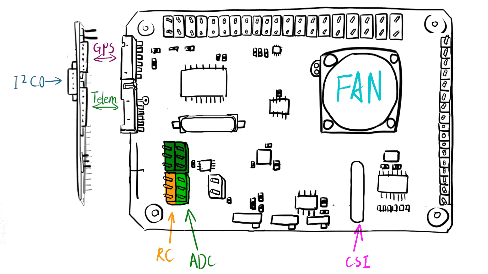

# RPi PilotPi Shield

<LinkedBadge type="warning" text="Experimental" url="../flight_controller/autopilot_experimental.html"/>

:::warning PX4 не виробляє цей (чи будь-який інший) автопілот. Зверніться до [виробника](mailto:lhf2613@gmail.com) щодо підтримки апаратного забезпечення чи питань відповідності вимогам.
:::

_PilotPi_ shield - це повнофункціональне рішення для запуску автопілота PX4 безпосередньо на Raspberry Pi. Він розроблений як низькобюджетна, але високомасштабована платформа з постійними оновленнями як зі сторони Linux, так і PX4. Не потрібні пропрієтарні драйвери, оскільки всі компоненти мають підтримку від спільноти RPi та PX4. PCB та схема також є відкритими.

## Короткий опис

- Підтримувані плати RPi:
  - Raspberry Pi 2B/3B/3B+/4B
- Підтримувані ОС:
  - Raspberry Pi OS
  - Ubuntu Server (armhf/arm64)
- Акселерометр / Гіроскоп:
  - ICM42688P
- Магнітометр:
  - IST8310
- Барометр:
  - MS5611
- PWM:
  - PCA9685
- ADC:
  - ADS1115
- Живлення:
  - Акумулятор 3~6S з вбудованим вимірюванням напруги.
  - Живлення Pi через кабель USB
- Доступність: _підготовка до відправлення_

## Підключення

Shield надає:

- 16 вихідних каналів PWM
- GPS конектор
- Конектор телеметрії
- Зовнішній конектор шини I2C (**Примітка:** конфліктує з камерою CSI)
- Вхідний порт RC (SBUS)
- 3x канали ADC діапазоном 0~5V
- 2\*8 2.54 мм не використовуваний конектор GPIO

Прямий доступ з RPi:

- 4x USB конектори
- CSI конектор(**Примітка:** конфліктує з зовнішньою I2C шиною)
- тощо.

## Рекомендована проводка

## Розпіновка

:::warning
Все ще використовує старі конектори GH1.25.
Проводка сумісна з Pixhawk 2.4.8
:::

### Конектори

#### GPS конектор

Зіставлено на `/dev/ttySC0`

| Пін | Сигнал | Вольт |
| --- | ------ | ----- |
| 1   | VCC    | +5V   |
| 2   | TX     | +3v3  |
| 3   | RX     | +3v3  |
| 4   | NC     | +3v3  |
| 5   | NC     | +3v3  |
| 6   | GND    | GND   |

#### Конектор телеметрії

Зіставлено на `/dev/ttySC1`

| Пін | Сигнал | Вольт |
| --- | ------ | ----- |
| 1   | VCC    | +5V   |
| 2   | TX     | +3v3  |
| 3   | RX     | +3v3  |
| 4   | CTS    | +3v3  |
| 5   | RTS    | +3v3  |
| 6   | GND    | GND   |

#### Зовнішній I2C конектор

Зіставлено на `/dev/i2c-0`

| Пін | Сигнал | Вольт         |
| --- | ------ | ------------- |
| 1   | VCC    | +5V           |
| 2   | SCL    | +3v3(pullups) |
| 3   | SDA    | +3v3(pullups) |
| 4   | GND    | GND           |

#### RC та ADC2/3/4

RC мапиться на `/dev/ttyAMA0` з перемикачем інвертора сигналу на лінії RX.

| Пін | Сигнал | Вольт    |
| --- | ------ | -------- |
| 1   | RC     | +3V3~+5V |
| 2   | VCC    | +5V      |
| 3   | GND    | GND      |

- ADC1 внутрішньо підключений до розподільника напруги для моніторингу напруги батареї.
- ADC2 залишається невикористаним.
- ADC3 може бути підключений до аналогового датчика швидкості.
- ADC4 має перемичку між ADC та VCC, щоб відстежувати рівень напруги системи.

| Пін | Сигнал | Вольт  |
| --- | ------ | ------ |
| 1   | ADCx   | 0V~+5V |
| 2   | VCC    | +5V    |
| 3   | GND    | GND    |

::: info
ADC3 та 4 мають альтернативне джерело VCC
Коли перемикач 'Vref' увімкнено, пін 'VCC' керується REF5050.
:::

#### Вільні GPIO доступні зверху на платі

| Shield Pin | BCM | WiringPi | RPi Pin |
| ---------- | --- | -------- | ------- |
| 1          | 3V3 | 3v3      | 3V3     |
| 2          | 5V  | 5V       | 5V      |
| 3          | 4   | 7        | 7       |
| 4          | 14  | 15       | 8       |
| 5          | 17  | 0        | 11      |
| 6          | 27  | 2        | 13      |
| 7          | 22  | 3        | 15      |
| 8          | 23  | 4        | 16      |
| 9          | 7   | 11       | 26      |
| 10         | 5   | 21       | 29      |
| 11         | 6   | 22       | 31      |
| 12         | 12  | 26       | 32      |
| 13         | 13  | 23       | 33      |
| 14         | 16  | 27       | 36      |
| 15         | 26  | 25       | 37      |
| 16         | GND | GND      | GND     |

### Перемикачі

#### RC Інвертор

Цей перемикач вирішуватиме полярність сигналу лінії RX: `UART_RX = SW xor RC_INPUT`

- On: підходить з SBUS (сигнал інвертований)
- Off: збережено

#### Vref

ADC 3 та 4 матимуть VCC, що кероване:

- Вихід Vref від REF5050, якщо увімкнено
- 5V пін напряму з RPi, якщо вимкнено

#### Режим завантаження

Цей перемикач підключений до Pin22(BCM25). Системний rc script перевірить його значення і вирішить, чи повинен PX4 запускатися разом із завантаженням системи чи ні.

- On: автоматичний запуск PX4
- Off: не запускати PX4

## Швидкий старт для розробника

Зверніться до інструкцій для вашої операційної системи на RPi:

- [Raspberry Pi OS Lite (armhf)](raspberry_pi_pilotpi_rpios.md)
- [Ubuntu Server (arm64 & armhf)](raspberry_pi_pilotpi_ubuntu_server.md)
