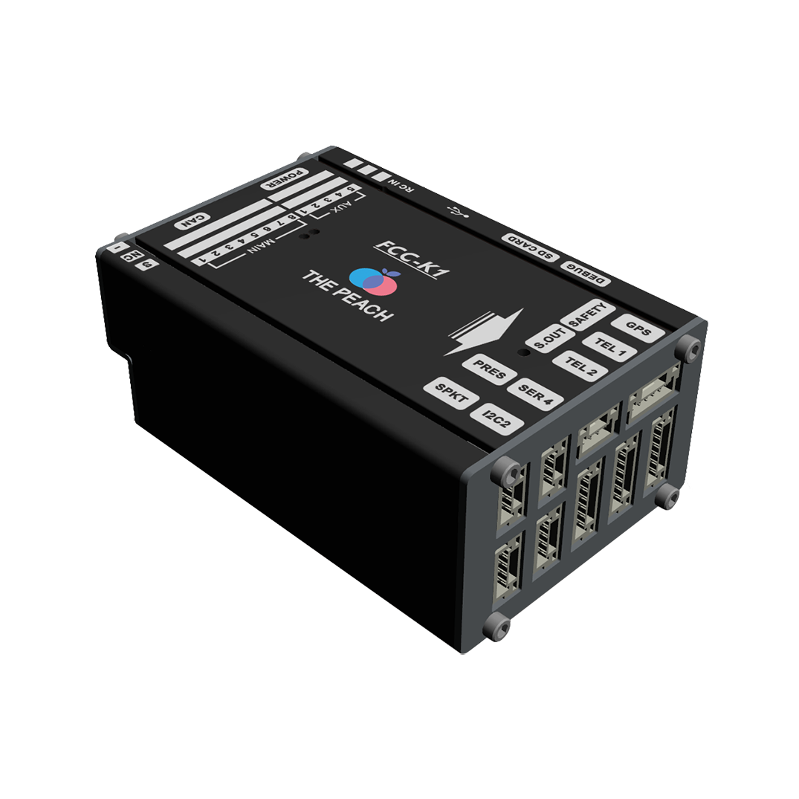
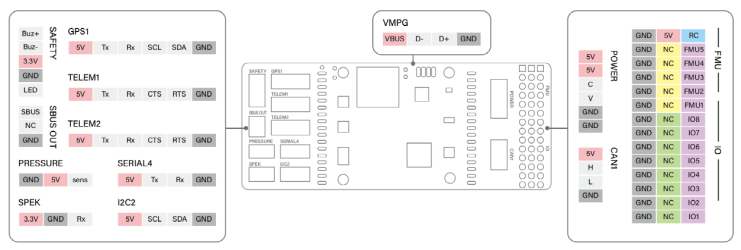

# ThePeach FCC-K1

:::warning
PX4 не виробляє цей (або будь-який інший) автопілот. Зверніться до [виробника](https://thepeach.kr/) щодо підтримки апаратного забезпечення чи питань відповідності вимогам.
:::

**ThePeach FCC-K1** - це просунутий автопілот, розроблений і виготовлений в **ThePeach**.

Вона базується на **Pixhawk-проекті FMUv3** з відкритим апаратним забезпеченням і працює під управлінням **PX4** на **Nuttx OS**.



## Характеристики

- Основний процесор: STM32F427VIT6

  - 32-бітний ARM Cortex-M4, 168 МГц 256 КБ ОЗП 2 МБ флеш-пам'яті

- IO процесор: STM32F100C8T6

  - ARM Cortex-M3, 32 бітний ARM Cortex-M3, 24 МГц, 8КБ SRAM

- Бортові сенсори

  - Акселератор/гіроскоп: ICM-20602
  - Акселератор/гіроскоп/Магнітометр: MPU-9250
  - Барометр: MS5611

- Інтерфейси

  - 8+5 PWM виходів (8 з IO, 5 з FMU)
  - Spektrum DSM / DSM2 / DSM-X Satellite сумісний вхід
  - Futaba S.BUS сумісний вхід та вихід
  - Вхід сигналу PPM sum
  - Аналоговий / PWM вхід RSSI
  - Вихід сервоприводу S.Bus
  - Запобіжний вимикач / LED
  - 4x Порти UART: TELEM1, TELEM2, GPS, SERIAL4
  - 2x I2C порти
  - 1x CAN шина
  - 1x ADC
  - Аналогові входи для напруги / струму з 1 батареї

- Деталі механічної частини
  - Розміри: 40.2 x 61.1 x 24.8 mm
  - Вага: 65г

## З’єднання




## Зіставлення послідовних портів

| UART   | Девайс     | Порт                            |
| ------ | ---------- | ------------------------------- |
| USART1 | /dev/ttyS0 | Відладка процесора вводу-виводу |
| USART2 | /dev/ttyS1 | TELEM1 (керування потоком)      |
| USART3 | /dev/ttyS2 | TELEM2 (керування потоком)      |
| UART4  | /dev/ttyS3 | GPS1                            |
| USART6 | /dev/ttyS4 | PX4IO                           |
| UART7  | /dev/ttyS5 | Консоль відлагодження           |
| UART8  | /dev/ttyS6 | TELEM4                          |

## Номінальна напруга

**Peach FCC-K1** може мати подвійне резервування живлення, якщо до нього під'єднано два джерела живлення. Шини живлення: **POWER** та **USB**.

::: info
Вихідні шини живлення **FMU PWM OUT** і **I/O PWM OUT** не живлять плату контролера польоту (і не отримують від неї живлення). Ви повинні подати живлення на один з роз'ємів **POWER** або **USB**, інакше плата буде знеструмлена.
:::

**Максимальна напруга нормальної роботи**

За таких умов всі джерела живлення будуть використовуватися в цьому порядку для живлення системи:

1. POWER вхід (5В до 5.5В)
2. USB вхід (4.75В до 5.25В)

**Абсолютна максимальна напруга**

За таких умов всі джерела живлення спричиняють постійні пошкодження контролеру польоту.

1. POWER вхід (більше 5.5В)
2. USB вхід (більше 5.5В)

## Збірка прошивки

Щоб зібрати PX4 для цього контролера:

```jsx
make thepeach_k1_default
```

## Де купити

Замовляйте у [ThePeach](http://thepeach.shop/)
