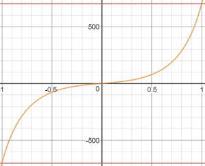

# Acro Режим (Мультикоптер)

&nbsp;&nbsp;

_Режим Acro_ — це режим RC для виконання акробатичних маневрів, наприклад фліпи, креніння та петлі.

Ручки крена, тангажу та риштування керують швидкістю кутової обертання навколо відповідних вісей, а керування тяги безпосередньо передається до розподілу керування. Коли палиці зосереджені, транспортний засіб зупинить обертання, але залишиться в поточному положенні (на боці, перевернутому або що завгодно) та рухатиметься згідно з поточним імпульсом.

<!-- image above incorrect: https://github.com/PX4/PX4-user_guide/issues/182 -->

## Технічний опис

Ручний режим для виконання акробатичних маневрів, наприклад, сальто, перекиди та петлі.

RC Штоки кочення/тангажу/рискання (RPY) контролюють швидкість кутового обертання навколо відповідних осей. Тяга передається напряму до розподілу керування. Коли стіки будуть відцентровані, апарат перестане обертатися, але залишиться у своїй поточній орієнтації (не обов'язково рівний) і рухатиметься відповідно до свого поточного імпульсу.

Потрібен ручний ввід управління (наприклад, за допомогою пульта дистанційного керування, джойстика):

- Крен, Тангаж, Курс: Допомога від автопілота для стабілізації швидкості положення. Положення палиці RC відображає швидкість обертання транспортного засобу в цій орієнтації.
- Throttle: Manual control via RC sticks. RC вхід передається напряму до розподілу керування.

## Stick Input Mapping

The default roll, pitch, and yaw input stick mapping for Acro mode is shown below. The curve enables a high turn rate at maximum stick input for performing acrobatic maneuvers, and a zone of lower sensitivity close to the stick center for small corrections.

This roll and pitch input stick response can be tuned using the [MC_ACRO_EXPO](#MC_ACRO_EXPO) and [MC_ACRO_SUPEXPO](#MC_ACRO_SUPEXPO) "exponential" parameters, while the yaw stick input response is tuned using [MC_ACRO_EXPO_Y](#MC_ACRO_EXPO_Y) and [MC_ACRO_SUPEXPOY](#MC_ACRO_SUPEXPOY). `MC_ACRO_EXPO` and `MC_ACRO_EXPO_Y` tune the curve(s) between a linear and cubic curve as shown below. `MC_ACRO_SUPEXPO` and `MC_ACRO_SUPEXPOY` allow the shape to be further tuned, modifying the width of the area of reduced sensitivity.

 

::: info
The mathematical relationship is:

$$\mathrm{y} = r(f \cdot x^3 + x(1-f)) (1-g)/(1-g |x|)$$, where `f = MC_ACRO_EXPO` or `MC_ACRO_EXPO_Y`, `g = MC_ACRO_SUPEXPO` or `MC_ACRO_SUPEXPOY`,and `r` is the maximum rate.

You can experiment with the relationships [here](https://www.desmos.com/calculator/yty5kgurmc).
:::

## Parameters

| Parameter                                                                                                 | Description                                                                                                                                                                                                                                                                                       |
| --------------------------------------------------------------------------------------------------------- | ------------------------------------------------------------------------------------------------------------------------------------------------------------------------------------------------------------------------------------------------------------------------------------------------- |
| [MC_ACRO_EXPO](../advanced_config/parameter_reference.md#MC_ACRO_EXPO)         | Acro mode "exponential" factor for tuning the stick input curve shape for roll and pitch. Values: 0 Purely linear input curve 1 Purely cubic input curve. Default: 0.69.                                                                                                                          |
| [MC_ACRO_EXPO_Y](../advanced_config/parameter_reference.md#MC_ACRO_EXPO_Y)     | Acro mode "exponential" factor for tuning the stick input curve shape for yaw. Values: 0 Purely linear input curve 1 Purely cubic input curve. Default: 0.69.                                                                                                                                     |
| [MC_ACRO_SUPEXPO](../advanced_config/parameter_reference.md#MC_ACRO_SUPEXPO)   | Acro mode "SuperExpo" factor for refining stick input curve shape for the roll and pitch axes (tuned using `MC_ACRO_EXPO`. Values: 0 Pure Expo function, 0.7 reasonable shape enhancement for intuitive stick feel, 0.95 very strong bent input curve only near maxima have effect. Default: 0.7. |
| [MC_ACRO_SUPEXPOY](../advanced_config/parameter_reference.md#MC_ACRO_SUPEXPOY) | Acro mode "SuperExpo" factor for refining stick input curve shape for the yaw axis (tuned using `MC_ACRO_EXPO_Y`. Values: 0 Pure Expo function, 0.7 reasonable shape enhancement for intuitive stick feel, 0.95 very strong bent input curve only near maxima have effect. Default: 0.7.          |
| [MC_ACRO_P_MAX](../advanced_config/parameter_reference.md#MC_ACRO_P_MAX)       | Max acro pitch rate. Default: 2 turns per second (720.0 deg/s).                                                                                                                                                                                                                                   |
| [MC_ACRO_R_MAX](../advanced_config/parameter_reference.md#MC_ACRO_R_MAX)       | Max acro roll rate. Default: 2 turns per second (720.0 deg/s).                                                                                                                                                                                                                                    |
| [MC_ACRO_Y_MAX](../advanced_config/parameter_reference.md#MC_ACRO_Y_MAX)       | Max acro yaw rate. Default: 1.5 turns per second (540.0 degrees/s).                                                                                                                                                                                                                               |
