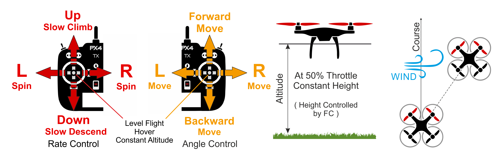

# Режим висоти (мультикоптер)

&nbsp;&nbsp;

_Режим висоти_ - це _відносно_ простий у керуванні режим пульта дистанційного керування, в якому стики крену і тангажу керують рухом транспортного засобу в напрямках вліво-вправо і вперед-назад (відносно "переду" транспортного засобу), стик риштування керує швидкістю обертання над горизонтальною площиною, а дросель контролює швидкість підйому-спуску.

Коли стіки відпускаються/центруються, апарат вирівнюється і підтримує поточну _висоту_. Якщо апарат рухається в горизонтальній площині, він буде продовжувати рух до тих пір, поки будь-який імпульс не буде погашений опором вітру. Якщо дме вітер, літак буде дрейфувати у напрямку вітру.

:::tip
_Режим висоти_ - найбезпечніший ручний режим без GPS для нових льотчиків. Він схожий на [Ручний/Стабілізація](../flight_modes_mc/manual_stabilized.md) режим, але додатково фіксує висоту апарата, коли стіки відпускаються.
:::

Діаграма нижче візуально показує поведінку режиму (для [передавача режиму 2](../getting_started/rc_transmitter_receiver.md#transmitter_modes)).

## Технічний підсумок

РК/ручний режим подібний до режиму [Посібник/Стабілізований (МК)](../flight_modes_mc/manual_stabilized.md), але з _стабілізацією висоти_ (центральні палиці рівняють транспортний засіб і утримують його на фіксованій висоті). Горизонтальне положення транспортного засобу може змінюватися через вплив вітру (або наявного імпульсу).

- Центровані палиці (в межах дедбенду):
  - Рівень RPY прикріплюється до транспортного засобу.
  - Дросель (~50%) утримує поточну висоту стабільно проти вітру.
- Зовнішній центр:
  - Палиці кочення/крену керують кут нахилу у відповідних орієнтаціях, що призводить до відповідного руху ліворуч-праворуч та вперед-назад.
  - Ручка дроселя керує швидкістю вгору/вниз з попередньо визначеною максимальною швидкістю (та швидкістю руху в інших осях).
  - Палиця крену контролює швидкість кутової ротації вище горизонтальної площини.
- Зліт:
  - Після посадки транспортний засіб злетить, якщо важіль керування газом підніметься вище 62.5% від повного діапазону (від низу).
- Висота зазвичай вимірюється за допомогою барометра, який може стати неточним в екстремальних погодних умовах. Транспортні засоби, які включають датчик LIDAR/дальнісний датчик, зможуть керувати висотою з більшою надійністю та точністю.
- Потрібен ручний ввід управління (наприклад, за допомогою пульта дистанційного керування, джойстика).
  - Крен, Тангаж: Допомога від автопілота для стабілізації польоту. Положення палиці RC відображає орієнтацію транспортного засобу.
  - Газ: Допомога від автопілота для утримання позиції проти вітру.
  - Курс: Допомога від автопілота для стабілізації швидкості польоту. Положення палиці RC відображає швидкість обертання транспортного засобу в цій орієнтації.

## Параметри

На режим впливають наступні параметри:

| Параметр                                                                                                    | Опис                                                                                                                                                                                                                                                                                                       |
| ----------------------------------------------------------------------------------------------------------- | ---------------------------------------------------------------------------------------------------------------------------------------------------------------------------------------------------------------------------------------------------------------------------------------------------------- |
| [MPC_Z_VEL_MAX_UP](../advanced_config/parameter_reference.md#MPC_Z_VEL_MAX_UP) | Максимальна швидкість вертикального підйому. За замовчуванням: 3 m/s.                                                                                                                                                                                                                                      |
| [MPC_Z_VEL_MAX_DN](../advanced_config/parameter_reference.md#MPC_Z_VEL_MAX_DN) | Максимальна швидкість вертикального спуску. За замовчуванням: 1 m/s.                                                                                                                                                                                                                                       |
| `RCX_DZ`                                                                           | RC зона мертвої зони для каналу X. Значення X для керування газом буде залежати від значення [RC_MAP_THROTTLE](../advanced_config/parameter_reference.md#RC_MAP_THROTTLE). Наприклад, якщо газ - це канал 4, то [RC4_DZ](../advanced_config/parameter_reference.md#RC4_DZ) вказує діапазон нечутливості. |
| `MPC_XXXX`                                                                         | Більшість параметрів MPC_xxx впливають на поведінку польоту в цьому режимі (принаймні до певної міри). Наприклад, [MPC_THR_HOVER](../advanced_config/parameter_reference.md#MPC_THR_HOVER) визначає тягу, при якій транспортний засіб буде утримуватися в повітрі.                                       |
