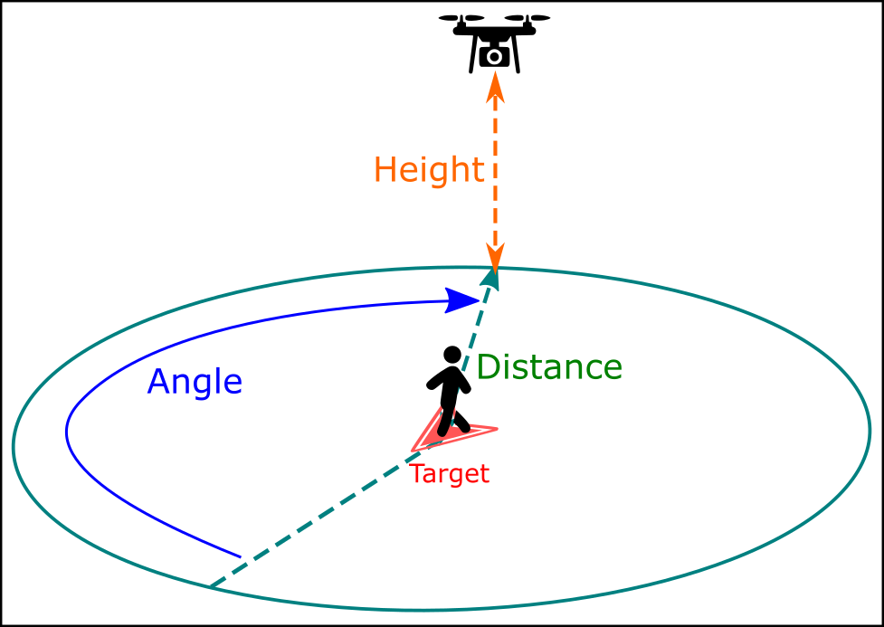
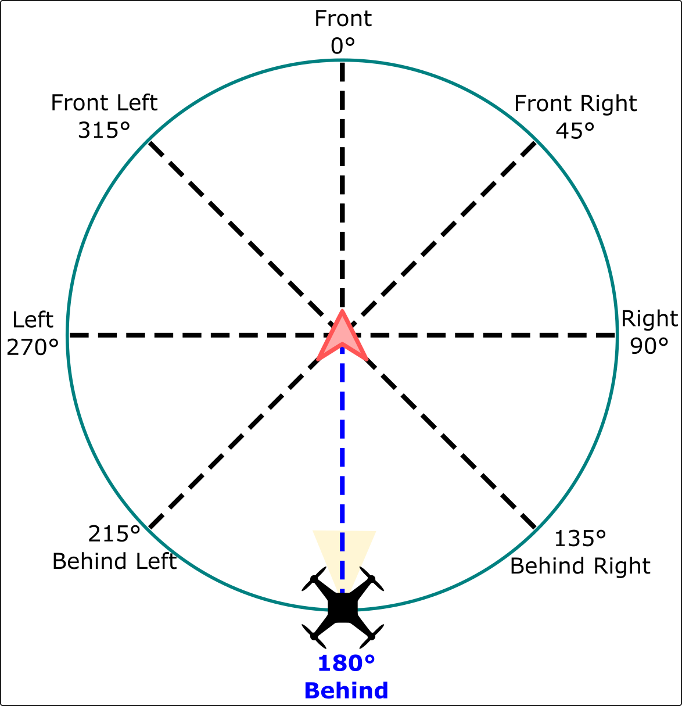
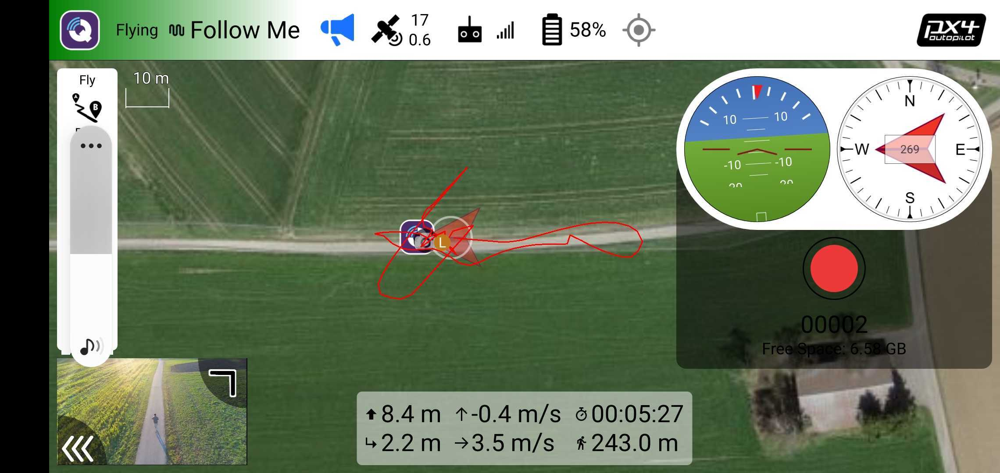
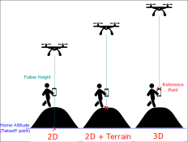

# Режим Follow-Me Слідуй за мною (мультикоптер)

Режим _Follow Me_ дозволяє багтротору автономно утримувати позицію та висоту відносно іншої системи, яка транслює свою позицію (і, за бажанням, швидкість) за допомогою повідомлення MAVLink [FOLLOW_TARGET](https://mavlink.io/en/messages/common.html#FOLLOW_TARGET).

:::info

- Режим є автоматичним - для керування транспортним засобом не потрібне _втручання_ користувача.
- Режим потребує принаймні дійсної локальної оцінки позиції (не потребує глобальної позиції).
  - Літаючі апарати не можуть перемикатися в цей режим без валідної локальної позиції.
  - Літаючі транспортні засоби будуть аварійно переходити в безпечний режим, якщо втрачають оцінку позиції.
- Режим перешкоджає взброєнню (транспортний засіб повинен бути включеним при переході в цей режим).
- Режим вимагає, щоб швидкість вітру та час польоту були в межах допустимих значень (вказано через параметри).
- Цей режим в даний час підтримується лише на багатокоптерних (або VTOL у режимі MC).
- Також обраний об'єкт повинен мати можливість постачання інформації про позицію.
- Режим слідування підтримується _QGroundControl_ на пристроях Android з модулем GPS, та [MAVSDK](#follow-me-with-mavsdk).

<!-- https://github.com/PX4/PX4-Autopilot/blob/release/1.15/src/modules/commander/ModeUtil/mode_requirements.cpp -->

:::

## Загальний огляд

Транспортний засіб автоматично почне розвертатися, щоб вирівнятися з ціллю та слідувати за нею з вказаного [відносного кута](#FLW_TGT_FA), [відстані](#FLW_TGT_DST) та [висоти](#FLW_TGT_HT) та висоти, залежно від [режиму керування висотою](#FLW_TGT_ALT_M).

За замовчуванням він буде слідувати безпосередньо за цільовим об'єктом на відстані 8 метрів, і на висоті 8 метрів вище домашньої (озброєної) позиції.

Користувачі можуть налаштувати кут слідування, висоту та відстань за допомогою пульта дистанційного керування, як показано вище:

- _Керування Висотою_ здійснюється за допомогою введення `up-down` ("Ручка газу"). Центруйте палицю, щоб тримати відстеження цілі на постійній висоті. Підніміть або опустіть палицю, щоб налаштувати висоту.
- _Відстань слідування_ керується вхідним параметром `вперед-назад` ("Крен"). Тиснення палиці вперед збільшує відстань слідування, витягування назад зменшує відстань.
- _Слідкуйте за кутом_ керується за допомогою введення `left-right` ("Roll"). Рух відбувається з точки зору користувача, тому якщо ви стоїте обличчям до дрона й рухаєте палицю ліворуч, він буде рухатися ліворуч. Зверху, якщо ви рухатимете палицю вліво, квадрокоптер буде рухатися проти годинникової стрілки.

  Follow Angle визначається як збільшення в годинниковому напрямку відносно напрямку руху цілі (який дорівнює 0 градусів)

  

:::info
Кут, висота та відстань, встановлені за допомогою пульта керування RC, відкидаються, коли ви виходите з режиму слідування за мною. Якщо ви вийдете з режиму "Follow-Me" й активуєте його знову, значення будуть скинуті до їх типових значень.
:::

Відео-демонстрація:

@[youtube](https://youtu.be/csuMtU6seXI?t=155)

### Заходи безпеки

:::warning
**Режим слідування** не реалізує жодного типу уникнення перешкод. Спеціальну увагу слід звертати при використанні цього режиму.
:::

Наступні попередження про польот слід дотримуватися:

- Режим слідування за мною слід використовувати тільки в широких відкритих місцях, які не перешкоджають дерева, електропроводи, будинки тощо.
  - Встановіть висоту [слідуй за висотою](#FLW_TGT_HT) на значення, яке вище будь-яких оточуючих перешкод. За _замовчуванням_ це є 8 метрів вище домашньої (озброювання) позиції.
- Це _безпечніше_ вручну піднятися на безпечну висоту перед активацією режиму 'слідуй за мною', ніж активувати режим 'слідуй за мною', коли приземлилися (навіть якщо режим реалізує автоматичний зліт).
- Надайте вашому транспортному засобу достатньо місця для зупинки, особливо коли він рухається швидко.
- Будьте готові повернутися до режиму позиціонування, якщо щось піде не так, особливо коли ви використовуєте режим слідування за мною вперше.
- Ви не можете вимкнути режим 'слідуй за мною', використовуючи рухи палицею RC (оскільки це налаштує властивості). Вам потрібно мати GroundStation, яка може відправляти сигнали перемикання режиму польоту або налаштований перемикач режиму польоту на вашому RC передавачі.

### Дотримуйтесь мене з QGroundControl

Режим _Follow Me_ підтримується за допомогою _QGroundControl_ як цілі на апаратному засобі наземної станції, що має модуль GPS. Рекомендована конфігурація - це Android-пристрій з підтримкою USB OTG з двома телеметричними радіостанціями.

Для налаштування режиму _Дотримуйся мене_:

- Підключіть телеметричне радіо до пристрою земної станції та інше до транспортного засобу (це дозволяє передавати інформацію про позицію між двома радіостанціями).
- Вимкніть режим сну на вашому пристрої Android:
  - Цей параметр зазвичай можна знайти за адресою: **Налаштування > Відображення**.
  - Важливо, щоб ви встановили свій пристрій на Android, щоб не спав, оскільки це може призвести до того, що сигнал GPS перестане випромінюватися через регулярні інтервали.
- Зліт на висоту щонайменше 2-3 метри (рекомендується навіть якщо підтримується автоматичний зліт).
  - Поставте транспортний засіб на землю, натисніть безпечний перемикач і відійдіть принаймні на 10 метрів.
  - Збройте транспортний засіб і злітайте.
- Перемикайтеся в режим слідування за мною.
  - Коптер спочатку підніметься на мінімальну безпечну висоту 1 метр над землею або додому, залежно від наявності датчика відстані.
  - Він підніметься, поки не буде на висоті 3 метри в межах [висоти слідування](#FLW_TGT_HT), щоб уникнути можливих зіткнень перед рухом у горизонтальному напрямку.
  - Коптер завжди буде коригувати свою орієнтацію, щоб бути спрямованим на ціль

На цьому етапі ви можете почати рухатися, і дрон буде слідувати за вами.

Режим було протестовано на наступних пристроях Android:

- Galaxy S10
- Планшет Nexus 7

### Дотримуйтесь мене з MAVSDK

[MAVSDK](https://mavsdk.mavlink.io/develop/en/api_reference/classmavsdk_1_1_follow_me.html) підтримує [Follow Me](https://mavsdk.mavlink.io/main/en/cpp/guide/follow_me.html), дозволяючи створювати додаток для дрона, який є ціллю Follow Me.

Для отримання додаткової інформації див. документацію класу [Follow Me](https://mavsdk.mavlink.io/main/en/cpp/guide/follow_me.html), а також [приклад Follow Me](https://mavsdk.mavlink.io/main/en/cpp/examples/follow_me.html).

:::info
MAVSDK наразі не рекомендується через помилку ([MAVSDK#1756](https://github.com/mavlink/MAVSDK/issues/1756), коли той самий повідомлення іноді відправляється двічі. Це може заплутати оцінювач цільового положення та швидкості.
:::

## Налаштування

### Режим контролю висоти

Режим керування висотою визначає, чи є висота транспортного засобу відносно домашньої позиції, висоти місцевості або висоти, звітованої ціллю слідування.

- `2D відстеження` (режим [висоти за замовчуванням](#FLW_TGT_ALT_M)) дозволяє дрону слідувати на висоті відносно фіксованої домашньої позиції (висота зльоту). Відносна відстань до дрона до цілі зміниться, коли ви підніметесь та опуститесь (використовуйте обережно в гірській місцевості).

- `2D + Terrain` робить дрона слідувати на фіксованій висоті відносно місцевості під ним, використовуючи інформацію від датчика відстані.

  - Якщо у транспортному засобі немає датчика відстані, слідування буде ідентичним до `2D відстеження`.
  - Датчики відстані не завжди точні, і транспортні засоби можуть бути "скачущими" під час польоту в цьому режимі.
  - Зверніть увагу, що висота вимірюється відносно землі під транспортним засобом, а не цільового об'єкта. Дрон може не слідувати за змінами висоти цілі!

- Режим відстеження `3D tracking` дозволяє дрону слідувати на висоті відносно цілі відстеження, як постачається його GPS-датчиком. Це адаптується до змін висоти цілі, наприклад, коли ви йдете вгору по пагорбу.

:::warning
Не встановлюйте режим **Висоти ([FLW_TGT_ALT_M](#FLW_TGT_ALT_M)**) на `3D відстеження` при використанні QGC для Android (або загалом, без перевірки, що [FOLLOW_TARGET.altitude](https://mavlink.io/en/messages/common.html#FOLLOW_TARGET) є значенням AMSL).

Визначення повідомлення MAVLink [FOLLOW_TARGET](https://mavlink.io/en/messages/common.html#FOLLOW_TARGET) передбачає висоту відносно середнього рівня моря (AMSL), тоді як QGC на Android надсилає висоту відносно геодезичного еліпсоїда GPS. Це може відрізнятися на 200 метрів!

Дрон, ймовірно, не впаде через вбудований мінімальний обмежений безпечний висотний ліміт (1 метр), але він може літати набагато вище, ніж очікувалося. Якщо висота дрона значно відрізняється від зазначеної, припускайте, що вихідна висота наземної станції неправильна, і використовуйте 2D відстеження.
:::

### Параметри

Стандартна поведінка може бути налаштована за допомогою параметрів:

| Параметр                                                                                                | Опис                                                                                                                                                                                                                                                                                                                                                                            |
| ------------------------------------------------------------------------------------------------------- | ------------------------------------------------------------------------------------------------------------------------------------------------------------------------------------------------------------------------------------------------------------------------------------------------------------------------------------------------------------------------------- |
| [FLW_TGT_HT](../advanced_config/parameter_reference.md#FLW_TGT_HT)           | Висота автомобіля, який супроводжує, у метрах. Зверніть увагу, що ця висота фіксована _відносно дому/положення озброєння_ (а не цільового транспортного засобу). Стандартна та мінімальна висота - 8 метрів (близько 26 футів)                                                                                                                                                  |
| [FLW_TGT_DST](../advanced_config/parameter_reference.md#FLW_TGT_DST)         | Розділення транспортного засобу/станції на землі у _горизонтальній_ (x, y) площині, у метрах. Мінімально допустимий інтервал - 1 метр. Стандартна відстань - 8 метрів (близько 26 футів).                                                                                                                                                                                       |
| [FLW_TGT_FA](../advanced_config/parameter_reference.md#FLW_TGT_FA)           | Слідкуйте за кутом відносно напрямку руху цілі, в градусах. Якщо введено значення поза межами діапазону [`-180.0`, `+180.0`], воно буде автоматично звернуто і застосовано (наприклад, `480.0` буде конвертовано в `120.0`)                                                                                                                                                     |
| [FLW_TGT_ALT_M](../advanced_config/parameter_reference.md#FLW_TGT_ALT_M)     | Режим керування висотою.  - `0` = 2D Відстеження (Висота фіксована)  - `1` = 2D Відстеження + Слідування за рельєфом  - `2` = 3D Відстеження висоти GPS цільової точки **УВАГА: [НЕ ВИКОРИСТОВУВАТИ З QGC для Android](#altitude-control-mode)**.                                                                                                    |
| [FLW_TGT_MAX_VEL](../advanced_config/parameter_reference.md#FLW_TGT_MAX_VEL) | Максимальна відносна швидкість для орбітального руху навколо цілі, у м/с. - 10 м/с виявився оптимальним показником для агресивності проти плавності. - Встановлення більш високого значення означає, що траєкторія орбіти навколо цілі буде рухатися швидше, але якщо дрон фізично не здатний досягти такої швидкості, це призводить до агресивної поведінки. |
| [FLW_TGT_RS](../advanced_config/parameter_reference.md#FLW_TGT_RS)           | Динамічний алгоритм фільтрації, який реагує на фільтрацію вхідної цільової локації. - `0.0` = Дуже чутливий до рухів та шумних оцінок позиції, швидкості та прискорення. - `1.0` = Дуже стабільний, але не реагує на фільтр                                                                                                                                   |

### Поради та хитрощі

1. Встановіть відстань [слідування](#FLW_TGT_DST) більше 12 метрів (8 метрів є "рекомендованим мінімумом").

   Існує вроджений вплив позиції (3 ~ 5 метрів) між цільовим об'єктом та GPS-датчиком дрона, що змушує дрон слідувати 'примарній цілі' десь поблизу фактичної цілі. Це стає більш очевидним, коли відстань слідування дуже мала. Ми рекомендуємо встановити достатньо велику відстань, щоб відхилення GPS не було значним.

2. Швидкість, з якою ви можете змінювати кут слідування, залежить від параметра [максимальної тангенціальної швидкості](#FLW_TGT_MAX_VEL).

   Експеримент показує, що значення між `5 м/с` та `10 м/с` зазвичай є придатними.

3. Використовуючи коригування RC для висоти, відстані та кута, ви можете отримати деякі креативні знімки камери.

   @[youtube](https://www.youtube.com/watch?v=o3DhvCL_M1E) Це відео демонструє перспективу виду Google Earth, змінюючи висоту на приблизно 50 метрів (високо), відстань на 1 метр (близько). Що дозволяє перспективу, як знято з супутника.

## Відомі проблеми

- Телеметричне радіо SiK 915 МГц [відомо](../telemetry/sik_radio.md), що заважає сигналу GPS, який отримують деякі пристрої Android. Тримайте радіо та пристрій на базі Android якомога подалі один від одного при використанні режиму слідування цілі, щоб уникнути перешкод.
- QGC для Android повідомляє про неправильну висоту (висота над еліпсоїдом, а не над рівнем моря). Висота може бути відхиленою на до 200м!
