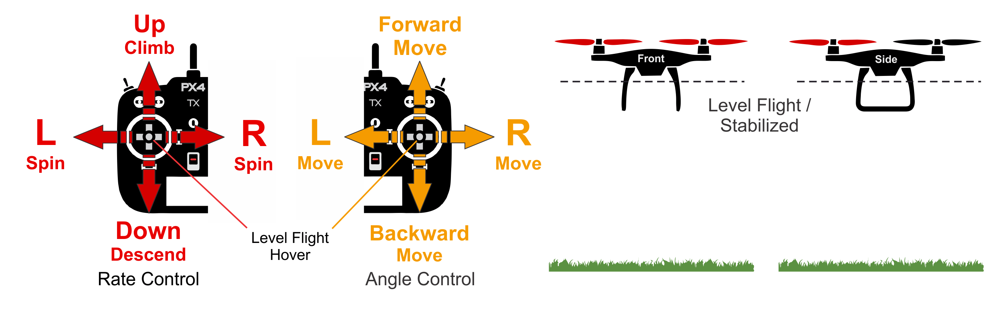

# Ручний/стабілізований режим (Multicopter)

&nbsp;&nbsp;

Режим _Ручний/Стабілізація_ стабілізує мультикоптер, коли стіки дистанційного керування відцентровані. Щоб ручно перемістити/полетіти на транспортному засобі, ви пересуваєте палички за межі центру.

:::info
Цей режим мультикоптера активується, якщо ви встановили режими _Ручний_ або _Стабілізований_.
:::

Під час ручного керування рульові палиці керують _кутом_ рухомого засобу (положенням) навколо відповідних осей, рульова палиця керує швидкістю обертання над горизонтальною площиною, а педаль газу керує висотою / швидкістю.

Як тільки ви відпустите ручки керування, вони повернуться до центральної мертвої зони. Багатороторник вирівняється і зупиниться, як тільки палиці кочення та тангажу будуть в центрі. Автомобіль потім буде зависати на місці / підтримувати висоту - за умови, що він належним чином збалансований, ручка газу налаштована належним чином (див. [нижче](#params)), й не застосовуються зовнішні сили (наприклад, вітер). Літальний апарат буде дрейфувати в напрямку будь-якого вітру, і вам доведеться керувати реостатом, щоб утримати висоту.

## Технічний опис

Режим RC, у якому центровані стіки вирівнюють транспортний засіб (тільки - позиція не стабілізується).

Команди пілота передаються як команди кутів крену та тангажу, а рискання як команда швидкості. Тяга масштабується (див. [нижче](#params)) і передається напряму до розподілу керування. Автопілот контролює положення, це означає що він регулює кути крену та тангажу до нуля коли органи керування пульту РК центровані всередині мертвої зони контролера (як наслідок вирівнюючи положення). Автопілот не компенсує дрейф через вітер (або інші джерела).

- Центровані палиці (в межах дедбенду):
  - Рівень ковзання/крена прикріплюється до транспортного засобу.
- Зовнішній центр:
  - Палиці кочення/крену керують кутом нахилу у цих орієнтаціях, що призводить до відповідного руху ліворуч-праворуч та вперед-назад.
  - Ручка дроселя керує швидкістю вгору/вниз (та швидкістю руху в інших осях).
  - Палиця крену контролює швидкість кутової ротації вище горизонтальної площини.
- Потрібен ручний ввід управління (наприклад, за допомогою пульта дистанційного керування, джойстика).
  - Крен, Тангаж: Допомога від автопілота для стабілізації поклику. Положення палиці RC відображає орієнтацію транспортного засобу.
  - Дросель: Ручне керування за допомогою палиць RC. RC ввід передається напряму до розподілу керування.
  - Курс: Допомога від автопілота для стабілізації швидкості польоту. Положення палиці RC відображає швидкість обертання транспортного засобу в цій орієнтації.

## Параметри

| Параметр                                                                                            | Опис                                                                                                                                                                                                                                                                                                                                                                                                                                                                                                                                                                                                                                                                                                                                                                                     |
| --------------------------------------------------------------------------------------------------- | ---------------------------------------------------------------------------------------------------------------------------------------------------------------------------------------------------------------------------------------------------------------------------------------------------------------------------------------------------------------------------------------------------------------------------------------------------------------------------------------------------------------------------------------------------------------------------------------------------------------------------------------------------------------------------------------------------------------------------------------------------------------------------------------- |
| [MPC_THR_HOVER](../advanced_config/parameter_reference.md#MPC_THR_HOVER) | Наведення дроселя, яке видається, коли важіль дроселя знаходиться в центрі, а `MPC_THR_CURVE` встановлено ​​в значення за замовчуванням.                                                                                                                                                                                                                                                                                                                                                                                                                                                                                                                                                                                                                                                 |
| [MPC_THR_CURVE](../advanced_config/parameter_reference.md#MPC_THR_CURVE) | Визначає масштаб ручки газу. За замовчуванням це встановлено на **Масштабування до утримування тяги**, що означає, що коли дросельна важіль у центрі, виводиться налаштована тяга утримування (`MPC_THR_HOVER`), а вхід важеля лінійно масштабується вище і нижче цього (дозволяючи плавний перехід між стабілізованим та регулюванням висоти/позиції контролю).  На потужних транспортних засобах керування порогу може бути дуже низьким (наприклад, нижче 20%), тому що масштабування спотворює вхід газу - тобто тут 80% тяги керується лише верхньою половиною входу палиці, а 20% - нижнім. Якщо потрібно `MPC_THR_CURVE` може бути встановлений ​​на **No Rescale**, щоб не було масштабування (вхід стіку до картографування польоту є незалежним від `MPC_THR_HOVER`). |
