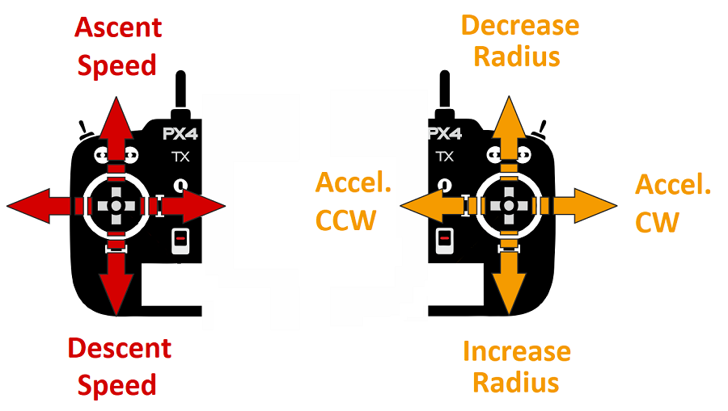

# Орбіта (Мультикоптер)

&nbsp;

Мод керованого польоту _Orbit_ дозволяє вам керувати багтротором (або VTOL у режимі багтротора) у кілі навколо певного місця, [автоматично](https://mavlink.io/en/messages/common.html#ORBIT_YAW_BEHAVIOUR) розвертаючись так, щоб завжди бути спрямованим на центр.

:::info

- Режим автоматичний - для керування автомобілем _не потрібно_ втручання користувача.
- Режим потребує принаймні дійсної локальної оцінки позиції (не потребує глобальної позиції).
  - Літаючі транспортні засоби не можуть переключатися на цей режим без глобального положення.
  - Літаючі транспортні засоби перейдуть в режим аварійної безпеки, якщо втратять оцінку положення.
- Режим перешкоджає зброюванню (транспортний засіб повинен бути зброєний при переході на цей режим).
- Режим вимагає, щоб швидкість вітру та час польоту були в межах допустимих значень (вказано через параметри).
- Цей режим в даний час підтримується лише на багатокоптерних (або VTOL у режимі MC).
- Рух палиці RC може контролювати підйом/спуск та швидкість та напрямок оберту.
- Режим може бути викликаний за допомогою команди MAVLink [MAV_CMD_DO_ORBIT](https://mavlink.io/en/messages/common.html#MMAV_CMD_DO_ORBIT).

<!-- https://github.com/PX4/PX4-Autopilot/blob/main/src/modules/commander/ModeUtil/mode_requirements.cpp -->

:::

## Загальний огляд

_QGroundControl_ (або інші сумісні GCS або MAVLink API) _потрібно_ для увімкнення режиму, а також для встановлення центральної позиції, початкового радіусу та висоти орбіти. Після активації транспортний засіб полетить якнайшвидше до найближчої точки на запланованій траєкторії кола і виконає повільний (1 м/с) ходовий оберт навколо запланованого кола за годинниковою стрілкою, обертаючись до центру.

Інструкції з того, як почати орбіту, можна знайти тут: [FlyView > Orbit Location](https://docs.qgroundcontrol.com/master/en/qgc-user-guide/fly_view/fly_view.html#orbit) (посібник _QGroundControl_).

:::info
Використання керування RC є _необов'язковим_. Якщо відсутній керування RC, орбіта буде продовжуватися, як описано вище. RC керування не може бути використане для запуску режиму (якщо ви перемикаєтеся на режим через RC, він буде просто працювати у мирі).
:::

RC керування може бути використане для зміни висоти орбіти, радіусу, швидкості та напрямку обертання:

- **Лівий джойстик:**
  - _вгору/вниз:_ контролює швидкість підйому/спуску, як у режимі [Положення](../flight_modes_mc/position.md). Коли в центрі мертвої зони, висота заблокована.
  - _ліворуч/праворуч:_ без ефекту.
- **Лівий джойстик:**
  - _ліворуч/праворуч:_ контролює прискорення орбіти у годинниковому/противогодинниковому напрямку. Коли центрується, поточна швидкість заблокована.
    - Максимальна швидкість становить 10 м/с і подальше обмеження з метою збереження центростремального прискорення нижче 2 м/с².
  - _вгору/вниз:_ контролює радіус орбіти (менший/більший). Коли центрується, поточний радіус заблокований.
    - Мінімальний радіус - 1м. Максимальний радіус становить 100 м.

Діаграма нижче візуально показує поведінку режиму (для [передавача режиму 2](../getting_started/rc_transmitter_receiver.md#transmitter_modes)).

Режим можна припинити, переключившись на будь-який інший режим польоту (використовуючи RC або QGC).

## Параметри/Обмеження

Немає жодних параметрів, специфічних для режиму орбіти.

Наступні обмеження зафіксовані у вихідному коді:

- Початкове / типове обертання 1 м/с у годинному напрямку.
- Максимальне прискорення обмежено до 2 м/с^2, з пріоритетом на збереження командованої траєкторії кола, а не командованої швидкості на землі (тобто транспортний засіб сповільнюватиметься, щоб досягти правильного кола, якщо прискорення перевищує 2 м/с^2).
- Максимальний радіус - 100м.

## Повідомлення MAVLink (розробники)

Режим орбіти використовує наступні команди MAVLink:

- [MAV_CMD_DO_ORBIT](https://mavlink.io/en/messages/common.html#MAV_CMD_DO_ORBIT) - Розпочати орбіту з вказаною центральною точкою, радіусом, напрямком, висотою, швидкістю та [напрямком yaw](https://mavlink.io/en/messages/common.html#ORBIT_YAW_BEHAVIOUR) (транспортний засіб за замовчуванням повертається до центру орбіти).
- [СТАН ВИКОНАННЯ ОРБІТИ](https://mavlink.io/en/messages/common.html#ORBIT_EXECUTION_STATUS) - Статус орбіти, випущений під час оберту для оновлення GCS поточних параметрів орбіти (ці параметри можуть бути змінені контролером RC).
