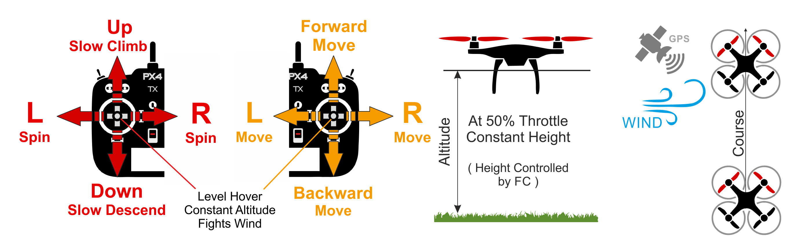

# Режим позиції (мультикоптер)

&nbsp;&nbsp;

_Положення_ - це відносно простий у керуванні режим, в якому стіки крену і тангажу керують прискоренням по землі вліво-вправо і вперед-назад (аналогічно педалі прискорювача автомобіля), а дросель - швидкістю підйому-спуску. Коли стіки відпускаються/центруються, автомобіль активно гальмує, вирівнюється і фіксується в певному положенні в 3D-просторі — компенсуючи вітер та інші сили. При повному відхиленні рукоятки транспортний засіб спочатку прискорюється з [MPC_ACC_HOR_MAX](#MPC_ACC_HOR_MAX), поступово зменшуючи швидкість до досягнення кінцевої швидкості [MPC_VEL_MANUAL](#MPC_VEL_MANUAL).

:::tip
Режим позиціонування є найбезпечнішим ручним режимом для нових льотчиків. На відміну від [Висота](../flight_modes_mc/altitude.md) і [Ручний/Стабілізація](../flight_modes_mc/manual_stabilized.md) режимів автомобіль зупиниться, коли стіки будуть відцентровані, а не буде безперервно продовжувати рух, поки не буде сповільнений опором вітру.
:::

Діаграма нижче візуально показує поведінку режиму (для передавача режиму 2).

### Посадка

Приземлення в цьому режимі легко:

1. Розмістіть дрон горизонтально над місцем посадки, використовуючи палиці кочення та тангажу.
1. Відпустіть рукоятку кочення і тангажу та дайте їй достатньо часу, щоб повністю зупинитися.
1. Потягніть палицю газу вниз обережно, доки транспортний засіб не доторкнеться до землі.
1. Тягніть палицю газу до максимуму, щоб полегшити і прискорити виявлення землі.
1. Транспортний засіб знизить тягу пропелера, виявить землю та [автоматично роззброїться](../advanced_config/prearm_arm_disarm.md#auto-disarming) (за замовчуванням).

:::warning
У дуже рідкісних випадках на добре налаштованому транспортному засобі можуть виникнути проблеми з посадкою.

- Якщо транспортний засіб не зупиняється горизонтально:
  - Ви все ще можете приземлитися під контролем у режимі [Висота](../flight_modes_mc/altitude.md). Підхід такий самий, як у вищезазначеному випадку, за винятком того, що вам потрібно вручну забезпечити, щоб транспортний засіб залишався вище місця посадки, використовуючи руль і підйомний механізм.
  - Після приземлення перевірте орієнтацію GPS та магнітометра, калібруйте.
- Якщо транспортний засіб не виявляє землю/посадку і не роззброюється:
  - Після того як транспортний засіб знаходиться на землі, перемикайтеся на режим [Ручного/Стабілізованого режиму](../flight_modes_mc/manual_stabilized.md), тримаючи палицю газу вниз, і вручну дезармуйте за допомогою жесту або іншої команди. За потреби ви також можете використовувати вимикач вимкнення, коли транспортний засіб вже знаходиться на землі.

:::

## Технічний підсумок

Режим RC, де рульові, кренові, керування газом (RPT) керують рухом у відповідних осях/напрямках. Центральні палиці рівняють транспортний засіб і утримують його на фіксованій висоті та позиції проти вітру.

- Центровані важелі рулів, крену, газу (в мертвій зоні RC [MPC_HOLD_DZ](../advanced_config/parameter_reference.md#MPC_HOLD_DZ)) утримують позицію x, y, z стійкою проти будь-яких перешкод, таких як вітер.
- Зовнішній центр:
  - Ручки кочення/крена керують горизонтальним прискоренням над землею у ліво-правому та передньо-задньому напрямках транспортного засобу (відповідно).
  - Палиця дросельного клапана контролює швидкість підйому-спуску.
  - Палиця крену контролює швидкість кутової ротації вище горизонтальної площини.
- Зліт:
  - Після посадки транспортний засіб злетить, якщо важіль керування газом підніметься вище 62.5% від повного діапазону (від низу).
- Потрібна глобальна оцінка положення.
- Потрібен ручний ввід управління (наприклад, за допомогою пульта дистанційного керування, джойстика).
  - Крен, Тангаж, Газ: Допомога від автопілота для утримання позиції проти вітру.
  - Курс: Допомога від автопілота для стабілізації швидкості кутового руху. Положення палиці RC відображає швидкість обертання транспортного засобу в цій орієнтації.

### Parameter

Усі параметри у групі [Керування позицією багатокоптера](../advanced_config/parameter_reference.md#multicopter-position-control) є відповідними. Декілька параметрів, на які варто звернути увагу, перераховані нижче.

| Параметр                                                                                                    | Опис                                                                                                                                                                                                                                                                                                                  |
| ----------------------------------------------------------------------------------------------------------- | --------------------------------------------------------------------------------------------------------------------------------------------------------------------------------------------------------------------------------------------------------------------------------------------------------------------- |
| [MPC_HOLD_DZ](../advanced_config/parameter_reference.md#MPC_HOLD_DZ)             | Мертва зона палиць, де активовано утримання позиції. За замовчуванням: 0.1 (10% від повного діапазону палиці).                                                                                                                                                                                                        |
| [MPC_Z_VEL_MAX_UP](../advanced_config/parameter_reference.md#MPC_Z_VEL_MAX_UP) | Максимальна швидкість вертикального підйому. Значення за замовчуванням: 3 м/с.                                                                                                                                                                                                                                        |
| [MPC_Z_VEL_MAX_DN](../advanced_config/parameter_reference.md#MPC_Z_VEL_MAX_DN) | Максимальна швидкість вертикального спуску. За замовчуванням: 1 m/s.                                                                                                                                                                                                                                                  |
| [MPC_LAND_ALT1](../advanced_config/parameter_reference.md#MPC_LAND_ALT1)         | Висота для спрацювання першої фази повільної посадки. Нижче цієї висоти швидкість спуску обмежується значенням між [MPC_Z_VEL_MAX_DN](#MPC_Z_VEL_MAX_DN) (або `MPC_Z_V_AUTO_DN`) та [MPC_LAND_SPEED](#MPC_LAND_SPEED). Значення повинно бути вище, ніж [MPC_LAND_ALT2](#MPC_LAND_ALT2). За замовчуванням 10м. |
| [MPC_LAND_ALT2](../advanced_config/parameter_reference.md#MPC_LAND_ALT2)         | Висота для другої фази повільної посадки. Нижче цієї висоти швидкість спуску обмежується до [`MPC_LAND_SPEED`](#MPC_LAND_SPEED). Значення повинно бути нижче, ніж "MPC_LAND_ALT1". Значення за замовчуванням: 5m.                                                                                                   |
| `RCX_DZ`                                                                           | RC зона мертвої зони для каналу X. Значення X для керування газом буде залежати від значення [RC_MAP_THROTTLE](../advanced_config/parameter_reference.md#RC_MAP_THROTTLE). Наприклад, якщо дросель - це канал 4, то [RC4_DZ](../advanced_config/parameter_reference.md#RC4_DZ) вказує діапазон нечутливості.        |
| `MPC_XXXX`                                                                         | Більшість параметрів MPC_xxx впливають на поведінку польоту в цьому режимі (принаймні до певної міри). Наприклад, [MPC_THR_HOVER](../advanced_config/parameter_reference.md#MPC_THR_HOVER) визначає тягу, при якій транспортний засіб буде утримуватися в повітрі.                                                  |
| [MPC_POS_MODE](../advanced_config/parameter_reference.md#MPC_POS_MODE)           | Стратегія перекладу введення на рух. З версії PX4 v1.12 за замовчуванням (4) є те, що положення палиці контролює прискорення (аналогічно педалі прискорювача автомобіля). Інші параметри дозволяють відхилення палиці безпосередньо контролювати швидкість над землею, з і без згладжування та обмежень прискорення.  |
| [MPC_ACC_HOR_MAX](../advanced_config/parameter_reference.md#MPC_ACC_HOR_MAX)     | Максимальне горизонтальне прискорення.                                                                                                                                                                                                                                                                                |
| [MPC_VEL_MANUAL](../advanced_config/parameter_reference.md#MPC_VEL_MANUAL)       | Максимальна горизонтальна швидкість.                                                                                                                                                                                                                                                                                  |
| [MPC_LAND_SPEED](../advanced_config/parameter_reference.md#MPC_LAND_SPEED)      | Швидкість спуску на посадку. За замовчуванням: 0.7 m/s.                                                                                                                                                                                                                                                               |

## Додаткова інформація

### Втрата позиції / безпека

Режим позиціонування залежить від наявності прийнятної оцінки позиції. Якщо оцінка падає нижче припустимих рівнів, наприклад через втрату GPS, це може спричинити [Позиційний (GPS) Захисний Режим Втрати](../config/safety.md#position-gps-loss-failsafe). Залежно від конфігурації, наявності пульта дистанційного керування та наявності достатньої оцінки висоти, PX4 може переключитися в режим висоти, ручний режим, режим посадки або завершити роботу.

## Дивись також

- [Режим повільного позиціювання ](../flight_modes_mc/position_slow.md)
