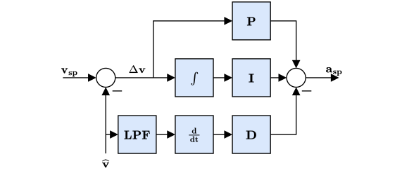
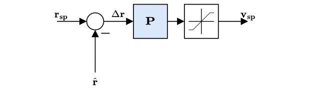
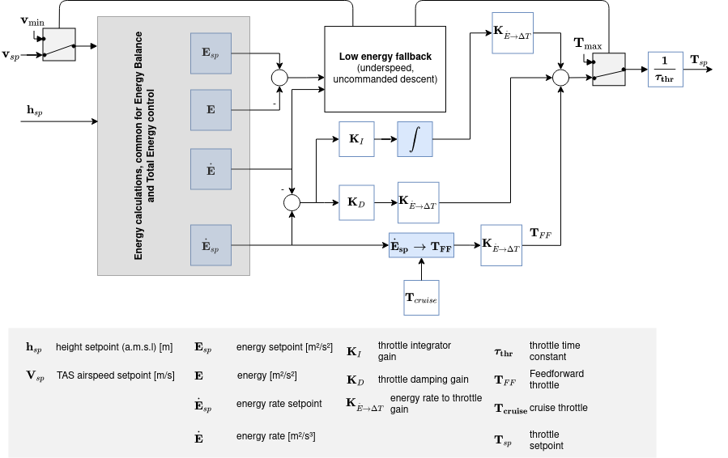
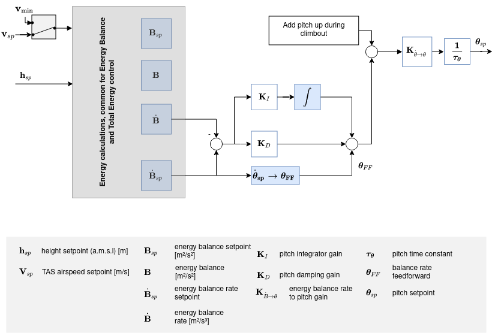

# Діаграми контролера

This section contains diagrams for the main PX4 controllers.

The diagrams use the standard [PX4 notation](../contribute/notation.md) (and each have an annotated legend).

<!--    The diagrams were created with LaTeX / TikZ.
        The code can be found in assets/diagrams/mc_control_arch_tikz.tex.
        The easiest way to generate the diagrams and edit them is to copy the code and paste it an Overleaf (www.overleaf.com/) document to see the output.
-->

## Multicopter Control Architecture

* This is a standard cascaded control architecture.
* The controllers are a mix of P and PID controllers.
* Estimates come from [EKF2](../advanced_config/tuning_the_ecl_ekf.md).
* Depending on the mode, the outer (position) loop is bypassed (shown as a multiplexer after the outer loop). The position loop is only used when holding position or when the requested velocity in an axis is null.

### Multicopter Angular Rate Controller

* K-PID controller. See [Rate Controller](../config_mc/pid_tuning_guide_multicopter.md#rate-controller) for more information.
* The integral authority is limited to prevent wind up.
* The outputs are limited (in the control allocation module), usually at -1 and 1.
* Фільтр низьких частот (LPF) використовується на шляху похідної для зменшення шуму (драйвер гіроскопа забезпечує відфільтровану похідну для контролера).

:::note
Потік IMU (інерціальної системи зоріентованості) включає наступні етапи: дані з гіроскопа > застосування параметрів калібрування > видалення оціненого зміщення > павуки-фільтри (`IMU_GYRO_NF0_BW` та `IMU_GYRO_NF0_FRQ`) > фільтр нижнього частотного діапазону (`IMU_GYRO_CUTOFF`) > кутова швидкість транспортного засобу (*фільтрована кутова швидкість, використовувана контролерами P та I*) > похідна -> фільтр нижнього частотного діапазону (`IMU_DGYRO_CUTOFF`) > кутове прискорення транспортного засобу (*фільтроване кутове прискорення, використовуване контролером D*)

  
:::

  <!-- source for image is https://github.com/PX4/PX4-Autopilot/blob/850d0bc588af79186286652af4c8293daafd2c4c/src/lib/mixer/MultirotorMixer/MultirotorMixer.cpp#L323-L326 -->

### Multicopter Attitude Controller

* The attitude controller makes use of [quaternions](https://en.wikipedia.org/wiki/Quaternion).
* The controller is implemented from this [article](https://www.research-collection.ethz.ch/bitstream/handle/20.500.11850/154099/eth-7387-01.pdf).
* When tuning this controller, the only parameter of concern is the P gain.
* The rate command is saturated.

### Multicopter Acceleration to Thrust and Attitude Setpoint Conversion

* The acceleration setpoints generated by the velocity controller will be converted to thrust and attitude setpoints.
* Converted acceleration setpoints will be saturated and prioritized in vertical and horizontal thrust.
* Thrust saturation is done after computing the corresponding thrust:
   1. Compute required vertical thrust (`thrust_z`)
   1. Saturate `thrust_z` with `MPC_THR_MAX`
   1. Saturate `thrust_xy` with `(MPC_THR_MAX^2 - thrust_z^2)^0.5`

Implementation details can be found in `PositionControl.cpp` and `ControlMath.cpp`.

### Multicopter Velocity Controller

* PID controller to stabilise velocity. Commands an acceleration.
* The integrator includes an anti-reset windup (ARW) using a clamping method.
* The commanded acceleration is NOT saturated - a saturation will be applied to the converted thrust setpoints in combination with the maximum tilt angle.
* Horizontal gains set via parameter `MPC_XY_VEL_P_ACC`, `MPC_XY_VEL_I_ACC` and `MPC_XY_VEL_D_ACC`.
* Vertical gains set via parameter `MPC_Z_VEL_P_ACC`, `MPC_Z_VEL_I_ACC` and `MPC_Z_VEL_D_ACC`.

### Multicopter Position Controller

* Simple P controller that commands a velocity.
* The commanded velocity is saturated to keep the velocity in certain limits. See parameter `MPC_XY_VEL_MAX`. This parameter sets the maximum possible horizontal velocity. This differs from the maximum **desired** speed `MPC_XY_CRUISE` (autonomous modes) and `MPC_VEL_MANUAL` (manual position control mode).
* Horizontal P gain set via parameter `MPC_XY_P`.
* Vertical P gain set via parameter `MPC_Z_P`.

#### Combined Position and Velocity Controller Diagram

* Залежні від режиму передачі вперед (ff) - наприклад, у режимі місії генератор траєкторій (траєкторія з обмеженням ривка) обчислює точки встановлення позиції, швидкості та прискорення.
* Точки встановлення прискорення (в інерціальній системі координат) будуть перетворені (з установкою курсу) на точки встановлення орієнтації (кватерніон) та точки встановлення загального тяги.

<!-- The drawing is on draw.io: https://drive.google.com/open?id=13Mzjks1KqBiZZQs15nDN0r0Y9gM_EjtX
Request access from dev team. -->
## Fixed-Wing Position Controller

### Total Energy Control System (TECS)

The PX4 implementation of the Total Energy Control System (TECS) enables simultaneous control of true airspeed and altitude of a fixed-wing aircraft. The code is implemented as a library which is used in the fixed-wing position control module.

As seen in the diagram above, TECS receives as inputs airspeed and altitude setpoints and outputs a throttle and pitch angle setpoint. These two outputs are sent to the fixed-wing attitude controller which implements the attitude control solution. However, the throttle setpoint is passed through if it is finite and if no engine failure was detected. It's therefore important to understand that the performance of TECS is directly affected by the performance of the pitch control loop. A poor tracking of airspeed and altitude is often caused by a poor tracking of the aircraft pitch angle.

:::note
Make sure to tune the attitude controller before attempting to tune TECS.
:::

Simultaneous control of true airspeed and height is not a trivial task. Increasing aircraft pitch angle will cause an increase in height but also a decrease in airspeed. Increasing the throttle will increase airspeed but also height will increase due to the increase in lift. Therefore, we have two inputs (pitch angle and throttle) which both affect the two outputs (airspeed and altitude) which makes the control problem challenging.

TECS offers a solution by respresenting the problem in terms of energies rather than the original setpoints. The total energy of an aircraft is the sum of kinetic and potential energy. Thrust (via throttle control) increases the total energy state of the aircraft. A given total energy state can be achieved by arbitrary combinations of potential and kinetic energies. In other words, flying at a high altitude but at a slow speed can be equivalent to flying at a low altitude but at a faster airspeed in a total energy sense. We refer to this as the specific energy balance and it is calculated from the current altitude and true airspeed setpoint. The specific energy balance is controlled via the aircraft pitch angle. An increase in pitch angle transfers kinetic to potential energy and a negative pitch angle vice versa. The control problem was therefore decoupled by transforming the initial setpoints into energy quantities which can be controlled independently. We use thrust to regulate the specific total energy of the vehicle and pitch maintain a specific balance between potential (height) and kinetic (speed) energy.

#### Total energy control loop

<!-- https://drive.google.com/file/d/1q12b6ASbQRkFWqLMXm92cryOI-cZnrKv/view?usp=sharing -->

#### Загальний цикл контролю балансу енергії

<!-- The drawing is on draw.io: https://drive.google.com/file/d/1bZtFULYmys-_EQNhC9MNcKLFauc7OYJZ/view -->

Загальна енергія літака - це сума кінетичної та потенціальної енергії:

$$E_T = \frac{1}{2} m V_T^2 + m g h$$

Проведення похідної відносно часу призводить до загальної швидкості енергії:

$$\dot{E_T} = m V_T \dot{V_T} + m g \dot{h}$$

З цього можна сформувати специфічну швидкість енергії:

$$\dot{E} = \frac{\dot{E_T}}{mgV_T}  = \frac{\dot{V_T}}{g} + \frac{\dot{h}}{V_T} = \frac{\dot{V_T}}{g} + sin(\gamma)$$

where $\gamma{}$ is the flight plan angle. Для невеликих $\gamma{}$ ми можемо наблизити це як:

$$\dot{E} \approx  \frac{\dot{V_T}}{g} + \gamma$$

З рівнянь динаміки літака ми отримуємо таке співвідношення:

$$T - D = mg(\frac{\dot{V_T}}{g} + sin(\gamma)) \approx mg(\frac{\dot{V_T}}{g} + \gamma)$$

де T і D - сили тяги і опору. У горизонтальному польоті початкова тяга компенсується опором, а зміна тяги призводить до:

$$\Delta T = mg(\frac{\dot{V_T}}{g} + \gamma)$$

As can be seen, $\Delta T{}$ is proportional to $\dot{E}{}$, and thus the thrust setpoint should be used for total energy control.

Elevator control on the other hand is energy conservative, and is thus used for exchanging potentional energy for kinetic energy and vice versa. To this end, a specific energy balance rate is defined as:

$$\dot{B} = \gamma - \frac{\dot{V_T}}{g}$$

## Контролер положення фіксованого крила

<!-- The drawing is on draw.io: https://drive.google.com/file/d/1ibxekmtc6Ljq60DvNMplgnnU-JOvKYLQ/view?usp=sharing
Request access from dev team. -->

Контролер положення працює за допомогою методу каскадного циклу. Зовнішній цикл обчислює помилку між встановленим величиною орієнтації та оціненим значенням орієнтації, яка, помножена на коефіцієнт (контролер P), генерує встановлення швидкості. Внутрішній цикл обчислює помилку в швидкостях та використовує ПІ (пропорційний + інтегральний) контролер для генерації потрібного кутового прискорення.

Кутове положення керуючих елементів (ельєрони, крейцери, рулі, ...) обчислюється за допомогою цього бажаного кутового прискорення та апріорних знань про систему за допомогою розподілу керування (також відомого як змішування). Крім того, оскільки керуючі поверхні ефективніші при високій швидкості і менш ефективні при низькій швидкості, контролер, налаштований на крейсерську швидкість, масштабується за допомогою вимірів швидкості повітря (якщо використовується такий датчик).

:::note
Якщо датчик швидкості повітря не використовується, то налаштування коефіцієнтів для контролера орієнтації фіксованого крила відключене (це відкритий цикл); корекція в ТЕСС за допомогою зворотного зв'язку по швидкості повітря відсутня або неможлива.
:::

The feedforward gain is used to compensate for aerodynamic damping. По суті, два основні компоненти моментів на осях тіла літака створюються керуючими поверхнями (ельєронами, крейцерами, рулями - які створюють рух) та аеродинамічним згасанням (пропорційним до швидкостей тіла - протидіють рухові). Щоб підтримувати постійну швидкість, це демпфування можна компенсувати за допомогою прямого зв’язку в циклі швидкості.

### Поворотна координація

Контролери крену та тангажу мають однакову структуру, і довжинна та поперечна динаміка вважаються достатньо роз'єднаними, щоб працювати незалежно один від одного. Контролер курсу, однак, генерує встановлення швидкості курсу, використовуючи обмеження координації повороту для мінімізації бокового прискорення, що виникає, коли літак слідкує.  Алгоритм узгодження повороту базується виключно на узгодженому розрахунку геометрії повороту.

$$\dot{\Psi}_{sp} = \frac{g}{V_T} \tan{\phi_{sp}} \cos{\theta_{sp}}$$

Контролер кутової швидкості по курсу також допомагає протидіяти [небажаним ефектам кутової швидкості](https://youtu.be/sNV_SDDxuWk) і гасити [датчик "гульби"](https://en.wikipedia.org/wiki/Dutch_roll), надаючи додаткового напрямного згасання.

## Диспетчер польотів VTOL

<!-- The drawing is on draw.io: https://drive.google.com/file/d/1tVpmFhLosYjAtVI46lfZkxBz_vTNi8VH/view?usp=sharing
Request access from dev team. -->

Цей розділ розповідає про структуру управління вертикальним Зльотом і Посадкою літаків (VTOL). Контролер польоту VTOL складається з контролера багтропільного вертольота та контролера фіксованого крила, які працюють окремо в відповідних режимах VTOL або разом під час переходів. На діаграмі вище є спрощена діаграма управління. Зверніть увагу на блок контролера орієнтації VTOL, який передусім забезпечує необхідну логіку перемикання та змішування для різних режимів VTOL, а також дії з контролю, характерні для типів VTOL під час переходів (наприклад, плавне збільшення потужності реактивного двигуна стандартного VTOL під час переходу вперед). Входи до цього блоку називаються "віртуальними", оскільки, залежно від поточного режиму VTOL, деякі від них ігноруються контролером.

Для стандартного і кутового вертольота під час переходу контролер орієнтації фіксованого крила генерує встановлення швидкості, які потім подаються на окремі контролери швидкості, що призводить до команд моменту для приводів багтропільного вертольота та фіксованого крила. Для tailsitters під час переходу запущений контролер положення мультикоптера.

Виходи блока орієнтації VTOL розділені на команди моменту та сили для приводів багтропільного вертольота та фіксованого крила (два екземпляри для `vehicle_torque_setpoint` та `vehicle_thrust_setpoint`). Ці вихідні дані обробляються в класі розподілу керування, який специфікується для кожного типу повітряного судна.

Для отримання додаткової інформації про налаштування логіки переходу всередині блоку VTOL див. [Конфігурація VTOL](../config_vtol/README.md).

### Масштабування швидкості повітря

Метою цього розділу є пояснення за допомогою рівнянь, чому і як вихід контролерів кутової швидкості PI та передачі подачі (FF) може бути масштабований за допомогою швидкості повітря для покращення роботи системи керування. Спочатку ми представимо спрощене лінійне розмірне рівняння моменту по коченню, потім покажемо вплив швидкості повітря на пряме створення моменту, і, нарешті, вплив швидкості повітря під час постійного кочення.

Як показано в контролері орієнтації фіксованого крила вище, контролери швидкості створюють встановлення кутового прискорення для розподільника керування (тут названого "міксер"). Для створення цих бажаних кутових прискорень міксер виробляє моменти за допомогою наявних аеродинамічних поверхонь керування (наприклад, стандартний літак зазвичай має два ельєрона, два руля висоти та кормовий руль). Моменти, що створюються цими поверхнями керування, сильно впливають на відносну швидкість повітря та щільність повітря, або, точніше, на динамічний тиск. Якщо не виконується масштабування швидкості повітря, контролер, який тісно налаштований для певної крейсерської швидкості повітря, зробить літак коливатися при вищій швидкості повітря або буде погано відслідковувати рух при низькій швидкості повітря.

Читачу слід знати різницю між [істинною швидкістю повітря (TAS)](https://en.wikipedia.org/wiki/True_airspeed) та [індикованою швидкістю повітря (IAS)](https://en.wikipedia.org/wiki/Indicated_airspeed), оскільки їх значення значно відрізняються, коли не літають на рівні моря.

Визначення динамічного тиску таке

$$\bar{q} = \frac{1}{2} \rho V_T^2$$

де $\rho{}$ - щільність повітря, а $V_T{}$ - істинна швидкість повітря (TAS).

Беручи в якості прикладу вісь крену для решти цього розділу, розмірний момент крену можна записати

$$\ell = \frac{1}{2}\rho V_T^2 S b C_\ell = \bar{q} S b C_\ell$$

де $\ell{}$ момент крену, $b{}$ розмах крила і $S{}$ опорна поверхня.

Недименсійна похідна моменту кочення $C_\ell{}$ може бути моделювана за допомогою похідної ефективності ельєронів $C_{\ell_{\delta_a}}{}$, похідної згасання кочення $C_{\ell_p}{}$ та похідної дігонь-кутів $C_{\ell_\beta}{}$

$$C_\ell = C_{\ell_0} + C_{\ell_\beta}\:\beta + C_{\ell_p}\:\frac{b}{2V_T}\:p + C_{\ell_{\delta_a}} \:\delta_a$$

де $\beta{}$ - кут бокового зносу, $p{}$ - кутова швидкість кочення корпусу, а $\delta_a{}$ - відхилення ельєронів.

Припускаючи симетричний ($C_{\ell_0} = 0{}$) і координований ($\beta = 0{}$) літак, рівняння можна спростити, використовуючи лише згасання кутової швидкості по крену та момент кочення, створений ельєронами

$$\ell = \frac{1}{2}\rho V_T^2 S b \left [C_{\ell_{\delta_a}} \:\delta_a + C_{\ell_p}\:\frac{b}{2V_T} \: p \right ]$$

Це кінцеве рівняння потім використовується як базове для двох наступних підрозділів для визначення виразу масштабування швидкості повітря, необхідного для контролерів PI та FF.

#### Static torque (PI) scaling

При умові нульових швидкостей ($p = 0{}$), згасаючий член зникає, і стале - моментальне - крутне зусилля може бути згенеровано за допомогою:

$$\ell = \frac{1}{2}\rho V_T^2 S b \: C_{\ell_{\delta_a}} \:\delta_a = \bar{q} S b \: C_{\ell_{\delta_a}} \:\delta_a$$

Витяг $\delta_a{}$ дає

$$\delta_a = \frac{2bS}{C_{\ell_{\delta_a}}} \frac{1}{\rho V_T^2} \ell = \frac{bS}{C_{\ell_{\delta_a}}} \frac{1}{\bar{q}} \ell$$

де перший дріб є постійним, а другий залежить від щільності повітря та квадрата швидкості повітря (Tas).

Крім того, замість масштабування за щільністю повітря та швидкістю повітря (TAS), можна показати, що індикована швидкість повітря (IAS, $V_I{}$) вже коригується за щільність повітря, оскільки на низькій висоті і швидкості ІAS може бути переведена в TAS за допомогою простого фактора помилки щільності

$$V_T = V_I \sqrt{\frac{\rho_0}{\rho}}$$

де $\rho_o{}$ - щільність повітря на рівні моря при 15°C.

Squaring, rearranging and adding a 1/2 factor to both sides makes the dynamic pressure $\bar{q}{}$ expression appear

$$\bar{q} = \frac{1}{2} \rho V_T^2 = \frac{1}{2} V_I^2 \rho_0$$

We can now easily see that the dynamic pressure is proportional to the IAS squared:

$$\bar{q} \propto V_I^2$$

The scaler previously containing TAS and the air density can finally be written using IAS only

$$\delta_a = \frac{2bS}{C_{\ell_{\delta_a}}\rho_0} \frac{1}{V_I^2} \ell$$

#### Оцінити (FF) масштабування

Головне використання впередньої подачі контролера кутової швидкості полягає у компенсації природного згасання кутової швидкості. Почнемо з базового розмірного рівняння, але на цей раз під час кочення зі сталою швидкістю момент, створений ельєронами, повинен точно компенсувати згасання, наприклад,

$$- C_{\ell_{\delta_a}} \:\delta_a = C_{\ell_p} \frac{b}{2 V_T} \: p$$

Перегруповуючи для вилучення ідеального відхилення ельєронів, отримуємо

$$\delta_a = -\frac{b \: C_{\ell_p}}{2 \: C_{\ell_{\delta_a}}} \frac{1}{V_T} \: p$$

Зазначте, що від'ємний знак потім поглинається похідною згасання кочення, яка також є від'ємною. Зауважте, що від'ємний знак потім поглинається похідною згасання кочення, яка також є від'ємною.

#### Висновок

The output of the rate PI controller has to be scaled with the indicated airspeed (IAS) squared and the output of the rate feedforward (FF) has to be scaled with the true airspeed (TAS)

$$\delta_{a} = \frac{V_{I_0}^2}{V_I^2} \delta_{a_{PI}} + \frac{V_{T_0}}{V_T} \delta_{a_{FF}}$$

where $V_{I_0}{}$ and $V_{T_0}{}$ are the IAS and TAS at trim conditions.

Finally, since the actuator outputs are normalized and that the mixer and the servo blocks are assumed to be linear, we can rewrite this last equation as follows:

$$\dot{\mathbf{\omega}}_{sp}^b = \frac{V_{I_0}^2}{V_I^2} \dot{\mathbf{\omega}}_{sp_{PI}}^b + \frac{V_{T_0}}{V_T} \dot{\mathbf{\omega}}_{sp_{FF}}^b$$

та реалізувати його безпосередньо в контролерах кутової швидкості по крену, тангажу та розвороту.

У випадку повітряних конструкцій, де продуктивність управління не залежить безпосередньо від швидкості повітря, наприклад, вертольота, такого як [autogyro](../frames_autogyro/README.md). Існує можливість вимкнути функцію масштабування швидкості повітря за допомогою [FW_ARSP_SCALE_EN](../advanced_config/parameter_reference.md#FW_ARSP_SCALE_EN)параметра.

#### Рекомендації з налаштування

Перевагою цього алгоритму масштабування швидкості повітря є те, що для його налагодження не потрібно ніяких специфічних дій.</3>. Однак якість вимірювань швидкості повітря безпосередньо впливає на його ефективність.

Крім того, для отримання найбільш стабільного польотного енвелопу слід налаштувати контролери орієнтації на значенні швидкості повітря, яке знаходиться між швидкістю стійкості та максимальною швидкістю транспортного засобу (наприклад: літак, який може літати від 15 до 25 м/с, слід налаштувати на 20 м/с). Цю "настройку" швидкості повітря слід встановити в параметрі [FW_AIRSPD_TRIM](../advanced_config/parameter_reference.md#FW_AIRSPD_TRIM).
