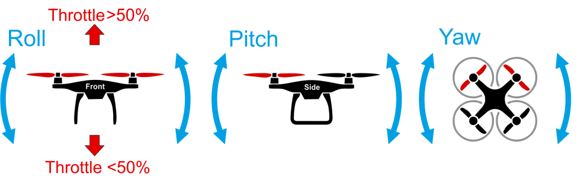
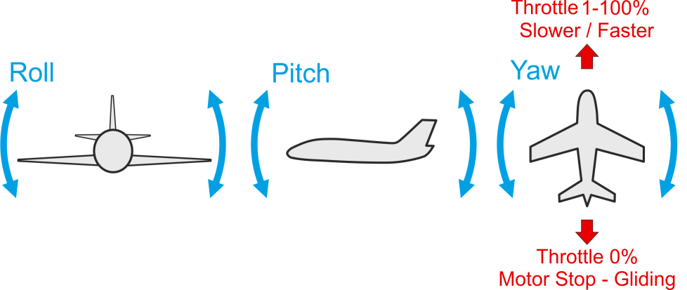

# Ручний політ

У цьому розділі пояснюються основи керування апаратом за допомогою [Радіопередавача](../getting_started/rc_transmitter_receiver.md) у ручному режимі або режимі польоту з автопілотом (про автономний політ див.: [Місії](../flying/missions.md)).

:::note
Перед першим польотом прочитайте наші [Рекомендації щодо першого польоту](../flying/first_flight_guidelines.md). :::

## Увімкнення апарату

Перед тим, як ви зможете літати апаратом, його спочатку потрібно [увімкнути](../getting_started/px4_basic_concepts.md#arming-and-disarming). Це подасть живлення на всі мотори та приводи; у мультикоптера це запустить обертання пропелерів.

Щоб увімкнути дрон:
- Спочатку вимкніть [перемикач безпеки](../getting_started/px4_basic_concepts.md#safety-switch).
- Використайте команду увімкнення для вашого апарата - переведіть стік газу в нижній правий кут.
  - Або налаштуйте [перемикач увімкнення/вимкнення](../config/safety.md#arm-disarm-switch).
  - Ви також можете увімкнути апарат в *QGroundControl* (PX4 не вимагає радіокерування для автономного польоту).

:::tip
Апарат не буде увімкнено, поки він не буде [відкалібрований/налаштований](../config/README.md) та не отримає локу позиції. [Сповіщення про стан апарата](../getting_started/vehicle_status.md) (включаючи світлодіоди на апараті, аудіосповіщення та оновлення в *QGroundControl*) можуть повідомити вас, коли апарат готовий до польоту (та допомогти вам з'ясувати причину, коли він не готовий до польоту). :::

:::note
Апарат (за [замовчанням](../advanced_config/parameter_reference.md#COM_DISARM_PRFLT)) автоматично [вимкнеться](../advanced_config/prearm_arm_disarm.md#auto-disarming) (вимкне мотори), якщо ви занадто довго готуєтесь до зльоту! Це заходи безпеки, щоб гарантувати, що апарати повертаються до безпечного стану, коли не використовуються. :::

:::note
Апарат VTOL може бути увімкнений лише в режимі мультикоптера (за замовчанням - увімкнення в режимі літака може бути активоване за допомогою [CBRK_VTOLARMING](../advanced_config/parameter_reference.md#CBRK_VTOLARMING)). :::

## Зліт

### Зліт мультикоптера

Пілоти мультикоптерів (та VTOL у режимі мультикоптера) можуть злітати *вручну*, активувавши будь-який ручний режим, увімкнувши апарат, а потім піднявши стік газу до рівня, коли мотори дадуть достатньо тяги для підняття з землі. У [режимі позиціювання](../flight_modes_mc/position.md) або [режимі висоти](../flight_modes_mc/altitude.md) потрібно збільшити стік газу до понад 62.5%, щоб задати швидкість підйому та змусити апарат піднятися з землі. Вище цього значення всі контролери активуються, і апарат переходить на рівень газу, необхідний для зависання ([MPC_THR_HOVER](../advanced_config/parameter_reference.md#MPC_THR_HOVER)).

Також підтримується [запуск через кидання](../flight_modes_mc/throw_launch.md), при якому апарат активує мотори після того, як виявляє, що досяг апогею кидку, а потім працює відповідно до свого поточного режиму.

Альтернативно зліт можна виконати, використовуючи автоматичний [режим зльоту](../flight_modes_mc/takeoff.md).

:::note
Апарат може вимкнутися, якщо ви занадто довго готуєтеся до зльоту після увімкнення (налаштуйте тайм-аут, використовуючи [COM_DISARM_PRFLT](../advanced_config/parameter_reference.md#COM_DISARM_PRFLT)). :::

:::note
[Детектор несправностей](../config/safety.md#failure-detector) автоматично зупинить мотори, якщо на зльоті виникне проблема. :::

### Зліт апарату з фіксованим крилом

:::note
Злетіти (та приземлитися) вручну не так просто!
Ми рекомендуємо використовувати автоматичні режими, особливо для недосвідчених пілотів.
:::

Для ручного зльоту рекомендуються [режим стабілізації](../flight_modes_fw/stabilized.md), [акробатичний режим](../flight_modes_fw/acro.md) або [ручний режим](../flight_modes_fw/manual.md). [Режим позиціонування](../flight_modes_fw/position.md) та [режим висоти](../flight_modes_fw/altitude.md) також можуть бути використані, але важливо достатньо розігнати апарат перед його підняттям у повітря — сильний ривок при запуску з рук, довга фаза розгону для зльоту зі злітної смуги (це необхідно, тому що контролер в цих режимах може віддавати перевагу швидкості відносно повітряного потоку над відстеженням висоти).

Ручні зльоти з літаками, що запускаються з рук:
- Розженіть мотор і киньте апарат горизонтально.
- Не підіймайте ніс занадто швидко, оскільки це може призвести до звалювання літака.
- Хороший баланс апарату має вирішальне значення для безпечного ручного злету, оскільки якщо апарат не летить рівно, у пілота є дуже мало часу для реагування перед тим, як апарат розіб'ється!

Ручні зльоти з літаками, що запускаються зі злітної смуги:
- Розганяйтеся на злітній смузі, поки швидкість не стане достатньою для зльоту.
- Якщо у літака є кероване колесо, використовуйте yaw стік, щоб тримати його на курсі.
- Як тільки швидкість стане достатньою, підніміть ніс літака за допомогою стіку pitch.

Автоматичні злети можливі у [режимі місії](../flight_modes_fw/mission.md#mission-takeoff) або [режимі зльоту (FW)](../flight_modes_fw/takeoff.md). Пілот може взяти апарат під ручне управління в будь-який момент під час процесу зльоту або після нього, перейшовши в режим ручного польоту.

## Посадка

### Посадка мультикоптера

Мультикоптери можуть приземлятися в будь-якому ручному режимі. Переконайтеся, що ви тримаєте стік газу опущеним після приземлення, поки мотори не вимкнуться.

Зверніть увагу, що за замовчанням апарати автоматично вимикаються після посадки:

- Використовуйте [COM_DISARM_LAND](../advanced_config/parameter_reference.md#COM_DISARM_LAND) для встановлення часу автоматичного вимкнення після посадки (або повністю вимкніть цю функцію).
- Manually disarm by putting the throttle stick in the bottom left corner.

There is also the option to let the vehicle land autonomously. For that engage the [Land mode](../flight_modes_mc/land.md) or [Return mode](../flight_modes_mc/return.md).

:::note
If you see the vehicle "twitch" during landing (turn down the motors, and then immediately turn them back up) this is probably caused by a poor [Land Detector Configuration](../advanced_config/land_detector.md) (specifically, a poorly set [MPC_THR_HOVER](../advanced_config/parameter_reference.md#MPC_THR_HOVER)). :::

### Fixed-wing Landing

[Stabilized mode](../flight_modes_fw/stabilized.md), [Acro mode](../flight_modes_fw/acro.md) or [Manual mode](../flight_modes_fw/manual.md) are recommended for landing (just as they are for takeoff). In these modes the pilot has full control over the motor thrust, which is required to perform a manual flaring maneuver when close to the ground (raising the vehicle nose without increasing throttle). You should perform the landing in headwind to reduce the groundspeed before touching down.

For auto landings you should use a [Fixed-Wing Mission Landing](../flight_modes_fw/mission.md#mission-landing). This landing is defined in a mission, and can be used in either [Mission](../flight_modes_fw/mission.md) or [Return](../flight_modes_fw/return.md) modes.

The automatic [Land mode](../flight_modes_fw/land.md) mode is not recommended unless absolutely necessary, as it cannot account for underlying terrain.
<!-- Added this to make it more generic: We'll split this out later -->

Note that vehicles automatically disarm on landing by default:

- Use [COM_DISARM_LAND](../advanced_config/parameter_reference.md#COM_DISARM_LAND) to set the time to auto-disarm after landing (or disable it altogether).
- Manually disarm by putting the throttle stick in the bottom left corner.

## Flight Controls/Commands

All flying, including takeoff and landing, is controlled using the 4 basic commands: roll, yaw, pitch and throttle.

In order to control your aircraft you need to understand how the basic Roll, Pitch, Yaw and Throttle commands affect movement in 3D space. This differs depending on whether you're controlling a forward-flying aircraft like a plane, or a "hover aircraft" like a multicopter.

### Hover Aircraft

Hover aircraft (Copter, VTOL in hover mode) respond to the movement commands as shown below:

- Pitch => Forward/back.
- Roll => Left/right.
- Yaw => Left/right rotation around the centre of the frame.
- Throttle => Changed altitude/speed.

### Forward-flying Aircraft

Forward-flying aircraft (planes, VTOL in forward flight) respond to the movement commands as shown below:

- Pitch => Up/down.
- Roll => Left/right and a turn.
- Yaw => Left/right tail rotation and turn.
- Throttle => Changed forward speed.

:::note
The best turn for airplanes is called a coordinated turn, and is performed using roll and little yaw at the same time.
This maneuver requires experience!
:::

## Assisted Flight

Even with an understanding of how the vehicle is controlled, flight in fully manual mode can be quite unforgiving. New users should [configure their transmitter](../config/flight_mode.md) to use flight modes where the autopilot automatically compensates for erratic user input or environmental factors.

The following three modes are highly recommended for new users:

* Stabilized - Vehicle hard to flip, and will level-out if the sticks are released (but not hold position)
* Altitude - Climb and drop are controlled to have a maximum rate.
* Position - When sticks are released the vehicle will stop (and hold position against wind drift)

:::note
You can also access automatic modes through the buttons on the bottom of the *QGroundControl* main flight screen. :::
