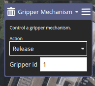
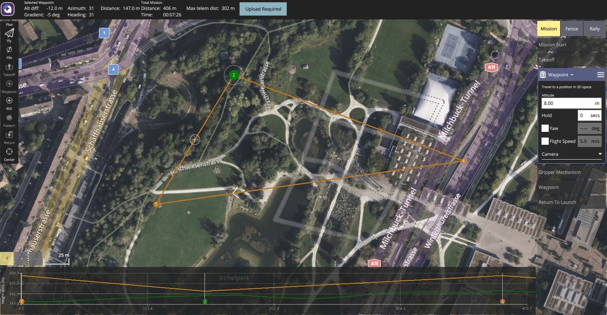

# Місії з доставки вантажу

Місія з доставки посилки дозволяє планувати та виконувати доставку вантажу за допомогою [захвату](../peripherals/gripper.md).

:::note
Ця функція була додана в PX4 v1.14 з підтримкою захвату (лише). Місії з доставки посилок будуть розширені для підтримки іншого обладнання для випуску вантажу в майбутньому, включаючи лебідки.
:::

## Конфігурація механізму доставки

Місії з доставки посилок вимагають певної конфігурації, яку необхідно виконати перед плануванням і виконанням місії.

Конфігурація значною мірою залежить від апаратного забезпечення, тому вона описана на сторінці налаштування для кожного типу обладнання доставки посилок:

- [Захват > Конфігурація доставки посилок](../peripherals/gripper.md#package-delivery-configuration)

## Планування місії

Місія доставки посилки планується майже так само, як і будь-яка інша [місія з маршрутною точкою](../flying/missions.md), із початковою точкою місії, точкою зльоту, різними маршрутними точками шляху та, можливо, точкою повернення. Єдина відмінність полягає в тому, що місія доставки посилки має включати пункт місії, який вказує, чи потрібно випустити посилку на землі (`Land`) чи в повітрі (`Waypoint`), після чого інший елемент місії для розвантаження посилки (`Механізм захоплення`).

Те, чи ви `приземляєтеся`, залежить від того чи можна безпечно вивантажити посилку під час польоту та чи здатний апарат приземлитися в місці вивантаження. Оскільки захват не може безпечно опускати посилки, мультикоптери та апарати VTOL часто приземляються, щоб розвантажити посилки, коли використовують захват.

Після того, як пристрій для розвантаження [вказує про завершення](#package-release-feedback), апарат попрямує до наступної маршрутної точки. Зауважте, що в разі приземлення наступним елементом місії після розвантаження має бути інший елемент місії `Waypoint` або `Takeoff` ([це не має бути `RETURN` >](#rtl-waypoint-for-package-delivery-with-landing).)

## Створення місії доставки посилок

Щоб створити місію доставки посилок (з використанням захвату):

1. Створіть звичайну місію з елементом місії `Takeoff` і додатковими маршрутними точками для потрібного маршруту польоту.
1. Додайте маршрутну точку на карті, де ви хочете випустити посилку.

   - Щоб скинути посилку під час польоту, установіть відповідну висоту для маршрутної точки (і переконайтеся, що маршрутна точка знаходиться в безпечному місці для скидання посилки).

   - Якщо ви хочете посадити апарат, щоб здійснити доставку, вам потрібно буде змінити `Waypoint` на елемент місії `Land`. Зробіть це, вибравши заголовок пункту місії, а потім вибравши `Land` у спливаючому діалоговому вікні.

     

1. Додайте маршрутну точку на карті (у будь-якому місці) для вивільнення захвату. Щоб змінити це на `Механізм захоплення`, виберіть заголовок "Waypoint" і у спливаючому вікні змініть групу на "Advanced", а потім виберіть `Gripper Mechanism`.

   

1. Налаштуйте дію для захоплювача в редакторі.

   

   - Щоб вивільнити посилку, встановіть значення "Release".
   - ID захоплювача наразі встановлювати не потрібно.

1. Додайте додаткові шляхові точки для решти шляху. Якщо ви приземлилися, пам’ятайте, що ви повинні включити маршрутну точку після `Gripper Mechanism` перед додаванням елемента місії `Return`.

### Приклади планів

#### Місія скидання посилки

Тут показано план місії, де апарат скидає пакет під час польоту. Початковий елемент місії – це маршрутна точка, а дія – `Gripper Release` (показано в переліку елементів місії)

Зверніть увагу, як графік висоти показує pre-waypoint як маршрутну точку в повітрі, також на правій панелі.

#### Місія приземлення та розвантаження

Тут показано план місії, де апарат приземляється, щоб доставити посилку.

Зверніть увагу, як на графіку висоти показано елемент `Land`.

### Примітки

#### Точка маршруту RTL для доставки посилок з посадкою

Не плануйте місію з доставкою таким чином: `LAND` > `GRIPPER` > `RETURN TO LAUNCH`.

З міркувань безпеки функція "Return To Launch" вимикається, коли апарат приземлений ([пов'язана проблема](https://github.com/PX4/PX4-Autopilot/pull/20044)). Отже, якщо ви приземлитесь, випустите вантаж, а потім встановите точку маршруту RTL, апарат буде простоювати на координатах посадки.

#### Ручне керування захватом в місіях

Захват може бути [керований вручну за допомогою кнопки джойстика](../peripherals/gripper.md#qgc-joystick-configuration) (якщо налаштовано) в будь-якому режимі, включаючи під час місії.

Проте зауважте, що якщо ви вручну командуєте закриття захвату, тоді як місія з доставки відкриває захват, захват не зможе завершити дію відкриття. Місія відновиться після тайм-ауту елемента місії доставки вантажу ([MIS_PD_TO](../advanced_config/parameter_reference.md#MIS_PD_TO) закінчується, навіть якщо вантаж не був випущений.

#### Автоматичне вимкнення відключено в місіях

Під час місії автоматичне вимкнення відключено за замовчуванням. Це означає, що під час посадки для доставки посилок апарат усе ще буде увімкнений (і потенційно небезпечний!)

#### Зворотний зв'язок щодо випуску посилки

Місія продовжиться після завершення елемента місії "package release" (наприклад, `GRIPPER`).

Захвати та інші пристрої доставки або використовують зворотний зв’язок датчика, або настроюваний тайм-аут, щоб вказати про завершення.
