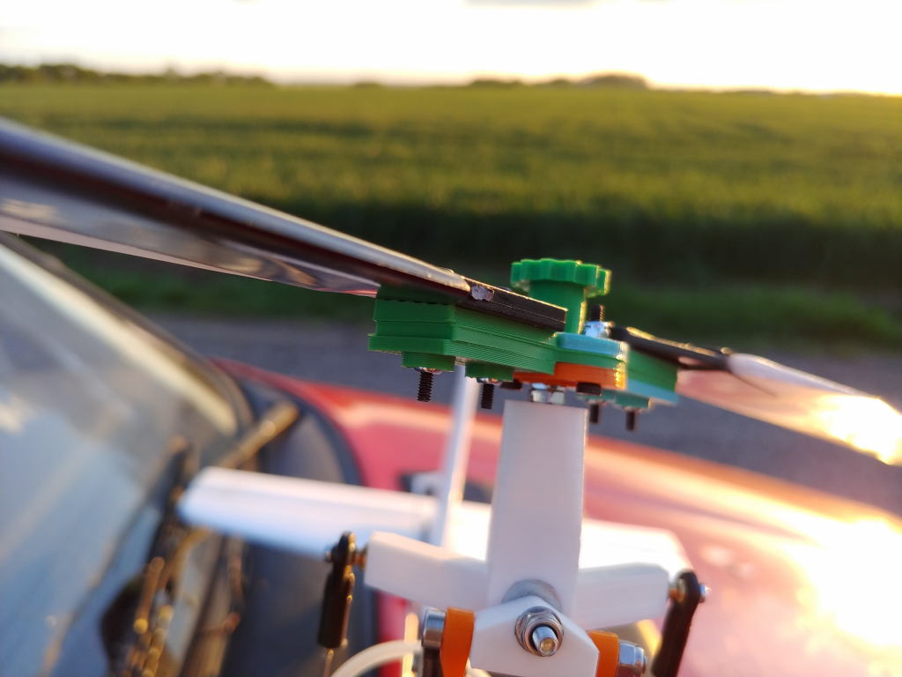

# ThunderFly Auto-G2 Autogyro

*ThunderFly Auto-G2* - це автопілот-керований автогир, заснований на [RC-моделі Durafly™ Auto-G2 Gyrocopter](https://hobbyking.com/en_us/duraflytm-auto-g2-gyrocopter-w-auto-start-system-821mm-pnf.html), замінивши кілька частин оригінальної моделі на друковані в 3D.

:::info
Автогир Auto-G2 розробляється та утримується авіакомпанією ThuderFly s.r.o.
:::

Усі додані частини доступні на [GitHub](https://github.com/ThunderFly-aerospace/TF-G2/) як проект з відкритим вихідним кодом. Надруковані деталі розроблені в [OpenSCAD](https://www.openscad.org/).

## Модифікації

Durafly Auto-G2, у своєму оригінальному дизайні, має трьохлопастний ротор з лопатями завдовжки 400 мм з профілем CLARK-Y. Головка ротора дозволяє нахил у вісі ROLL лише. Автогиро керується рулем та ліфтом. Durafly Auto-G2 коробка автожира містить полістирольне тіло автожира, регулятор швидкості, двигун (мабуть 800 кВт), 4 сервопривода, хвостові аеродинамічні профілі, 3 лопаті з частинами центру ротора, дротову шасі та попередньовідкручувач.

Модифікація моделі Durafly виглядає наступним чином:
* Додавання автопілота
* Головка ротора з двома осями вільності (крен, кривошип)
* Двохлопатевий ротор з безпечною роторною пластиною, яку можна безпечно зламати
* Більші посадочні шасі

### Автопілот

Літак з усіма модифікаціями вже досить важкий. Отже, рекомендується низькомасовий контролер польоту (наприклад, [Holybro pix32](../flight_controller/holybro_pix32.md) або [CUAV nano](../flight_controller/cuav_v5_nano.md)).

Автопілот повинен бути встановлений на нижній стороні автожира на демпфуючій подушці, надрукованій у 3D. Ми використали платформу згасання, знайдену на [thingiverse](https://www.thingiverse.com/thing:160655)

### Голова ротора

Головка ротора (у порівнянні з оригінальним автожиром) модифікована так, що дозволяє рух у обох віслях кочення та тангажу. Завдяки цьому ротор може контролювати обертання, а також підйом автогира. Напрямне керування автожира за допомогою ротора можливе навіть у випадку низької швидкості повітря порівняно з оригінальним керуванням рулем і елеватором.

Напечатана головка ротора складається з трьох частин. Нижня частина закручується за допомогою винта М2,5 до оригінального пілона з фанери. Гвинт M3x35, знайдений між першою та другою частиною, створює вільність по осі кроку, а з'єднання між другою та третьою частиною - вільність по осі кочення. Останній вісь складається з гвинта M3x30 з самоблокуючою гайкою. З боку ротора головка шурупа має велику площу шайби.

Вісь ротора, виготовлена з високої міцності гвинта M3x50, проходить через третю частину. Використовуються підшипники 623 2Z C3 SKF. В кінці цієї частини є кульові вали, прикріплені за допомогою гвинтів M2.5 до сервоприводів, розташованих у нижній частині пілона. Краще обміняти ці оригінальні сервоприводи на якісніші, оскільки вони слабкі, і в оригінальній конструкції вони допомагають один одному.

### Двоклиновий ротор

Оригінальний автожир Durafly Auto-G2 має трьохлопастний ротор, який був модифікований у цій моделі для використання двохлопастного ротора. Причини - це зменшення вібрації та спрощення конструкції. Надруковані центральні частини призначені для використання як з китайськими лопатями Durafly, так і з надрукованими на 3D принтері лопатями.

Центральна частина ротора складається з кількох компонентів, які виконують наступні ролі:
* Вони дозволяють лопатці вільно коливатися.
* Вони мають зони деформації, які ламаються при ударі з землею. Завдяки цьому ротор зазвичай можна швидко відремонтувати, замінивши лише один компонент.
* Просте налаштування кута атаки лопаток.

#### Лопатки ротора HobbyKing

Можна використовувати надруковану центральну частину ротора з оригінальними лопатями. Ці леза можна придбати на [HobbyKing](https://hobbyking.com/en_us/duraflytm-auto-g-gyrocopter-821mm-replacement-main-blade-1pcs-bag.html). Леза від Hobbyking відрізняються положенням центру ваги, тому необхідно правильно їх збалансувати.

#### Роторні лопаті, надруковані у 3D

Також можливо надрукувати лопаті ротора.

Надруковані лопаті ротора все ще знаходяться в стадії розробки, але попередні тести показують, що вони мають кращу якість в основному завдяки своїй точній формі та відсутності поздовжніх жолобів. Проте деякі з процесів виробництва все ще потребують налаштування.

#### Балансування

Правильний баланс лез дуже важливий для мінімізації вібрацій. Леза повинні бути збалансовані таким чином, щоб центр ваги знаходився в середині осі ротора.

Надруковані леза збалансовані в процесі виробництва і не потребують додаткового балансування.

### Випуск пристрою

Якщо ви хочете запустити автожира за допомогою лебідки або якщо ви хочете запустити його шляхом буксирування, вам потрібно надрукувати пристрій випуску. Це невелика коробка, обладнана сервоприводом, який витягує шпильку та відпускає мотузку.

Вся частина склеєна за допомогою гарячого клейового розчину під двигуном на нижній частині корпусу автогиро. Якщо автогир буксирується за допомогою каната, його двигун не повинен бути увімкнений. Це може бути вирішено, наприклад, нулюючи вихід двигуна в передавачі, якщо вимикач пристрою вивільнення закритий.

## Список деталей

### Електроніка

* Автопілот ([Holybro pix32](../flight_controller/holybro_pix32.md), [CUAV nano](../flight_controller/cuav_v5_nano.md))
* GPS (Модуль GPS NEO-6M, з патч-антеною)
* Датчик швидкості повітря ( [SDP3x](https://www.sensirion.com/en/flow-sensors/differential-pressure-sensors/worlds-smallest-differential-pressure-sensor/))
* Сильніші сервоприводи як заміна оригінальних (необов'язково), ([BlueBird BMS-125WV](https://www.blue-bird-model.com/products_detail/411.htm))
* Додатковий сервопривід для пристрою відпускання (необов'язково)

### Механічні деталі

* Підшипник роторної головки (623 2Z C3)
* Пропелер ([APC 10x7](https://www.apcprop.com/product/10x7e/))
* [Адаптер пропелера](https://mpjet.com/shop/gb/prop-adapters/184-collet-prop-adapter-19-mm-4-mm-shaft-m629-standard.html)

### Друковані частини

* Голова ротора:
  * [Кінцева опора](https://github.com/ThunderFly-aerospace/Auto-G2/blob/master/CAD/stl/111_1001.stl)
  * [Частина кроку](https://github.com/ThunderFly-aerospace/Auto-G2/blob/master/CAD/stl/111_1002.stl)
  * [Частина рулону](https://github.com/ThunderFly-aerospace/Auto-G2/blob/master/CAD/stl/111_1003.stl)

* Ротор:
  * [верхня частина пральної машини](https://github.com/ThunderFly-aerospace/Auto-G2/blob/master/CAD/stl/111_1008.stl)
  * [нижня частина пральної машини центральної частини](https://github.com/ThunderFly-aerospace/Auto-G2/blob/master/CAD/stl/111_1004.stl)
  * [центральна пластина з деформаційними зонами](https://github.com/ThunderFly-aerospace/Auto-G2/blob/master/CAD/stl/888_1001.stl)
  * [шайби для встановлення AoA лопаток](https://github.com/ThunderFly-aerospace/Auto-G2/blob/master/CAD/stl/111_1005.stl)
  * [Гайка ротора](https://github.com/ThunderFly-aerospace/Auto-G2/blob/master/CAD/stl/888_1002.stl)

* Лопаті ротора (необов'язково)
* Держатель автопілота
* [Випуск пристрою](https://github.com/ThunderFly-aerospace/Auto-G2/blob/master/CAD/stl/888_1010.stl)
* [Передні колеса](https://github.com/ThunderFly-aerospace/Auto-G2/blob/master/CAD/stl/888_1011.stl)

### Рекомендовані запасні частини

* Сервоприводи з покращеною якістю (рекомендовано [BlueBird BMS-125WV](https://www.blue-bird-model.com/products_detail/411.htm), оригінальні сервоприводи не дуже довговічні))
* Пропелер ([APC 10x7](https://www.apcprop.com/product/10x7e/))
* Центральна пластина ротора з деформаційними зонами (надрукована в 3D)
* Лопатки ротора ([HobbyKing](https://hobbyking.com/en_us/duraflytm-auto-g-gyrocopter-821mm-replacement-main-blade-1pcs-bag.html) або надруковані на 3D принтері)

## Відео

@[youtube](https://youtu.be/YhXXSWz5wWs)

## Фотогалерея змін

   
