# Збірка DJI FlameWheel 450 + CUAV V5 nano

Ця тема надає повні інструкції для збирання комплекту та налаштування PX4 з використанням *QGroundControl*.

Основна Інформація

- **Каркас:** DJI F450
- **Контролер польоту:** [CUAV V5 nano](../flight_controller/cuav_v5_nano.md)
- **Час зборки (приблизно):** 90 хвилин (45 хвилин на раму, 45 хвилин на встановлення/налаштування автопілота)

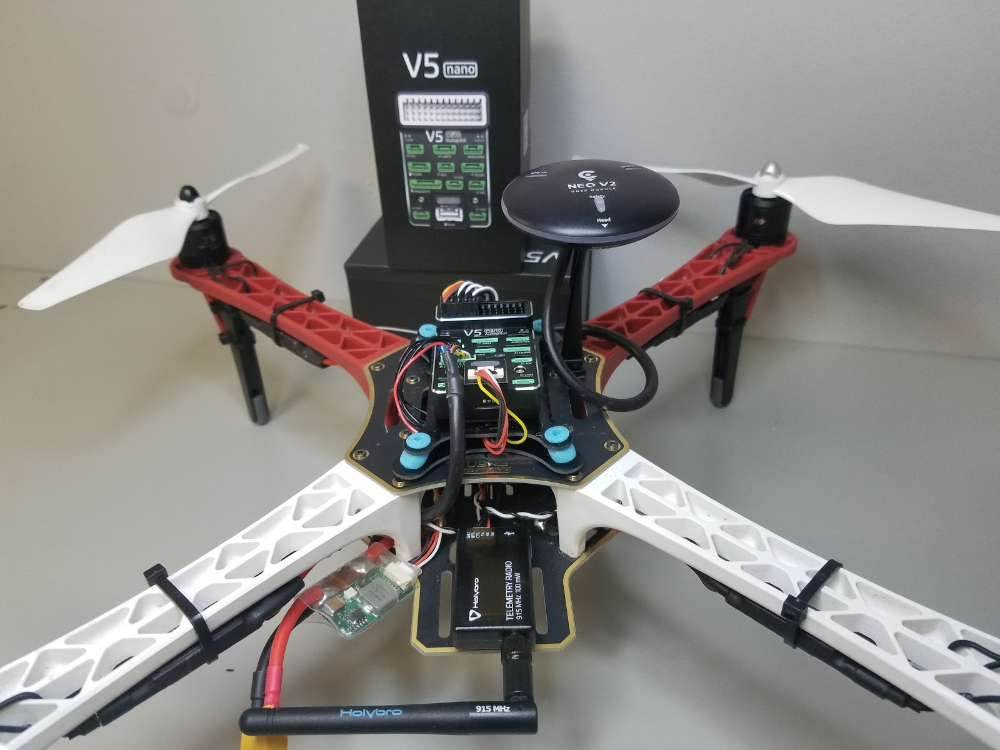

## Специфікація матеріалів

Компоненти, необхідні для цієї збірки, є:
- Контролер польоту: [CUAV V5 nano](https://store.cuav.net/shop/v5-nano/):
  - GPS: [CUAV NEO V2 GPS](https://store.cuav.net/index.php?id_product=97&id_product_attribute=0&rewrite=cuav-new-ublox-neo-m8n-gps-module-with-shell-stand-holder-for-flight-controller-gps-compass-for-pixhack-v5-plus-rc-parts-px4&controller=product&id_lang=1)
  - Модуль живлення
- Фрейм: [DJI F450](https://www.amazon.com/Flame-Wheel-Basic-Quadcopter-Drone/dp/B00HNMVQHY)
- Пропелери: [DJI Phantom Built-in Nut Upgrade Propellers 9.4x5](https://www.masterairscrew.com/products/dji-phantom-built-in-nut-upgrade-propellers-in-black-mr-9-4x5-prop-set-x4-phantom)
- Акумулятор: [Turnigy High Capacity 5200mAh 3S 12C Lipo Pack w/XT60](https://hobbyking.com/en_us/turnigy-high-capacity-5200mah-3s-12c-multi-rotor-lipo-pack-w-xt60.html?___store=en_us)
- Телеметрія: [Holybro Transceiver Telemetry Radio V3](../telemetry/holybro_sik_radio.md)
- Пульт дистанційного керування: [FrSky D4R-II 2.4G 4CH ACCST Telemetry Receiver](https://www.banggood.com/FrSky-D4R-II-2_4G-4CH-ACCST-Telemetry-Receiver-for-RC-Drone-FPV-Racing-p-929069.html?cur_warehouse=GWTR)
- Мотори: [DJI E305 2312E Мотор (960kv,CW)](https://www.amazon.com/DJI-E305-2312E-Motor-960kv/dp/B072MBMCZN)
- ESC: Hobbywing XRotor 20A APAC Brushless ESC 3-4S для RC Мультикоптерів

Крім того, ми використовували контролер FrSky Taranis. Вам також знадобляться хомутів, двостороння стрічка, паяльник.

На наведеному нижче зображенні показані як рама, так і електронні компоненти.

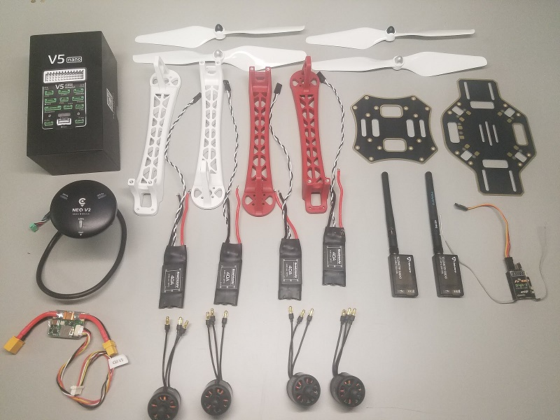

## Обладнання

### Рама

Цей розділ містить усе обладнання для каркасів.

| Опис                                              | Кількість |
| ------------------------------------------------- | --------- |
| DJI F450 Нижня пластина                           | 1         |
| DJI F450 Верхня пластина                          | 1         |
| DJI F450 ніжки з шасі                             | 4         |
| Гвинти M3*8                                       | 18        |
| Гвинти M2 5*6                                     | 24        |
| Акумуляторний ремінь на липучці                   | 1         |
| DJI Phantom Built-in Nut Upgrade Propellers 9.4x5 | 1         |

### CUAV v5 nano Package

У цьому розділі перераховані компоненти, що входять до складу пакета CUAV v5 nano.

| Опис                        | Кількість (Набір за замовчуванням) | Кількість (+GPS Набір) |
| --------------------------- | ---------------------------------- | ---------------------- |
| V5 nano політний контролер  | 1                                  | 1                      |
| Кабель DuPont               | 2                                  | 2                      |
| Кабель I2C/CAN              | 2                                  | 2                      |
| Кабель ADC 6.6              | 2                                  | 2                      |
| Сигнальний кабель SBUS      | 1                                  | 1                      |
| Кабель IRSSI                | 1                                  | 1                      |
| Сигнальний кабель DSM       | 1                                  | 1                      |
| Кабель ADC 3.3              | 1                                  | 1                      |
| Кабель для відладки         | 1                                  | 1                      |
| Кабель запобіжного вимикача | 1                                  | 1                      |
| Кабель напруги та струму    | 1                                  | 1                      |
| Кабель модуля PW-Link       | 1                                  | 1                      |
| Модуль живлення             | 1                                  | 1                      |
| Карта пам'яті SanDisk 16GB  | 1                                  | 1                      |
| Платка розширення 12C       | 1                                  | 1                      |
| ТТЛ-пластина                | 1                                  | 1                      |
| NEO GPS                     | -                                  | 1                      |
| GPS Bracket                 | -                                  | 1                      |

### Електроніка

| Опис                                                  | Кількість |
| ----------------------------------------------------- | --------- |
| CUAV V5 nano                                          | 1         |
| CUAV NEO V2 GPS                                       | 1         |
| Holibro Telemetry                                     | 1         |
| FrSky D4R-II 2.4G 4CH ACCST Telemetry Receiver        | 1         |
| DJI E305 2312E Motor (800kv,CW)                       | 4         |
| Hobbywing XRotor 20A APAC Brushless ESC               | 4         |
| Модуль живлення (включено в набір CUAV V5 nano)       | 1         |
| Turnigy High Capacity 5200mAh 3S 12C Lipo Pack w/XT60 | 1         |

### Необхідні інструменти

У цій збірці використовуються наступні інструменти:

- Викрутка з шестигранником 2,0 мм
- Шуруповерт Phillips 3 мм
- Кусачки
- Прецизійний пінцет
- Паяльник

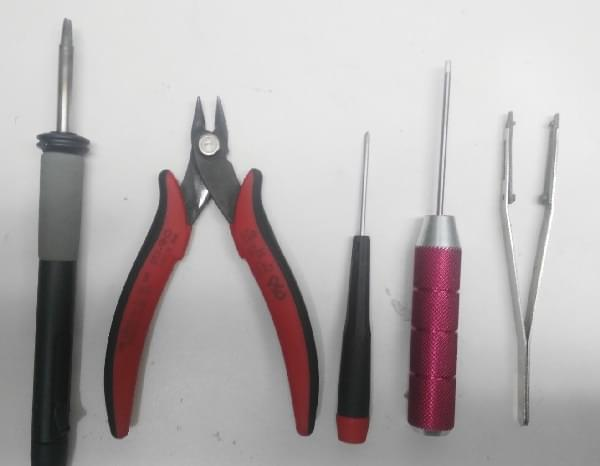

## Збірка

Приблизний час для збирання становить приблизно 90 хвилин (близько 45 хвилин на раму та 45 хвилин на встановлення автопілота та налаштування корпусу.

1. Прикріпіть 4 ніжки до нижньої пластини за допомогою наданих гвинтів.

   

1. Припаяйте ЕСК (електронний регулятор швидкості) до плати, позитивний (червоний) та негативний (чорний).

   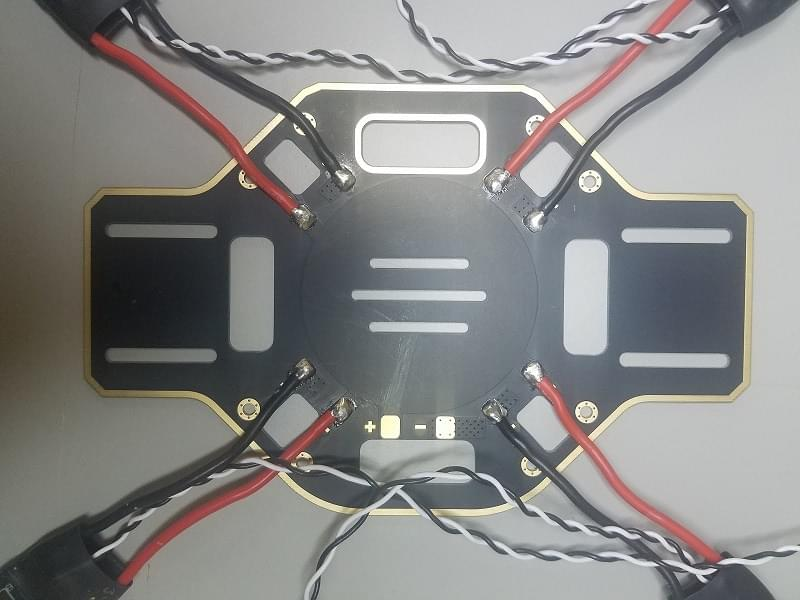

1. Припаяйте модуль живлення, позитивний (червоний) та негативний (чорний).

   

1. Підключіть двигуни до ESC відповідно до їхніх позицій.

   

1. Прикріпіть двигуни до відповідних рук.

   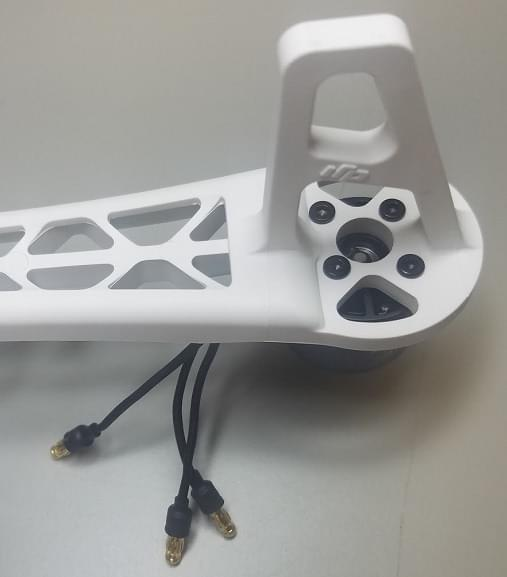 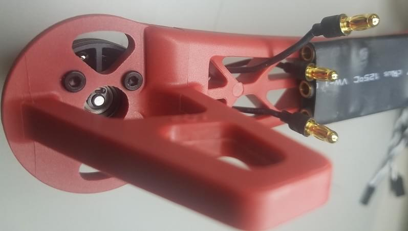

1. Додайте верхню дошку (прикрутіть до верхньої частини ніг).

   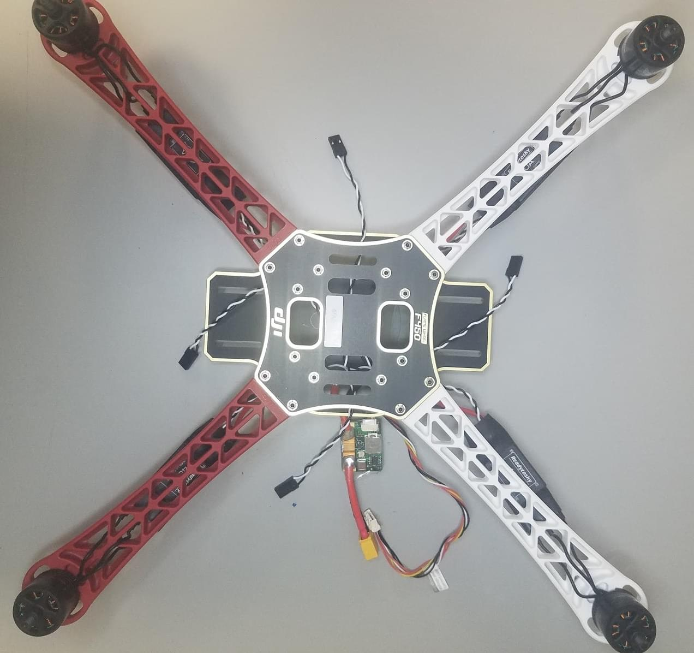

1. Додайте амортизаційну пінку до польотного контролера *CUAV V5 nano*.

   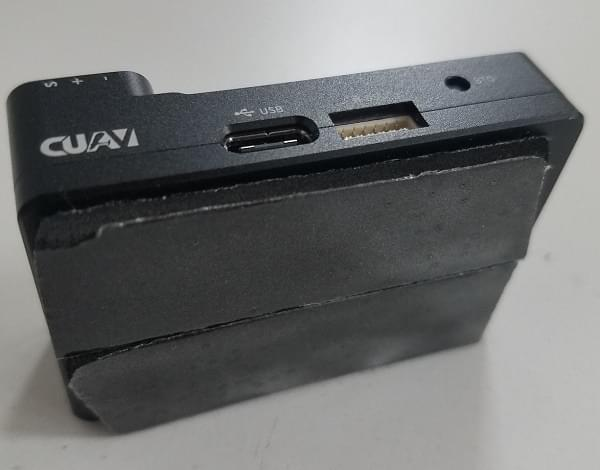 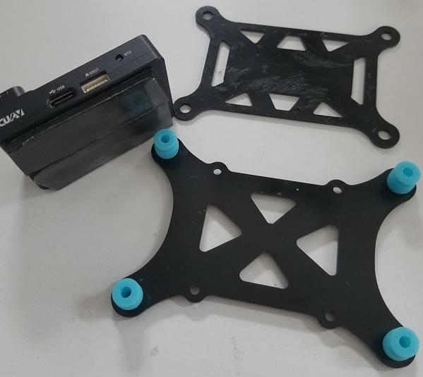

1. Прикріпіть приймач FrSky до нижньої плати за допомогою двосторонньої стрічки.

   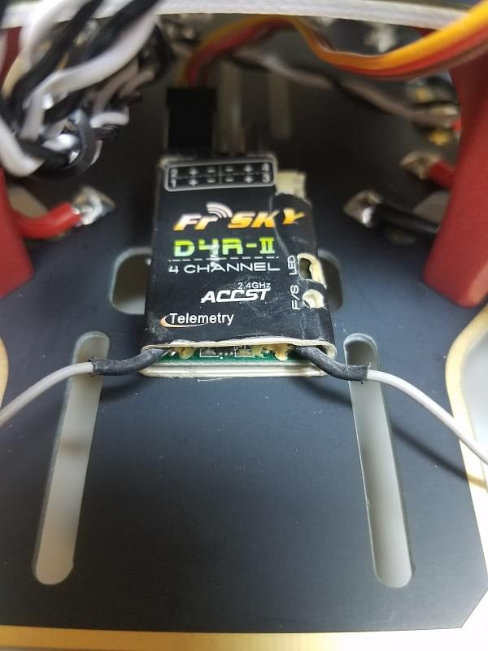

1. Прикріпіть телеметричний модуль до нижньої плати транспортного засобу за допомогою двосторонньої стрічки.

   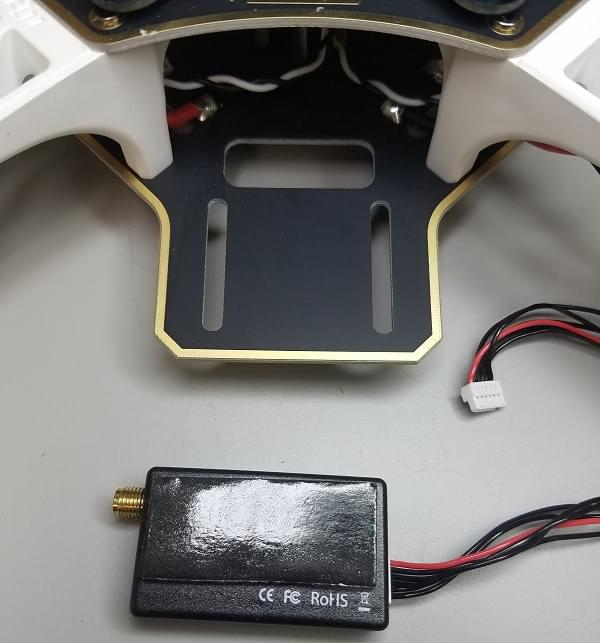 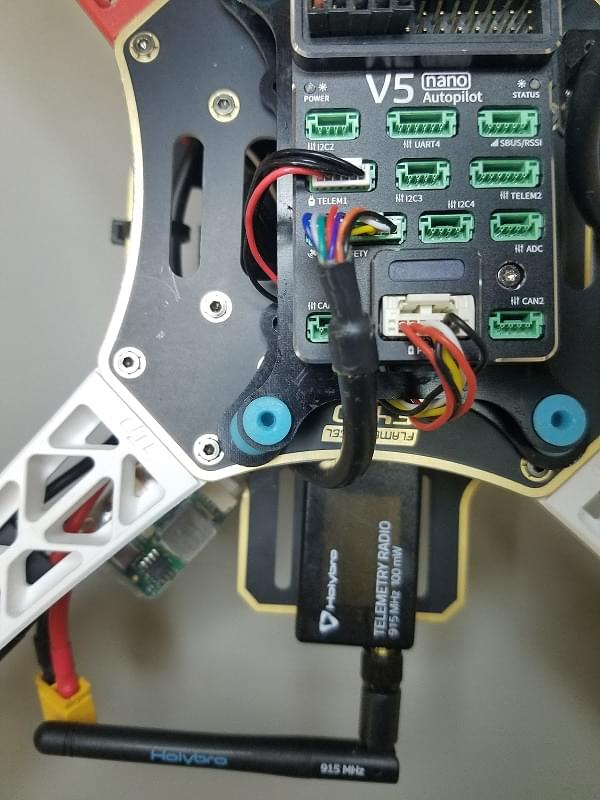

1. Поставте алюмінієві опори на платформу кнопок і прикріпіть GPS.

   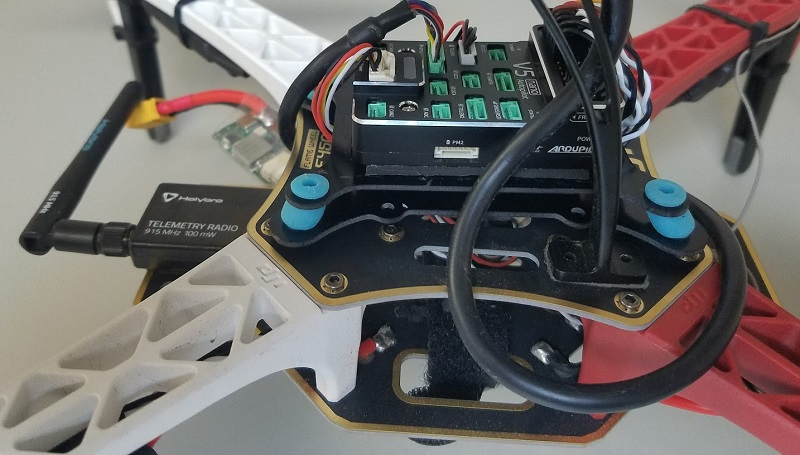

1. Підключіть телеметрію (`TELEM1`), модуль GPS (`GPS/SAFETY`), приймач RC (`RC`), всі 4 ESC (`M1-M4`), та модуль живлення (`Power1`) до контролера польоту. 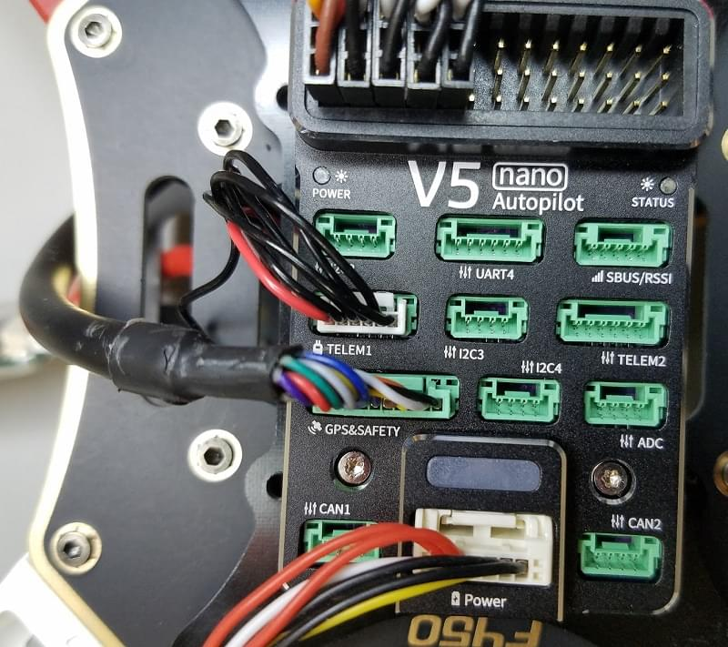

   :::info Порядок мотора визначено в [Довідник з літальних апаратів > Квадрокоптер x](../airframes/airframe_reference.md#quadrotor-x)
:::

Ось і все! Останню збірку показано нижче:

## Налаштування PX4

*QGroundControl* використовується для встановлення автопілота PX4 та його налаштування / налаштування для рами. [Завантажте та встановіть](http://qgroundcontrol.com/downloads/) *QGroundControl* для вашої платформи.

:::tip
Повні інструкції щодо встановлення та налаштування PX4 можна знайти в [Основна конфігурація](../config/index.md).
:::

Спочатку оновіть прошивку, конструкцію та виходи:

- [Прошивка](../config/firmware.md)
- [Планер](../config/airframe.md)

  :::info Вам потрібно буде вибрати шасі *Generic Quadcopter* (**Квадрокоптер x > Generic Quadcopter**).

  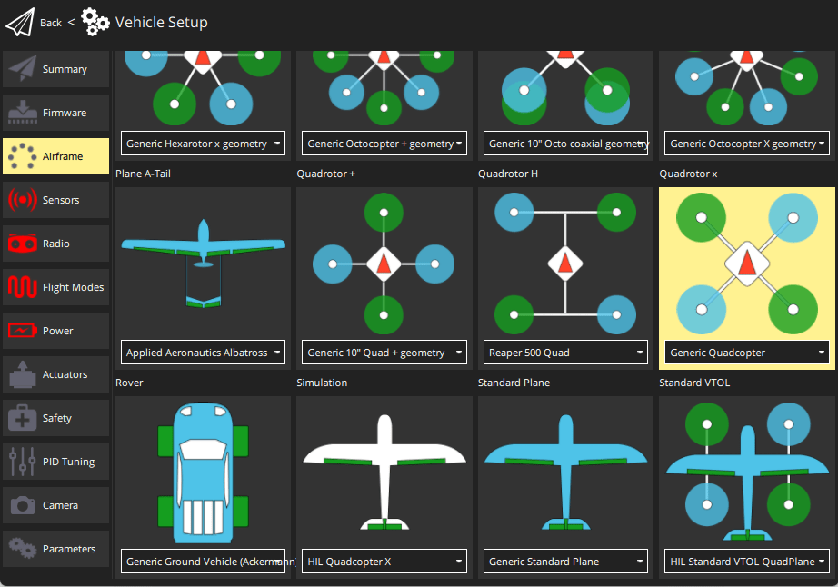
:::

- [Приводи](../config/actuators.md)
  - Оновіть геометрію транспортного засобу, щоб вона відповідала рамі.
  - Призначте функції приводу до виходів, щоб відповідати вашому підключенню.
  - Перевірте конфігурацію, використовуючи слайдери.

Потім виконайте обов'язкове налаштування / калібрування:

- [Орієнтація сенсора](../config/flight_controller_orientation.md)
- [Компас](../config/compass.md)
- [Акселерометр](../config/accelerometer.md)
- [Калібрування рівня горизонту](../config/level_horizon_calibration.md)
- [Налаштування радіо](../config/radio.md)
- [Режими польоту](../config/flight_mode.md)

  :::info Для цієї збірки ми налаштували режими *Стабілізований*, *Висота* та *Позиція* на трьохпозиційний перемикач на приймачі (відображений на один канал - 5). Це рекомендований мінімальний набір режимів для початківців.
:::

В ідеалі ви також повинні зробити:

- [Калібрування ESC](../advanced_config/esc_calibration.md)
- [Налаштування оцінки батареї](../config/battery.md)
- [Безпека](../config/safety.md)

## Вдосконалення

Набори вибору конструкції встановлюють параметри автопілота *за замовчуванням* для рами. Ці можуть бути достатньо хороші для польоту, але вам слід налаштувати кожну конструкцію рами.

Для інструкцій щодо того, як розпочати, почніть з [Автоналаштування](../config/autotune.md).

## Відео

@[youtube](https://youtu.be/b0bKNdDqVHw)

## Подяки

Цей журнал збірки був наданий Командою тестового польоту Dronecode.
