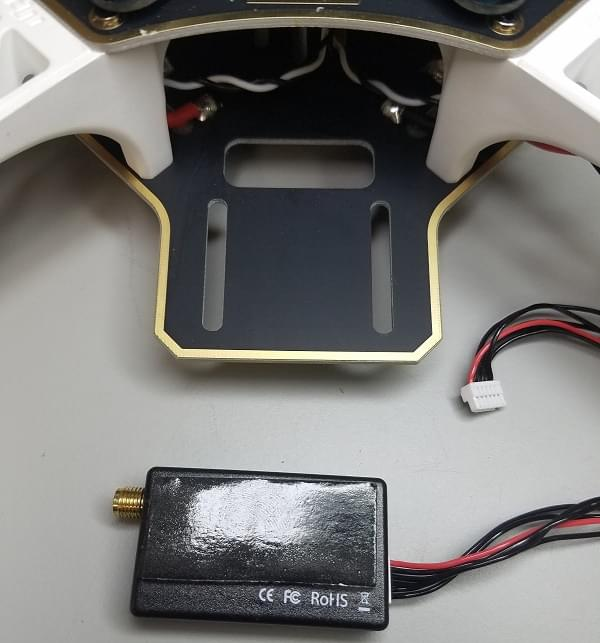

# Збірка DJI FlameWheel 450 + CUAV V5+

Ця тема надає повні інструкції для збирання комплекту та налаштування PX4 з використанням *QGroundControl*.

Основна Інформація

- **Рама:** DJI F450
- **Контролер польоту:** [CUAV V5+](../flight_controller/cuav_v5_plus.md)
- **Час збірки (приблизно):** 90 хвилин (45 хвилин на раму, 45 хвилин на встановлення/налаштування автопілоту)

## Специфікація матеріалів

Компоненти, необхідні для цієї збірки:
- Контролер польоту: [CUAV V5+](https://store.cuav.net/index.php?id_product=95&id_product_attribute=0&rewrite=cuav-new-pixhack-v5-autopilot-m8n-gps-for-fpv-rc-drone-quadcopter-helicopter-flight-simulator-free-shipping-whole-sale&controller=product&id_lang=1):
  - GPS: [CUAV NEO V2 GPS](https://store.cuav.net/index.php?id_product=97&id_product_attribute=0&rewrite=cuav-new-ublox-neo-m8n-gps-module-with-shell-stand-holder-for-flight-controller-gps-compass-for-pixhack-v5-plus-rc-parts-px4&controller=product&id_lang=1)
  - Модуль живлення
- Рама: [DJI F450](https://www.amazon.com/Flame-Wheel-Basic-Quadcopter-Drone/dp/B00HNMVQHY)
- Пропелери: [DJI Phantom Built-in Nut Upgrade Propellers 9.4x5](https://www.masterairscrew.com/products/dji-phantom-built-in-nut-upgrade-propellers-in-black-mr-9-4x5-prop-set-x4-phantom)
- Батарея: [Turnigy High Capacity 5200mAh 3S 12C Lipo Pack з XT60](https://hobbyking.com/en_us/turnigy-high-capacity-5200mah-3s-12c-multi-rotor-lipo-pack-w-xt60.html?___store=en_us)
- Телеметрія: [Holybro Transceiver Telemetry Radio V3](../telemetry/holybro_sik_radio.md)
- RC Приймач: [FrSky D4R-II 2.4G 4CH ACCST Приймач телеметрії](https://www.banggood.com/FrSky-D4R-II-2_4G-4CH-ACCST-Telemetry-Receiver-for-RC-Drone-FPV-Racing-p-929069.html?cur_warehouse=GWTR)
- Мотори: [DJI E305 2312E Мотор (960kv,CW)](https://www.amazon.com/DJI-E305-2312E-Motor-960kv/dp/B072MBMCZN)
- ESC: Hobbywing XRotor 20A APAC Brushless ESC 3-4S для RC Мультикоптерів

Крім того, ми використовували контролер FrSky Taranis. Вам також знадобляться кабельні стяжки, двосторонній скотч, паяльник.

На наведеному нижче зображенні показані як рама, так і електронні компоненти.

## Апаратне забезпечення

### Рама

Цей розділ перелічує все обладнання для рами.

| Опис                                              | Кількість |
| ------------------------------------------------- | --------- |
| DJI F450 Нижня пластина                           | 1         |
| DJI F450 Верхня пластина                          | 1         |
| DJI F450 ніжки з шасі                             | 4         |
| Гвинти M3*8                                       | 18        |
| Гвинти M2 5*6                                     | 24        |
| Акумуляторний ремінь на липучці                   | 1         |
| DJI Phantom Built-in Nut Upgrade Propellers 9.4x5 | 1         |

### Набір CUAV V5+

У цьому розділі перераховані компоненти в наборі CUAV v5+.

| Опис                        | Кількість (Набір за замовчуванням) | Кількість (+GPS Набір) |
| --------------------------- | ---------------------------------- | ---------------------- |
| Автопілот V5+               | 1                                  | 1                      |
| Кабель DuPont               | 2                                  | 2                      |
| Кабель I2C/CAN              | 2                                  | 2                      |
| Кабель ADC 6.6              | 2                                  | 2                      |
| Сигнальний кабель SBUS      | 1                                  | 1                      |
| Кабель IRSSI                | 1                                  | 1                      |
| Сигнальний кабель DSM       | 1                                  | 1                      |
| Кабель ADC 3.3              | 1                                  | 1                      |
| Кабель для відладки         | 1                                  | 1                      |
| Кабель запобіжного вимикача | 1                                  | 1                      |
| Кабель напруги та струму    | 1                                  | 1                      |
| Кабель модуля PW-Link       | 1                                  | 1                      |
| Модуль живлення             | 1                                  | 1                      |
| Карта пам'яті SanDisk 16GB  | 1                                  | 1                      |
| Платка розширення 12C       | 1                                  | 1                      |
| ТТЛ-пластина                | 1                                  | 1                      |
| NEO GPS                     | -                                  | 1                      |
| 1                           | -                                  | 1                      |

### Електроніка

| Опис                                                  | Кількість |
| ----------------------------------------------------- | --------- |
| CUAV V5+                                              | 1         |
| CUAV NEO V2 GPS                                       | 1         |
| Holibro Telemetry                                     | 1         |
| FrSky D4R-II 2.4G 4CH ACCST Telemetry Receiver        | 1         |
| DJI E305 2312E Motor (800kv,CW)                       | 4         |
| Hobbywing XRotor 20A APAC Brushless ESC               | 4         |
| Модуль живлення (включено в набір CUAV V5+)           | 1         |
| Turnigy High Capacity 5200mAh 3S 12C Lipo Pack w/XT60 | 1         |

### Необхідні інструменти

Наступні інструменти використовуються у цій збірці:

- Викрутка з шестигранником 2,0 мм
- Хрестоподібна викрутка 3 мм
- Кусачки
- Прецизійний пінцет
- Паяльник

## Збірка

Приблизний час для збирання становить приблизно 90 хвилин (близько 45 хвилин на раму та 45 хвилин на встановлення автопілота та налаштування корпусу.

1. Прикріпіть 4 ніжки до нижньої пластини за допомогою наданих гвинтів.

   

1. Припаяйте ESC (електронний регулятор швидкості) до плати, позитивний (червоний) та негативний (чорний).

   

1. Припаяйте модуль живлення, позитивний (червоний) та негативний (чорний).

   

1. Підключіть двигуни до ESC відповідно до їхніх позицій.

   

1. Прикріпіть двигуни до відповідних рук.

    

1. Додайте верхню пластину (прикрутіть до верхньої частини ніжок).

   

1. Додайте двосторонній скотч (3M) до контролера польоту CUAV V5+ (він має внутрішнє гасіння вібрацій, тому використовувати піну не потрібно).

   

1. Прикріпіть приймач FrSky до нижньої плати за допомогою двостороннього скотчу.

   

1. Прикріпіть телеметричний модуль до нижньої плати транспортного засобу за допомогою двостороннього скотчу.

    

1. Поставте алюмінієві опори на платформу кнопок.

1. Підключіть телеметрію (`TELEM1`) та модуль GPS (`GPS/SAFETY`) до контролера польоту.  

1. Підключіть приймач RC (`RC`), всі 4 ESC (`M1-M4`), та модуль живлення (`Power1`) до контролера польоту. 

   ::: info Порядок моторів визначено в [Довідник літальних апаратів > Quadrotor x](../airframes/airframe_reference.md#quadrotor-x)
:::

Ось і все! Остаточну збірку показано нижче:

## Налаштування PX4

*QGroundControl* використовується для встановлення автопілота PX4 та його налаштування / налаштування для рами. [Завантажте та встановіть](http://qgroundcontrol.com/downloads/) *QGroundControl* для вашої платформи.

:::tip
Повні інструкції щодо встановлення та налаштування PX4 можна знайти в [Основна конфігурація](../config/index.md).
:::

Спочатку оновіть прошивку, конструкцію та виходи:

- [Прошивка](../config/firmware.md)
- [Конструкція літального апарату](../config/airframe.md) ::: info Вам потрібно вибрати корпус *Generic Quadcopter* (**Quadrotor x > Generic Quadcopter**).

  
:::

- [Приводи](../config/actuators.md)
  - Оновіть геометрію транспортного засобу, щоб вона відповідала рамі.
  - Призначте функції приводу до виходів, щоб відповідати вашому підключенню.
  - Перевірте конфігурацію, використовуючи слайдери.

Потім виконайте обов'язкове налаштування / калібрування:

- [Орієнтація сенсорів](../config/flight_controller_orientation.md)
- [Компас](../config/compass.md)
- [Акселерометр](../config/accelerometer.md)
- [Калібрування рівня горизонту](../config/level_horizon_calibration.md)
- [Налаштування радіо](../config/radio.md)
- [Режими польоту](../config/flight_mode.md)

  :::info Для цієї збірки ми налаштували режими *Стабілізований*, *Висота* та *Позиція* на трьохпозиційний перемикач на приймачі (відображений на один канал - 5). Це рекомендований мінімальний набір режимів для початківців.
:::

В ідеалі ви також повинні зробити:
* [Калібрування ESC](../advanced_config/esc_calibration.md)
* [Налаштування оцінки заряду батареї](../config/battery.md)
* [Індикатор безпеки](../config/safety.md)

## Вдосконалення

Набори вибору конструкції встановлюють параметри автопілота *за замовчуванням* для рами. Ці можуть бути достатньо хороші для польоту, але вам слід налаштувати кожну конструкцію рами.

For instructions on how, start from [Autotune](../config/autotune_mc.md).

## Відео

@[youtube](https://youtu.be/r-IkaVpN1Ko)

## Подяки

Цей журнал збірки був наданий Командою тестового польоту Dronecode.
